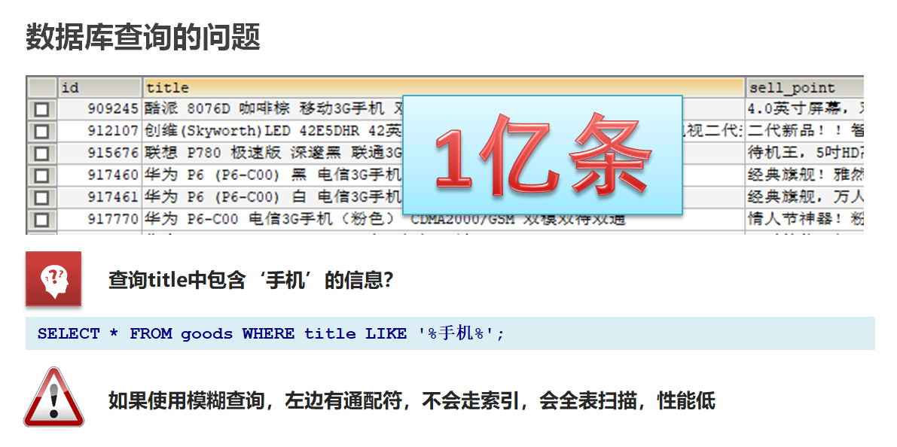
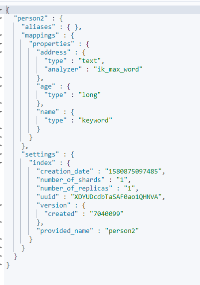

## **1-今日内容**

1.  初识 ElasticSearch

2. 安装 ElasticSearch
3. ElasticSearch 核心概念
4. 操作 ElasticSearch
5.  ElasticSearch JavaAPI

 

## **2-初识ElasticSearch**

### 2.1-基于数据库查询的问题



 


### **2.2-倒排索引**

**倒排索引**：将文档进行分词，形成词条和id的对应关系即为反向索引。

 以唐诗为例，所处包含“前”的诗句

正向索引：由《静夜思》-->窗前明月光--->“前”字

反向索引：“前”字-->窗前明月光-->《静夜思》

反向索引的实现就是对诗句进行分词，分成单个的词，由词推据，即为反向索引


“床前明月光”--> 分词

将一段文本按照一定的规则，拆分为不同的词条（term）


 


### **2.3-ES存储和查询的原理**

 

**index（索引）**：相当于mysql的库

**映射**：相当于mysql 的表结构

**document(文档)**：相当于mysql的表中的数据


 **数据库查询存在的问题：**

1. 性能低：使用模糊查询，左边有通配符，不会走索引，会全表扫描，性能低
2.  功能弱：如果以”华为手机“作为条件，查询不出来数据

Es使用倒排索引，对title 进行分词


 

1. 使用“手机”作为关键字查询

   生成的倒排索引中，词条会排序，形成一颗树形结构，提升词条的查询速度

2. 使用“华为手机”作为关键字查询

   华为：1,3

   手机：1,2,3

   

### **2.4-ES概念详解**

•ElasticSearch是一个基于Lucene的搜索服务器


•是一个分布式、高扩展、高实时的搜索与数据分析引擎

•基于RESTful web接口

•Elasticsearch是用Java语言开发的，并作为Apache许可条款下的开放源码发布，是一种流行的企业级搜索引擎

•官网：https://www.elastic.co/


应用场景

•搜索：海量数据的查询

•日志数据分析

•实时数据分析


## **3-安装ElasticSearch**

### 3.1-ES安装

 参见ElasticSearch-ES安装.md

 查看elastic是否启动

```
ps -ef|grep elastic
```


### **3.2-ES辅助工具安装**

 参见ElasticSearch-ES安装.md

后台启动

```
nohup ../bin/kibana &
```

 

## **4-ElasticSearch核心概念**

 

**索引（index）**

ElasticSearch存储数据的地方，可以理解成关系型数据库中的数据库概念。

**映射（mapping）**

mapping定义了每个字段的类型、字段所使用的分词器等。相当于关系型数据库中的表结构。

**文档（document）**

   Elasticsearch中的最小数据单元，常以json格式显示。一个document相当于关系型数据库中的一行数据。

**倒排索引**

   一个倒排索引由文档中所有不重复词的列表构成，对于其中每个词，对应一个包含它的文档id列表。

**类型（type）**

   一种type就像一类表。如用户表、角色表等。在Elasticsearch7.X默认type为_doc

     \- ES 5.x中一个index可以有多种type。
    
      \- ES 6.x中一个index只能有一种type。
    
      \- ES 7.x以后，将逐步移除type这个概念，现在的操作已经不再使用，默认_doc

 


## **5-脚本操作ES**

### 5.1-RESTful风格介绍

 1.ST（Representational State Transfer），表述性状态转移，是一组架构约束条件和原则。满足这些约束条件和原则的应用程序或设计就是RESTful。就是一种定义接口的规范。

2.基于HTTP。

3.使用XML格式定义或JSON格式定义。

4.每一个URI代表1种资源。

5.客户端使用GET、POST、PUT、DELETE 4个表示操作方式的动词对服务端资源进行操作：

GET：用来获取资源

POST：用来新建资源（也可以用于更新资源）

PUT：用来更新资源

DELETE：用来删除资源


 

### **5.2-操作索引**

 

**PUT**

```
http://ip:端口/索引名称
```

查询

```
GET http://ip:端口/索引名称  # 查询单个索引信息
GET http://ip:端口/索引名称1,索引名称2...  # 查询多个索引信息
GET http://ip:端口/_all  # 查询所有索引信息
```

•删除索引

```
DELETE http://ip:端口/索引名称
```

•关闭、打开索引

```
POST http://ip:端口/索引名称/_close  
POST http://ip:端口/索引名称/_open 
```


### **5.3-ES数据类型**

 

1. **简单数据类型**

- 字符串

聚合：相当于mysql 中的sum（求和）

```text
text：会分词，不支持聚合

keyword：不会分词，将全部内容作为一个词条，支持聚合
```

- 数值
- 布尔：boolean

- 二进制：binary
- 范围类型


```
integer_range, float_range, long_range, double_range, date_range 
```

- 日期:date

2. **复杂数据类型**

•数组：[ ]  Nested: `nested` (for arrays of JSON objects 数组类型的JSON对象)  

•对象：{ } Object: object(for single JSON objects 单个JSON对象)


### **5.4-操作映射**

 

```json
 PUT person
 
 GET person
 #添加映射
 PUT /person/_mapping
 {
   "properties":{
     "name":{
       "type":"text"
     },
     "age":{
       "type":"integer"
     }
   }
 }


 
```

 

 #创建索引并添加映射

```json
 
 #创建索引并添加映射
 PUT /person1
{
  "mappings": {
    "properties": {
      "name": {
        "type": "text"
      },
      "age": {
        "type": "integer"
      }
    }
  }
}

GET person1/_mapping
```


添加字段

```json
#添加字段
PUT /person1/_mapping
{
  "properties": {
      "name": {
        "type": "text"
      },
      "age": {
        "type": "integer"
      }
    }
}
```


### **5.5-操作文档**

 

•添加文档，指定id

```json
POST /person1/_doc/2
{
  "name":"张三",
  "age":18,
  "address":"北京"
}

GET /person1/_doc/1


```

 •添加文档，不指定id

```json
#添加文档，不指定id
POST /person1/_doc/
{
  "name":"张三",
  "age":18,
  "address":"北京"
}

# 根据id修改文档
# 使用添加命令 如果有就修改 如果没有就添加

#查询所有文档
GET /person1/_search
```


```json
#删除指定id文档
DELETE /person1/_doc/1
```


## 6-分词器

###  6.1分词器-介绍

 •IKAnalyzer是一个开源的，基于java语言开发的轻量级的中文分词工具包

•是一个基于Maven构建的项目

•具有60万字/秒的高速处理能力

•支持用户词典扩展定义

•下载地址：https://github.com/medcl/elasticsearch-analysis-ik/archive/v7.4.0.zip 

安装包在资料文件夹中提供

### **6.2-ik分词器安装**

参见 ik分词器安装.md

 执行如下命令时如果出现  打包失败（501码）将maven镜像换成阿里云的

```
mvn package
```

 /opt/apache-maven-3.1.1/conf/setting.xml

```xml
	<mirror>
        <id>alimaven</id>
        <name>aliyun maven</name>
        <url>http://maven.aliyun.com/nexus/content/groups/public/</url>
        <mirrorOf>central</mirrorOf>
    </mirror>
```


### **6.3-ik分词器使用**

IK分词器有两种分词模式：ik_max_word和ik_smart模式。

1、**ik_max_word**

会将文本做最细粒度的拆分，比如会将“乒乓球明年总冠军”拆分为“乒乓球、乒乓、球、明年、总冠军、冠军。

```json
# 默认分词器
GET /_analyze
{
  "analyzer": "standard",
  "text": "我爱北京天安门"
}

GET /_analyze
{
  "analyzer": "standard",
  "text": "I Love Beijing Tiananmen"
}

#方式一ik_max_word
GET /_analyze
{
  "analyzer": "ik_max_word",
  "text": "乒乓球明年总冠军"
}
```

ik_max_word分词器执行如下：

```json
{
  "tokens" : [
    {
      "token" : "乒乓球",
      "start_offset" : 0,
      "end_offset" : 3,
      "type" : "CN_WORD",
      "position" : 0
    },
    {
      "token" : "乒乓",
      "start_offset" : 0,
      "end_offset" : 2,
      "type" : "CN_WORD",
      "position" : 1
    },
    {
      "token" : "球",
      "start_offset" : 2,
      "end_offset" : 3,
      "type" : "CN_CHAR",
      "position" : 2
    },
    {
      "token" : "明年",
      "start_offset" : 3,
      "end_offset" : 5,
      "type" : "CN_WORD",
      "position" : 3
    },
    {
      "token" : "总冠军",
      "start_offset" : 5,
      "end_offset" : 8,
      "type" : "CN_WORD",
      "position" : 4
    },
    {
      "token" : "冠军",
      "start_offset" : 6,
      "end_offset" : 8,
      "type" : "CN_WORD",
      "position" : 5
    }
  ]
}

```

2、**ik_smart**
会做最粗粒度的拆分，比如会将“乒乓球明年总冠军”拆分为乒乓球、明年、总冠军。

```json
#方式二ik_smart
GET /_analyze
{
  "analyzer": "ik_smart",
  "text": "乒乓球明年总冠军"
}
```

ik_smart分词器执行如下：

```json
{
  "tokens" : [
    {
      "token" : "乒乓球",
      "start_offset" : 0,
      "end_offset" : 3,
      "type" : "CN_WORD",
      "position" : 0
    },
    {
      "token" : "明年",
      "start_offset" : 3,
      "end_offset" : 5,
      "type" : "CN_WORD",
      "position" : 1
    },
    {
      "token" : "总冠军",
      "start_offset" : 5,
      "end_offset" : 8,
      "type" : "CN_WORD",
      "position" : 2
    }
  ]
}

```

由此可见  使用ik_smart可以将文本"text": "乒乓球明年总冠军"分成了【乒乓球】【明年】【总冠军】

这样看的话，这样的分词效果达到了我们的要求。

 

### **6.4使用IK分词器-查询文档**

###  

 •词条查询：term

​			词条查询不会分析查询条件，只有当词条和查询字符串完全匹配时才匹配搜索

•全文查询：match

​           全文查询会分析查询条件，先将查询条件进行分词，然后查询，求并集


1.创建索引，添加映射，并指定分词器为ik分词器

```json
PUT person2
{
  "mappings": {
    "properties": {
      "name": {
        "type": "keyword"
      },
      "address": {
        "type": "text",
        "analyzer": "ik_max_word"
      }
    }
  }
}
```

2.添加文档

```
POST /person2/_doc/1
{
  "name":"张三",
  "age":18,
  "address":"北京海淀区"
}

POST /person2/_doc/2
{
  "name":"李四",
  "age":18,
  "address":"北京朝阳区"
}

POST /person2/_doc/3
{
  "name":"王五",
  "age":18,
  "address":"北京昌平区"
}

```


3.查询映射

```json
GET person2
```




4.查看分词效果

```json
GET _analyze
{
  "analyzer": "ik_max_word",
  "text": "北京海淀"
}

```


5.词条查询：term

查询person2中匹配到"北京"两字的词条

```json
GET /person2/_search
{
  "query": {
    "term": {
      "address": {
        "value": "北京"
      }
    }
  }
}
```


6.全文查询：match

​           全文查询会分析查询条件，先将查询条件进行分词，然后查询，求并集

```
GET /person2/_search
{
  "query": {
    "match": {
      "address":"北京昌平"
    }
  }
}
```


## **7-ElasticSearch JavaApi-**

 

### 7.1SpringBoot整合ES

 ①搭建SpringBoot工程

②引入ElasticSearch相关坐标

```xml
<!--引入es的坐标-->
        <dependency>
            <groupId>org.elasticsearch.client</groupId>
            <artifactId>elasticsearch-rest-high-level-client</artifactId>
            <version>7.4.0</version>
        </dependency>
        <dependency>
            <groupId>org.elasticsearch.client</groupId>
            <artifactId>elasticsearch-rest-client</artifactId>
            <version>7.4.0</version>
        </dependency>
        <dependency>
            <groupId>org.elasticsearch</groupId>
            <artifactId>elasticsearch</artifactId>
            <version>7.4.0</version>
        </dependency>
```

③测试

ElasticSearchConfig

```java
@Configuration
@ConfigurationProperties(prefix="elasticsearch")
public class ElasticSearchConfig {

    private String host;

    private int port;

 


    public String getHost() {
        return host;
    }

    public void setHost(String host) {
        this.host = host;
    }

    public int getPort() {
        return port;
    }

    public void setPort(int port) {
        this.port = port;
    }
    @Bean
    public RestHighLevelClient client(){
        return new RestHighLevelClient(RestClient.builder(
                new HttpHost(host,port,"http")
        ));
    }
}
```

ElasticsearchDay01ApplicationTests

注意：使用@Autowired注入RestHighLevelClient 如果报红线，则是因为配置类所在的包和测试类所在的包，包名不一致造成的

```java
@SpringBootTest
class ElasticsearchDay01ApplicationTests {

    @Autowired
    RestHighLevelClient client;

    /**
     * 测试
     */
    @Test
    void contextLoads() {

        System.out.println(client);
    }
}
```


### **7.2-创建索引**

1.添加索引

 ```java
/**
     * 添加索引
     * @throws IOException
     */
    @Test
    public void addIndex() throws IOException {
       //1.使用client获取操作索引对象
        IndicesClient indices = client.indices();
        //2.具体操作获取返回值
        //2.1 设置索引名称
        CreateIndexRequest createIndexRequest=new CreateIndexRequest("itheima");

        CreateIndexResponse createIndexResponse = indices.create(createIndexRequest, RequestOptions.DEFAULT);
        //3.根据返回值判断结果
        System.out.println(createIndexResponse.isAcknowledged());
    }
 ```
2.添加索引，并添加映射

```java
 /**
     * 添加索引，并添加映射
     */
    @Test
    public void addIndexAndMapping() throws IOException {
       //1.使用client获取操作索引对象
        IndicesClient indices = client.indices();
        //2.具体操作获取返回值
        //2.具体操作，获取返回值
        CreateIndexRequest createIndexRequest = new CreateIndexRequest("itcast");
        //2.1 设置mappings
        String mapping = "{\n" +
                "      \"properties\" : {\n" +
                "        \"address\" : {\n" +
                "          \"type\" : \"text\",\n" +
                "          \"analyzer\" : \"ik_max_word\"\n" +
                "        },\n" +
                "        \"age\" : {\n" +
                "          \"type\" : \"long\"\n" +
                "        },\n" +
                "        \"name\" : {\n" +
                "          \"type\" : \"keyword\"\n" +
                "        }\n" +
                "      }\n" +
                "    }";
        createIndexRequest.mapping(mapping,XContentType.JSON);

        CreateIndexResponse createIndexResponse = indices.create(createIndexRequest, RequestOptions.DEFAULT);
        //3.根据返回值判断结果
        System.out.println(createIndexResponse.isAcknowledged());
    }

```

 

### **7.3-查询、删除、判断索引**


查询索引
```java

   

    /**
     * 查询索引
     */
    @Test
    public void queryIndex() throws IOException {
        IndicesClient indices = client.indices();

        GetIndexRequest getRequest=new GetIndexRequest("itcast");
        GetIndexResponse response = indices.get(getRequest, RequestOptions.DEFAULT);
        Map<String, MappingMetaData> mappings = response.getMappings();
        //iter 提示foreach
        for (String key : mappings.keySet()) {
            System.out.println(key+"==="+mappings.get(key).getSourceAsMap());
        }
    }

   
   
```

删除索引

```java
 /**
     * 删除索引
     */
    @Test
    public void deleteIndex() throws IOException {
         IndicesClient indices = client.indices();
        DeleteIndexRequest deleteRequest=new DeleteIndexRequest("itheima");
        AcknowledgedResponse delete = indices.delete(deleteRequest, RequestOptions.DEFAULT);
        System.out.println(delete.isAcknowledged());

    }
```


索引是否存在

```java
 /**
     * 索引是否存在
     */
    @Test
    public void existIndex() throws IOException {
        IndicesClient indices = client.indices();

        GetIndexRequest getIndexRequest=new GetIndexRequest("itheima");
        boolean exists = indices.exists(getIndexRequest, RequestOptions.DEFAULT);


        System.out.println(exists);

    }
    
```


### **7.4-添加文档**

1.添加文档,使用map作为数据

```java
 @Test
    public void addDoc1() throws IOException {
        Map<String, Object> map=new HashMap<>();
        map.put("name","张三");
        map.put("age","18");
        map.put("address","北京二环");
        IndexRequest request=new IndexRequest("itcast").id("1").source(map);
        IndexResponse response = client.index(request, RequestOptions.DEFAULT);
        System.out.println(response.getId());
    }
```

 2.添加文档,使用对象作为数据

```java
@Test
public void addDoc2() throws IOException {
    Person person=new Person();
    person.setId("2");
    person.setName("李四");
    person.setAge(20);
    person.setAddress("北京三环");
    String data = JSON.toJSONString(person);
    IndexRequest request=new IndexRequest("itcast").id(person.getId()).source(data,XContentType.JSON);
    IndexResponse response = client.index(request, RequestOptions.DEFAULT);
    System.out.println(response.getId());
}
```

 

### **7.5-修改、查询、删除文档**

1.修改文档：添加文档时，如果id存在则修改，id不存在则添加

```java
    /**
     * 修改文档：添加文档时，如果id存在则修改，id不存在则添加
     */

    @Test
    public void UpdateDoc() throws IOException {
        Person person=new Person();
        person.setId("2");
        person.setName("李四");
        person.setAge(20);
        person.setAddress("北京三环车王");

        String data = JSON.toJSONString(person);

        IndexRequest request=new IndexRequest("itcast").id(person.getId()).source(data,XContentType.JSON);
        IndexResponse response = client.index(request, RequestOptions.DEFAULT);
        System.out.println(response.getId());
    }
```

2.根据id查询文档

```java
    /**
     * 根据id查询文档
     */
    @Test
    public void getDoc() throws IOException {

        //设置查询的索引、文档
        GetRequest indexRequest=new GetRequest("itcast","2");

        GetResponse response = client.get(indexRequest, RequestOptions.DEFAULT);
        System.out.println(response.getSourceAsString());
    }
```

3.根据id删除文档

```java
/**
     * 根据id删除文档
     */
    @Test
    public void delDoc() throws IOException {

        //设置要删除的索引、文档
        DeleteRequest deleteRequest=new DeleteRequest("itcast","1");

        DeleteResponse response = client.delete(deleteRequest, RequestOptions.DEFAULT);
        System.out.println(response.getId());
    }
```


