# RabbitMQ第一天

## 今天必须要会的东西

1. MQ的概念
2. 能够在虚拟机上面挂载MQ
3. ==MQ的工作模式==
4. Spring整合MQ
5. Springboot整合MQ


## MQ的介绍

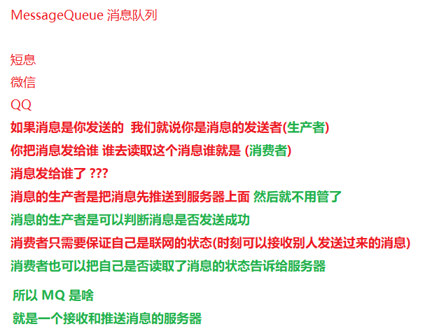

远程调用的同步和异步

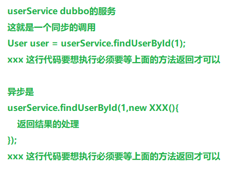

基于Dubbo的远程调用都是同步的

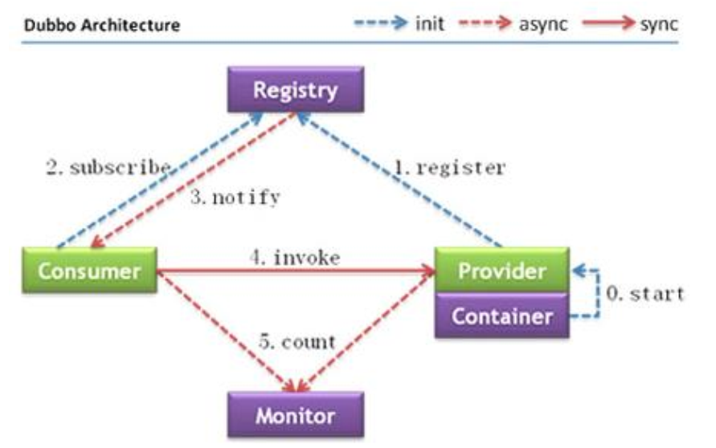

> A服务器要想异步调用B服务器
>
> 只需要保证A服务器的消息发送到MQ上面即可 
>
> B服务器什么时候去消费A就不用管了
>
> 这样就实现了一个异步的通信


## MQ的优势

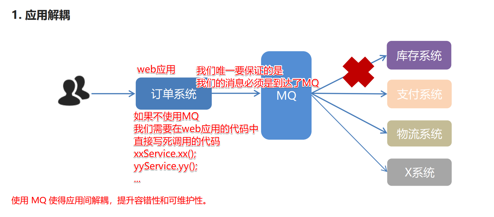

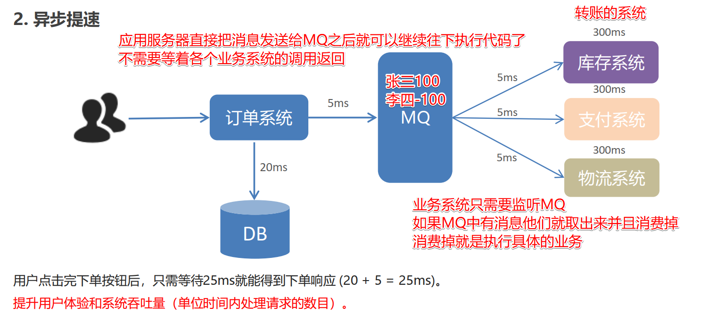


## 常见的MQ产品

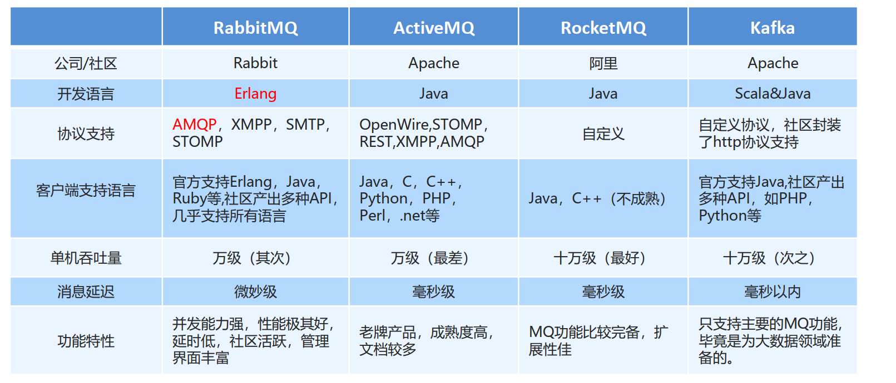

## RabbitMQ的概念

### AMQP协议

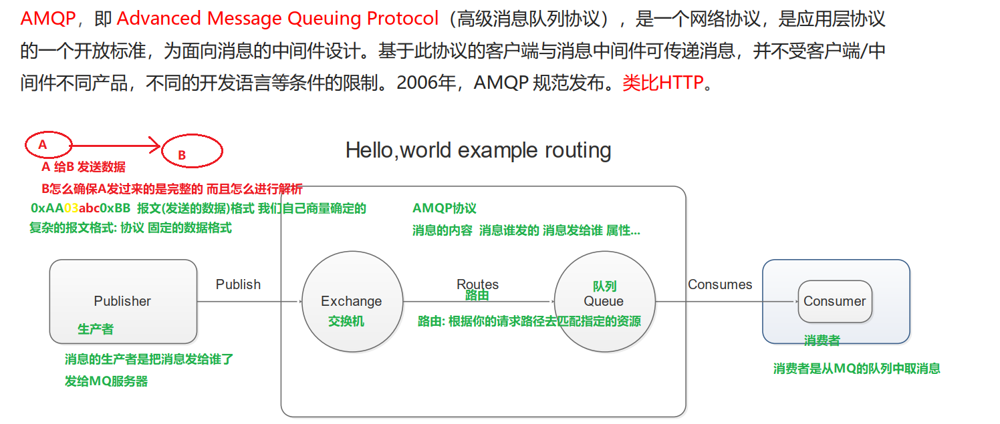

### MQ的架构图


## MQ的安装

> 建议使用资料中给大家提供的
>
> 查看自己的IP

MQ的命令

```shell
service rabbitmq-server start
service rabbitmq-server stop
service rabbitmq-server restart
```

启动完成后可以通过页面来访问

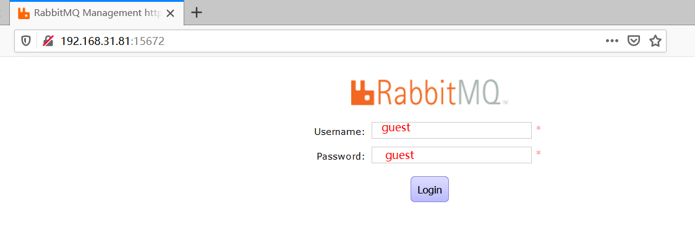

## MQ的工作模式

### HelloWorld模式

> 一个消息的生产者对应一个消息的消费者
>
> 使用的是默认的交换机
>
> 注意: 路由Key一定要写队列的名称

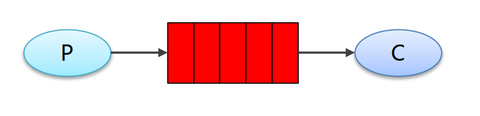

消息的生产者代码

```java
package com.itheima.producer;

import com.rabbitmq.client.Channel;
import com.rabbitmq.client.Connection;
import com.rabbitmq.client.ConnectionFactory;

import java.io.IOException;
import java.util.concurrent.TimeoutException;

/**
 * 发送消息
 */
public class Producer_HelloWorld {
    public static void main(String[] args) throws IOException, TimeoutException {
        //1.创建连接工厂
        ConnectionFactory factory = new ConnectionFactory();
        //2. 设置参数
        factory.setHost("192.168.31.81");//ip  默认值 localhost
        factory.setPort(5672); //端口  默认值 5672
        factory.setVirtualHost("/heima");//虚拟机 默认值/
        factory.setUsername("heima");//用户名 默认 guest
        factory.setPassword("heima");//密码 默认值 guest
        //3. 创建连接 Connection
        Connection connection = factory.newConnection();
        //4. 创建Channel
        Channel channel = connection.createChannel();

        //5. 创建队列Queue
        /*
        queueDeclare(String queue, boolean durable, boolean exclusive, boolean autoDelete, Map<String, Object>
        arguments)
        参数：
            1. queue：队列名称
            2. durable:是否持久化，当mq重启之后，还在
            3. exclusive：
                * 是否独占。只能有一个消费者监听这队列
                * 当Connection关闭时，是否删除队列
            4. autoDelete:是否自动删除。当没有Consumer时，自动删除掉
            5. arguments：参数。
         */
        //如果没有一个名字叫hello_world的队列，则会创建该队列，如果有则不会创建
        channel.queueDeclare("hello_world", true, false, false, null);
        /*
        basicPublish(String exchange, String routingKey, BasicProperties props, byte[] body)
        参数：
            1. exchange：交换机名称。简单模式下交换机会使用默认的 ""
            2. routingKey：路由名称
            3. props：配置信息
            4. body：发送消息数据
         */
        String body = "hello rabbitmq~~~";
        //6. 发送消息
        channel.basicPublish("", "hello_world", null, body.getBytes());
        //7.释放资源
        channel.close();
        connection.close();
    }
}

```

消息的消费者

```java
package com.itheima.consumer;

import com.rabbitmq.client.*;

import java.io.IOException;
import java.util.concurrent.TimeoutException;

public class Consumer_HelloWorld {
    public static void main(String[] args) throws IOException, TimeoutException {

        //1.创建连接工厂
        ConnectionFactory factory = new ConnectionFactory();
        //2. 设置参数
        factory.setHost("192.168.31.81");//ip  默认值 localhost
        factory.setPort(5672); //端口  默认值 5672
        factory.setVirtualHost("/heima");//虚拟机 默认值/
        factory.setUsername("heima");//用户名 默认 guest
        factory.setPassword("heima");//密码 默认值 guest
        //3. 创建连接 Connection
        Connection connection = factory.newConnection();
        //4. 创建Channel
        Channel channel = connection.createChannel();
        //5. 创建队列Queue
        channel.queueDeclare("hello_world", true, false, false, null);

        // 接收消息
        // 监听机制 消息的消费者去监听 队列
        Consumer consumer = new DefaultConsumer(channel) {
            // 如果队列中有消息就会执行这个回调函数中的代码
            @Override
            public void handleDelivery(String consumerTag, Envelope envelope, AMQP.BasicProperties properties, byte[] body) throws IOException {
                System.out.println("consumerTag：" + consumerTag);
                System.out.println("Exchange：" + envelope.getExchange());
                System.out.println("RoutingKey：" + envelope.getRoutingKey());
                System.out.println("properties：" + properties);
                System.out.println("body：" + new String(body));
            }
        };
        // 连接到队列 并且把消费者对象和队列进行了监听绑定
        channel.basicConsume("hello_world", true, consumer);

        //关闭资源？不要
    }
}
```

### WorkQueues模式

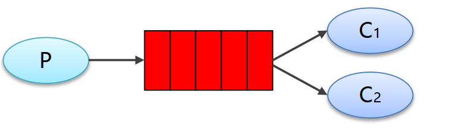

> 一个消息的生产者把消息推送到队列中, 使用的也是默认的交换机
>
> 在队列上绑定了多个消息的消费者, 这多个消费者会从这一个队列中==竞争消息资源==
>
> 每个消费者消费的消息是不一样的
>
> 测试时先启动两个消费者 再启动生产者

消息的生产者代码

```java
package com.itheima.producer;

import com.rabbitmq.client.Channel;
import com.rabbitmq.client.Connection;
import com.rabbitmq.client.ConnectionFactory;

import java.io.IOException;
import java.util.concurrent.TimeoutException;

/**
 * 发送消息
 */
public class Producer_WorkQueues {
    public static void main(String[] args) throws IOException, TimeoutException {

        //1.创建连接工厂
        ConnectionFactory factory = new ConnectionFactory();
        //2. 设置参数
        factory.setHost("192.168.31.81");//ip  默认值 localhost
        factory.setPort(5672); //端口  默认值 5672
        factory.setVirtualHost("/heima");//虚拟机 默认值/
        factory.setUsername("heima");//用户名 默认 guest
        factory.setPassword("heima");//密码 默认值 guest
        //3. 创建连接 Connection
        Connection connection = factory.newConnection();
        //4. 创建Channel
        Channel channel = connection.createChannel();
        //5. 创建队列Queue
        /*
        queueDeclare(String queue, boolean durable, boolean exclusive, boolean autoDelete, Map<String, Object> arguments)
        参数：
            1. queue：队列名称
            2. durable:是否持久化，当mq重启之后，还在
            3. exclusive：
                * 是否独占。只能有一个消费者监听这队列
                * 当Connection关闭时，是否删除队列
                *
            4. autoDelete:是否自动删除。当没有Consumer时，自动删除掉
            5. arguments：参数。
         */
        //如果没有一个名字叫hello_world的队列，则会创建该队列，如果有则不会创建
        channel.queueDeclare("work_queues", true, false, false, null);
        /*
        basicPublish(String exchange, String routingKey, BasicProperties props, byte[] body)
        参数：
            1. exchange：交换机名称。简单模式下交换机会使用默认的 ""
            2. routingKey：路由名称
            3. props：配置信息
            4. body：发送消息数据

         */
        for (int i = 1; i <= 9; i++) {
            String body = i + "hello rabbitmq~~~";
            //6. 发送消息
            channel.basicPublish("", "work_queues", null, body.getBytes());
        }

        //7.释放资源
        channel.close();
        connection.close();
    }
}
```

消费者代码同上面的消费者代码 , 改队列名称即可

### 订阅/发布模式

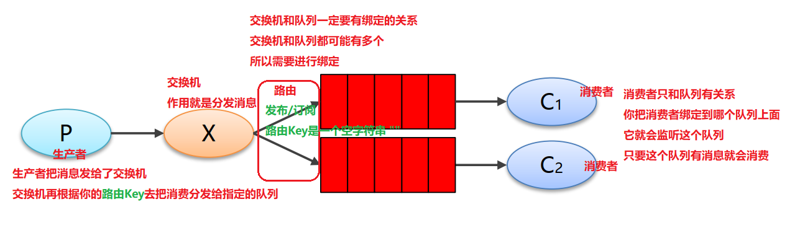

生产者代码

```java
package com.itheima.producer;

import com.rabbitmq.client.BuiltinExchangeType;
import com.rabbitmq.client.Channel;
import com.rabbitmq.client.Connection;
import com.rabbitmq.client.ConnectionFactory;

import java.io.IOException;
import java.util.concurrent.TimeoutException;

/**
 * 发送消息
 */
public class Producer_PubSub {
    public static void main(String[] args) throws IOException, TimeoutException {

        //1.创建连接工厂
        ConnectionFactory factory = new ConnectionFactory();
        //2. 设置参数
        factory.setHost("192.168.110.75");//ip  默认值 localhost
        factory.setPort(5672); //端口  默认值 5672
        factory.setVirtualHost("/heima");//虚拟机 默认值/
        factory.setUsername("heima");//用户名 默认 guest
        factory.setPassword("heima");//密码 默认值 guest
        //3. 创建连接 Connection
        Connection connection = factory.newConnection();
        //4. 创建Channel
        Channel channel = connection.createChannel();
       /*

       exchangeDeclare(String exchange, BuiltinExchangeType type, boolean durable, boolean autoDelete, boolean internal, Map<String, Object> arguments)
       参数：
        1. exchange:交换机名称
        2. type:交换机类型
            DIRECT("direct"),：定向
            FANOUT("fanout"),：扇形（广播），发送消息到每一个与之绑定队列。
            TOPIC("topic"),通配符的方式
            HEADERS("headers");参数匹配

        3. durable:是否持久化
        4. autoDelete:自动删除
        5. internal：内部使用。 一般false
        6. arguments：参数
        */

        String exchangeName = "test_fanout";
        //5. 创建交换机
        channel.exchangeDeclare(exchangeName, BuiltinExchangeType.FANOUT, true, false, false, null);

        //6. 创建队列
        String queue1Name = "test_fanout_queue1";
        String queue2Name = "test_fanout_queue2";

        channel.queueDeclare(queue1Name, true, false, false, null);
        channel.queueDeclare(queue2Name, true, false, false, null);
        //7. 绑定队列和交换机
        /*
        queueBind(String queue, String exchange, String routingKey)
        参数：
            1. queue：队列名称
            2. exchange：交换机名称
            3. routingKey：路由键，绑定规则
                如果交换机的类型为fanout ，routingKey设置为""
         */
        channel.queueBind(queue1Name, exchangeName, "");
        channel.queueBind(queue2Name, exchangeName, "");

        String body = "日志信息：张三调用了findAll方法...日志级别：info...";
        //8. 发送消息
        channel.basicPublish(exchangeName, "", null, body.getBytes());

        //9. 释放资源
        channel.close();
        connection.close();

    }
}
```

消费者代码同上面的消费者代码 , 改队列名称即可

### 路由模式

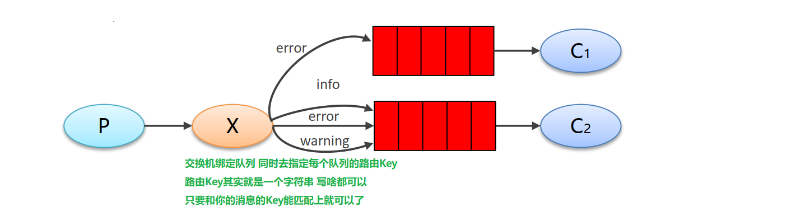

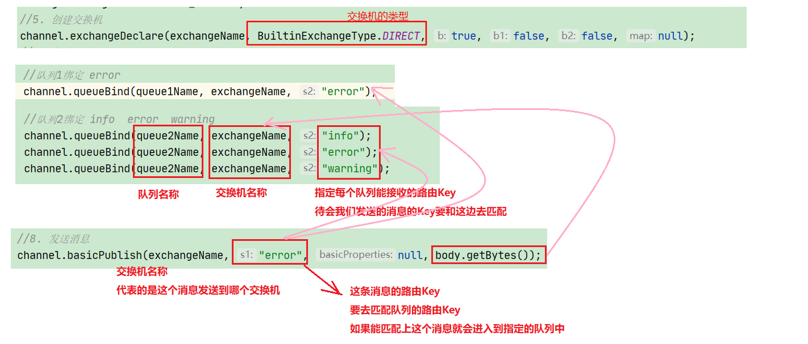

消息生产者代码

```java
package com.itheima.producer;

import com.rabbitmq.client.BuiltinExchangeType;
import com.rabbitmq.client.Channel;
import com.rabbitmq.client.Connection;
import com.rabbitmq.client.ConnectionFactory;

import java.io.IOException;
import java.util.concurrent.TimeoutException;

/**
 * 发送消息
 */
public class Producer_Routing {
    public static void main(String[] args) throws IOException, TimeoutException {

        //1.创建连接工厂
        ConnectionFactory factory = new ConnectionFactory();
        //2. 设置参数
        factory.setHost("192.168.110.75");//ip  默认值 localhost
        factory.setPort(5672); //端口  默认值 5672
        factory.setVirtualHost("/heima");//虚拟机 默认值/
        factory.setUsername("heima");//用户名 默认 guest
        factory.setPassword("heima");//密码 默认值 guest
        //3. 创建连接 Connection
        Connection connection = factory.newConnection();
        //4. 创建Channel
        Channel channel = connection.createChannel();
       
        String exchangeName = "test_direct";
        //5. 创建交换机
        channel.exchangeDeclare(exchangeName, BuiltinExchangeType.DIRECT, true, false, false, null);
        //6. 创建队列
        String queue1Name = "test_direct_queue1";
        String queue2Name = "test_direct_queue2";

        channel.queueDeclare(queue1Name, true, false, false, null);
        channel.queueDeclare(queue2Name, true, false, false, null);
        //7. 绑定队列和交换机
        //队列1绑定 error
        channel.queueBind(queue1Name, exchangeName, "error");

        //队列2绑定 info  error  warning
        channel.queueBind(queue2Name, exchangeName, "info");
        channel.queueBind(queue2Name, exchangeName, "error");
        channel.queueBind(queue2Name, exchangeName, "warning");

        String body = "日志信息：张三调用了delete方法...出错误了。。。日志级别：error...";
        //8. 发送消息
        channel.basicPublish(exchangeName, "error", null, body.getBytes());

        //9. 释放资源
        channel.close();
        connection.close();

    }
}
```

消费者代码同上面的消费者代码 , 改队列名称即可

### Topic模式

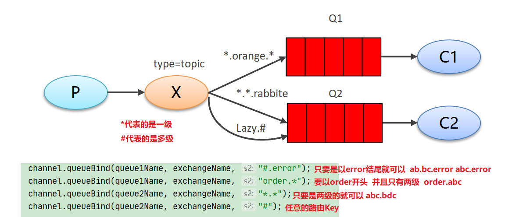


```java
package com.itheima.producer;

import com.rabbitmq.client.BuiltinExchangeType;
import com.rabbitmq.client.Channel;
import com.rabbitmq.client.Connection;
import com.rabbitmq.client.ConnectionFactory;

import java.io.IOException;
import java.util.concurrent.TimeoutException;

/**
 * 发送消息
 */
public class Producer_Topics {
    public static void main(String[] args) throws IOException, TimeoutException {

        //1.创建连接工厂
        ConnectionFactory factory = new ConnectionFactory();
        //2. 设置参数
        factory.setHost("192.168.31.81");//ip  默认值 localhost
        factory.setPort(5672); //端口  默认值 5672
        factory.setVirtualHost("/heima");//虚拟机 默认值/
        factory.setUsername("heima");//用户名 默认 guest
        factory.setPassword("heima");//密码 默认值 guest
        //3. 创建连接 Connection
        Connection connection = factory.newConnection();
        //4. 创建Channel
        Channel channel = connection.createChannel();
       /*

       exchangeDeclare(String exchange, BuiltinExchangeType type, boolean durable, boolean autoDelete, boolean internal, Map<String, Object> arguments)
       参数：
        1. exchange:交换机名称
        2. type:交换机类型
            DIRECT("direct"),：定向
            FANOUT("fanout"),：扇形（广播），发送消息到每一个与之绑定队列。
            TOPIC("topic"),通配符的方式
            HEADERS("headers");参数匹配

        3. durable:是否持久化
        4. autoDelete:自动删除
        5. internal：内部使用。 一般false
        6. arguments：参数
        */

        String exchangeName = "test_topic";
        //5. 创建交换机
        channel.exchangeDeclare(exchangeName, BuiltinExchangeType.TOPIC, true, false, false, null);
        //6. 创建队列
        String queue1Name = "test_topic_queue1";
        String queue2Name = "test_topic_queue2";
        channel.queueDeclare(queue1Name, true, false, false, null);
        channel.queueDeclare(queue2Name, true, false, false, null);
        //7. 绑定队列和交换机
        /*
        queueBind(String queue, String exchange, String routingKey)
        参数：
            1. queue：队列名称
            2. exchange：交换机名称
            3. routingKey：路由键，绑定规则
                如果交换机的类型为fanout ，routingKey设置为""
         */

        // routing key  系统的名称.日志的级别。
        //=需求： 所有error级别的日志存入数据库，所有order系统的日志存入数据库
        channel.queueBind(queue1Name, exchangeName, "#.error");
        channel.queueBind(queue1Name, exchangeName, "order.*");
        channel.queueBind(queue2Name, exchangeName, "*.*");
        channel.queueBind(queue2Name, exchangeName, "#");

        String body = "日志信息：张三调用了findAll方法...日志级别：info...";
        //8. 发送消息
        channel.basicPublish(exchangeName, "goods.error", null, body.getBytes());

        //9. 释放资源
        channel.close();
        connection.close();

    }
}
```

消费者代码同上面的消费者代码 , 改队列名称即可

## Spring整合RabbitMQ

pom.xml

```xml
<dependencies>
    <dependency>
        <groupId>org.springframework</groupId>
        <artifactId>spring-context</artifactId>
        <version>5.1.7.RELEASE</version>
    </dependency>

    <dependency>
        <groupId>org.springframework.amqp</groupId>
        <artifactId>spring-rabbit</artifactId>
        <version>2.1.8.RELEASE</version>
    </dependency>

    <dependency>
        <groupId>junit</groupId>
        <artifactId>junit</artifactId>
        <version>4.12</version>
    </dependency>

    <dependency>
        <groupId>org.springframework</groupId>
        <artifactId>spring-test</artifactId>
        <version>5.1.7.RELEASE</version>
    </dependency>
    <dependency>
        <groupId>org.slf4j</groupId>
        <artifactId>slf4j-simple</artifactId>
        <version>1.7.25</version>
        <scope>compile</scope>
    </dependency>
</dependencies>

<build>
    <plugins>
        <plugin>
            <groupId>org.apache.maven.plugins</groupId>
            <artifactId>maven-compiler-plugin</artifactId>
            <version>3.8.0</version>
            <configuration>
                <source>1.8</source>
                <target>1.8</target>
            </configuration>
        </plugin>
    </plugins>
</build>
```

Spring配置说明

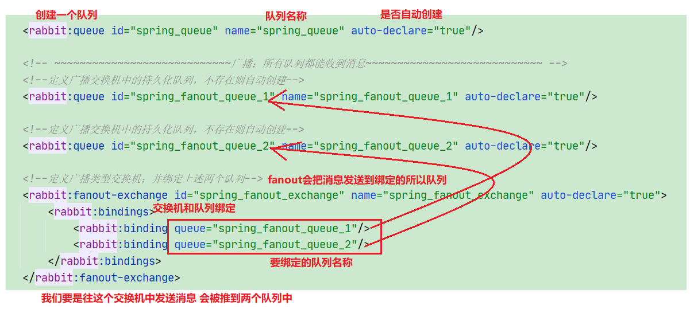

Spring配置文件

```xml
<?xml version="1.0" encoding="UTF-8"?>
<beans xmlns="http://www.springframework.org/schema/beans"
       xmlns:xsi="http://www.w3.org/2001/XMLSchema-instance"
       xmlns:context="http://www.springframework.org/schema/context"
       xmlns:rabbit="http://www.springframework.org/schema/rabbit"
       xsi:schemaLocation="http://www.springframework.org/schema/beans
       http://www.springframework.org/schema/beans/spring-beans.xsd
       http://www.springframework.org/schema/context
       https://www.springframework.org/schema/context/spring-context.xsd
       http://www.springframework.org/schema/rabbit
       http://www.springframework.org/schema/rabbit/spring-rabbit.xsd">
    <!--加载配置文件-->
    <context:property-placeholder location="classpath:rabbitmq.properties"/>

    <!-- 定义rabbitmq connectionFactory -->
    <rabbit:connection-factory id="connectionFactory" host="${rabbitmq.host}"
                               port="${rabbitmq.port}"
                               username="${rabbitmq.username}"
                               password="${rabbitmq.password}"
                               virtual-host="${rabbitmq.virtual-host}"/>

    <!--定义管理交换机、队列 创建 绑定 删除-->
    <rabbit:admin connection-factory="connectionFactory"/>

    <!--定义持久化队列，不存在则自动创建；不绑定到交换机则绑定到默认交换机
    默认交换机类型为direct，名字为：""，路由键为队列的名称
    -->
    <!--
        id：bean的名称
        name：queue的名称
        auto-declare:自动创建
        auto-delete:自动删除。 最后一个消费者和该队列断开连接后，自动删除队列
        exclusive:是否独占
        durable：是否持久化
    -->

    <rabbit:queue id="spring_queue" name="spring_queue" auto-declare="true"/>

    <!-- ~~~~~~~~~~~~~~~~~~~~~~~~~~~~广播；所有队列都能收到消息~~~~~~~~~~~~~~~~~~~~~~~~~~~~ -->
    <!--定义广播交换机中的持久化队列，不存在则自动创建-->
    <rabbit:queue id="spring_fanout_queue_1" name="spring_fanout_queue_1" auto-declare="true"/>

    <!--定义广播交换机中的持久化队列，不存在则自动创建-->
    <rabbit:queue id="spring_fanout_queue_2" name="spring_fanout_queue_2" auto-declare="true"/>

    <!--定义广播类型交换机；并绑定上述两个队列-->
    <rabbit:fanout-exchange id="spring_fanout_exchange" name="spring_fanout_exchange" auto-declare="true">
        <rabbit:bindings>
            <rabbit:binding queue="spring_fanout_queue_1"/>
            <rabbit:binding queue="spring_fanout_queue_2"/>
        </rabbit:bindings>
    </rabbit:fanout-exchange>

    <!--<rabbit:direct-exchange name="aa" >
        <rabbit:bindings>
            &lt;!&ndash;direct 类型的交换机绑定队列  key ：路由key  queue：队列名称&ndash;&gt;
            <rabbit:binding queue="spring_queue" key="xxx"></rabbit:binding>
        </rabbit:bindings>
    </rabbit:direct-exchange>-->

    <!-- ~~~~~~~~~~~~~~~~~~~~~~~~~~~~通配符；*匹配一个单词，#匹配多个单词 ~~~~~~~~~~~~~~~~~~~~~~~~~~~~ -->
    <!--定义广播交换机中的持久化队列，不存在则自动创建-->
    <rabbit:queue id="spring_topic_queue_star" name="spring_topic_queue_star" auto-declare="true"/>
    <!--定义广播交换机中的持久化队列，不存在则自动创建-->
    <rabbit:queue id="spring_topic_queue_well" name="spring_topic_queue_well" auto-declare="true"/>
    <!--定义广播交换机中的持久化队列，不存在则自动创建-->
    <rabbit:queue id="spring_topic_queue_well2" name="spring_topic_queue_well2" auto-declare="true"/>

    <rabbit:topic-exchange id="spring_topic_exchange" name="spring_topic_exchange" auto-declare="true">
        <rabbit:bindings>
            <rabbit:binding pattern="heima.*" queue="spring_topic_queue_star"/>
            <rabbit:binding pattern="heima.#" queue="spring_topic_queue_well"/>
            <rabbit:binding pattern="itcast.#" queue="spring_topic_queue_well2"/>
        </rabbit:bindings>
    </rabbit:topic-exchange>

    <!--定义rabbitTemplate对象操作可以在代码中方便发送消息-->
    <rabbit:template id="rabbitTemplate" connection-factory="connectionFactory"/>
</beans>
```

测试代码

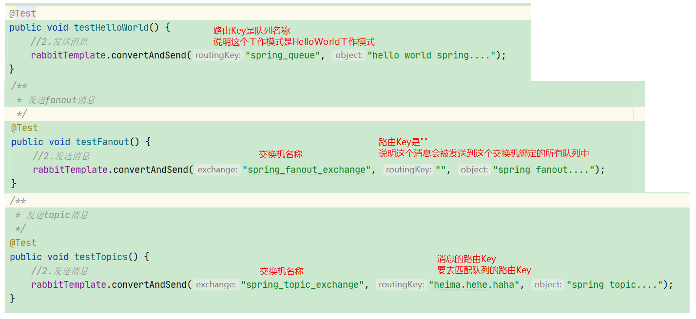

```java
package com.itheima;

import org.junit.Test;
import org.junit.runner.RunWith;
import org.springframework.amqp.rabbit.core.RabbitAdmin;
import org.springframework.amqp.rabbit.core.RabbitTemplate;
import org.springframework.beans.factory.annotation.Autowired;
import org.springframework.test.context.ContextConfiguration;
import org.springframework.test.context.junit4.SpringJUnit4ClassRunner;

// 替换Junit4的默认的核心运行器
@RunWith(SpringJUnit4ClassRunner.class)
// Spring的核心运行器在加载容器的时候需要使用到配置文件/配置类
@ContextConfiguration(locations = "classpath:spring-rabbitmq-producer.xml")
public class ProducerTest {

    //1.注入 RabbitTemplate
    @Autowired
    private RabbitTemplate rabbitTemplate;

    /*@Autowired
    private RabbitAdmin rabbitAdmin;*/

    @Test
    public void testHelloWorld() {
        //2.发送消息
        rabbitTemplate.convertAndSend("spring_queue", "hello world spring....");
    }


    /**
     * 发送fanout消息
     */
    @Test
    public void testFanout() {
        //2.发送消息
        rabbitTemplate.convertAndSend("spring_fanout_exchange", "", "spring fanout....");
    }


    /**
     * 发送topic消息
     */
    @Test
    public void testTopics() {
        //2.发送消息
        rabbitTemplate.convertAndSend("spring_topic_exchange", "heima.hehe.haha", "spring topic....");
    }
}
```

Spring整合RabbitMQ的消费者

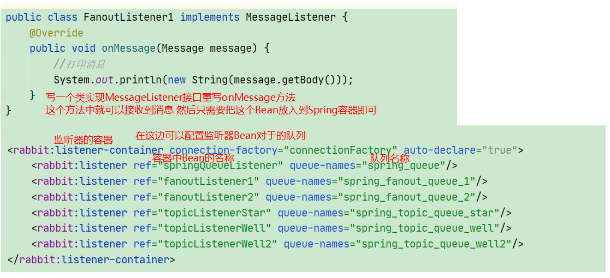

配置文件

```xml
<?xml version="1.0" encoding="UTF-8"?>
<beans xmlns="http://www.springframework.org/schema/beans"
       xmlns:xsi="http://www.w3.org/2001/XMLSchema-instance"
       xmlns:context="http://www.springframework.org/schema/context"
       xmlns:rabbit="http://www.springframework.org/schema/rabbit"
       xsi:schemaLocation="http://www.springframework.org/schema/beans
       http://www.springframework.org/schema/beans/spring-beans.xsd
       http://www.springframework.org/schema/context
       https://www.springframework.org/schema/context/spring-context.xsd
       http://www.springframework.org/schema/rabbit
       http://www.springframework.org/schema/rabbit/spring-rabbit.xsd">
    <!--加载配置文件-->
    <context:property-placeholder location="classpath:rabbitmq.properties"/>

    <!-- 定义rabbitmq connectionFactory -->
    <rabbit:connection-factory id="connectionFactory" host="${rabbitmq.host}"
                               port="${rabbitmq.port}"
                               username="${rabbitmq.username}"
                               password="${rabbitmq.password}"
                               virtual-host="${rabbitmq.virtual-host}"/>


    <bean id="springQueueListener" class="com.itheima.rabbitmq.listener.SpringQueueListener"/>
    <bean id="fanoutListener1" class="com.itheima.rabbitmq.listener.FanoutListener1"/>
    <bean id="fanoutListener2" class="com.itheima.rabbitmq.listener.FanoutListener2"/>
    <bean id="topicListenerStar" class="com.itheima.rabbitmq.listener.TopicListenerStar"/>
    <bean id="topicListenerWell" class="com.itheima.rabbitmq.listener.TopicListenerWell"/>
    <bean id="topicListenerWell2" class="com.itheima.rabbitmq.listener.TopicListenerWell2"/>

    <rabbit:listener-container connection-factory="connectionFactory" auto-declare="true">
        <rabbit:listener ref="springQueueListener" queue-names="spring_queue"/>
        <rabbit:listener ref="fanoutListener1" queue-names="spring_fanout_queue_1"/>
        <rabbit:listener ref="fanoutListener2" queue-names="spring_fanout_queue_2"/>
        <rabbit:listener ref="topicListenerStar" queue-names="spring_topic_queue_star"/>
        <rabbit:listener ref="topicListenerWell" queue-names="spring_topic_queue_well"/>
        <rabbit:listener ref="topicListenerWell2" queue-names="spring_topic_queue_well2"/>
    </rabbit:listener-container>
</beans>
```

```java
package com.itheima.rabbitmq.listener;

import org.springframework.amqp.core.Message;
import org.springframework.amqp.core.MessageListener;
import org.springframework.stereotype.Component;

//实现MessageListener接口，重写onMessage方法
public class FanoutListener1 implements MessageListener {
    @Override
    public void onMessage(Message message) {
        //打印消息
        System.out.println(new String(message.getBody()));
    }
}
```

## Springboot整合RabbitMQ

pom.xml

```xml
<!--
 1. 父工程依赖
-->
<parent>
    <groupId>org.springframework.boot</groupId>
    <artifactId>spring-boot-starter-parent</artifactId>
    <version>2.1.8.RELEASE</version>
</parent>

<dependencies>
    <!--2. rabbitmq-->
    <dependency>
        <groupId>org.springframework.boot</groupId>
        <artifactId>spring-boot-starter-amqp</artifactId>
    </dependency>
    <dependency>
        <groupId>org.springframework.boot</groupId>
        <artifactId>spring-boot-starter-test</artifactId>
    </dependency>
</dependencies>
```

Springboot配置文件

```yml
# 配置RabbitMQ的基本信息  ip 端口 username  password..
spring:
  rabbitmq:
    host: 192.168.13.81 # ip
    port: 5672
    username: heima
    password: heima
    virtual-host: /heima
```

Springboot配置类

```java
package com.itheima.rabbitmq.config;

import org.springframework.amqp.core.*;
import org.springframework.beans.factory.annotation.Qualifier;
import org.springframework.context.annotation.Bean;
import org.springframework.context.annotation.Configuration;

@Configuration
public class RabbitMQConfig {

    public static final String EXCHANGE_NAME = "boot_topic_exchange";
    public static final String QUEUE_NAME = "boot_queue";

    //1.交换机
    @Bean("bootExchange")
    public Exchange bootExchange() {
        return ExchangeBuilder.topicExchange(EXCHANGE_NAME).durable(true).build();
    }


    //2.Queue 队列
    @Bean("bootQueue")
    public Queue bootQueue() {
        return QueueBuilder.durable(QUEUE_NAME).build();
    }

    //3. 队列和交互机绑定关系 Binding
    /*
        1. 知道哪个队列
        2. 知道哪个交换机
        3. routing key
     */
    @Bean
    public Binding bindQueueExchange(@Qualifier("bootQueue") Queue queue,
                                     @Qualifier("bootExchange") Exchange exchange) {
        return BindingBuilder.bind(queue).to(exchange).with("boot.#").noargs();
    }

}
```

发送消息

```java
@SpringBootTest
@RunWith(SpringRunner.class)
public class ProducerTest {

    //1.注入RabbitTemplate
    @Autowired
    private RabbitTemplate rabbitTemplate;

    @Test
    public void testSend() {
        rabbitTemplate.convertAndSend(RabbitMQConfig.EXCHANGE_NAME, "boot.haha", "boot mq hello~~~");
    }
}
```

接收消息

```java
@Component
public class RabbimtMQListener {

    @RabbitListener(queues = "boot_queue")
    public void ListenerQueue(Message message) {
        //System.out.println(message);
        System.out.println(new String(message.getBody()));
    }
}
```

