# RabbitMQ第二天

## 今天必须要会的东西

1. 消息可靠性保障

   - 是一种回调机制，confirm确认producer消息是否成功发送到exchange并回调，return确认exchange消息是否发送给队列并回调，通过设置mandatory来确认未发送成功的消息是回调还是丢弃（默认,false）

2. 消费端限流

   - 是一种应对MQ削峰填谷的优势的体现
   - 在消费端设置获取消息的数量来保障稳定
     - 首先要确保消费端是手动签收模式 acknowledge="manual"
     - 设置prefetch的值  代表每次取出的消息数量

3. 队列过时和消息过时

   - 队列过时：在queue配置属性 x-message-ttl 毫秒值，到达时间后该队列中所有消息移除
   - 消息过时：在listener中设置Expiration ,过期后单条消息移除

4. 死信队列

   - 死信的消息转移到死信队列上的一种操作，消息转移

   - 死信三种情况
     - 消息数量超过队列的长度
     
     - 消费端手动签收拒签，且消息没有返回给队列时（requeue = flase），<font color="red">注意一点：拒签时可以设置将该消息返回给队列，这跟单条消息过时不一样，过时后就会丢失不是马上移除，当消费者消费到该条消息时才会真正移除该消息</font>，<font color="blue">队列过时时，会直接移除，单条消息过时，会在队列顶端时才移除</font>
     
       
     
     - 队列或消息设置了过时

5. 延迟队列

   - 死信+ttl，设置一定的ttl时间，到了这个时间队列消息就转移到死信队列上，这时候监听死信队列即可

6. 消息补偿机制

   - 如果生产者发送的消息没有被成功消费，可能会出现重复发送的情况，详见下图


## 消息可靠性保障

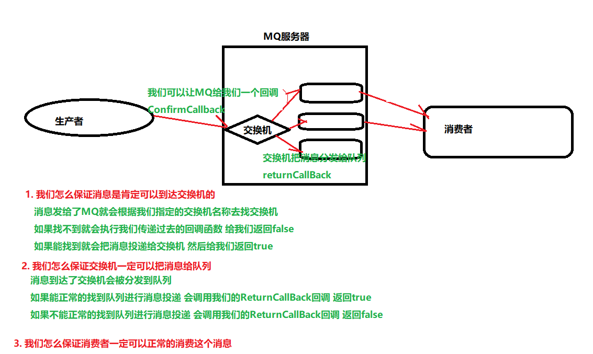

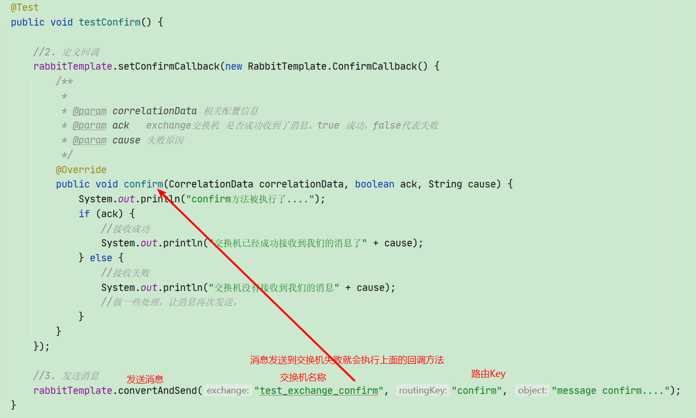

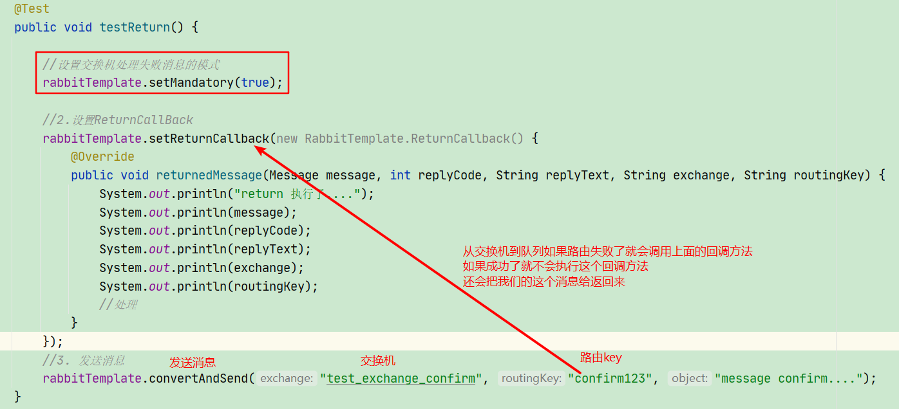

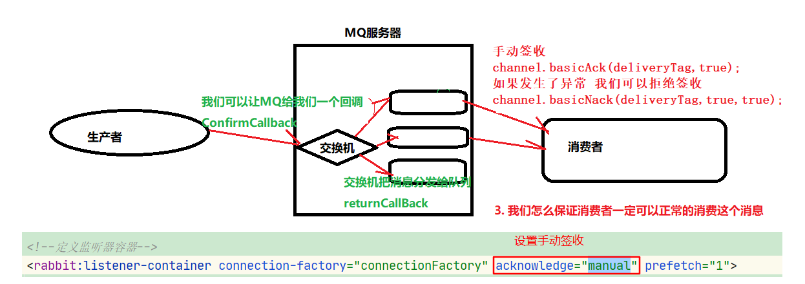

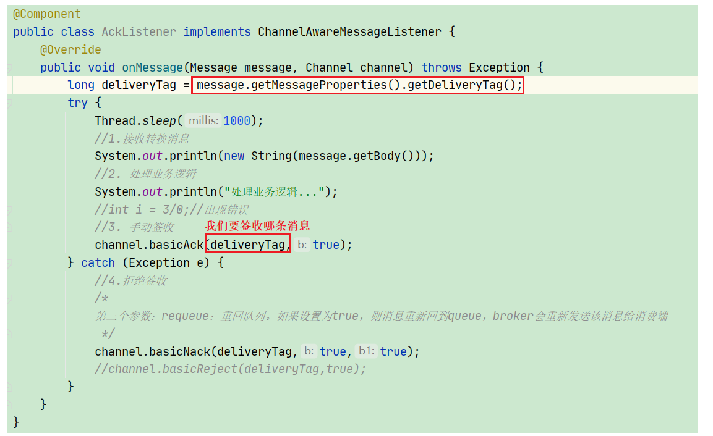

> 以上的方式都是MQ给我们提供的默认处理方式
>
> MQ给我们提供了一系列的回调函数来进行保障
>
> 当我们成功了就给我们一个回应说成功了
>
> 当我们失败了也会给我们一个回应告诉我们失败了  我们就可以再次尝试发送
>
> 如果我们的业务正常消费了一条消息我们也可以告诉MQ　这条消息已经被消费掉了
>
> 如果我们的业务异常了　也可以告诉MQ  把这条消息重新推送给消费者
>
> 利用上面的这些机制 可以基本保障消息的可靠性

生产者的Spring的配置文件

```xml
<?xml version="1.0" encoding="UTF-8"?>
<beans xmlns="http://www.springframework.org/schema/beans"
       xmlns:xsi="http://www.w3.org/2001/XMLSchema-instance"
       xmlns:context="http://www.springframework.org/schema/context"
       xmlns:rabbit="http://www.springframework.org/schema/rabbit"
       xsi:schemaLocation="http://www.springframework.org/schema/beans
       http://www.springframework.org/schema/beans/spring-beans.xsd
       http://www.springframework.org/schema/context
       https://www.springframework.org/schema/context/spring-context.xsd
       http://www.springframework.org/schema/rabbit
       http://www.springframework.org/schema/rabbit/spring-rabbit.xsd">
    <!--加载配置文件-->
    <context:property-placeholder location="classpath:rabbitmq.properties"/>

    <!-- 定义rabbitmq connectionFactory -->
    <rabbit:connection-factory id="connectionFactory" host="${rabbitmq.host}"
                               port="${rabbitmq.port}"
                               username="${rabbitmq.username}"
                               password="${rabbitmq.password}"
                               virtual-host="${rabbitmq.virtual-host}"
                               publisher-confirms="true"
                               publisher-returns="true"
    />
    <!--定义管理交换机、队列-->
    <rabbit:admin connection-factory="connectionFactory"/>

    <!--定义rabbitTemplate对象操作可以在代码中方便发送消息-->
    <rabbit:template id="rabbitTemplate" connection-factory="connectionFactory"/>
    
    <!--消息可靠性投递（生产端）-->
    <rabbit:queue id="test_queue_confirm" name="test_queue_confirm"></rabbit:queue>
    <rabbit:direct-exchange name="test_exchange_confirm">
        <rabbit:bindings>
            <rabbit:binding queue="test_queue_confirm" key="confirm"></rabbit:binding>
        </rabbit:bindings>
    </rabbit:direct-exchange>


    <!--ttl-->
    <rabbit:queue name="test_queue_ttl" id="test_queue_ttl">
        <!--设置queue的参数-->
        <rabbit:queue-arguments>
            <!--x-message-ttl指队列的过期时间-->
            <entry key="x-message-ttl" value="100000" value-type="java.lang.Integer"></entry>
        </rabbit:queue-arguments>
    </rabbit:queue>

    <rabbit:topic-exchange name="test_exchange_ttl" >
        <rabbit:bindings>
            <rabbit:binding pattern="ttl.#" queue="test_queue_ttl"></rabbit:binding>
        </rabbit:bindings>
    </rabbit:topic-exchange>

    <!--
        死信队列：
            1. 声明正常的队列(test_queue_dlx)和交换机(test_exchange_dlx)
            2. 声明死信队列(queue_dlx)和死信交换机(exchange_dlx)
            3. 正常队列绑定死信交换机
                设置两个参数：
                    * x-dead-letter-exchange：死信交换机名称
                    * x-dead-letter-routing-key：发送给死信交换机的routingkey
    -->

    <!--
        1. 声明正常的队列(test_queue_dlx)和交换机(test_exchange_dlx)
    -->

    <rabbit:queue name="test_queue_dlx" id="test_queue_dlx">
        <!--3. 正常队列绑定死信交换机-->
        <rabbit:queue-arguments>
            <!--3.1 x-dead-letter-exchange：死信交换机名称-->
            <entry key="x-dead-letter-exchange" value="exchange_dlx" />
            <!--3.2 x-dead-letter-routing-key：发送给死信交换机的routingkey-->
            <entry key="x-dead-letter-routing-key" value="dlx.hehe" />
            <!--4.1 设置队列的过期时间 ttl-->
            <entry key="x-message-ttl" value="10000" value-type="java.lang.Integer" />
            <!--4.2 设置队列的长度限制 max-length -->
            <entry key="x-max-length" value="10" value-type="java.lang.Integer" />
        </rabbit:queue-arguments>
    </rabbit:queue>
    <rabbit:topic-exchange name="test_exchange_dlx">
        <rabbit:bindings>
            <rabbit:binding pattern="test.dlx.#" queue="test_queue_dlx"></rabbit:binding>
        </rabbit:bindings>
    </rabbit:topic-exchange>


    <!--
       2. 声明死信队列(queue_dlx)和死信交换机(exchange_dlx)
   -->

    <rabbit:queue name="queue_dlx" id="queue_dlx"></rabbit:queue>
    <rabbit:topic-exchange name="exchange_dlx">
        <rabbit:bindings>
            <rabbit:binding pattern="dlx.#" queue="queue_dlx"></rabbit:binding>
        </rabbit:bindings>
    </rabbit:topic-exchange>


    <!--
        延迟队列：
            1. 定义正常交换机（order_exchange）和队列(order_queue)
            2. 定义死信交换机（order_exchange_dlx）和队列(order_queue_dlx)
            3. 绑定，设置正常队列过期时间为30分钟
    -->
    <!-- 1. 定义正常交换机（order_exchange）和队列(order_queue)-->
    <rabbit:queue id="order_queue" name="order_queue">
        <!-- 3. 绑定，设置正常队列过期时间为30分钟-->
        <rabbit:queue-arguments>
            <entry key="x-dead-letter-exchange" value="order_exchange_dlx" />
            <!--  x-dead-letter-routing-key如果不写  默认值是当前这个消息的RoutingKey -->
            <!--<entry key="x-dead-letter-routing-key" value="dlx.order.cancel" />-->
            <entry key="x-message-ttl" value="10000" value-type="java.lang.Integer" />
        </rabbit:queue-arguments>
    </rabbit:queue>
    <rabbit:topic-exchange name="order_exchange">
        <rabbit:bindings>
            <rabbit:binding pattern="order.#" queue="order_queue"></rabbit:binding>
        </rabbit:bindings>
    </rabbit:topic-exchange>

    <!--  2. 定义死信交换机（order_exchange_dlx）和队列(order_queue_dlx)-->
    <rabbit:queue id="order_queue_dlx" name="order_queue_dlx"></rabbit:queue>
    <rabbit:topic-exchange name="order_exchange_dlx">
        <rabbit:bindings>
            <rabbit:binding pattern="order.#" queue="order_queue_dlx"></rabbit:binding>
        </rabbit:bindings>
    </rabbit:topic-exchange>
</beans>
```

生产者的测试代码

```java
package com.itheima.test;


import org.junit.Test;
import org.junit.runner.RunWith;
import org.springframework.amqp.AmqpException;
import org.springframework.amqp.core.Message;
import org.springframework.amqp.core.MessagePostProcessor;
import org.springframework.amqp.rabbit.connection.CorrelationData;
import org.springframework.amqp.rabbit.core.RabbitTemplate;
import org.springframework.beans.factory.annotation.Autowired;
import org.springframework.test.context.ContextConfiguration;
import org.springframework.test.context.junit4.SpringJUnit4ClassRunner;

@RunWith(SpringJUnit4ClassRunner.class)
@ContextConfiguration(locations = "classpath:spring-rabbitmq-producer.xml")
public class ProducerTest {

    @Autowired
    private RabbitTemplate rabbitTemplate;


    /**
     * 确认模式：
     * 步骤：
     * 1. 确认模式开启：ConnectionFactory中开启publisher-confirms="true"
     * 2. 在rabbitTemplate定义ConfirmCallBack回调函数
     */
    @Test
    public void testConfirm() {

        //2. 定义回调
        rabbitTemplate.setConfirmCallback(new RabbitTemplate.ConfirmCallback() {
            /**
             *
             * @param correlationData 相关配置信息
             * @param ack   exchange交换机 是否成功收到了消息。true 成功，false代表失败
             * @param cause 失败原因
             */
            @Override
            public void confirm(CorrelationData correlationData, boolean ack, String cause) {
                System.out.println("confirm方法被执行了....");
                if (ack) {
                    //接收成功
                    System.out.println("交换机已经成功接收到我们的消息了" + cause);
                } else {
                    //接收失败
                    System.out.println("交换机没有接收到我们的消息" + cause);
                    //做一些处理，让消息再次发送。
                    // 次数  5 次  都失败了  把这条消息保存下来 我们人工的手动发送
                }
            }
        });

        //3. 发送消息
        rabbitTemplate.convertAndSend("test_exchange_confirm", "confirm", "message confirm....");
    }


    /**
     * 回退模式： 当消息发送给Exchange后，Exchange路由到Queue失败是 才会执行 ReturnCallBack
     * 步骤：
     * 1. 开启回退模式:publisher-returns="true"
     * 2. 设置ReturnCallBack
     * 3. 设置Exchange处理消息的模式：
     * 1. 如果消息没有路由到Queue，则丢弃消息（默认）
     * 2. 如果消息没有路由到Queue，返回给消息发送方ReturnCallBack
     */

    @Test
    public void testReturn() {

        //设置交换机处理失败消息的模式
        rabbitTemplate.setMandatory(true);

        //2.设置ReturnCallBack
        rabbitTemplate.setReturnCallback(new RabbitTemplate.ReturnCallback() {
            @Override
            public void returnedMessage(Message message, int replyCode, String replyText, String exchange, String routingKey) {
                System.out.println("return 执行了....");
                System.out.println(message);
                System.out.println(replyCode);
                System.out.println(replyText);
                System.out.println(exchange);
                System.out.println(routingKey);
                //处理
            }
        });
        //3. 发送消息
        rabbitTemplate.convertAndSend("test_exchange_confirm", "confirm", "message confirm....");
    }


    @Test
    public void testSend() {
        for (int i = 0; i < 10; i++) {
            // 发送消息
            rabbitTemplate.convertAndSend("test_exchange_confirm", "confirm", "message confirm....");
        }
    }


    /**
     * TTL:过期时间
     * 1. 队列统一过期
     * <p>
     * 2. 消息单独过期
     * <p>
     * <p>
     * 如果设置了消息的过期时间，也设置了队列的过期时间，它以时间短的为准。
     * 队列过期后，会将队列所有消息全部移除。
     * 消息过期后，只有消息在队列顶端，才会判断其是否过期(移除掉)
     */
    @Test
    public void testTtl() {


      /*  for (int i = 0; i < 10; i++) {
            // 发送消息
            rabbitTemplate.convertAndSend("test_exchange_ttl", "ttl.hehe", "message ttl....");
        }*/

        // 消息后处理对象，设置一些消息的参数信息
        MessagePostProcessor messagePostProcessor = new MessagePostProcessor() {
            @Override
            public Message postProcessMessage(Message message) throws AmqpException {
                //1.设置message的信息
                message.getMessageProperties().setExpiration("5000");//消息的过期时间
                //2.返回该消息
                return message;
            }
        };


        //消息单独过期
        //rabbitTemplate.convertAndSend("test_exchange_ttl", "ttl.hehe", "message ttl....",messagePostProcessor);
        for (int i = 0; i < 10; i++) {
            if (i == 5) {
                //消息单独过期
                rabbitTemplate.convertAndSend("test_exchange_ttl", "ttl.hehe", "message ttl....", messagePostProcessor);
            } else {
                //不过期的消息
                rabbitTemplate.convertAndSend("test_exchange_ttl", "ttl.hehe", "message ttl....");
            }
        }
    }


    /**
     * 发送测试死信消息：
     * 1. 过期时间
     * 2. 长度限制
     * 3. 消息拒收
     */
    @Test
    public void testDlx() {
        //1. 测试过期时间，死信消息
        rabbitTemplate.convertAndSend("test_exchange_dlx","test.dlx.haha","我是一条消息，我会死吗？");

        //2. 测试长度限制后，消息死信
        /*for (int i = 0; i < 20; i++) {
            rabbitTemplate.convertAndSend("test_exchange_dlx","test.dlx.haha","我是一条消息，我会死吗？");
        }*/

        //3. 测试消息拒收
        //rabbitTemplate.convertAndSend("test_exchange_dlx", "test.dlx.haha", "我是一条消息，我会死吗？");

    }


    @Test
    public void testDelay() throws InterruptedException {
        //1.发送订单消息。 将来是在订单系统中，下单成功后，发送消息
        rabbitTemplate.convertAndSend("order_exchange", "order.msg", "订单信息：id=1,time=2019年8月17日16:41:47");

        /*//2.打印倒计时10秒
        for (int i = 10; i > 0 ; i--) {
            System.out.println(i+"...");
            Thread.sleep(1000);
        }*/

    }
}
```

消费者的Spring配置文件

```xml
<?xml version="1.0" encoding="UTF-8"?>
<beans xmlns="http://www.springframework.org/schema/beans"
       xmlns:xsi="http://www.w3.org/2001/XMLSchema-instance"
       xmlns:context="http://www.springframework.org/schema/context"
       xmlns:rabbit="http://www.springframework.org/schema/rabbit"
       xsi:schemaLocation="http://www.springframework.org/schema/beans
       http://www.springframework.org/schema/beans/spring-beans.xsd
       http://www.springframework.org/schema/context
       https://www.springframework.org/schema/context/spring-context.xsd
       http://www.springframework.org/schema/rabbit
       http://www.springframework.org/schema/rabbit/spring-rabbit.xsd">
    <!--加载配置文件-->
    <context:property-placeholder location="classpath:rabbitmq.properties"/>

    <!-- 定义rabbitmq connectionFactory -->
    <rabbit:connection-factory id="connectionFactory" host="${rabbitmq.host}"
                               port="${rabbitmq.port}"
                               username="${rabbitmq.username}"
                               password="${rabbitmq.password}"
                               virtual-host="${rabbitmq.virtual-host}"/>


    <context:component-scan base-package="com.itheima.listener" />

    <!--定义监听器容器-->
    <rabbit:listener-container connection-factory="connectionFactory" acknowledge="manual" prefetch="1">
        <!--<rabbit:listener ref="ackListener" queue-names="test_queue_confirm"></rabbit:listener>-->
        <!--<rabbit:listener ref="qosListener" queue-names="test_queue_confirm"></rabbit:listener>-->
        <!--定义监听器，监听正常队列-->
        <!--<rabbit:listener ref="dlxListener" queue-names="test_queue_dlx"></rabbit:listener>-->

        <!--延迟队列效果实现：  一定要监听的是 死信队列！！！-->
        <rabbit:listener ref="orderListener" queue-names="order_queue_dlx"></rabbit:listener>
    </rabbit:listener-container>

</beans>
```

消费者的监听类

```java
package com.itheima.listener;

import com.rabbitmq.client.Channel;
import org.springframework.amqp.core.Message;
import org.springframework.amqp.core.MessageListener;
import org.springframework.amqp.rabbit.listener.api.ChannelAwareMessageListener;
import org.springframework.stereotype.Component;

import java.io.IOException;

/**
 * Consumer ACK机制：
 *  1. 设置手动签收。acknowledge="manual"
 *  2. 让监听器类实现ChannelAwareMessageListener接口
 *  3. 如果消息成功处理，则调用channel的 basicAck()签收
 *  4. 如果消息处理失败，则调用channel的basicNack()拒绝签收，broker重新发送给consumer
 */

@Component
public class AckListener implements ChannelAwareMessageListener {
    @Override
    public void onMessage(Message message, Channel channel) throws Exception {
        long deliveryTag = message.getMessageProperties().getDeliveryTag();
        try {
            Thread.sleep(1000);
            //1.接收转换消息
            System.out.println(new String(message.getBody()));
            //2. 处理业务逻辑
            System.out.println("处理业务逻辑...");
            //int i = 3/0;//出现错误
            //3. 手动签收
            channel.basicAck(deliveryTag,true);
        } catch (Exception e) {
            //4.拒绝签收
            /*
            第三个参数：requeue：重回队列。如果设置为true，则消息重新回到queue，broker会重新发送该消息给消费端
             */
            channel.basicNack(deliveryTag,true,true);
            //channel.basicReject(deliveryTag,true);
        }
    }
}
```

## 消费端限流

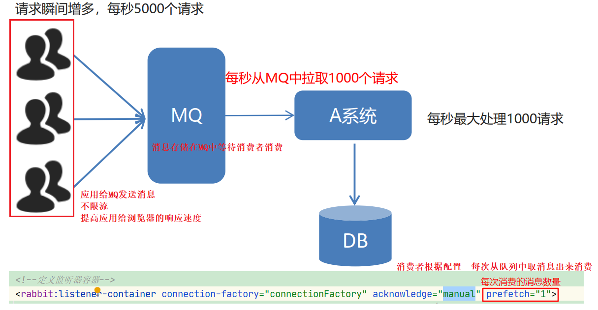

## TTL

> TTL 过期时间
>
> 我们可以给队列 或者 消息取设置过期时间
>
> 如果队列过期了 那么队列中的消息全部丢失了（两种状态，可以是丢失，也可以重新返回给队列）
>
> 如果是给某个消息设置了过期时间 如果在过期时间内还没有被消费 这个消息就过期了

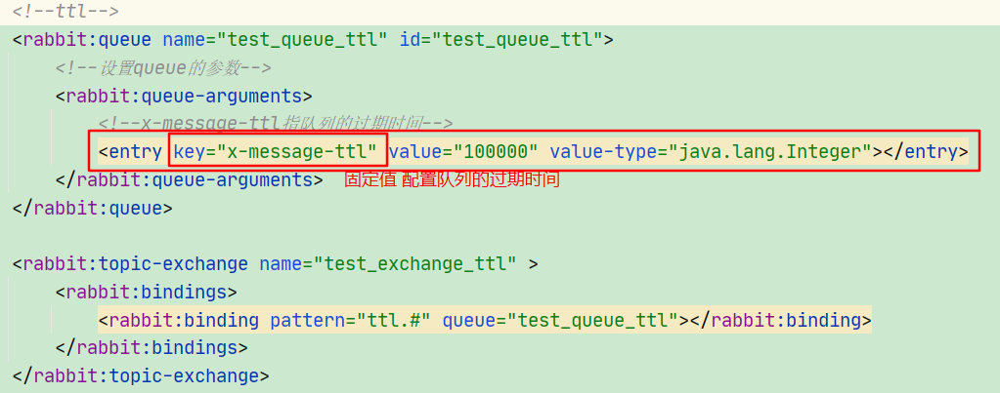

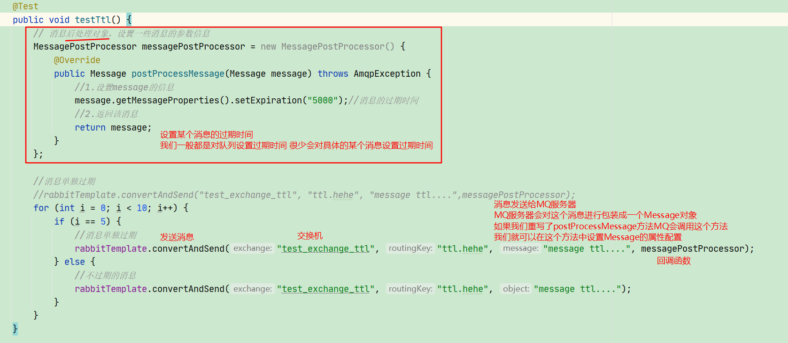

> ==如果消息和队列都设置了过期时间  以时间短的为准==
>
> 如果队列时间过期了 整个队列中的所有消息都会被移除
>
> 如果是具体的某个消息过期了  会被立即移除吗  ? 
>
> 如果这个消息是在队列的中间  不会被移除 只是标记这个消息是一个过期的消息  在被消费的时候才会被移除  肯定不会发给消费者
>
> 如果这个消息在队列的==顶端==，一旦到了过期时间就会被移除 

## 死信队列

### 什么是死信队列

> 死信队列本质上其实也是一个普通的队列 
>
> 死信队列是：正常的普通队列消息到达交换机之后 正常的路由转移给死信队列的
>
> 而死信队列是从已有的队列中转移到死信队列中的
>
> 什么情况下的消息会进入到死信队列中 ?
>
> 消息的三种情况：
>
> 1. 如果消息的长度超过了队列的长度限制 ，再来的新消息就会进入死信队列
> 2. 被拒收的消息且没有再放回原来的队列也会进入到死信队列，前提是手动签收消息
> 3. 超时的消息也会进入到死信队列中

### 怎么配置死信队列

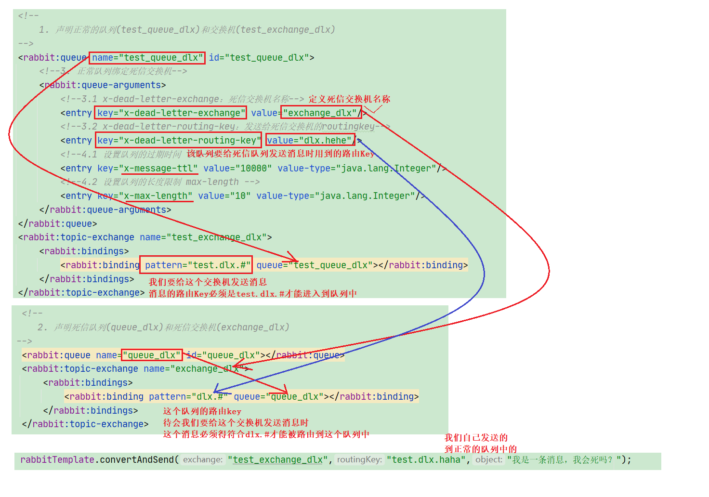

## 延迟队列

> 一个消息发过来 我们要等一段时间才去消费这个消息 
>
> ==场景==
>
> 1. 订单系统 下单后30分钟要支付 否则取消订单
>
> 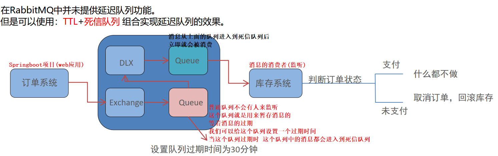

配置参考上面的死信队列

## RabbitMQ的日志查看

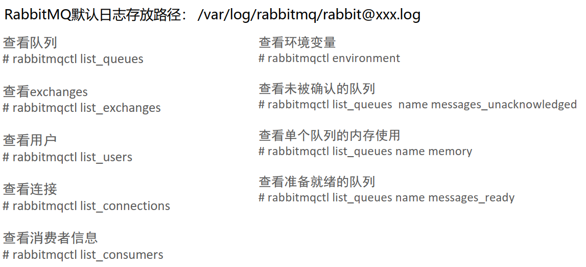

## RabbitMQ的消息追踪

> 我们可以从一个消息的发送开始追踪到这个被消费掉的整个过程
>
> RabbitMQ中已经默认的给我们提供一个追踪的交换机**amq.rabbitmq.trace**
>
> 我们只需要创建一个队列绑定到这个交换机上面即可
>
> 那么所有的消息都会被这个发送到这个交换机上面并且再保存到我们自己的队列上面
>
> 我们还可以使用插件去保存日志到文件 然后去分析文件

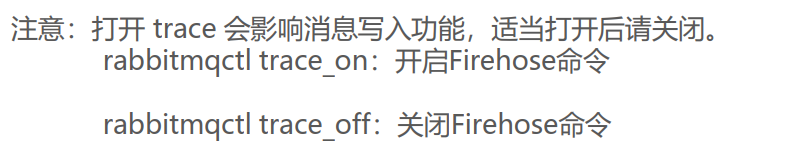


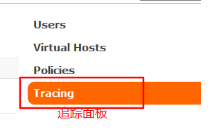

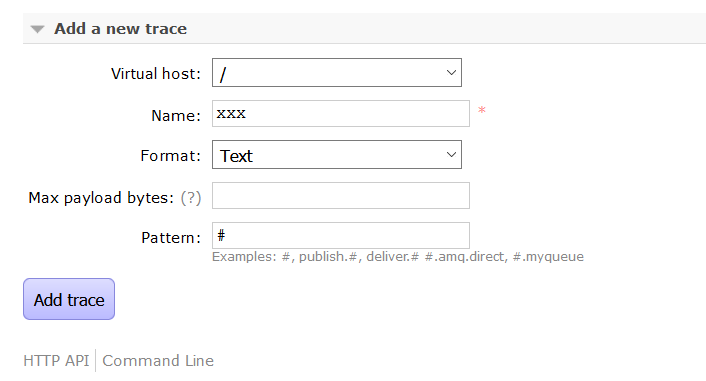

## ==消息补偿机制==

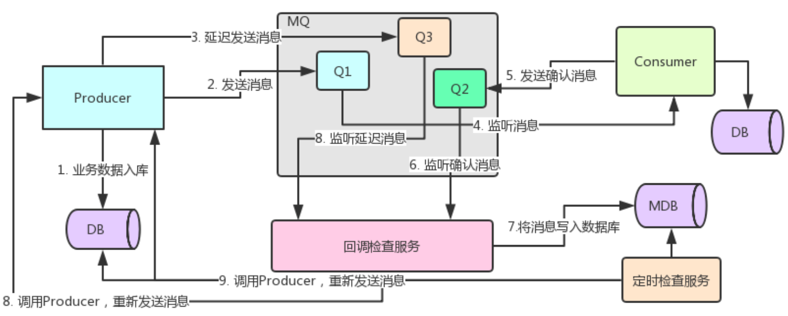

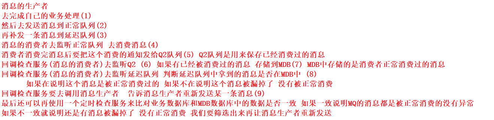

## 消息的幂等性保障

> 消息的幂等性解决的问题是同一个消息不会被消费多次
>
> 啥是幂等性: 同一个操作执行多次结果是相同的 我们称这种操作是幂等性操作
>
> 往数据库中插入一条记录 是幂等性吗 ?  不是，id不同，同一条记录可以插入多次
>
> 根据ID查询一条记录  是幂等性吗 ? 是，只能查询到一条结果，id不会重复

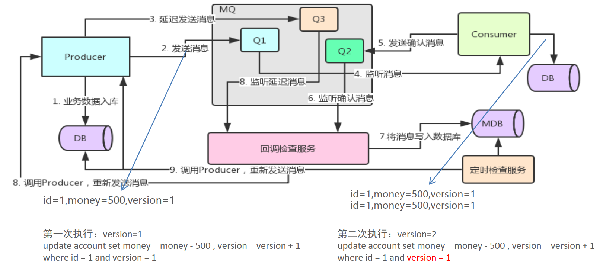

我们也可以使用Redis去解决重复消费问题

我们会把消费过的消息保存到Redis中 , 每次再来消息的时候我们会先去Redis中查询是否有这条记录

如果有说明之前消费过, 就直接响应消费完成, 如果没有说明之前没有消费过, 进行正常消费过程即可

## RabbitMQ的Spring整合


**consumer**

- pom文件

  ~~~~xml
  <?xml version="1.0" encoding="UTF-8"?>
  <project xmlns="http://maven.apache.org/POM/4.0.0"
           xmlns:xsi="http://www.w3.org/2001/XMLSchema-instance"
           xsi:schemaLocation="http://maven.apache.org/POM/4.0.0 http://maven.apache.org/xsd/maven-4.0.0.xsd">
      <modelVersion>4.0.0</modelVersion>
  
      <groupId>com.itheima</groupId>
      <artifactId>day02_spring_rabbitmq_producer</artifactId>
      <version>1.0-SNAPSHOT</version>
  
      <dependencies>
          <dependency>
              <groupId>org.springframework</groupId>
              <artifactId>spring-context</artifactId>
              <version>5.1.7.RELEASE</version>
          </dependency>
  
          <dependency>
              <groupId>org.springframework.amqp</groupId>
              <artifactId>spring-rabbit</artifactId>
              <version>2.1.8.RELEASE</version>
          </dependency>
  
          <dependency>
              <groupId>junit</groupId>
              <artifactId>junit</artifactId>
              <version>4.12</version>
          </dependency>
  
          <dependency>
              <groupId>org.springframework</groupId>
              <artifactId>spring-test</artifactId>
              <version>5.1.7.RELEASE</version>
          </dependency>
      </dependencies>
  
      <build>
          <plugins>
              <plugin>
                  <groupId>org.apache.maven.plugins</groupId>
                  <artifactId>maven-compiler-plugin</artifactId>
                  <version>3.8.0</version>
                  <configuration>
                      <source>1.8</source>
                      <target>1.8</target>
                  </configuration>
              </plugin>
          </plugins>
      </build>
  
  </project>
  ~~~~

  

- ACKlistener 手动签收

~~~java
package com.itheima.listener;

import com.rabbitmq.client.Channel;
import org.springframework.amqp.core.Message;
import org.springframework.amqp.core.MessageListener;
import org.springframework.amqp.rabbit.listener.api.ChannelAwareMessageListener;
import org.springframework.stereotype.Component;

import java.io.IOException;

@Component
public class AckListener implements ChannelAwareMessageListener {


    /**
     * consumer ack机制
     *  1.设置手动签收
     *      acknowledge="manual"
     *  2. 需要用channel接受回调 实现接口ChannelAwareMessageListener
     *
     *  3. 消息处理成功 调用channel的basicAck（）方法
     *  4. 消息处理失败 调用channel的basicNack（）方法 拒绝签收，重新发送给consumer
     *
     *
     * @param message
     */

    @Override
    public void onMessage(Message message, Channel channel) throws Exception {
        long deliveryTag = message.getMessageProperties().getDeliveryTag();

        try {
            //1. 接收转换消息
            System.out.println(new String(message.getBody()));

            //2.处理业务逻辑
            System.out.println("处理业务逻辑...");
            int i = 1 /0;

           //3.手动签收
            channel.basicAck(deliveryTag,true);
        } catch (Exception e) {
            channel.basicNack(deliveryTag,true,true);
        }
    }

}

~~~

- Dlxlistener 死信队列

  ~~~~java
  package com.itheima.listener;
  
  import com.rabbitmq.client.Channel;
  import com.rabbitmq.client.DeliverCallback;
  import org.springframework.amqp.core.Message;
  import org.springframework.amqp.rabbit.listener.api.ChannelAwareMessageListener;
  import org.springframework.stereotype.Component;
  
  import java.io.IOException;
  
  /**
   * 限流机制
   *  1.确认consumer的ack机制为手动
   *  2.配置 prefetch="1" 表示消费端每次从队列中取一条消息
   */
  @Component
  public class DlxListener implements ChannelAwareMessageListener {
  
      @Override
      public void onMessage(Message message, Channel channel) throws Exception {
          long deliveryTag = message.getMessageProperties().getDeliveryTag();
          try {
              // 1.获取消息
              System.out.println(new String(message.getBody()));
              //2. 处理业务逻辑
  
              System.out.println( 1/0);
              //3.签收
              channel.basicAck(deliveryTag,true);
          } catch (IOException e) {
              channel.basicNack(deliveryTag,true,false);
          }
      }
  
  }
  
  ~~~~

- Qoslistener 消费端限流

  ~~~java
  package com.itheima.listener;
  
  import com.rabbitmq.client.Channel;
  import org.springframework.amqp.core.Message;
  import org.springframework.amqp.rabbit.listener.api.ChannelAwareMessageListener;
  import org.springframework.stereotype.Component;
  
  /**
   * 限流机制
   *  1.确认consumer的ack机制为手动
   *  2.配置 prefetch="1" 表示消费端每次从队列中取一条消息
   */
  @Component
  public class QosListener implements ChannelAwareMessageListener {
  
      @Override
      public void onMessage(Message message, Channel channel) throws Exception {
          long deliveryTag = message.getMessageProperties().getDeliveryTag();
          // 1.获取消息
          System.out.println(new String(message.getBody()));
          //2. 处理业务逻辑
  
          //3.签收
          channel.basicAck(deliveryTag,true);
      }
  
  }
  
  ~~~

- Resources

  ~~~~properties
  #rabibtmq的相关配置
  rabbitmq.host=192.168.23.131
  rabbitmq.port=5672
  rabbitmq.username=guest
  rabbitmq.password=guest
  rabbitmq.virtual-host=/
  ~~~~

  spring-rabbitmq-consumer.xml文件

  ~~~xml
  <?xml version="1.0" encoding="UTF-8"?>
  <beans xmlns="http://www.springframework.org/schema/beans"
         xmlns:xsi="http://www.w3.org/2001/XMLSchema-instance"
         xmlns:context="http://www.springframework.org/schema/context"
         xmlns:rabbit="http://www.springframework.org/schema/rabbit"
         xsi:schemaLocation="http://www.springframework.org/schema/beans http://www.springframework.org/schema/beans/spring-beans.xsd http://www.springframework.org/schema/context https://www.springframework.org/schema/context/spring-context.xsd http://www.springframework.org/schema/rabbit http://www.springframework.org/schema/rabbit/spring-rabbit.xsd">
  
      <context:property-placeholder location="classpath*:rabbitmq.properties"/>
  
      <rabbit:connection-factory id="connectionFactory"
                                 host="${rabbitmq.host}"
                                 port="${rabbitmq.port}"
                                 username="${rabbitmq.username}"
                                 password="${rabbitmq.password}"
                                 virtual-host="${rabbitmq.virtual-host}"
      />
  
      <context:component-scan base-package="com.itheima.listener"/>
  
      <rabbit:listener-container connection-factory="connectionFactory" acknowledge="manual" >
          <!--<rabbit:listener ref="ackListener" queue-names="test_queue_confirm"/>-->
          <!--<rabbit:listener ref="qosListener" queue-names="test_queue_confirm"/>-->
          <rabbit:listener ref="dlxListener" queue-names="test_queue_dlx"/>
      </rabbit:listener-container>
  
  </beans>
  ~~~

**producer**

- pom文件

  ~~~xml
  <?xml version="1.0" encoding="UTF-8"?>
  <project xmlns="http://maven.apache.org/POM/4.0.0"
           xmlns:xsi="http://www.w3.org/2001/XMLSchema-instance"
           xsi:schemaLocation="http://maven.apache.org/POM/4.0.0 http://maven.apache.org/xsd/maven-4.0.0.xsd">
      <modelVersion>4.0.0</modelVersion>
  
      <groupId>com.itheima</groupId>
      <artifactId>day02_spring_rabbitmq_producer</artifactId>
      <version>1.0-SNAPSHOT</version>
  
      <dependencies>
          <dependency>
              <groupId>org.springframework</groupId>
              <artifactId>spring-context</artifactId>
              <version>5.1.7.RELEASE</version>
          </dependency>
  
          <dependency>
              <groupId>org.springframework.amqp</groupId>
              <artifactId>spring-rabbit</artifactId>
              <version>2.1.8.RELEASE</version>
          </dependency>
  
          <dependency>
              <groupId>junit</groupId>
              <artifactId>junit</artifactId>
              <version>4.12</version>
          </dependency>
  
          <dependency>
              <groupId>org.springframework</groupId>
              <artifactId>spring-test</artifactId>
              <version>5.1.7.RELEASE</version>
          </dependency>
      </dependencies>
  
      <build>
          <plugins>
              <plugin>
                  <groupId>org.apache.maven.plugins</groupId>
                  <artifactId>maven-compiler-plugin</artifactId>
                  <version>3.8.0</version>
                  <configuration>
                      <source>1.8</source>
                      <target>1.8</target>
                  </configuration>
              </plugin>
          </plugins>
      </build>
  
  </project>
  ~~~

- rabbitmq.properties

  ~~~~properties
  rabbitmq.host=192.168.23.131
  rabbitmq.port=5672
  rabbitmq.username=guest
  rabbitmq.password=guest
  rabbitmq.virtual-host=/
  ~~~~

  spring-rabbitmq-producer.xml

  ~~~xml
  <?xml version="1.0" encoding="UTF-8"?>
  <beans xmlns="http://www.springframework.org/schema/beans"
         xmlns:xsi="http://www.w3.org/2001/XMLSchema-instance"
         xmlns:context="http://www.springframework.org/schema/context"
         xmlns:rabbit="http://www.springframework.org/schema/rabbit"
         xsi:schemaLocation="http://www.springframework.org/schema/beans http://www.springframework.org/schema/beans/spring-beans.xsd http://www.springframework.org/schema/context https://www.springframework.org/schema/context/spring-context.xsd http://www.springframework.org/schema/rabbit http://www.springframework.org/schema/rabbit/spring-rabbit.xsd">
  
      <context:property-placeholder location="classpath*:rabbitmq.properties"/>
  
      <rabbit:connection-factory id="connectionFactory"
                                 host="${rabbitmq.host}"
                                 port="${rabbitmq.port}"
                                 username="${rabbitmq.username}"
                                 password="${rabbitmq.password}"
                                 virtual-host="${rabbitmq.virtual-host}"
                                 publisher-confirms="true"
                                 publisher-returns="true"
      />
  
      <rabbit:admin connection-factory="connectionFactory"/>
  
      <rabbit:template id="rabbitTemplate" connection-factory="connectionFactory"/>
  
      <rabbit:queue id="test_queue_confirm" name="test_queue_confirm" auto-declare="true"/>
  
      <rabbit:direct-exchange name="test_exchange_confirm" auto-declare="true">
          <rabbit:bindings>
              <rabbit:binding queue="test_queue_confirm" key="confirm"></rabbit:binding>
          </rabbit:bindings>
      </rabbit:direct-exchange>
  
      <!--ttl-->
      <rabbit:queue name="test_queue_ttl" id="test_queue_ttl" auto-declare="true">
          <!--设置queue的参数-->
          <rabbit:queue-arguments>
              <!--队列的过期时间-->
              <entry key="x-message-ttl" value="100000" value-type="java.lang.Integer"></entry>
          </rabbit:queue-arguments>
      </rabbit:queue>
  
      <rabbit:topic-exchange name="test_exchange_ttl" id="topicExchange" auto-declare="true">
          <rabbit:bindings>
              <rabbit:binding pattern="ttl.#" queue="test_queue_ttl"></rabbit:binding>
          </rabbit:bindings>
      </rabbit:topic-exchange>
  
  
      <!--死信队列
              1.声明正常队列 test_queue_dlx 和交换机 test_exchange_dlx
              2.声明死信队列 queue_dlx 和交换机 exchange_dlx
              3.正常队列绑定死信交换机
                  x-dead-letter-exchange 死信交换机名称
                  x-dead-letter-routing-key 死信路由key名称
  
      -->
      <!--正常队列-->
      <rabbit:queue id="test_queue_dlx" name="test_queue_dlx" auto-declare="true">
          <rabbit:queue-arguments>
              <!--绑定死信交换机-->
              <entry key="x-dead-letter-exchange" value="exchange_dlx"/>
              <!--死信路由key-->
              <entry key="x-dead-letter-routing-key" value="dlx.aa"/>
              <!--设置队列最大值-->
              <entry key="x-max-length" value="10" value-type="java.lang.Integer"/>
              <!--设置ttl-->
              <entry key="x-message-ttl" value="10000" value-type="java.lang.Integer"/>
  
          </rabbit:queue-arguments>
      </rabbit:queue>
      <!--正常交换机-->
      <rabbit:topic-exchange name="test_exchange_dlx" id="test_exchange_dlx" auto-declare="true" durable="true">
          <rabbit:bindings>
              <rabbit:binding pattern="test.dlx.#" queue="test_queue_dlx"></rabbit:binding>
          </rabbit:bindings>
      </rabbit:topic-exchange>
  
  
      <!--死信队列-->
      <rabbit:queue id="queue_dlx" name="queue_dlx" auto-declare="true">
  
      </rabbit:queue>
      <!--死信交换机-->
      <rabbit:topic-exchange name="exchange_dlx" id="exchange_dlx" auto-declare="true" durable="true">
          <rabbit:bindings>
              <rabbit:binding pattern="dlx.#" queue="queue_dlx"></rabbit:binding>
          </rabbit:bindings>
      </rabbit:topic-exchange>
  </beans>
  ~~~

- Test类

  ~~~java
  package com.itheima.test;
  
  import org.junit.Test;
  import org.junit.runner.RunWith;
  import org.springframework.amqp.AmqpException;
  import org.springframework.amqp.core.Message;
  import org.springframework.amqp.core.MessagePostProcessor;
  import org.springframework.amqp.rabbit.connection.CorrelationData;
  import org.springframework.amqp.rabbit.core.RabbitTemplate;
  import org.springframework.beans.factory.annotation.Autowired;
  import org.springframework.test.context.ContextConfiguration;
  import org.springframework.test.context.junit4.SpringJUnit4ClassRunner;
  
  @RunWith(SpringJUnit4ClassRunner.class)
  @ContextConfiguration(locations = "classpath:spring-rabbitmq-producer.xml")
  public class ProducerTest {
  
      @Autowired
      private RabbitTemplate rabbitTemplate;
  
      /**
       * 确认模式
       */
      @Test
      public void testConfirm() {
          rabbitTemplate.setConfirmCallback(new RabbitTemplate.ConfirmCallback() {
              @Override
              public void confirm(CorrelationData correlationData, boolean b, String s) {
                  System.out.println("confirm方法被执行了...");
  
                  if (b) {
                      System.out.println("交换机成功接受消息" + s);
                  } else {
                      System.out.println("交换机接受消息失败..." + s);
                  }
              }
          });
  
  
          rabbitTemplate.convertAndSend("test_exchange_confirm", "confirm", "confirm running...");
  
      }
  
  
      /**
       * 确认模式
       */
      @Test
      public void testReturn() {
  
  
          //设置交互机处理失败消息的模式
  //        1. 如果消息没有路由到Queue，则丢弃消息（默认）
  //     * 2. 如果消息没有路由到Queue，返回给消息发送方ReturnCallBack
          rabbitTemplate.setMandatory(true);
  
          //设置returnbalc回调
          rabbitTemplate.setReturnCallback(new RabbitTemplate.ReturnCallback() {
              @Override
              public void returnedMessage(Message message, int i, String s, String s1, String s2) {
                  System.out.println("return 执行了...");
                  System.out.println(new String(message.getBody()));
                  System.out.println(i);
                  System.out.println(s);
                  System.out.println(s1);
                  System.out.println(s2);
              }
          });
  
          rabbitTemplate.convertAndSend("test_exchange_confirm", "confirm", "confirm running...");
  
      }
  
  
      @Test
      public void testSend() {
          for (int i = 0; i < 10; i++) {
              rabbitTemplate.convertAndSend("test_exchange_confirm", "confirm", "send test ...");
          }
  
      }
  
      /**
       * 过期时间
       * <p>
       * 1.队列的统一过期
       * <p>
       * <p>
       * 2.消息单独过期
       */
  
      @Test
      public void testTTL() {
  
  //        for (int i = 0; i < 10; i++) {
  //            rabbitTemplate.convertAndSend("test_exchange_ttl","ttl.hehe","message tttl...");
  //        }
  
          //消息后处理对象 设置一些消息的参数信息
          MessagePostProcessor messagePostProcessor = new MessagePostProcessor() {
              @Override
              public Message postProcessMessage(Message message) throws AmqpException {
                  //设置消息过期时间 单条消息过期时间
                  message.getMessageProperties().setExpiration("5000");
  
                  return message;
              }
          };
  
  
          //消息单独过期
  //        rabbitTemplate.convertAndSend("test_exchange_ttl", "ttl.hehe", "message tttl...", messagePostProcessor);
  
          for (int i = 1; i <= 10; i++) {
              if (i == 1) {
                  rabbitTemplate.convertAndSend("test_exchange_ttl", "ttl.hehe", "message tttl...", messagePostProcessor);
  
              } else
                  rabbitTemplate.convertAndSend("test_exchange_ttl", "ttl.hehe", "message tttl...");
          }
      }
  
  
      @Test
      public void testDLX(){
  
          //死信队列的情况
          //1. 队列消息长度
          //2. 队列过期 也一同测试了
          // 参数： 正常队列的交换机名称
  //        for (int i = 0; i < 20; i++) {
  //
  //            rabbitTemplate.convertAndSend("test_exchange_dlx","test.dlx.aa","队列长度....");
  //        }
  
  
          //3.正常发送消息 消费者未签收
              rabbitTemplate.convertAndSend("test_exchange_dlx","test.dlx.aa","没有签收....");
      }
  
  }
  
  ~~~

  

## RabbitMQ的集群搭建

参考集群搭建文档