# RocketMQ

## 今天必须要掌握的东西

1. 能够把RocketMQ跑起来(还是使用之前RabbitMQ的虚拟机)
2. RocketMQ的工作模式
   - 一对一，单生产者对单消费者
   - 一对多，一个生产者对应多个消费者，通过setmessageModel来设置模式，有负载均衡和广播模式
   - 多对多，多个生产者和多个消费都都可以正常运作
3. 消息类别
   - 同步消息：必须等到方法返回才会继续向下执行
   - 异步：无需等到方法返回，有回调函数返回，不关注返回时间
   - 单向：不在乎是否返回，发过去就行，比如日志信息
4. 延迟消息
   - 使用message.setlevel 类似的API设置 0表示不会延迟，从1开始分别表示1s 5s 10s 等等
5. 消息过滤
   - tag过滤
   - sql过滤
     - producer中设置userproperty属性信息
     - consumer中subscribe设置相关语法
6. 解决消息顺序问题
   - 设置消息发送到同一个队列，selectqueue
   - 设置单线程接收，使用new MessageListenerOrderly(){}
7. 消息的事务
   - 三种状态：提交，回滚，未知

## RocketMQ

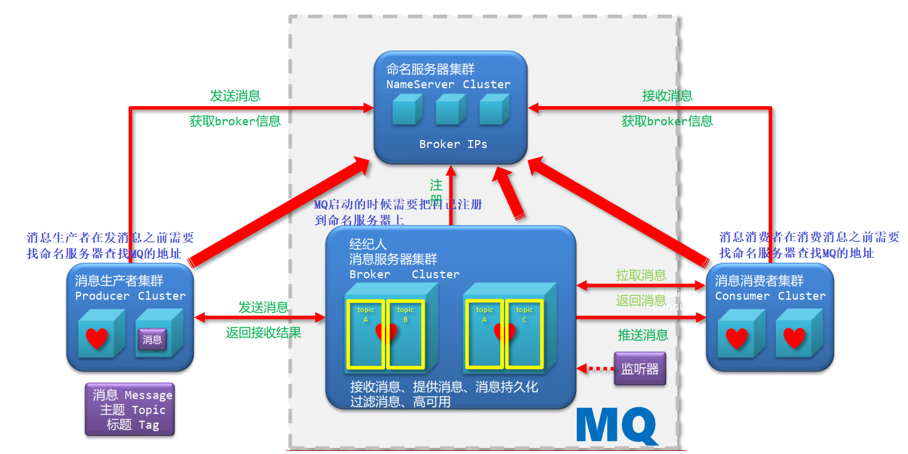

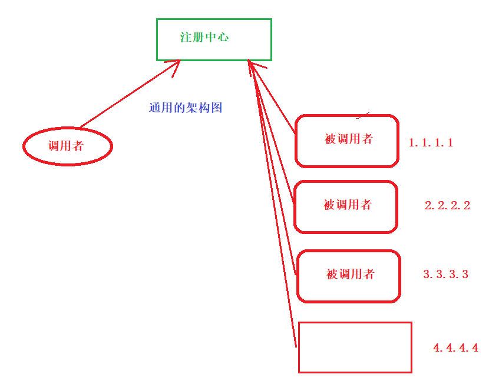

## 启动RocketMQ

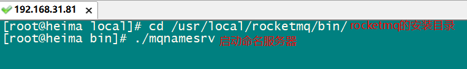

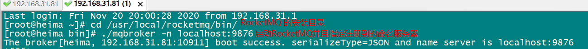

## RocketMQ一对一

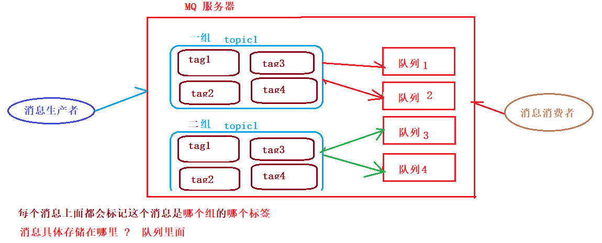

pom文件

```xml
<dependencies>
    <dependency>
        <groupId>org.apache.rocketmq</groupId>
        <artifactId>rocketmq-client</artifactId>
        <version>4.5.2</version>
    </dependency>
</dependencies>
```

消息生产者代码

```java
package com.itheima.base;

import org.apache.rocketmq.client.producer.DefaultMQProducer;
import org.apache.rocketmq.client.producer.SendResult;
import org.apache.rocketmq.common.message.Message;

import java.util.Collection;

public class Producer {
    public static void main(String[] args) throws Exception {
        // 创建一个发送消息的对象
        DefaultMQProducer producer = new DefaultMQProducer("group1");
        // 连接到命名服务器
        producer.setNamesrvAddr("192.168.31.81:9876");
        // 启动服务  根据指定的IP和端口进行连接  获取连接
        producer.start();
        // 发送消息 构建消息对象 指定消息发送到哪个topic  还有消息体内容是啥
        Message msg = new Message("topic1", "hellomq".getBytes());
        // 发送消息 同步  异步  ?
        // 有返回值说明肯定是同步的
        SendResult sendResult = producer.send(msg);
        System.out.println("sendResult = " + sendResult);
        // 关闭连接
        producer.shutdown();
    }
}
```

消息消费者代码

```java
package com.itheima.base;

import org.apache.rocketmq.client.consumer.DefaultMQPushConsumer;
import org.apache.rocketmq.client.consumer.listener.ConsumeConcurrentlyContext;
import org.apache.rocketmq.client.consumer.listener.ConsumeConcurrentlyStatus;
import org.apache.rocketmq.client.consumer.listener.MessageListenerConcurrently;
import org.apache.rocketmq.client.producer.DefaultMQProducer;
import org.apache.rocketmq.client.producer.SendResult;
import org.apache.rocketmq.common.admin.ConsumeStats;
import org.apache.rocketmq.common.message.Message;
import org.apache.rocketmq.common.message.MessageExt;

import java.util.List;

public class Consumer {
    public static void main(String[] args) throws Exception{
        // 创建一个收送消息的对象
        DefaultMQPushConsumer consumer = new DefaultMQPushConsumer("group1");
        // 连接到命名服务器
        consumer.setNamesrvAddr("192.168.31.81:9876");
        // 设置订阅的topic * 代表的是所有标签
        consumer.subscribe("topic1","*");
        // 接收消息
        consumer.registerMessageListener(new MessageListenerConcurrently() {
            @Override
            public ConsumeConcurrentlyStatus consumeMessage(List<MessageExt> list, ConsumeConcurrentlyContext consumeConcurrentlyContext) {
                for (MessageExt messageExt : list) {
                    System.out.println("接收消息 = " + new String(messageExt.getBody()));
                }
                return ConsumeConcurrentlyStatus.CONSUME_SUCCESS;
            }
        });
        // 启动服务
        consumer.start();
        // 关闭连接
        //consumer.shutdown();
    }
}
```

## 一对多

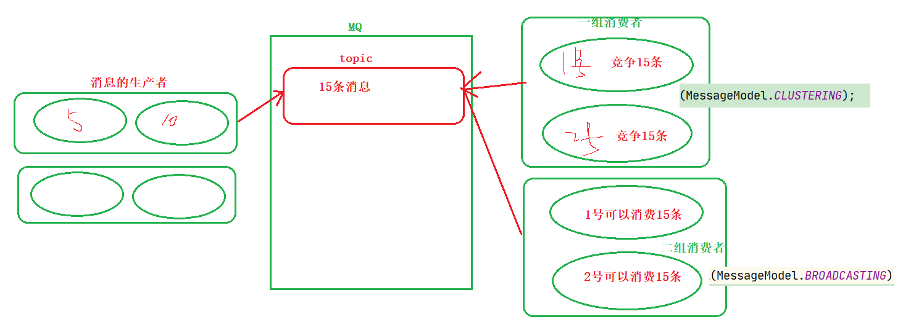

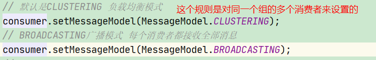

## 多对多

> 其实就是把多个消息生产者的消息发送到同一个topic
>
> 再开启多个消费者去那个topic中取消息

## 消息类型

```java
package com.itheima.messagetype;

import org.apache.rocketmq.client.producer.DefaultMQProducer;
import org.apache.rocketmq.client.producer.SendCallback;
import org.apache.rocketmq.client.producer.SendResult;
import org.apache.rocketmq.common.message.Message;

import java.util.concurrent.TimeUnit;

/* 测试消息类型 */
public class Producer {
    public static void main(String[] args) throws Exception{
        // 创建一个发送消息的对象
        DefaultMQProducer producer = new DefaultMQProducer("group1");
        // 连接到命名服务器
        producer.setNamesrvAddr("192.168.31.81:9876");
        // 启动服务
        producer.start();
        // 发送消息
        for (int i = 1; i <= 10; i++) {
            Message msg = new Message("topic1",("hellomq "+ i).getBytes());
            // 同步消息 发送消息后等着返回结果
            // 如果你需要拿着消息的返回结果取做业务处理 肯定是要使用同步消息
            // 同步的话肯定是要耗时的  发送一个消息的时间
            SendResult sendResult = producer.send(msg);

            // 异步消息 发送消息成功后调用回调函数中的方法
            // 异步消息是只要把消息发送出去 同步把回调函数传递给send方法即可
            // 程序就立即向下执行了 根本不会等待消息的结果返回
            // 消息处理完毕后会自动执行回调函数中的代码
            producer.send(msg, new SendCallback() {
                @Override
                public void onSuccess(SendResult sendResult) {
                    System.out.println("消息发送成功后回调");
                }

                @Override
                public void onException(Throwable throwable) {
                    System.out.println("消息发送失败后回调");
                }
            });
            // 单向消息 发送消息后不会有返回值
            // 消息一旦发送出去后就不管不问了 
            producer.sendOneway(msg);
        }

        TimeUnit.SECONDS.sleep(3);
        // 关闭连接
        producer.shutdown();
    }
}
```

## 延时消息

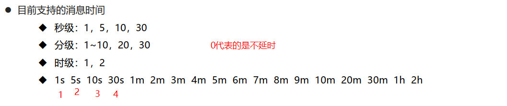

```java
package com.itheima.delaymessage;

import org.apache.rocketmq.client.producer.DefaultMQProducer;
import org.apache.rocketmq.client.producer.SendResult;
import org.apache.rocketmq.common.message.Message;

public class Producer {
    public static void main(String[] args) throws Exception{
        // 创建一个发送消息的对象
        DefaultMQProducer producer = new DefaultMQProducer("group1");
        // 连接到命名服务器
        producer.setNamesrvAddr("192.168.31.81:9876");
        // 启动服务
        producer.start();
        // 发送消息
        for (int i = 1; i <= 10; i++) {
            Message msg = new Message("topic2",("hellomq "+ i).getBytes());
            // 1s 5s 10s 30s ....
            // 0 代表是不延时 立即发送
            msg.setDelayTimeLevel(0);
            SendResult sendResult = producer.send(msg);
        }

        // 关闭连接
        producer.shutdown();
    }
}
```

## 消息的批量发送

```java
package com.itheima.mul;

import org.apache.rocketmq.client.producer.DefaultMQProducer;
import org.apache.rocketmq.client.producer.SendResult;
import org.apache.rocketmq.common.message.Message;

import java.util.ArrayList;

public class Producer {
    public static void main(String[] args) throws Exception {
        // 创建一个发送消息的对象
        DefaultMQProducer producer = new DefaultMQProducer("group1");
        // 连接到命名服务器
        producer.setNamesrvAddr("192.168.31.75:9876");
        // 启动服务
        producer.start();
        // 发送消息
        Message msg1 = new Message("topic1", ("hellomq1").getBytes());
        Message msg2 = new Message("topic1", ("hellomq2").getBytes());
        Message msg3 = new Message("topic1", ("hellomq3").getBytes());
        ArrayList<Message> messages = new ArrayList<>();
        messages.add(msg1);
        messages.add(msg2);
        messages.add(msg3);
        SendResult sendResult = producer.send(messages);
        System.out.println("sendResult = " + sendResult);
        // 关闭连接
        producer.shutdown();
    }
}
```

## Tag标签的使用

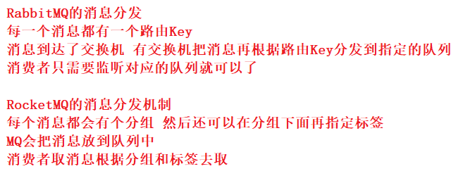

```java
package com.itheima.filtertag;

import org.apache.rocketmq.client.producer.DefaultMQProducer;
import org.apache.rocketmq.client.producer.SendResult;
import org.apache.rocketmq.common.message.Message;

public class Producer {
    public static void main(String[] args) throws Exception {
        // 创建一个发送消息的对象
        DefaultMQProducer producer = new DefaultMQProducer("group1");
        // 连接到命名服务器
        producer.setNamesrvAddr("192.168.31.81:9876");
        // 启动服务
        producer.start();
        // 发送消息
        // 给每个消息都可以指定一个topic和tag
        Message msg = new Message("topic31", "tt11", ("hellomq..tag").getBytes());
        SendResult sendResult = producer.send(msg);
        
        // 关闭连接
        producer.shutdown();
    }
}
```

```java
package com.itheima.filtertag;

import org.apache.rocketmq.client.consumer.DefaultMQPushConsumer;
import org.apache.rocketmq.client.consumer.listener.ConsumeConcurrentlyContext;
import org.apache.rocketmq.client.consumer.listener.ConsumeConcurrentlyStatus;
import org.apache.rocketmq.client.consumer.listener.MessageListenerConcurrently;
import org.apache.rocketmq.common.message.MessageExt;
import org.apache.rocketmq.common.protocol.heartbeat.MessageModel;

import java.util.List;

/* 一个生产者对应多个消费者 */
public class Consumer {
    public static void main(String[] args) throws Exception{
        // 创建一个收送消息的对象
        DefaultMQPushConsumer consumer = new DefaultMQPushConsumer("group1");
        // 连接到命名服务器
        consumer.setNamesrvAddr("192.168.31.81:9876");
        // 设置订阅的topic
        // * 代表接收所有tag 指定多个tag可以使用 tag1 || tag2
        consumer.subscribe("topic31","tt");
        // 接收消息
        consumer.registerMessageListener(new MessageListenerConcurrently() {
            @Override
            public ConsumeConcurrentlyStatus consumeMessage(List<MessageExt> list, ConsumeConcurrentlyContext consumeConcurrentlyContext) {
                for (MessageExt messageExt : list) {
                    System.out.println("接收消息 = " + new String(messageExt.getBody()));
                }
                return ConsumeConcurrentlyStatus.CONSUME_SUCCESS;
            }
        });
        // 启动服务
        consumer.start();
        // 关闭连接
        //consumer.shutdown();
    }
}
```

## SQL过滤

==需要以下配置使支持SQL过滤，未配置会报错==

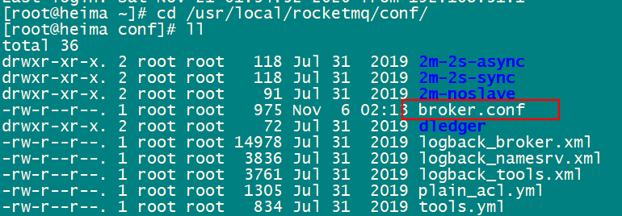

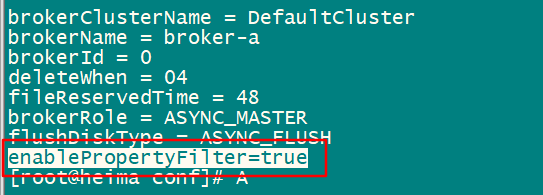

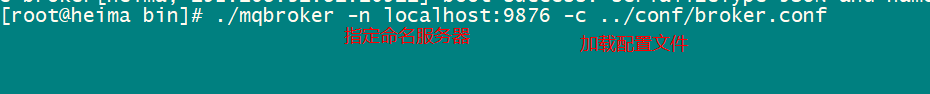

消息的消费者

```java
package com.itheima.filtersql;

import org.apache.rocketmq.client.consumer.DefaultMQPushConsumer;
import org.apache.rocketmq.client.consumer.MessageSelector;
import org.apache.rocketmq.client.consumer.listener.ConsumeConcurrentlyContext;
import org.apache.rocketmq.client.consumer.listener.ConsumeConcurrentlyStatus;
import org.apache.rocketmq.client.consumer.listener.MessageListenerConcurrently;
import org.apache.rocketmq.common.message.MessageExt;

import java.util.List;

/* 一个生产者对应多个消费者 */
public class Consumer {
    public static void main(String[] args) throws Exception{
        // 创建一个收送消息的对象
        DefaultMQPushConsumer consumer = new DefaultMQPushConsumer("group1");
        // 连接到命名服务器
        consumer.setNamesrvAddr("192.168.31.81:9876");
        // 设置订阅的topic
        consumer.subscribe("topic5", MessageSelector.bySql("age > 18"));
//        consumer.subscribe("topic5", MessageSelector.bySql("uname = 'zhs'"));
//        consumer.subscribe("topic5", MessageSelector.bySql("age > 18 or uname = 'zhshan'"));
//        consumer.subscribe("topic5", MessageSelector.bySql("TAGS in ('abc','bcd')"));
        // 接收消息
        consumer.registerMessageListener(new MessageListenerConcurrently() {
            @Override
            public ConsumeConcurrentlyStatus consumeMessage(List<MessageExt> list, ConsumeConcurrentlyContext consumeConcurrentlyContext) {
                for (MessageExt messageExt : list) {
                    System.out.println("接收消息 = " + new String(messageExt.getBody()));
                }
                return ConsumeConcurrentlyStatus.CONSUME_SUCCESS;
            }
        });
        // 启动服务
        consumer.start();
        // 关闭连接
        //consumer.shutdown();
    }
}
```

消费者的生产者

```java
package com.itheima.filtersql;

import org.apache.rocketmq.client.producer.DefaultMQProducer;
import org.apache.rocketmq.client.producer.SendResult;
import org.apache.rocketmq.common.message.Message;

public class Producer {
    public static void main(String[] args) throws Exception {
        // 创建一个发送消息的对象
        DefaultMQProducer producer = new DefaultMQProducer("group1");
        // 连接到命名服务器
        producer.setNamesrvAddr("192.168.31.81:9876");
        // 启动服务
        producer.start();
        // 发送消息
        Message msg = new Message("topic5","xxx", ("hellomq..sql").getBytes());
        msg.putUserProperty("age","10");
        msg.putUserProperty("uname","zhsan");
        SendResult sendResult = producer.send(msg);
        // 关闭连接
        producer.shutdown();
    }
}
```

## 消息的顺序性保障

> 第一步需要保障同一个业务的消息进入到同一个队列中
>
> 第二步需要保障同一个队列只能被一个线程进行消费

消息的生产者

```java
package com.itheima.order;

import com.itheima.domain.Order;
import org.apache.rocketmq.client.producer.DefaultMQProducer;
import org.apache.rocketmq.client.producer.MessageQueueSelector;
import org.apache.rocketmq.client.producer.SendResult;
import org.apache.rocketmq.common.message.Message;
import org.apache.rocketmq.common.message.MessageQueue;

import java.util.ArrayList;
import java.util.List;

public class Producer {
    public static void main(String[] args) throws Exception {
        // 创建一个发送消息的对象
        DefaultMQProducer producer = new DefaultMQProducer("group1");
        // 连接到命名服务器
        producer.setNamesrvAddr("192.168.31.81:9876");
        // 启动服务
        producer.start();
        // 准备数据
        ArrayList<Order> orders = new ArrayList<>();
        Order order1 = new Order();
        order1.setId("a");
        order1.setMsg("主单-1");
        orders.add(order1);

        Order order2 = new Order();
        order2.setId("a");
        order2.setMsg("子单-2");
        orders.add(order2);

        Order order3 = new Order();
        order3.setId("a");
        order3.setMsg("支付-3");
        orders.add(order3);

        Order order4 = new Order();
        order4.setId("a");
        order4.setMsg("推送-4");
        orders.add(order4);

        Order order5 = new Order();
        order5.setId("b");
        order5.setMsg("主单-1");
        orders.add(order5);

        Order order6 = new Order();
        order6.setId("b");
        order6.setMsg("子单-2");
        orders.add(order6);

        Order order7 = new Order();
        order7.setId("c");
        order7.setMsg("主单-1");
        orders.add(order7);

        Order order8 = new Order();
        order8.setId("c");
        order8.setMsg("子单-2");
        orders.add(order8);

        Order order9 = new Order();
        order9.setId("c");
        order9.setMsg("支付-3");
        orders.add(order9);

        // 将同一个订单业务信息发送到同一个队列中
        //这里的order要用final修饰，原因是下面的匿名内部类new MessageQueueSelector()中引用到了order，即order.getId()。java中规定，局部内部类引用局部变量时需要在局部变量添加final，百度查询是说防止更改局部变量值，局内匿名内部类引用时就扩大了order的作用域范围，为了安全性考虑而必须加final
        for (final Order order : orders) {
            // 发送消息
            Message msg = new Message("ordertopic", order.toString().getBytes());
            SendResult send = producer.send(msg, new MessageQueueSelector() {
                @Override
                public MessageQueue select(List<MessageQueue> list, Message message, Object o) {
                    // 根据不同的消息选择不同的消息队列
                    // 数字 a  123  b  234  c  456
                    // % 4   =  1 - 3
                    // 1  2
                    int i = order.getId().hashCode() % list.size();
                    return list.get(i);
                }
            }, null);
            System.out.println("send = " + send);
        }

        // 关闭连接
        producer.shutdown();
    }
}
```

```java
package com.itheima.order;

import org.apache.rocketmq.client.consumer.DefaultMQPushConsumer;
import org.apache.rocketmq.client.consumer.MessageSelector;
import org.apache.rocketmq.client.consumer.listener.*;
import org.apache.rocketmq.common.message.MessageExt;

import java.util.List;

/* 一个生产者对应多个消费者 */
public class Consumer {
    public static void main(String[] args) throws Exception {
        Thread.sleep(100);
        // 创建一个收送消息的对象
        DefaultMQPushConsumer consumer = new DefaultMQPushConsumer("group1");
        // 连接到命名服务器
        consumer.setNamesrvAddr("192.168.31.81:9876");
        // 设置订阅的topic
        consumer.subscribe("ordertopic", "*");
        // 同一个队列中使用同一个线程接收消息
        consumer.registerMessageListener(new MessageListenerOrderly() {
            @Override
            public ConsumeOrderlyStatus consumeMessage(List<MessageExt> list,
                                                       ConsumeOrderlyContext consumeOrderlyContext) {
                for (MessageExt messageExt : list) {
                    System.out.println(new String(messageExt.getBody()));
                }
                return ConsumeOrderlyStatus.SUCCESS;
            }
        });
        // 启动服务
        consumer.start();
        // 关闭连接
        //consumer.shutdown();
    }
}
```

## MQ的事务

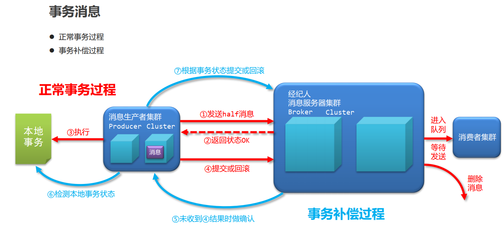

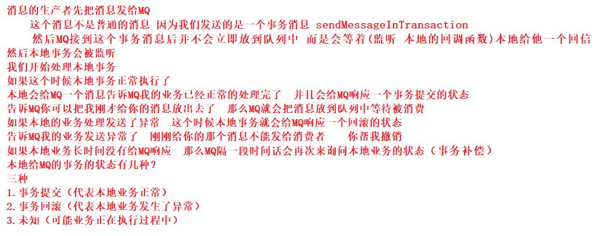

消息的生产者

```java
package com.itheima.transaction;

import org.apache.rocketmq.client.exception.MQClientException;
import org.apache.rocketmq.client.producer.*;
import org.apache.rocketmq.common.message.Message;
import org.apache.rocketmq.common.message.MessageExt;

import java.util.ArrayList;
import java.util.concurrent.TimeUnit;

public class Producer {
    public static void main(String[] args) throws Exception {
        // 创建一个发送消息的对象
        TransactionMQProducer producer = new TransactionMQProducer("group1");
        // 连接到命名服务器
        producer.setNamesrvAddr("192.168.31.81:9876");
        // 设置监听事务状态
        producer.setTransactionListener(new MyTransactionListener());

        // 启动服务
        producer.start();
        // 构建消息
        Message msg = new Message("topic123", ("hellomq1...trans").getBytes());
        // 发送事务消息
        SendResult sendResult = producer.sendMessageInTransaction(msg, null);
        System.out.println("sendResult = " + sendResult);
        // 关闭连接
        //producer.shutdown();
    }

}
```

本地事务

```java
package com.itheima.transaction;

import org.apache.rocketmq.client.producer.LocalTransactionState;
import org.apache.rocketmq.client.producer.TransactionListener;
import org.apache.rocketmq.common.message.Message;
import org.apache.rocketmq.common.message.MessageExt;

import java.util.HashMap;

public class MyTransactionListener implements TransactionListener {
    // 保存本地的事务状态
    // Key为MQ中消息事务的ID Value定义本地事务的状态
    // 0: 代表正在执行/超时/未知   1: 代表事务成功   2: 代表事务异常/回滚
    private HashMap<String, Integer> lts = new HashMap<>();

    @Override
    public LocalTransactionState executeLocalTransaction(Message message, Object o) {
        // 获取当期消息的事务ID
        String transactionId = message.getTransactionId();
        System.out.println("本次的事务ID是: " + transactionId);
        // 保存到本地事务状态中
        lts.put(transactionId, 0);
        try {
            System.out.println("本地事务开始执行.....");
            Thread.sleep(60000);
            //System.out.println(1/0);
            System.out.println("本地事务执行成功.....");
            lts.put(transactionId, 1);
        } catch (Exception e) {
            //e.printStackTrace();
            System.out.println("本地事务执行异常了....");
            lts.put(transactionId, 2);
            return LocalTransactionState.ROLLBACK_MESSAGE;
        }
        // 告诉MQ把消息放出去
        return LocalTransactionState.COMMIT_MESSAGE;
    }

    @Override
    public LocalTransactionState checkLocalTransaction(MessageExt messageExt) {
        // 消息回查  MQ在一段时间内没有收到消息的确认 会来这里确认消息的状态
        // 我们可以根据本地事务的状态去给MQ发送确认消息
        // 获取消息的事务ID
        String transactionId = messageExt.getTransactionId();
        // 根据事务的ＩＤ获取本地事务的状态
        Integer status = lts.get(transactionId);
        // 输出事务状态到控制台
        System.out.println("事务ID:" + transactionId + "   " + "事务状态: " + status);
        switch (status) {
            case 0:
                return LocalTransactionState.UNKNOW;
            case 1:
                return LocalTransactionState.COMMIT_MESSAGE;
            case 2:
                return LocalTransactionState.ROLLBACK_MESSAGE;
        }
        return LocalTransactionState.UNKNOW;
    }
}
```

消息的消费者

```java
package com.itheima.transaction;

import org.apache.rocketmq.client.consumer.DefaultMQPushConsumer;
import org.apache.rocketmq.client.consumer.listener.*;
import org.apache.rocketmq.client.exception.MQClientException;
import org.apache.rocketmq.common.consumer.ConsumeFromWhere;
import org.apache.rocketmq.common.message.MessageExt;

import java.util.List;
import java.util.Random;
import java.util.concurrent.TimeUnit;

/* 一个生产者对应多个消费者 */
public class Consumer {
    public static void main(String[] args) throws Exception {
        // 创建一个收送消息的对象
        DefaultMQPushConsumer consumer = new DefaultMQPushConsumer("group1");
        // 连接到命名服务器
        consumer.setNamesrvAddr("192.168.31.81:9876");
        // 设置订阅的topic
        consumer.subscribe("topic123", "*");
        // 接收消息
        consumer.registerMessageListener(new MessageListenerConcurrently() {
            @Override
            public ConsumeConcurrentlyStatus consumeMessage(List<MessageExt> list, ConsumeConcurrentlyContext consumeConcurrentlyContext) {
                for (MessageExt messageExt : list) {
                    System.out.println("接收消息 = " + new String(messageExt.getBody()));
                }
                return ConsumeConcurrentlyStatus.CONSUME_SUCCESS;
            }
        });
        // 启动服务
        consumer.start();
        // 关闭连接
        //consumer.shutdown();
    }
}
```

## 整合Springboot

pom文件

```xml
<dependency>
    <groupId>org.apache.rocketmq</groupId>
    <artifactId>rocketmq-spring-boot-starter</artifactId>
    <version>2.0.3</version>
</dependency>
```

消息的生产者

```java
package com.itheima.producer;

import org.apache.rocketmq.spring.core.RocketMQTemplate;
import org.junit.jupiter.api.Test;
import org.springframework.beans.factory.annotation.Autowired;
import org.springframework.boot.test.context.SpringBootTest;

@SpringBootTest
class ProducerApplicationTests {

	@Autowired
	RocketMQTemplate mqTemplate;

	@Test
	void contextLoads() {
		// 消息发送
		mqTemplate.convertAndSend("topic1","hello springboot");
	}
}
```

~~~properties
rocketmq.name-server=192.168.23.131:9876
~~~


消息的消费者

```java
package com.itheima.consumer;

import org.apache.rocketmq.spring.annotation.RocketMQMessageListener;
import org.apache.rocketmq.spring.core.RocketMQListener;
import org.springframework.stereotype.Component;

@Component
@RocketMQMessageListener(topic = "topic1",consumerGroup = "group1")
public class MQConsumer implements RocketMQListener<String> {
    @Override
    public void onMessage(String s) {
        System.out.println("接收消息 = " + s);
    }
}
```

properties文件

~~~properties
rocketmq.name-server=192.168.23.131:9876
rocketmq.producer.group=group1
~~~

