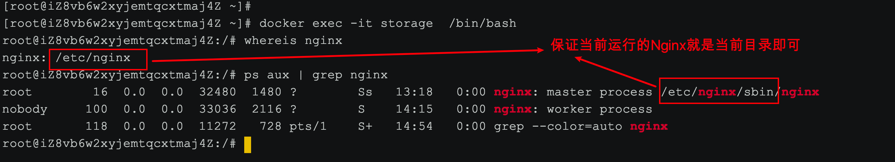
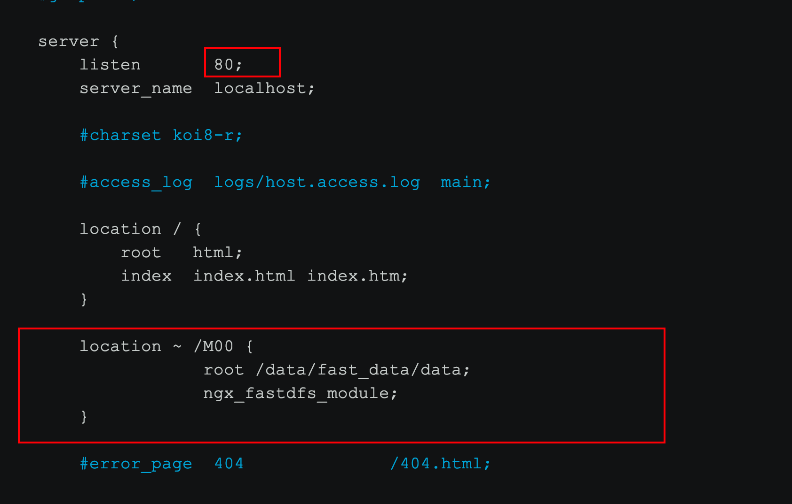
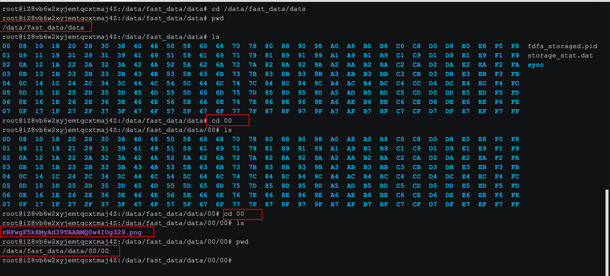

### 1 拉取镜像

```properties
docker pull morunchang/fastdfs
```

> 如果网速下载慢，可以参考资料文件夹中给大家导出的镜像包上传到 Linux服务器上，通过`docker load -i my_fdfs.tar` 加载镜像。
>
> 使用 docker images查看是否成功

### 2 运行tracker

```properties
docker run -d --name tracker --net=host morunchang/fastdfs sh tracker.sh
```

### 3 运行storage

```properties
docker run -d --name storage --net=host -e TRACKER_IP=<your tracker server address>:22122 -e GROUP_NAME=<group name> morunchang/fastdfs sh storage.sh

例子：
docker run -d --name storage --net=host -e TRACKER_IP=192.168.200.130:22122 -e GROUP_NAME=group1 morunchang/fastdfs sh storage.sh
```

- 使用的网络模式是–net=host, <your tracker server address> 替换为你机器的Ip即可  
- <group name> 是组名，即storage的组  
- 如果想要增加新的storage服务器，再次运行该命令，注意更换 新组名

### 4 修改nginx的配置  

进入storage的容器内部，修改nginx.conf

```sh
# 进入到storage容器内部
docker exec -it storage  /bin/bash
```

进入到容器内部后

```sh
#1 通过命令来查询Nginx的安装位置
root@iZ8vb6w2xyjemtqcxtmaj4Z:/# whereis nginx
nginx: /etc/nginx
#2 查看当前Nginx的进程
root@iZ8vb6w2xyjemtqcxtmaj4Z:/# ps aux | grep nginx
root        16  0.0  0.0  32480  1480 ?        Ss   13:18   0:00 nginx: master process /etc/nginx/sbin/nginx
nobody     100  0.0  0.0  33036  2116 ?        S    14:15   0:00 nginx: worker process
root       118  0.0  0.0  11272   728 pts/1    S+   14:54   0:00 grep --color=auto nginx
```



添加以下内容

```sh
#3 修改Nginx的配置文件
vi /etc/nginx/conf/nginx.conf

#4 修改Nginx配置内容
 server {
        listen       80;
        server_name  localhost;
        
        location ~ /M00 {
        		# storage 实际存储图片的位置
            root /data/fast_data/data;
            ngx_fastdfs_module;
        }
}

#5 进入到Nginx sbin目录从新加载Nginx配置文件
cd /etc/nginx/sbin
# 重新加载配置文件
./nginx -s reload
```

修改后：



storage存储的位置/data/fast_data/data




### 5 设置开机启动容器

```shell
docker update --restart=always  tracker
docker update --restart=always  storage
```

如果更新不成功，查看是否是下面错误

*IPv4 forwarding is disabled. Networking will not work*

解决：https://www.cnblogs.com/python-wen/p/11224828.html