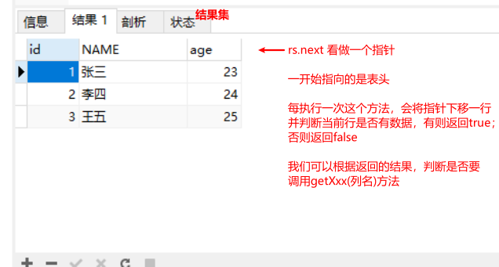

## 1. jdbc入门

### 1.1 概述

JDBC （Java DataBase Connectivity  java数据库连接）

Java和数据库厂商共同制定的一套连接并操作数据库的统一规范（接口），需要数据库厂商来实现，我们使用的时候只需要导入数据库厂商已经实现好的jar包即可。

### 1.2 快速入门

```java
public class JDBCDemo01 {
    public static void main(String[] args) throws Exception{
        //1.导入jar包
        //2.注册驱动
        // 通过反射加载了Driver类，这个类是mysql实现了jdbc规范的类
        Class.forName("com.mysql.jdbc.Driver");
        // 其他
        // com.mysql.jdbc.Driver.class;
        // new com.mysql.jdbc.Driver();

        //3.获取连接
        // 相当于之前使用mysql工具连接数据库
        // jdbc:mysql://就是协议 相当于 http://
        // 如果连接的是本机默认端口的mysql，url可以简写成jdbc:mysql:///数据库名
        Connection con = DriverManager.getConnection("jdbc:mysql://192.168.59.129:3306/db2","root","root");

        //4.获取执行者对象
        Statement stat = con.createStatement();

        //5.执行sql语句，并且接收结果
        String sql = "SELECT * FROM user";
        ResultSet rs = stat.executeQuery(sql);

        //6.处理结果
        while(rs.next()) {
            System.out.println(rs.getInt("id") + "\t" + rs.getString("name"));
        }

        //7.释放资源，先开后关
        rs.close();
        stat.close();
        con.close();
    }
}
```


## 2. jdbc常用API

### 2.1 DriverManager

**功能1：注册驱动**

- 不需要手动调用`DriverManager`的`API`注册，而是保证`com.mysql.jdbc.Driver`被加载进内存即可。

查看`com.mysql.jdbc.Driver`类的源码

```java
package com.mysql.jdbc;

import java.sql.DriverManager;
import java.sql.SQLException;

public class Driver extends NonRegisteringDriver implements java.sql.Driver {
    public Driver() throws SQLException {
    }

    static {
        try {
            // 在静态代码块中完成了注册驱动的代码
            // 我们只要保证Driver被加载进内存，下面的注册驱动的步骤就会自动完成。
            /*
            	Class.forName("com.mysql.jdbc.Driver");
            	Driver.class //Driver的字节码对象
            	
            	new Driver(); // 多一个driver对象
            */
            /*
            	在MySQL5以上的版本，注册驱动不需要我们自己做了。
            	在mysql-connector-java-5.1.47.jar中META-INF下面services下面的
            	java.sql.Driver文件中，填写了com.mysql.jdbc.Driver全类名
            	该类的会自动被加载进内存
            */
            DriverManager.registerDriver(new Driver());
        } catch (SQLException var1) {
            throw new RuntimeException("Can't register driver!");
        }
    }
}

```


**功能2：获取连接对象**

static Connection getConnection(url, username, password)

```java
//3.获取连接
// 相当于之前使用mysql工具连接数据库
// jdbc:mysql://就是协议 相当于 http://
// url连本机  jdbc:mysql://localhost:3306/db2 简化写法jdbc:mysql:///db2 

Connection con = DriverManager.getConnection("jdbc:mysql://localhost:3306/db2","root","root");
```


### 2.2 Connection 

**功能1：获取执行者对象**

- 获取普通执行者对象：Statement createStatement();

- 获取预编译执行者对象：PreparedStatement prepareStatement(String sql);


**功能2：控制事务**

- 开启：setAutoCommit(boolean autoCommit);  参数为false，则开启事务。

- 提交：commit();

- 回滚：rollback();

​    

**功能3：释放资源**

close();


### 2.3  Statement 

执行者对象，执行SQL语句并返回SQL语句执行的结果集的对象。

- 执行DML语句：修改（增删改）

  int executeUpdate(String sql);

  返回值int：返回影响的行数。

  参数sql：insert、update、delete语句。

- 执行DQL语句：查询

  ResultSet executeQuery(String sql)

  返回值ResultSet：封装查询的结果。

  参数sql：select语句。

- 释放资源

  立即将执行者对象释放：void close();


### 2.4 ResultSet

封装查询出来的结果集

- 判断结果集中是否还有记录

  boolean next();

  - 有数据返回true，并将索引向下移动一行。

  - 没有数据返回false。

    

- 获取某条记录中的某一列的值

  - XXX getXxx("列名");

  - XXX代表数据类型(要获取某列数据，这一列的数据类型)。

  - 例如：String getString("name");          int getInt("age");

    

- 释放资源

  - close()	释放资源

​     

## 3. 软件三层&MVC

### 3.1 软件三层

在大型复杂项目中，为了明确代码分工。

- web层/表现层/展示层：负责与浏览器(用户)打交道。
  - M Model 模型， 封装数据的模型
  - V View 视图，展示或收集数据
  - C controller 控制器，保证m和v同步，做简单的业务逻辑

- service层/业务逻辑层：负责处理业务逻辑。

- dao层/数据持久层：负责与数据库打交道。

### 3.2 面向接口编程

做法：

- 在service层和dao层定义接口，制定规范
- 具体的实现，写一个实现类（需要实现接口）中，

好处：

- 编写代码的风格统一
- 解耦，降低各层之间的耦合，在需要的时候尽量减少代码的修改。


### 3.3 OCP 

open -close - principle	开闭原则

对拓展开放

对修改关闭

**面向接口编程**就是符合OCP，也是我们之后开发的主流方式。

## 4. 学生增删改查案例

### 4.1 环境准备

数据库准备

```sql
-- 创建db14数据库
CREATE DATABASE db14;

-- 使用db14数据库
USE db14;


-- 创建student表
CREATE TABLE student(
	sid INT PRIMARY KEY AUTO_INCREMENT,	-- 学生id
	name VARCHAR(20),			-- 学生姓名
	age INT,				-- 学生年龄
	birthday DATE				-- 学生生日
);

-- 添加数据
INSERT INTO student VALUES (NULL,'张三',23,'1999-09-23'),(NULL,'李四',24,'1998-08-10'),
(NULL,'王五',25,'1996-06-06'),(NULL,'赵六',26,'1994-10-20');
```


分层建包

- bean/domain  实体类
- dao   数据持久层类
- service 业务层类类
- web   web层/表现层类
  - controller	servlet/controllor类
  - listener  listener类
  - filter filter类


### 4.2 查询所有的实现

查询所有StudentDaoImpl

```java
/*
        查询所有学生信息
     */
@Override
public ArrayList<Student> findAll() {
    ArrayList<Student> list = new ArrayList<>();
    Connection con = null;
    Statement stat = null;
    ResultSet rs = null;
    try{
        // 1. 注册驱动
        Class.forName("com.mysql.jdbc.Driver");
        
        // 获取连接
        con = DriverManager.getConnection("jdbc:mysql://192.168.15.130:3306/db14", "root", "root");

        //3.获取执行者对象
        stat = con.createStatement();

        //4.执行sql语句，并且接收返回的结果集
        String sql = "SELECT * FROM student";
        rs = stat.executeQuery(sql);

        //5.处理结果集
        while(rs.next()) {
            Integer sid = rs.getInt("sid");
            String name = rs.getString("name");
            Integer age = rs.getInt("age");
            Date birthday = rs.getDate("birthday");

            //封装Student对象
            Student stu = new Student(sid,name,age,birthday);

            //将student对象保存到集合中
            list.add(stu);
        }

    } catch(Exception e) {
        e.printStackTrace();
    } finally {
        //6.释放资源
        // 顺序：先开后关
		// 首先进行非空判断，不为空再close()，这里的异常也要try...catch
    }
    //将集合对象返回
    return list;
}
```


StudentServiceImpl

```java
// 成员变量    
private StudentDao dao = new StudentDaoImpl();
/*
        查询所有学生信息
 */
@Override
public ArrayList<Student> findAll() {
    return dao.findAll();
}
```


`StudentController`

```java
// 成员变量
private StudentService service = new StudentServiceImpl();
/*
        查询所有学生信息
     */
@Test
public void findAll() {
    ArrayList<Student> list = service.findAll();
    for(Student stu : list) {
        System.out.println(stu);
    }
}
```


### 4.3 根据id查询学生

StudentDaoImpl

```java
/*
        条件查询，根据id查询学生信息
     */
@Override
public Student findById(Integer id) {
    Student stu = null;
    Connection con = null;
    Statement stat = null;
    ResultSet rs = null;
    try{

       // 1. 注册驱动
        Class.forName("com.mysql.jdbc.Driver");
        
        // 获取连接
        con = DriverManager.getConnection("jdbc:mysql://192.168.15.130:3306/db14", "root", "root");


        //3.获取执行者对象
        stat = con.createStatement();

        //4.执行sql语句，并且接收返回的结果集
        String sql = "SELECT * FROM student WHERE sid="+id;
        rs = stat.executeQuery(sql);

        //5.处理结果集
        while(rs.next()) {
            Integer sid = rs.getInt("sid");
            String name = rs.getString("name");
            Integer age = rs.getInt("age");
            Date birthday = rs.getDate("birthday");

            //封装Student对象
            stu = new Student(sid,name,age,birthday);
            // 效果一样
            /*stu.setSid(sid);
                stu.setName(name);
                stu.setAge(age);
                stu.setBirthday(birthday);*/
        }

    } catch(Exception e) {
        e.printStackTrace();
    } finally {
        // 6.释放资源
        // 顺序：先开后关
		// 首先进行非空判断，不为空再close()，这里的异常也要try...catch
    }
    //将对象返回
    return stu;
}
```


StudentServiceImpl

```java
/*
    条件查询，根据id查询学生信息
 */
@Override
public Student findById(Integer id) {
    return dao.findById(id);
}
```


StudentController

```java
/*
    条件查询，根据id查询学生信息
 */
@Test
public void findById() {
    Student stu = service.findById(3);
    System.out.println(stu);
}
```


### 4.4 添加学生


StudentDaoImpl

```java
/*
    添加学生信息
 */
@Override
public int insert(Student stu) {
    Connection con = null;
    Statement stat = null;
    int result = 0;
    try{
         // 1. 注册驱动
        Class.forName("com.mysql.jdbc.Driver");
        
        // 获取连接
        con = DriverManager.getConnection("jdbc:mysql://192.168.15.130:3306/db14", "root", "root");

        //3.获取执行者对象
        stat = con.createStatement();

        //4.执行sql语句，并且接收返回的结果集
        Date d = stu.getBirthday();
        String birthday = DateStringUtils.date2LocalString(d);
        // 字符串拼接
        // 先准备完整的字符串 INSERT INTO student VALUES (NULL, 'zs', 20, 2000-02-20)
        // 替换字符串中的常量  删掉常量  加两个""  引号中间在加两个++  加号中间 写变量
        String sql = "INSERT INTO student VALUES ('"+stu.getSid()+"','"+stu.getName()+"','"+stu.getAge()+"','"+birthday+"')";
        result = stat.executeUpdate(sql);

    } catch(Exception e) {
        e.printStackTrace();
    } finally {
        // 6.释放资源
        // 顺序：先开后关
		// 首先进行非空判断，不为空再close()，这里的异常也要try...catch
    }
    //将结果返回
    return result;
}
```


DateStringUtils

```java
// date  2  String
public static String date2String(Date date,String pattern){
    SimpleDateFormat sdf = new SimpleDateFormat(pattern);
    return sdf.format(date);
}

// date 2 localString
// 不需要再写一遍格式化的代码，调用之前的date2String即可
public static String date2LocalString(Date date){
    return date2String(date,"yyyy-MM-dd");
}
```


StudentServiceImpl

```java
/*
    添加学生信息
 */
@Override
public int insert(Student stu) {
    return dao.insert(stu);
}
```


StudentController

```java
/*
    添加学生信息
 */
@Test
public void insert() {
    Student stu = new Student(5,"周七",27,new Date());
    int result = service.insert(stu);

    if(result!=0) {
        System.out.println("添加成功");
    }else {
        System.out.println("添加失败");
    }
}
```


### 4.5 修改学生

StudentDaoImpl

```java
/*
        修改学生信息
     */
@Override
public int update(Student stu) {
    Connection con = null;
    Statement stat = null;
    int result = 0;
    try {
        // 1. 注册驱动
        Class.forName("com.mysql.jdbc.Driver");

        // 获取连接
        con = DriverManager.getConnection("jdbc:mysql://192.168.15.130:3306/db14", "root", "root");
        //3.获取执行者对象
        stat = con.createStatement();

        //4.执行sql语句，并且接收返回的结果集
        Date d = stu.getBirthday();
        String birthday = DateStringUtils.date2LocalString(d);
        String sql = "UPDATE student SET sid='" + stu.getSid() + "',name='" + stu.getName() + "',age='" + stu.getAge() + "',birthday='" + birthday + "' WHERE sid='" + stu.getSid() + "'";
        result = stat.executeUpdate(sql);

    } catch (Exception e) {
        e.printStackTrace();
    } finally {
        // 6.释放资源
        // 顺序：先开后关
        // 首先进行非空判断，不为空再close()，这里的异常也要try...catch
    }
    //将结果返回
    return result;
}
```

StudentServiceImpl

```java
/*
    修改学生信息
 */
@Override
public int update(Student stu) {
    return dao.update(stu);
}
```


StudentController

```java
/*
    修改学生信息
 */
@Test
public void update() {
    Student stu = service.findById(5);
    stu.setName("周七七");

    int result = service.update(stu);

    if(result != 0) {
        System.out.println("修改成功");
    }else {
        System.out.println("修改失败");
    }
}
```


### 4.6 删除学生

```java
/*
   删除学生信息
*/
@Override
public int delete(Integer id) {
    Connection con = null;
    Statement stat = null;
    int result = 0;
    try {
        // 1. 注册驱动
        Class.forName("com.mysql.jdbc.Driver");

        // 获取连接
        con = DriverManager.getConnection("jdbc:mysql://192.168.15.130:3306/db14", "root", "root");

        //3.获取执行者对象
        stat = con.createStatement();

        //4.执行sql语句，并且接收返回的结果集
        String sql = "DELETE FROM student WHERE sid='" + id;
        result = stat.executeUpdate(sql);

    } catch (Exception e) {
        e.printStackTrace();
    } finally {
        // 6.释放资源
        // 顺序：先开后关
        // 首先进行非空判断，不为空再close()，这里的异常也要try...catch
    }
    //将结果返回
    return result;
}
```

StudentServiceImpl

```java
/*
    删除学生信息
 */
@Override
public int delete(Integer id) {
    return dao.delete(id);
}
```

StudentController

```java
/*
    删除学生信息
 */
@Test
public void delete() {
    int result = service.delete(5);

    if(result != 0) {
        System.out.println("删除成功");
    }else {
        System.out.println("删除失败");
    }
}
```

## 5. jdbc工具类

之前代码的问题

1. 数据库相关参数写死了，硬编码在代码中
2. 注册驱动、获取连接、释放资源完全重复，可以抽取复用


### 5.1 配置文件

新建properties文件，src上右击，选择Resource Bundle，直接写文件名即可（不需要后缀）

内容，使用模板代码即可。


### 5.2 工具类

```java
/*
    JDBC工具类
 */
public class JDBCUtils {


    // 测试
    public static void main(String[] args) {
        Connection connection = JDBCUtils.getConnection();
        System.out.println("connection = " + connection);
    }


    //1.私有构造方法
    private JDBCUtils() {
    }

    //2.声明所需要的配置变量
    private static String url;
    private static String username;
    private static String password;
    private static Connection con;

    //3.提供静态代码块。读取配置文件的信息为变量赋值，注册驱动
    static {
        try {
            String driverClass;
            //读取配置文件的信息为变量赋值
            /*
            InputStream is = JDBCUtils.class.getClassLoader().getResourceAsStream("config.properties");
            Properties prop = new Properties();
            prop.load(is);

            driverClass = prop.getProperty("driverClass");
            url = prop.getProperty("url");
            username = prop.getProperty("username");
            password = prop.getProperty("password");

            */

            // ResourceBundle.getBundle(String baseName)
            // 根据提供的properties配置文件基本名称，自动加载并解析该文件
            ResourceBundle rsb = ResourceBundle.getBundle("config");

            // getString  可以根据key获取value
            driverClass = rsb.getString("jdbc.driver");
            url = rsb.getString("jdbc.url");
            username = rsb.getString("jdbc.username");
            password = rsb.getString("jdbc.password");


            //注册驱动
            Class.forName(driverClass);

        } catch (Exception e) {
            e.printStackTrace();
        }
    }

    //4.提供获取数据库连接方法
    public static Connection getConnection() {
        try {
            con = DriverManager.getConnection(url, username, password);
        } catch (SQLException e) {
            e.printStackTrace();
        }

        return con;
    }

    //5.提供释放资源的方法
    public static void close(Connection con, Statement stat, ResultSet rs) {

        if (rs != null) {
            try {
                rs.close();
            } catch (SQLException e) {
                e.printStackTrace();
            }
        }
        if (stat != null) {
            try {
                stat.close();
            } catch (SQLException e) {
                e.printStackTrace();
            }
        }

        if (con != null) {
            try {
                con.close();
            } catch (SQLException e) {
                e.printStackTrace();
            }
        }


    }

    public static void close(Connection con, Statement stat) {
        close(con, stat, null);
    }
}
```

优化代码

```java
// 略
```


## 6. SQL注入及解决方案

### 6.1. 产生的原因

使用下面的用户名登录(最后有一个空格)，密码不填

> ' or 1=1 -- 

SQL 语句

```sql
SELECT * FROM user WHERE loginname='' or 1=1 -- ' AND password=''
```

普通的statement只是把用户输入的用户名和密码进行了简单的拼接，拼接到了SQL语句中。

这样，用户名或密码中特殊的单子或符号就被识别成了SQL语句中的关键字或者是特殊符号。

思路：仅把`' or 1=1 --  `当做普通的字符串来处理，使用转义符号`\`，然后面的符号表示其本来的意思（现原形）。       


PreparedStatement就是使用这个思路解决的。

​	

`PreparedStatement`中的方法`public void setString(int parameterIndex, String x) throws SQLException `

```java
// 提前准备好长度变量，不用每次调用length()方法，效率高
int stringLength = x.length();

for(int i = 0; i < stringLength; ++i) {
    // 获取参数的每一个字符
    char c = x.charAt(i);
    
    // 判断是否是特殊符号，如果是就在前面拼一个 \  转义，让这个特殊符号表示自己原来的意思。
    switch(c) {
        case '\u0000':
            buf.append('\\');
            buf.append('0');
            break;
        case '\n':
            buf.append('\\');
            buf.append('n');
            break;
        case '\r':
            buf.append('\\');
            buf.append('r');
            break;
        case '\u001a':
            buf.append('\\');
            buf.append('Z');
            break;
        case '"':
            if (this.usingAnsiMode) {
                buf.append('\\');
            }

            buf.append('"');
            break;
        case '\'':
            buf.append('\\');
            buf.append('\'');
            break;
        case '\\':
            buf.append('\\');
            buf.append('\\');
            break;
        case '¥':
        case '₩':
            if (this.charsetEncoder != null) {
                CharBuffer cbuf = CharBuffer.allocate(1);
                ByteBuffer bbuf = ByteBuffer.allocate(1);
                cbuf.put(c);
                cbuf.position(0);
                this.charsetEncoder.encode(cbuf, bbuf, true);
                if (bbuf.get(0) == 92) {
                    buf.append('\\');
                }
            }

            buf.append(c);
            break;
        default:
            buf.append(c);
    }
}
```


优化后的安全代码

```java
/*
    使用PreparedStatement登陆方法，解决注入攻击
 */
@Override
public User findByLoginNameAndPassword(String loginName, String password) {
    //定义必要信息
    Connection conn = null;
    PreparedStatement st = null;
    ResultSet rs = null;
    User user = null;
    try {
        //1.获取连接
        conn = JDBCUtils.getConnection();
        
        //3.获取操作对象，执行sql语句，获取结果集
        /*
           conn.prepareStatement(sql) 获取的是预编译的执行对象
           区别：
                createStatement()   没有传sql
                prepareStatement(sql)   提前编译，所以需要传参

                // SQL需要先编译，后执行；编译完之后放在内存中，供使用
                普通的statement编译后的SQL
                    SELECT * FROM user WHERE loginname='zs' AND password='123"
                    SELECT * FROM user WHERE loginname='ls' AND password='1234"
                    每个人登录的SQL语句都不一样，都需要重新编译，效率低。
                预编译Statement
                    SELECT * FROM user WHERE loginname=? AND password=?
                    编译一次之后，所有人登录，都是用这个SQL，效率高


                1. 预编译Statement的效率比普通Statement效率高。
                2. 预编译Statement比普通Statement安全
                        通过把一些特殊符号转义，现原形，保证不会出现SQL注入问题


        * */
        //2.定义SQL语句，使用？作为参数的 占位符
        String sql = "SELECT * FROM user WHERE loginname=? AND password=?";
        // 提前编译，所以需要传参
        st = conn.prepareStatement(sql);
        // SQL语句中使用？占位，需要使用setString 把参数设置进去
        // 参数的索引从1开始，没有0
        st.setString(1,loginName);
        st.setString(2,password);

        rs = st.executeQuery();

        //4.获取结果集
        if (rs.next()) {
            //5.封装
            user = new User();
            user.setUid(rs.getString("uid"));
            user.setUcode(rs.getString("ucode"));
            user.setUsername(rs.getString("username"));
            user.setPassword(rs.getString("password"));
            user.setGender(rs.getString("gender"));
            user.setDutydate(rs.getDate("dutydate"));
            user.setBirthday(rs.getDate("birthday"));
            user.setLoginname(rs.getString("loginname"));
        }
        //6.返回
        return user;
    }catch (Exception e){
        throw new RuntimeException(e);
    }finally {
        JDBCUtils.close(conn,st,rs);
    }
}
```


### 6.2 PreparedStatment作用

1. 更安全，不会出现SQL注入的风险

2. 效率更高，速度更快。

   使用Statment 的SQL语句如下：

   ```sql
   SELECT * FROM user WHERE loginname='zhangsan' AND password='1234'
   SELECT * FROM user WHERE loginname='lisi' AND password='12345'
   ```

   每次执行之前都要编译，编译完之后再执行。

   使用PreparedStatment的SQL语句如下

   ```sql
   SELECT * FROM user WHERE loginname=? AND password=?
   ```

   某个功能的SQL语句，对于任何人来说都一样，不需要每次执行都编译一次，只需要在第一次执行的时候编译然后长期保存在内存直接使用即可，所以效率高。


## 7. jdbc事务管理

```java
try{
    // 开启事务，在try的第一行开启事务
    conn.setAutoCommit(false);
    // 扣除张三500块钱
    modifyMoney(“张三”,-500)
    
    //李四添加500块钱
     modifyMoney("李四",500)
    
    
    // 提交事务，在try的最后一行提交事务
    conn.commit();
}catch(e){
    // 回滚事务
    conn.rollback();
}


Class Dao(){
    // 账户金额修改
    modifyMoney(String username, double m){
       // 通过SQL修改某个账户的金额
        money = money + m
    }
}
```


问题：在哪一层控制事务？

答：在Service层控制。

原因：关于业务相关的代码，需要在service层实现。


```java
/*
    事务要控制在此处
 */
@Override
public void batchAdd(List<User> users) {
    //获取数据库连接对象
    // 如果想多个对数据库的操作在同一个事务中，需要保证他们使用的是同一个连接对象
    Connection con = JDBCUtils.getConnection();
    try {
        //开启事务
        con.setAutoCommit(false);

        for (User user : users) {
            //1.创建ID,并把UUID中的-替换
            String uid = UUID.randomUUID().toString().replace("-", "").toUpperCase();
            //2.给user的uid赋值
            user.setUid(uid);
            //3.生成员工编号
            user.setUcode(uid);

            //出现异常
            //int n = 1 / 0;

            //4.保存
            userDao.save(con,user);
        }

        //提交事务
        con.commit();

    }catch (Exception e){
        //回滚事务
        try {
            con.rollback();
        } catch (SQLException e1) {
            e1.printStackTrace();
        }
        e.printStackTrace();
    } finally {
        //释放资源
        JDBCUtils.close(con,null);
    }
}
```


