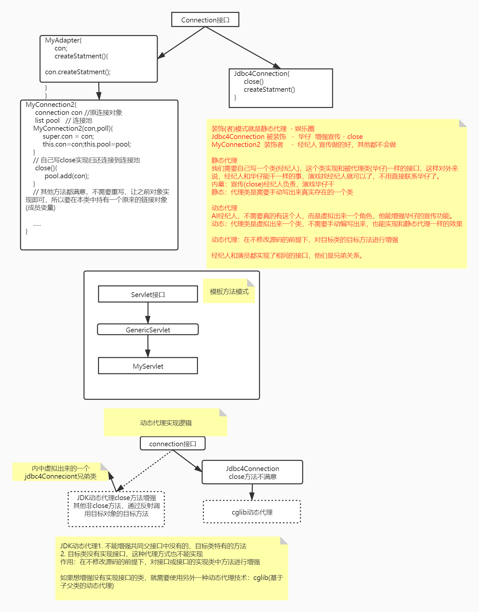

## 1. 连接池

### 1.1 概念

初始化并维护多个连接对象，当其他地方需要时，从连接池获取；用完之后，归还到连接池。以此实现连接的复用，提高效率。


### 1.2 池化思想（重要）

以空间换时间的做法。

游戏背包、新闻客户端。

1. 提供更好的使用体验
2. 对资源的消耗会更少。不会频繁的创建和销毁对象。


### 1.3 自定义连接池思路

自定义一个连接池的**整体思路**

1. 准备一个保存多个连接的容器ArrayList

2. 一开始就创建多个连接，并存入上述容器
3. 自己写一个类，封装上述的容器ArrayList对象，对外提供获取连接、归还链接的方法(封装了ArrayList的相关方法)


### 1.4 自定义连接池实现

实现获取连接的方法`MyDataSource`

```java
//1.准备一个容器。用于保存多个数据库连接对象
// DateSource类中维护的容器才是真正的连接池
// DataSource(数据源)是一个维护并管理连接池的一个类
private static List<Connection> pool = Collections.synchronizedList(new ArrayList<>());

//2.定义静态代码块,获取多个连接对象保存到容器中
static{
    for(int i = 1; i <= 10; i++) {
        Connection con = JDBCUtils.getConnection();
        pool.add(con);
    }
}

//3.重写getConnection方法，用于返回一个连接对象
// 存在线程安全的隐患
@Override
public Connection getConnection() throws SQLException {
    if(pool.size() > 0) {
        Connection con = pool.remove(0);
        return con;
    }else {
        throw new RuntimeException("连接数量已用尽");
    }
}

//4.提供一个获取连接池大小的方法
public int getSize() {
    return pool.size();
}
```


测试

所有测试连接池的代码完全一样，可以复用之前的`MyDataSourceTest`类

```java
public class MyDataSourceTest {
    public static void main(String[] args) throws Exception{
        //1.创建连接池对象
        MyDataSource dataSource = new MyDataSource();

        System.out.println("使用之前的数量：" + dataSource.getSize());

        //2.通过连接池对象获取连接对象
        Connection con = dataSource.getConnection();
        // class com.mysql.jdbc.JDBC4Connection
        System.out.println(con.getClass());

        //3.查询学生表的全部信息
        String sql = "SELECT * FROM student";
        PreparedStatement pst = con.prepareStatement(sql);

        //4.执行sql语句，接收结果集
        ResultSet rs = pst.executeQuery();

        //5.处理结果集
        while(rs.next()) {
            System.out.println(rs.getInt("sid") + "\t" + rs.getString("name") + "\t" + rs.getInt("age") + "\t" + rs.getDate("birthday"));
        }

        //6.释放资源
        rs.close();
        pst.close();
        con.close();    // 用完以后，关闭连接
        // dataSource.close(con);


        // 归还思路：
        /*
            1. 为MyDataSource添加一个归还的方法，传递连接这个参数，实现归还 dataSource.close(con);

            上面做法可以实现，但是编码规范不完美，我们要做的是使用connection自己的close方法，
            方法的实现由原来的释放资源，变成归还链接本身，接下来要做的就是增强(修改)close()

            class com.mysql.jdbc.JDBC4Connection是mysql的jar包中提供的类，他的close方法已经写死了，不能修改！

            2. 自己写一个connection类，继承JDBC4Connection，可以继承并增强close方法
            3. 自己写一个connection类，直接实现Connection接口，自己写close方法，实现归还逻辑
            4. 自己写一个connection类，想办法只实现close方法，其他的方法我们继续调用JDBC4Connection的方法（静态代理）
            5. 动态代理


         */


        System.out.println("使用之后的数量：" + dataSource.getSize());
    }
}
```


### 1.5 归还连接的思路分析

        // 归还思路：
        /*
            1. 为MyDataSource添加一个归还的方法，传递连接这个参数，实现归还 dataSource.close(con);
    		//4.提供一个归还连接的方法的方法
            public void close(Connection con) {
                pool.add(con);
            }
            不要再使用connection对象的close方法，而是调用MyDataSource对象的close
    
    
            上面做法可以实现，但是编码规范不完美，我们要做的是使用connection自己的close方法，
            方法的实现由原来的释放资源，变成归还链接本身，接下来要做的就是增强(修改)close()
    
            class com.mysql.jdbc.JDBC4Connection是mysql的jar包中提供的类，他的close方法已经写死了，不能修改！
    
            2. 自己写一个connection类，继承JDBC4Connection，可以继承并增强close方法
            	只要保证从连接池中获取的连接对象是我们自己写的子类connection类对象就可以了
            3. 自己写一个connection类，直接实现Connection接口，自己写close方法，实现归还逻辑（装饰者模式、静态代理）
            	我们只关心close方法，但是其他所有的抽象方法，都需要我们实现;我们实现的时候是调用原来jdbc4Connection对象的方法。
            4. 自己写一个connection类，想办法只实现close方法，其他的方法我们继续调用JDBC4Connection的方法（模板方法模式，静态代理）
            	我们就搞一个中间类，中间类中实现除close方法之外的其他方法，在这些方法中调用JDBC4Connection的对象，自己写的链接类，继承中间类，只实现close方法即可。
            5. 动态代理


### 1.6 继承实现（此路不通）

`MyConnection1`

```java
/*
    自定义的连接对象
    1.定义一个类，继承JDBC4Connection
    2.定义Connection连接对象和容器对象的成员变量
    3.通过有参构造方法为成员变量赋值
    4.重写close方法，完成归还连接
 */
public class MyConnection1 extends JDBC4Connection{//1.定义一个类，继承JDBC4Connection
    //2.定义Connection连接对象和容器对象的成员变量
    private Connection con;
    private List<Connection> pool;

    //3.通过有参构造方法为成员变量赋值
    public MyConnection1(String hostToConnectTo, int portToConnectTo, Properties info, String databaseToConnectTo, String url,Connection con,List<Connection> pool) throws SQLException {
        super(hostToConnectTo, portToConnectTo, info, databaseToConnectTo, url);
        this.con = con;
        this.pool = pool;
    }

    //4.重写close方法，完成归还连接
    @Override
    public void close() throws SQLException {
        pool.add(con);
    }
}
```


`MyDataSource`

```java
public class MyDataSource implements DataSource {
    //1.准备一个容器。用于保存多个数据库连接对象
    // DateSource类中维护的容器才是真正的连接池
    // DataSource(数据源)是一个维护并管理连接池的一个类
    private static List<Connection> pool = Collections.synchronizedList(new ArrayList<>());

    //2.定义静态代码块,获取多个连接对象保存到容器中
    static{
        for(int i = 1; i <= 10; i++) {
            Connection con = JDBCUtils.getConnection();
            pool.add(con);
        }
    }

    //4.提供一个获取连接池大小的方法
    public int getSize() {
        return pool.size();
    }


    //3.重写getConnection方法，用于返回一个连接对象
    @Override
    public Connection getConnection() throws SQLException {
        if(pool.size() > 0) {
            Connection con = pool.remove(0);
			
            // 无法让DriverManager的getConnection的方法返回MyConnection1类型的对象
            // 所以此路不通。
            return myCon;
        }else {
            throw new RuntimeException("连接数量已用尽");
        }
    }
```


### 1.7 装饰者模式实现（写的太多）

`MyConnection2`

```java
/*
    1.定义一个类，实现Connection接口
    2.定义连接对象和连接池容器对象的成员变量
    3.通过有参构造方法为成员变量赋值
    4.重写close方法，完成归还连接
    5.剩余方法，还是调用原有的连接对象中的功能即可
 */
//1.定义一个类，实现Connection接口
public class MyConnection2 implements Connection{

    //2.定义连接对象和连接池容器对象的成员变量
    private Connection con;
    private List<Connection> pool;

    //3.通过有参构造方法为成员变量赋值
    // con  从池子中取出来的jdbc4Connection
    // pool  池子
    public MyConnection2(Connection con,List<Connection> pool) {
        this.con = con;
        this.pool = pool;
    }

    //4.重写close方法，完成归还连接
    @Override
    public void close() throws SQLException {
        pool.add(con);
    }

    //5.剩余方法，还是调用原有的连接对象中的功能即可
	// 此处省略N个方法的实现
    // 这些方法中都是通过调用原来JDBC4Connection对象的方法
   /* 
    MyCOnnection2代理了JDBC4Connection，
        MyCOnnection2、JDBC4Connection都实现了Connection接口，都具有了相同的方法（实现于Connection接口）
        MyCOnnection2在实现的时候，除了close()方法之外，其他的所有方法都是找了JDBC4Connection来干的；
        */
        // 华仔 唱歌 演电影   ctrl  xuanchuan
        // 华仔因为不火  所以找经济人帮他宣传
        // 经纪人   -   代理华仔   -  代理对象	-  只做宣传工作 - MyCOnnection2
        // 华仔	 -    被经纪人代理 - 被代理对象 - ctrl		- JDBC4Connection
        
        // 经纪人在外面就代表了华仔，所有华仔会的动作，经纪人也要会，但是可以不用自己做（ctrl华仔来做）
        // 他们实现相同的接口就可以达到这个效果
        // 所以JDK动态代理要求被代理的对象必须实现了接口，而且也只能增强接口里面的方法。
        
        // 经纪人真是存在  -  静态代理
        // 经纪人不需要人来做了，通过AI合成虚拟人，根据你的时机情况，自动帮你营销  - 动态代理
        /*
        经纪人{
        	华仔
            
            宣传();  //经纪人宣传营销
        	// ctrl
        	华仔.ctrl();     
    	}    
    
         MyCOnnection2{
        		JDBC4Connection
            
            close();  //经纪人宣传营销
        	// ctrl
        	JDBC4Connection.除了close的所有方法();     
    	} 
    	*/
}
```

测试类

```java
public static void main(String[] args) throws Exception{
    //1.创建连接池对象
    MyDataSource dataSource = new MyDataSource();

    System.out.println("使用之前的数量：" + dataSource.getSize());

    //2.通过连接池对象获取连接对象
    Connection con = dataSource.getConnection();
    System.out.println(con.getClass());

    //3.查询学生表的全部信息
    String sql = "SELECT * FROM student";
    // 这里的prepareStatement，最终调用的值MyConnection2中con<JDBC4Connetcion对象>的方法（原来的方法）
    PreparedStatement pst = con.prepareStatement(sql);

    //4.执行sql语句，接收结果集
    ResultSet rs = pst.executeQuery();

    //5.处理结果集
    while(rs.next()) {
        System.out.println(rs.getInt("sid") + "\t" + rs.getString("name") + "\t" + rs.getInt("age") + "\t" + rs.getDate("birthday"));
    }

    //6.释放资源
    rs.close();
    pst.close();
    con.close();    // 把这个连接归还到连接池中

    // dataSource.returnCon(con);
    /*
            归还思路：
                1. 直接修改connection对象所属类的方法，改成归还到连接池
                     需要修改第三方jar包的源码 不选用
                2. 在连接池管理类DataSource中，定义一个归还的办法 dataSource.returnCon(con);
                    不符合我们常规的归还方式，不选用。


                   最终想通过使用connection对象的close（）方法实现归还连接到连接池，
                   白话：增强connection的close()方法

                3. 继承，在之类中增强（此路不通）
                    因为需要自定的内容太多，很多的类（DriverManager....）都需要被增强，不现实
                4. 装饰者模式
                	问题：自定义的connection类直接实现connection接口，需要实现的无关方法太多
                5. 适配器模式
                	
                6. 动态代理

        */

    System.out.println("使用之后的数量：" + dataSource.getSize());
}
```


### 1.8 模板方法模式实现（优化模板方法模式）

`MyConnection3`

```java
/*
    1.定义一个类，继承适配器类
    2.定义连接对象和连接池容器对象的成员变量
    3.通过有参构造为变量赋值
    4.重写close方法，完成归还连接
 */
//1.定义一个类，继承适配器类
public class MyConnection3 extends MyAdapter {

    //2.定义连接对象和连接池容器对象的成员变量
    private Connection con;
    private List<Connection> pool;

    //3.通过有参构造为变量赋值
    public MyConnection3(Connection con,List<Connection> pool) {
        super(con);
        this.con = con;
        this.pool = pool;
    }

    //4.重写close方法，完成归还连接
    @Override
    public void close() {
        pool.add(con);
    }
}
```

`MyAdapter`

```java
/*
    1.定义一个适配器类。实现Connection接口
    2.定义连接对象的成员变量
    3.通过有参构造为变量赋值
    4.重写所有的抽象方法(除了close)
 */
public abstract class MyAdapter implements Connection {

    //2.定义连接对象的成员变量
    private Connection con;

    //3.通过有参构造为变量赋值
    public MyAdapter(Connection con) {
        this.con = con;
    }


    //4.重写所有的抽象方法(除了close)
}

// MyAdapter  + MyConnection3 = MyConnection2
// 理解简单，写起来麻烦
// 理解不简单，写起来简单
```


### ==1.9 动态代理==


代理



代理分类

静态代理

​	通过自己编写一个类，修改(并增强)被代理的类（目标类）部分代码(某些方法)。

动态代理

​	在不修改源码的前提下，修改(增强)目标方法的执行逻辑

> ​	`JDK`动态代理要求，被代理(目标)对象必须实现接口。可以增强目标对象从接口中继承的方法。
>
> ​	`JDK`动态代理会拦截目标对象的所有方法的执行（目标对象的所有方法的执行都会经过`invocationHandler`对象的invoke方法）。

- 共同父接口`StudentInterface`

  ```java
  public interface StudentInterface {
      void eat(String name);
      void study();
  }
  ```
  
- 被代理的类`Student`

  ```java
  public class Student implements StudentInterface{
      public void eat(String name) {
          System.out.println("学生吃" + name);
      }
  
      public void study() {
          System.out.println("在家自学");
      }
  }
  ```
  
- 动态代理编写和测试`JDKProxy`

  ```java
  public class Test {
      public static void main(String[] args) {
          Student stu = new Student();
          /*stu.eat("米饭");
          stu.study();*/
  
          /*
              要求：在不改动Student类中任何的代码的前提下，通过study方法输出一句话：来黑马学习
              类加载器：和被代理对象使用相同的类加载器
              接口类型Class数组：和被代理对象使用相同接口
              InvocationHandler：调用处理器对象，真正的增强或者调用目标方法的逻辑写在其内部的invoke方法中
              代理规则：完成代理增强的功能
           */
          StudentInterface proxyStu =
                  (StudentInterface) Proxy.newProxyInstance(
                          stu.getClass().getClassLoader(),
                          new Class[]{StudentInterface.class/*,xxx.class*/},
                          new InvocationHandler() {
              /*
                  执行Student代理类中所有的方法都会经过invoke方法
                  对method方法进行判断
                      如果是study，则对其增强（修改）
                      如果不是，还调用学生对象原有的功能即可
               */
  
              /**
               *
               * @param proxy     代理对象，这个位置的代理对象是给系统使用
               * @param method    目标方法的封装对象
               * @param args      调用目标方法传递的实参
               * @return          表示目标方法的返回值，一定要在该方法内部，把调用目标方法获得的返回值return出去，否则外界无法获取该值
               * @throws Throwable
               */
              @Override
              public Object invoke(Object proxy, Method method, Object[] args) throws Throwable {
                  if("study".equals(method.getName())) {
                      System.out.println("来黑马学习");
                      return null;
                  }else {
                      // 通过反射调用指定方法（student中非study的方法）
                      return method.invoke(stu,args);
                  }
              }
          });
  
          proxyStu.eat("米饭");
          proxyStu.study();
          
          Student stu = new Student();
          stu.eat("小米粥");
  
      }
  }
  ```
  
  

### 1.10 动态代理实现

```java
public class MyDataSource implements DataSource {
    //1.准备一个容器。用于保存多个数据库连接对象
    // DateSource类中维护的容器才是真正的连接池
    // DataSource(数据源)是一个维护并管理连接池的一个类
    private static List<Connection> pool = Collections.synchronizedList(new ArrayList<>());

    //2.定义静态代码块,获取多个连接对象保存到容器中
    static{
        for(int i = 1; i <= 10; i++) {
            Connection con = JDBCUtils.getConnection();
            pool.add(con);
        }
    }

    //4.提供一个获取连接池大小的方法
    public int getSize() {
        return pool.size();
    }

    /*
        动态代理方式
     */
    @Override
    public Connection getConnection() throws SQLException {
        if(pool.size() > 0) {
            Connection con = pool.remove(0);

            Connection proxyCon = (Connection) Proxy.newProxyInstance(
                con.getClass().getClassLoader(), 
                new Class[]{Connection.class}, 
                new InvocationHandler() {

                    /*执行Connection实现类连接对象所有的方法都会经过invoke
                    如果是close方法，归还连接
                    如果不是，直接执行连接对象原有的功能即可*/

                @Override
                public Object invoke(Object proxy, Method method, Object[] args) throws Throwable {
                    if("close".equals(method.getName())) {
                        //归还连接
                        pool.add(con);
                        return null;
                    }else {
                        return method.invoke(con,args);
                    }
                }
            });

            return proxyCon;
        }else {
            throw new RuntimeException("连接数量已用尽");
        }
    }


    @Override
    public Connection getConnection(String username, String password) throws SQLException {
        return null;
    }

    @Override
    public <T> T unwrap(Class<T> iface) throws SQLException {
        return null;
    }

    @Override
    public boolean isWrapperFor(Class<?> iface) throws SQLException {
        return false;
    }

    @Override
    public PrintWriter getLogWriter() throws SQLException {
        return null;
    }

    @Override
    public void setLogWriter(PrintWriter out) throws SQLException {

    }

    @Override
    public void setLoginTimeout(int seconds) throws SQLException {

    }

    @Override
    public int getLoginTimeout() throws SQLException {
        return 0;
    }

    @Override
    public Logger getParentLogger() throws SQLFeatureNotSupportedException {
        return null;
    }
}
```


## 第三方连接池

### c3p0

导包

```java
c3p0-0.9.5.2.jar
mchange-commons-java-0.2.12.jar
```

准备配置文件`c3p0-config.xml`，配置文件名字固定，内容中标签和name值固定。

```xml
<c3p0-config>
  <!-- 使用默认的配置读取连接池对象 -->
  <default-config>
  	<!--  连接参数 -->
    <property name="driverClass">com.mysql.jdbc.Driver</property>
    <property name="jdbcUrl">jdbc:mysql://192.168.59.129:3306/db14</property>
    <property name="user">root</property>
    <property name="password">itheima</property>
    
    <!-- 连接池参数 -->
    <!--初始化的连接数量-->
    <property name="initialPoolSize">5</property>
    <!--最大连接数量-->
    <property name="maxPoolSize">10</property>
    <!--超时时间-->
    <property name="checkoutTimeout">3000</property>
  </default-config>
</c3p0-config>
```


测试代码

```java
public class C3P0Test1 {
    public static void main(String[] args) throws Exception{
        //1.创建c3p0的数据库数据源对象
        DataSource dataSource = new ComboPooledDataSource();

        //2.通过数据源对象获取数据库连接
        Connection con = dataSource.getConnection();

        //3.执行操作
        String sql = "SELECT * FROM student";
        PreparedStatement pst = con.prepareStatement(sql);

        //4.执行sql语句，接收结果集
        ResultSet rs = pst.executeQuery();

        //5.处理结果集
        while(rs.next()) {
            System.out.println(rs.getInt("sid") + "\t" + rs.getString("name") + "\t" + rs.getInt("age") + "\t" + rs.getDate("birthday"));
        }

        //6.释放资源
        rs.close();
        pst.close();
        con.close();
    }
}
```


C3P0相关知识点测试

```java
public class C3P0Test2 {
    public static void main(String[] args) throws Exception{
        //1.创建c3p0的数据库连接池对象
        DataSource dataSource = new ComboPooledDataSource();

        //2.测试
        for(int i = 1; i <= 11; i++) {
            Connection con = dataSource.getConnection();
            System.out.println(i + ":" + con);

            if(i == 5) {
                con.close();
            }
        }
    }
}
```


### Druid

导包

```java
druid-1.0.9.jar
```

配置文件(名字任意)，但是配置文件中key的值固定。

```properties
driverClassName=com.mysql.jdbc.Driver
url=jdbc:mysql://192.168.59.129:3306/db14
username=root
password=itheima
# 初始化连接数量
initialSize=5
# 最大连接数量
maxActive=10
# 超时时间
maxWait=3000
```


测试

```java
/*
    1.通过Properties集合，加载配置文件
    2.通过Druid连接池工厂类获取数据库连接池对象
    3.通过连接池对象获取数据库连接进行使用
 */
public class DruidTest1 {
    public static void main(String[] args) throws Exception{
        //获取配置文件的流对象
        // 从当前项目的类路径下读取。类路径：
        // 非web项目 out\production\项目， 不是src路径
        // web项目 out\artifacts\项目， 不是src路径
        InputStream is = DruidTest1.class.getClassLoader().getResourceAsStream("druid.properties");

        //1.通过Properties集合，加载配置文件
        Properties prop = new Properties();
        prop.load(is);

        //2.通过Druid连接池工厂类获取数据库数据源对象
        DataSource dataSource = DruidDataSourceFactory.createDataSource(prop);

        //3.通过数据源对象获取数据库连接进行使用
        Connection con = dataSource.getConnection();


        String sql = "SELECT * FROM student";
        PreparedStatement pst = con.prepareStatement(sql);

        //4.执行sql语句，接收结果集
        ResultSet rs = pst.executeQuery();

        //5.处理结果集
        while(rs.next()) {
            System.out.println(rs.getInt("sid") + "\t" + rs.getString("name") + "\t" + rs.getInt("age") + "\t" + rs.getDate("birthday"));
        }

        //6.释放资源
        rs.close();
        pst.close();
        con.close();
    }
}
```


使用Druid优化工具类

```java
/*
    数据库数据源的工具类
 */
public class DataSourceUtils {
    //1.私有构造方法
    private DataSourceUtils() {
    }

    //2.声明数据源变量
    private static DataSource dataSource;

    //3.提供静态代码块，完成配置文件的加载和获取数据库连接池对象
    static {
        try {
            //完成配置文件的加载
            InputStream is = DataSourceUtils.class.getClassLoader().getResourceAsStream("druid.properties");

            Properties prop = new Properties();
            prop.load(is);

            //获取数据库连接池对象
            dataSource = DruidDataSourceFactory.createDataSource(prop);
        } catch (Exception e) {
            e.printStackTrace();
        }
    }

    //4.提供一个获取数据库连接的方法
    public static Connection getConnection() {
        Connection con = null;
        try {
            con = dataSource.getConnection();
        } catch (SQLException e) {
            e.printStackTrace();
        }
        return con;
    }

    //5.提供一个获取数据库连接池对象的方法
    public static DataSource getDataSource() {
        return dataSource;
    }

    //6.释放资源
    public static void close(Connection con, Statement stat, ResultSet rs) {

        if (rs != null) {
            try {
                rs.close();
            } catch (SQLException e) {
                e.printStackTrace();
            }
        }


        if (stat != null) {
            try {
                stat.close();
            } catch (SQLException e) {
                e.printStackTrace();
            }
        }

        if (con != null) {
            try {
                con.close();
            } catch (SQLException e) {
                e.printStackTrace();
            }
        }

    }

    public static void close(Connection con, Statement stat) {
        close(con, stat, null);
    }
}
```


