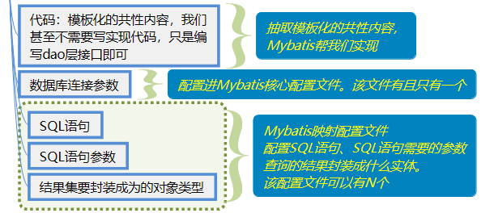
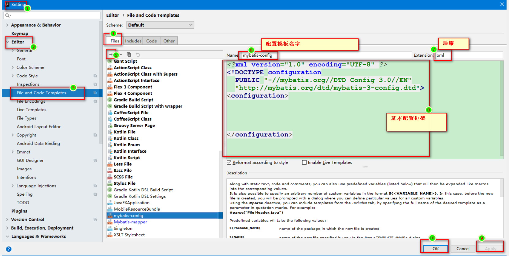

## 0. 相关概念

### 0.1 框架和工具类

- 工具类
  - 对程序中一小段代码的封装。项目中大多数代码还是需要我们写。
- 框架
  - 通俗理解框架
  - 可以看做一个半成品的软件/项目。使用框架开发项目，项目中半数以上代码就不需要 我们编写了。
  - 我们一般需要配置（大多数框架都是重配置轻编码的）+少量编码，就可完成项目中的需求。
  - 框架的目的 就是为了**简化编码**：`eg：Mybatis`。
    我们在学习完`Mybatis`之后，`dao`层会更简单。你只需要写一个`dao`接口，然后写一个`SQL`语句，`dao`层就已经写完了。
- 学习步骤
  - 这个框架能干什么？
  - 导包+配置
  - 框架少量的`API`，少量编码

### 0.2 `ORM`

- `Object Relational Mapping`  对象关系映射的思想

- 对象 - Java中的对象   关系-关系型数据库中表的记录  映射 - 一对一关联起来

- `java`项目中的每一个**实体类**，对应数据库中的一个**表**；
  `java`类中的**属性**，对应数据库表中的**字段**。
  `java`类中的一个**实体对象**，对应一个数据表中的**一条记录**

- 全自动`ORM`框架：`hibernate`。

  通过操作实体对象，就可以完成对数据库表中记录的操作。复杂业务性能低下，不可定制，学习成本高。

- 半自动的`ORM`框架：`Mybatis`,`ibatis`

  基于`ORM`，但是`SQL`语句需要我们自己编写。自己优化`SQL`，可定制性强，效率高。


### 0.3 `Mybatis`&原生`JDBC`

- 原生jdbc		

  - ~~注册驱动，设置连接参数~~
  - ~~获取连接~~
  - **获取执行对象**
  - **设置`SQL`参数并执行`SQL`语句**
  - **封装结果集并封装成实体对象**
  - ~~释放资源~~

  > 相同的内容已经抽取到工具类中（上述删除线标识的步骤）
  >
  > 模板化（步骤不变，部分步骤相同，上述加粗的内容）的操作，也是可以抽取封装的。
  >
  > 但是相同的步骤中又有不同的地方，不同的地方如果也要实现解耦，需要通过配置来实现

- `Mybatis`解决方案

  - 连接复用：使用数据库连接池初始化并管理连接
  - 解耦：将`SQL`语句和设置到`SQL`中的参数抽取到`xml`配置文件中
  	 自动封装：通过反射内省等技术，实现**查询结果集字段**与**实体属性**自动映射并赋值	

- `Mybatis`框架抽取后的样子

  

- `Mybatis`简介

  - 是一个数据持久层（`DAO`）框架，封装共性内容让使用者只关注`SQL`本身。结合了`ORM`思想，是一个`ORM`半自动的框架。
  - 使用`Mybatis`之后，我们只需要定义一个`Dao`层接口+存储`SQL`的配置文件（`Mybatis`映射配置文件），就可以完成`Dao`层内容。


## ==1. `Mybatis`快速入门==

### 1.1 `Mybatis`快速入门步骤

- 导入Jar包

  - `mybatis-3.5.3.jar`
  	 `mysql-connector-java-5.1.37-bin.jar`		
  - `log4j-1.2.17.jar`

- 编写`Mybatis`核心配置文件:`mybatis-config.xml`

  - 连接数据库四要素
  - `<mapper>`标签中映射文件路径不是`.` 是`/` 建议复制，不要手敲

- 编写映射文件：`StudentDao.xml`

- 编写`POJO`类和`Dao`层接口，初始化数据库表及数据

- `SQL`

- 实体类

- 接口

- 测试

- 小经验

  - 直接生成`mybatis`的两类`xml`文件

    

  - `Mybatis`映射配置文件和接口之间相互跳转

**核心配置文件**

```xml
<?xml version="1.0" encoding="UTF-8" ?>
<!DOCTYPE configuration
        PUBLIC "-//mybatis.org//DTD Config 3.0//EN"
        "http://mybatis.org/dtd/mybatis-3-config.dtd">
<configuration>
    <environments default="development">
        <environment id="development">
            <transactionManager type="JDBC"/>
            <dataSource type="POOLED">
                <!-- 连接数据库四要素 -->
                <property name="driver" value="com.mysql.jdbc.Driver"/>
                <property name="url" value="jdbc:mysql:///web17_mybatis01"/>
                <property name="username" value="root"/>
                <property name="password" value="root"/>
            </dataSource>
        </environment>
    </environments>


    <!-- 加载映射配置文件 -->
    <mappers>
        <mapper resource="com/itheima/dao/StudentDao.xml"/>
    </mappers>
</configuration>
```


**映射配置文件**

```xml
<?xml version="1.0" encoding="UTF-8" ?>
<!--
    xml文档第一行是文档声明，必须在首行
    接下来是：命名空间。作用如下：
        1. 引入dtd文件
        2. 对文档中标签及其属性进行约束
 -->
<!DOCTYPE mapper
        PUBLIC "-//mybatis.org//DTD Mapper 3.0//EN"
        "http://mybatis.org/dtd/mybatis-3-mapper.dtd">

<!-- 把当前这个xml配置文件当做对应接口的实现类
        通过namespace属性指向要被实现的接口，接口代理的方式必须这样写

 -->
<mapper namespace="com.itheima.dao.StudentDao">
    <!--
        标签名：select  表示查询
            id属性   id唯一标识，要配置被实现的接口中的方法
            resultType属性    方法的结果（集合中泛型）的类型，全限定类名，不能省略
            parameterType属性，方法参数的类型，全限定类名，可以省略
            标签体中书写SQL语句
		整个标签被称之为：statement

     -->
        <select id="findById" resultType="com.itheima.domain.Student">
            select * from student where  id = 1;
        </select>
</mapper>
```

**接口StudentDao.java**

```java
public interface StudentDao {
    Student findById();
}
```


**测试类MybatisTest.ava**

```java
public class MybatisTest {

    @Test
    public void test01() throws IOException {

        // 指定核心配置文件
        String resource = "mybatisconfig.xml";

        // 把核心配置文件加载成输入流
        // Resources是mybatis提供的方便读取配置文件的工具类
        InputStream inputStream = Resources.getResourceAsStream(resource);
        //inputStream = MybatisTest.class.getClassLoader().getResourceAsStream(resource);


        // SQL会话工厂对象  生产SQL连接对象的工厂
        SqlSessionFactory sqlSessionFactory = new SqlSessionFactoryBuilder().build(inputStream);

        // JDK7 新特性 try-with-resouce
        // 在try后面的小阔号中开启流对象，这些流对象就不需要我们手动管理（关闭）了
        // 获取连接对象
        try (SqlSession session = sqlSessionFactory.openSession(true)) {
            //BlogMapper mapper = session.getMapper(BlogDao.class);

            // spring提供了getBean的方法，就可以直接获取一个dao层对象
            // 该对象是通过动态代理生成的代理对象
            StudentDao studentDao = session.getMapper(StudentDao.class);


            Student student = studentDao.findById();
            System.out.println("student = " + student);


            // 不用我们自己关闭了
            //session.close();
        }

    }
}
```


## 2. API

### 2.1 `Resources`

读取配置的文件的工具类

`InputStream getResourceAsStream`("配置文件相对于类路径的相对路径");

### 2.2 `SqlSessionFactoryBuilder`


获取` SqlSessionFactory `工厂对象的功能类。

```java
// 通过构建的方式构建了一个SqlSessionFactory
        SqlSessionFactory sqlSessionFactory = new SqlSessionFactoryBuilder().build(inputStream);

//xxxBuilder.build()
```

### 2.3 `SqlSessionFactory`

`org.apache.ibatis.session.SqlSessionFactory`：获取 `SqlSession` 对象的工厂接口。

`SqlSession openSession()` 获取`SqlSession`对象，并**开启手动**提交事务

`SqlSession openSession(boolean autoCommit)` 获取`SqlSession`对象，`true`表示**自动提交**


### ==2.4`SqlSession`==

`org.apache.ibatis.session.SqlSession`：sql会话对象接口。用于**执行`SQL`**、**管理事务**、**接口代理**。

|      |                      |                              |
| ---- | -------------------- | ---------------------------- |
| void | commit()             | 提交事务                     |
| void | rollback()           | 回滚事务                     |
| T    | getMapper(Class cls) | 获取指定接口的代理实现类对象 |
| void | close()              | 释放资源                     |

## ==3. 映射配置文件==

编码完成如下需求：

```java
// 需求1：查询id为1的学生（强制要求）
// 需求2：创建一个Student对象并保存到数据库（参数和成员变量名保持一致）(成功了吗？)
// 需求3：根据学生姓名和年龄查询用户，传两个参数（多个参数怎么办？）
// 需求4：完成需求3，传一个参数。
```

映射配置文件`StudentDao.xml`，**保证这个文件的名字和接口名完全一致，且在同一个包下。**


```xml
<?xml version="1.0" encoding="UTF-8" ?>
<!--
    xml文档第一行是文档声明，必须在首行
    接下来是：命名空间。作用如下：
        1. 引入dtd文件
        2. 对文档中标签及其属性进行约束
 -->
<!DOCTYPE mapper
        PUBLIC "-//mybatis.org//DTD Mapper 3.0//EN"
        "http://mybatis.org/dtd/mybatis-3-mapper.dtd">

<!-- 把当前这个xml配置文件当做对应接口的实现类
        通过namespace属性指向要被实现的接口，接口代理的方式必须这样写

 -->
    <mapper namespace="com.itheima.dao.StudentDao">
    <!--
        标签名：select  表示查询
            id属性   id唯一标识，要配置被实现的接口中的方法
            resultType属性    方法的结果（集合中泛型）的类型，全限定类名，不能省略
            parameterType属性，方法发参数的类型，全限定类名，可以省略
            标签体中书写SQL语句
		整个标签被称之为：statement

     -->
    <!--    <select id="findById" resultType="com.itheima.domain.Student">
            select * from student where  id = 1;
        </select>-->


    <!-- 
        通过 #{}传递参数给SQL语句
        当接口中方法的参数只有一个，并且是普通类型（基本类型 + String），SQL语句中#{}可以使用任意字符接收

        限制接收参数的名称之后，乱写造成的异常
        BindingException: Parameter 'xxxx' not found. Available parameters are [id, param1]
		在接口的参数位置使用@Param("标识")，这个时候需要使用这个标识接收参数。
     -->
    <select id="findById2" parameterType="java.lang.Integer"
            resultType="com.itheima.domain.Student">
        select * from student where  id = #{xxxx}
    </select>

    <!--
        当接口中方法的参数只有一个，实体对象类型，SQL语句中#{}可以使用属性名接收


        增删改 修改操作直接执行不会持久化到数据库中，因为mybatis默认开始起了事务，但是没有自动提交
        解决方式1：
            1. 手动提交。使用SQLSession对象的commit方法提交
            2. 自动提交。获取SQLSession的时候指定自动提交。openSession(true)

        关于日志：
            mybatis的日志实现之一是log4j，我们需要导包 + 创建配置文件(log4j.properties)才能生效。
			核心配置文件中的配置可以不配，他会自己搜索日志的实现。
     -->
    <delete id="save">
        insert into student values (null ,#{name} ,#{age});
    </delete>

    <!--
        parameterType可以省略不写

        如果接口中形参，传递的是两普通类型的参数
            可以使用arg0, arg1, param1, param2

        错误提示信息
            BindingException: Parameter 'xxx' not found. Available parameters are [arg1, arg0, param1, param2]

        接口形参位置添加限制
            @Param之后 可以使用 的是
            name age  param1   param2

    -->

    <select id="findByNameAndAge" resultType="com.itheima.domain.Student">
        select * from student where name=#{name} and age=#{age}
    </select>

    <!--
             多个参数可以封装到一个实体对象中，方便使用
             局限性：
                 多个相同的参数不方便传递 -  范围查询
      -->

    <!-- 需求4：完成需求3，传一个参数。 -->
    <select id="findByStudent" resultType="com.itheima.domain.Student">
        select * from student where name=#{name} and age=#{age}
    </select>


    <!--
        接口中形参是一个map
            在SQL中通过#{key} 来接收对应的value的值

    -->
    <!-- 4.2 List<Student> findByMap(Map<String,Object> map);
        通过配置mapUnderscoreToCamelCase 完成驼峰命名和底杠命名的自动映射转换

     -->
    <!--<select id="findByMap" resultType="com.itheima.domain.Student">
        select * from student where last_name=#{namex} and age=#{age};
    </select>-->

    <!--

        起别名，保证结果集字段名和实体属性名一致，完成自动封装
     -->
    <select id="findByMap" resultType="com.itheima.domain.Student">
            select id, last_name lastName, age from student where last_name=${namex} and
            age=${age};
    </select>

    <!--
        resultMap 手动建立起结果集字段名和实体属性名的映射关系
            解决集字段名和实体属性名不一致的问题
            id属性    唯一标识，方便调用
            type     当前映射是为哪个类型的实体建立的
        字标签
            id  建立主键列的映射关系
            result  建立非主键列的映射关系
    -->
    <!--<resultMap id="baseStudent" type="com.itheima.domain.Student">
        <id column="id" property="id"/>
        <result column="last_name" property="lastName"/>
        <result column="age" property="age"/>
    </resultMap>


     <select id="findByMap" resultMap="baseStudent">
            select * from student where last_name=#{namex} and age=#{age};
     </select>-->
</mapper>
```


核心配置文件

```xml
<!-- 加载映射配置文件  这里使用的是/ -->
<mappers>
    <mapper resource="com/itheima/dao/StudentDao.xml"/>
</mappers>
```


`Dao`层接口`StudentDao`

```java
public interface StudentDao {
    @Select("select * from student where  id = 1")
    Student findById();

    // 需求1：查询id为1的学生（强制要求）
    Student findById2(@Param("id") Integer id);

    // 需求2：创建一个Student对象并保存到数据库
    void save(Student stu);

    // 需求3：根据学生姓名和年龄查询用户，传两个参数（多个参数怎么办？）
    List<Student> findByNameAndAge(@Param("name") String name, @Param("agex") Integer age);

    // 需求4：完成需求3，传一个参数。
    // 4.1 把两个参数封装成一个实体对象
    // 如果把多个参数封装到一个实体对象中，参数类型有局限性，不能是两个一样的条件做范围查询
    List<Student> findByStudent(Student stu);

    // 4.2 把两个参数封装到Map集合中
    List<Student> findByMap(Map<String,Object> map);
}
```


测试类

```java
/**
 * @Author Vsunks.v
 * @Date 2020/8/7 11:19
 * @Description:
 */
public class MybatisDemo {
    public static void main(String[] args) throws Exception {

        // 指定核心配置文件
        String resource = "mybatis-config.xml";
        // 把核心配置文件加载成流  Resources为我们提供的方便读取配置文件的工具类
        InputStream inputStream = Resources.getResourceAsStream(resource);

        // 通过构建的方式构建了一个SqlSessionFactory
        SqlSessionFactory sqlSessionFactory = new SqlSessionFactoryBuilder().build(inputStream);

        // SqlSession 就相当于我们之前的 Connection
        // JDK7新特性  try-with-resource
        // 需要释放资源的动作，自动释放在try（）中开启的一些流、会话......
        try (SqlSession session = sqlSessionFactory.openSession(true)) {

            // getMapper  getDao   获取一个指定接口的实现类对象
            // 底层是动态代理
            // 动态代理可以增强有接口的类、接口（增强接口，就是现实接口）
            // 就相当于我们自己new StudentDaoImpl();
            // 这个StudentDaoImpl是Mybatis通过动态代理帮我们自动生成并且赋值给了studentDao
            StudentDao studentDao = session.getMapper(StudentDao.class);

            /*List<Student> students = studentDao.findAll();
            System.out.println("students = " + students);*/


            // 测试根据id查询
            /*Student student = studentDao.findById(1);
            System.out.println("student = " + student);*/

            // 测试添加学生
            //studentDao.saveStudent(new Student(null,"凤姐",20));

            // 根据名称和年龄查询用户，参数是两个基本类型
            //List<Student> students = studentDao.findByNameAndAge("美女", 20);
            //System.out.println("students = " + students);

            // 根据名称和年龄查询用户，参数是一个student对象
            //List<Student> students = studentDao.findByUser(new Student(null, "凤姐", 20));
            //System.out.println("students = " + students);

            // 根据名称和年龄查询用户，参数是一个map集合

            HashMap<String, Object> map = new HashMap<>();
            map.put("name", "王二蛋");
            map.put("age", 20);

            System.out.println("studentDao.findByMap(map) = " + studentDao.findByMap(map));


            // 手动提交
            //session.commit();

            // session.close();
        }

    }
}
```


## 4. 核心配置文件

### ==4.1 properties（重要）==

引入外部的properties文件，一般用作引入数据库链接参数的配置。

核心配置文件

```xml
<?xml version="1.0" encoding="UTF-8" ?>
<!DOCTYPE configuration
        PUBLIC "-//mybatis.org//DTD Config 3.0//EN"
        "http://mybatis.org/dtd/mybatis-3-config.dtd">
<!-- 这是一个mybatis的核心配置文件，名字任意-->
<configuration>
    <!-- -->
    <properties resource="jdbc.properties"/>

    <environments default="development">
        <environment id="development">
            <transactionManager type="JDBC"/>
            <dataSource type="POOLED">
                <property name="driver" value="${jdbc.driver}"/>
                <property name="url" value="${jdbc.url}"/>
                <property name="username" value="${jdbc.username}"/>
                <property name="password" value="${jdbc.password}"/>
            </dataSource>
        </environment>
    </environments>

    <!-- 加载映射配置文件 -->
    <mappers>
        <mapper resource="com/itheima/dao/StudentDao.xml"/>
    </mappers>
</configuration>
```

`jdbc.properties`

```properties
jdbc.driver=com.mysql.jdbc.Driver
jdbc.url=jdbc:mysql://192.168.115.130:3306/db1
jdbc.username=root
jdbc.password=root
```


### ==4.2 `Settings`（重要）==

```xml
<!-- 极为重要的设置 -->
<settings>
    <!--
        指定 MyBatis 所用日志的具体实现，未指定时将自动查找。
        LOG4J  要求：1. 导入log4j的jar包  2. 有一个log4j.properties文件
        建议显式的配置上。可配可不配的，建议配上。
     -->
    <setting name="logImpl" value="LOG4J"/>


    <!--
        mapUnderscoreToCamelCase
        是否开启驼峰命名自动映射，即从经典数据库列名 A_COLUMN 映射到经典 Java 属性名 aColumn。

        Java中多个单词的属性名  使用驼峰命名   lastName
        MySQL不缺分大小写      底杠命名       last_name


        Mybatis可以帮我们自动完成结果集和实体的自动转换封装，原因是结果集的字段名和实体属性名一致。

    -->
    <!--<setting name="mapUnderscoreToCamelCase" value="true"/>-->
</settings>
```


### 4.3 `TypeAliases`（了解）

```xml
<!-- 起别名 -->
<typeAliases>
    <!--
        type 全限定类名
        alias 别名
        别名不区分大小写
     -->
    <!--<typeAlias type="com.itheima.domain.Student" alias="student"/>-->

    <!-- 为包下所有的实体类起别名，不区分大小写 -->
    <!--<package name="com.itheima.domain"/>-->

</typeAliases>
```

起别名后，在映射配置文件中可以直接使用别名

```xml
<select id="findByMap" resultType="Student">
       select * from student where first_username=#{name}
       and
       age=#{age}
</select>
```


系统为常见的类型起好了别名

### 4.4 `Environments`（了解）

```xml
<environments default="dev">
    <environment id="dev">
        <transactionManager type="JDBC"/>
        <dataSource type="POOLED">
            <!-- 连接数据库四要素 -->
            <property name="driver" value="${jdbc.driver}"/>
            <property name="url" value="${jdbc.url}"/>
            <property name="username" value="${jdbc.username}"/>
            <property name="password" value="${jdbc.password}"/>
        </dataSource>
    </environment>
    <environment id="test">
        <transactionManager type="JDBC"/>
        <dataSource type="POOLED">
            <!-- 连接数据库四要素 -->
            <property name="driver" value="${jdbc.driver}"/>
            <property name="url" value="${jdbc.url}"/>
            <property name="username" value="${jdbc.username}"/>
            <property name="password" value="${jdbc.password}"/>
        </dataSource>
    </environment>
</environments>
```


### ==4.5 `Mappers`(重点)==

```xml
<!-- 加载映射配置文件 -->
<mappers>
    <!--
        使用相对于类路径的资源引用 可以用
        每个标签引入一个Mapper的XML文件
     -->
    <!--<mapper resource="com/itheima/dao/StudentDao.xml"/>-->
    <!--<mapper resource="com/itheima/dao/CourseDao.xml"/>-->
    <!--<mapper resource="com/itheima/dao/OrderDao.xml"/>-->

    <!--
        使用完全限定资源定位符（URL） 不推荐使用
        http://   file://
     -->
    <!--<mapper url="file:///var/mappers/AuthorMapper.xml"/>-->

    <!--
        加载指定某个的接口，识别接口中的注解 可以用
     -->
    <!--<mapper class="com.itheima.dao.StudentDao"/>-->
    <!--<mapper class="com.itheima.dao.StudentDao"/>-->
    <!--<mapper class="com.itheima.dao.StudentDao"/>-->

    <!--
        把包下所有的映射配置文件和接口全部加载进来  最推荐使用
     -->
    <package name="com.itheima.dao"/>
</mappers>
```


## 5.  经验分享

### 5.1 生成`Mybatis`配置文件

本质是新建了一个文件模板，按照下面的方式新建两个模板即可（`Mybatis-config`、`Mybatis-Mapper`）




### 5.2 `接口`和`映射配置文件`跳转

使用一个插件`free-idea-mybatis`。

这个插件是个zip包，不要解压，直接安装即可。

已知bug：

​	多个模块之间有相同内容会提示/跳转错误，卸载其他模块即可。


### 5.3 ${}和#{}区别(面试题)

#{}     MyBatis 会创建 `PreparedStatement` 参数占位符，并通过占位符安全地设置参数（就像使用 ? 一样）。 这样做更安全，更迅速，通常也是首选做法

${} 会做字符串的拼接，将{}中直接拼直接在 SQL 语句中，可能会有SQL注入的风险，效率更低。但是，如果你需要在SQL语句中直接插入一个不转义的字符串，可以使用这种方式。一般情况下会把表名或者字段名通过这方方式传递到SQL语句中，比方说 ORDER BY后面的列名。

