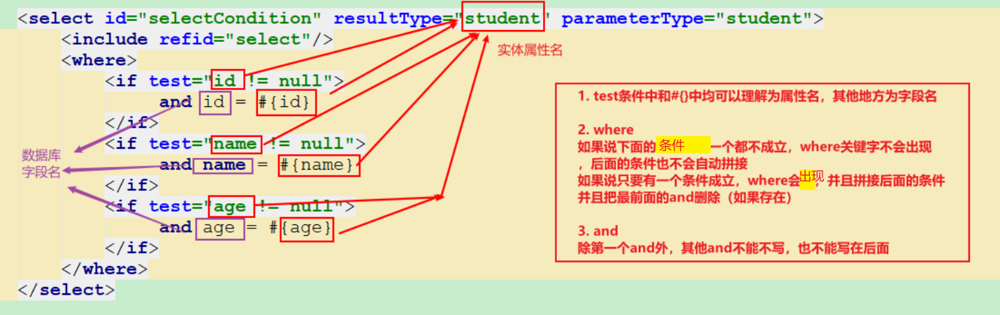
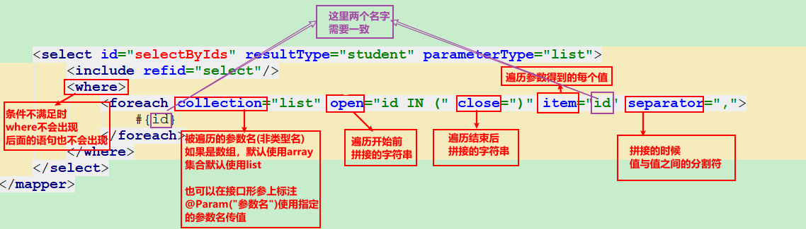
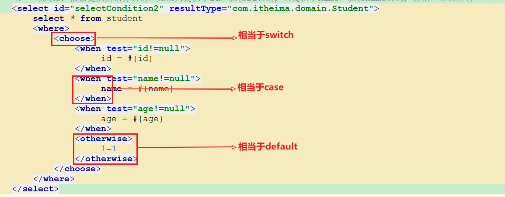
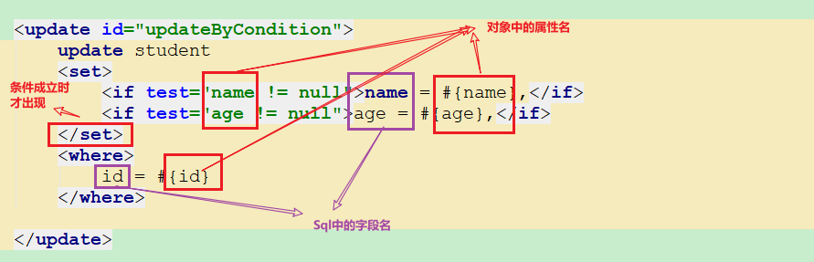
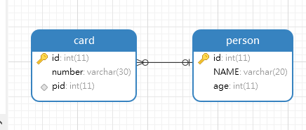
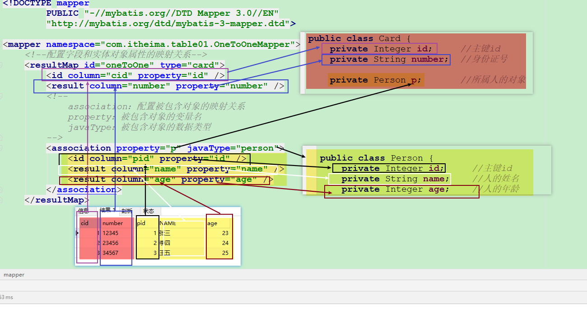
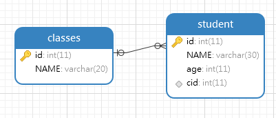
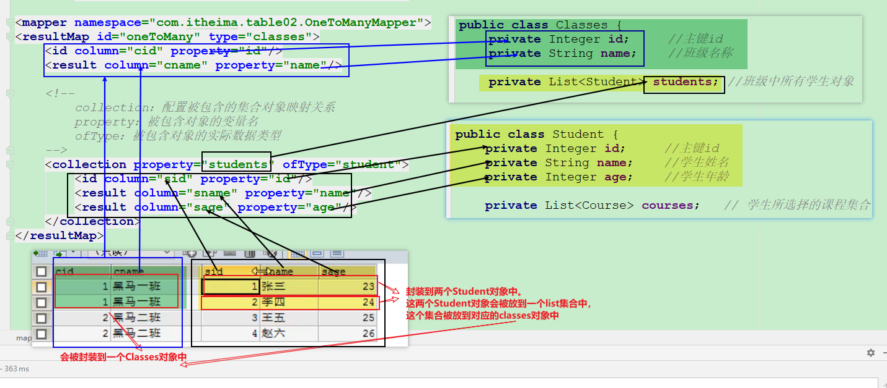
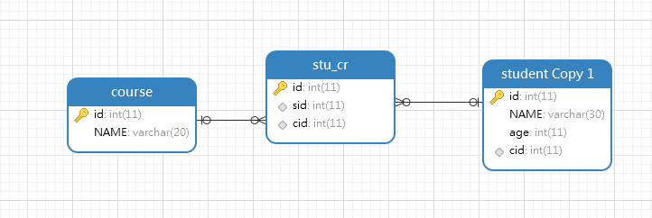
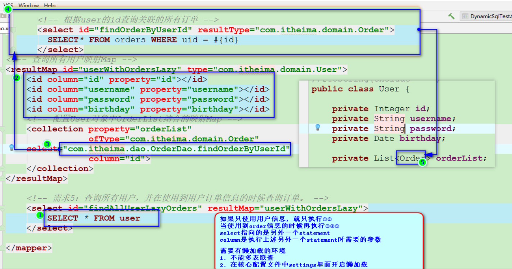

```java
/*
请使用user.sql初始化Mybatis数据库
需求1：
查询所有Student
根据ID查询
需求2：
添加一个Student
需求3：
修改一个Student
需求4：
删除一个Student
需求5：
查询Student，数据库字段名和实体类属性名不一致
// 需求6：根据现有student对象属性的值查找学生
// 学生对象如果只设置了id属性的值，就通过id查询，
// 如果id和name属性都有值，那就根据id和name两个条件查询
// 如果id和name、age属性都有值，那就根据id和name、属性三个条件查询

select * from student where id=#{id} and name=#{name}

要根据条件不一样，生成不同的SQL语句
if(name =! null)

*/
```


## 0. `ResultMap`

解决**数据库字段名**和实**体属性名不一致**的问题

- 本质：`Mybatis`能帮我们自动映射封装的原理，就是**结果集的字段名**要和**实体的属性名一致**。

- 方式1：`SQL`语句中起别名

- 方式2：在核心配置文件`settings`中通过`mapUnderscoreToCamelCase=true`实现自动转换

- 方式3：使用`resultMap`手动建立表**字段名**和实体**属性名**映射关系，映射配置文件中配置如下：

  ```xml
  <select id="findByMap" resultMap="xxx">
         select * from student where first_username=#{name}
         and
         age=#{age}
  </select>
  <!--
  	主要应用场景：多表关系中配置。因为单表用这个会比较麻烦。
      当结果集字段名和实体属性名不一致的是，
      可以通过resultMap标签把不一致的内容建立起映射关系
          id 当前手动映射的唯一标识，方便调用
          type  当前映射是基于哪个类
  
      如果结果集字段名和实体属性名一致，resultMap会自动完成映射，
      我们只需要手动建立起名称不一致的映射即可
  -->
  <resultMap id="xxx" type="com.itheima.domain.Student" >
      <!--
          id 建立主键和对应实体属性的映射
          column  数据库主键名
          property    对应的实体的属性名
       -->
      <!--<id column="id" property="id"/>-->
      <!--
          result 建立非主键和对应实体属性的映射
          column  数据库非主键字段名
          property    对应的实体的属性名
       -->
      <result column="first_username" property="firstUsername"/>
      <!--<result column="age" property="age"/>-->
  </resultMap>
  ```


## 1.  动态`SQL`

`Java`根据用户的需求拼接`SQL`

```java
// SELECT * FROM PRODUCT WHERE 1=1 
if(品牌 !=null){
    AND 品牌 = ? 
}
if(屏幕尺寸 !=null){
    AND 屏幕尺寸 = ? 
}
if(内存大小 !=null){
    AND 内存大小 = ? 
}
```

`Mybatis`自动完成动态`SQL`的拼接，本质就是在`Mybatis`映射配置文件中使用标签来拼接`SQL`，思路和上面的一样，写法不同。


### ==1.1 `if`和`where`标签(重点)==

```xml
<select id="selectCondition" resultType="student" parameterType="student">    
    select * from student  
    <where>
        <if test="id != null">
            AND id = #{id}
        </if>
        <if test="name != null">
            AND name = #{name}
        </if>
        <if test="age != null">
            AND age = #{age}
        </if>
    </where>
</select>
```





### 1.2 `foreach`（了解）

```sql
select * from student where id in(3,4,5)
```

```xml
<select id="selectByIds" resultType="student" parameterType="list">
    select * from student
    <where>
        <foreach collection="list" open="id IN (" close=")" item="id" separator=",">
            #{id}
        </foreach>
    </where>
</select>
```





### 1.3 `choose&when&otherwise`（了解）

```xml
<!-- 需求：根据提供的条件查询，如果提供了id，就按id查询；如果没有提供id提供了name，就只按name查询；两者都不提供，查询所有 -->
<select id="selectCondition2" resultType="com.itheima.domain.Student">
    select * from student
    <where>
        <choose>
            <when test="id!=null">
                 id = #{id}
            </when>
            <when test="name!=null">
                 name = #{name}
            </when>
            <when test="age!=null">
                 age = #{age}
            </when>
            <otherwise>
                 1=1  [/ true]
            </otherwise>
        </choose>
    </where>
</select>
```




### 1.4 `set`（了解）

```xml
<!-- 
	动态更新：属性有值就更新，没值就不更新。
	需求：动态更新Student，根据用户传的内容更新数据中某一行数据
 -->
<update id="updateByCondition">
    update student
    <set>
        <if test="id != null">id = #{id},</if> -- 避免只有id的情况报语法错误
        <if test="name != null">name = #{name},</if>
        <if test="age != null">age = #{age},</if>
    </set>
    <where>
        id = #{id}
    </where>
</update>
```





### ==1.5 `SQL`片段（重点）==

```xml
<!--
    用于抽取SQL语句动的代码片段，效果类似于java的方法
    id  唯一标识，用于区分多个SQL片段，也用于使用的调用标志
    标签体编写抽取出来的SQL片段
    注意：
        可以统一修改，但是要谨慎。

-->
<sql id="xxx" >SELECT * FROM student</sql>


<!--
    include标签用于使用之前定义好的SQL片段  直接把该标签SQL语句中对应的位置即可
    refid   要引用的SQL片段的id
-->
<include refid="xxx"/>

<!--sql片段抽取-->
<sql id="columes">id, name, age</sql>

<select id="findByCondition" parameterType="user" resultType="user">
	select <include refid="columes"/> from student
</select>
```


## 2. 分页插件(理解)

### 2.1 分页语句写法

```sql
select * from student [where name like '%张%'] limit [之前页已经展示的记录数], 本页展示记录数;
-- 之前页已经展示的记录数 = (当前页数 - 1 )* 每页记录数
```

### 2.2 `Mybatis`分页插件

实现分页的步骤

1. 导入`jar`包

   ```java
   jsqlparser-3.1.jar
   pagehelper-5.1.10.jar
   ```

   

2. 在核心配置文件中配置分页助手插件

   ```xml
   <!--
       分页助手的插件
       插件中入口类的全限定类名
   	注意配置顺序，否则会报错
   	SAXParseException; lineNumber: 55; columnNumber: 17; 元素类型为 "configuration" 的内容必须匹配 "(properties?,settings?,typeAliases?,....
   	按照报错提示的顺序修改即可。
    -->
   <plugins>
       <plugin interceptor="com.github.pagehelper.PageInterceptor"></plugin>
   </plugins>
   ```

   

3. 通过一行代码设置分页数据（当前页，每页记录数）即可

   ```java
   // 一定要在调用查询方法之前设置，否则无效
   // pageNum  就是要查询的真实的页数
   // pageSize 当前页显示的记录数
   PageHelper.startPage(pageNum,pageSize);
   
   //5.调用实现类的方法，接收结果
   List<Student> list = mapper.selectAll();
   ```

   

4. 获取分页相关的其他数据

   ```java
   // 在查询之后
   // 创建一个PageInfo对象，封装查询出来的当页记录内容，
   // 会自动帮我们算出来各项需要的参数。（PageBean）
   PageInfo<Student> info = new PageInfo<>(list);
   System.out.println("总条数：" + info.getTotal());
   System.out.println("总页数：" + info.getPages());
   System.out.println("当前页：" + info.getPageNum());
   System.out.println("每页显示条数：" + info.getPageSize());
   System.out.println("上一页：" + info.getPrePage());
   System.out.println("下一页：" + info.getNextPage());
   System.out.println("是否是第一页：" + info.isIsFirstPage());
   System.out.println("是否是最后一页：" + info.isIsLastPage());
   ```

   

5. `page`对象

   ```java
   // 设置分页参数方法的返回值对象中，包含了分页相关信息和查询的结果
   Page<Object> page = PageHelper.startPage(2, 3);
   
   //5.调用实现类的方法，接收结果
   // 这里的结果是分页后的结果，也就是某一页的记录
   List<Student> list = mapper.selectAll();
   
   // 通过page对象获取查询的结果数据
   List<Object> result = page.getResult();
   for (int i = 0; i < result.size(); i++) {
       System.out.println("result.get(i) = " + result.get(i));
   }
   // page对象也可以获取pageInfo中封装的数据：上一页、下一
   ```

   

## 3. 多表关系

### ==3.1 数据库中维护多表关系==（理解）

- 一对一

  建表原则：在任意一方添加一个外键列指向另一方的主键

- 一对多

  建表原则：在多的一方添加一个外键指向一的一方的主键

- 多对多

  建表原则：新建一个中间表，最少含有两个字段，分别作为外键指向另外两张表的主键

  本质上是多个一对多

- 本质：通过**`外键`**来维护多表关系的

### ==3.2 Java中维护多表(类)关系==（理解）

- 一对一

  在任意一方添加一个属性（成员变量），类型为另外一方的类型

  ```java
  Student{
      int id;
      String name;
      IdCard idCard; //这个人持有的身份证
  }
  IdCard{
      int id;
      String desc;
  }
  ```

- 一对多

  在一的一方添加一个多的的一方的**集合引用**

  ```java
  Classes{
     List<Student> stus; // 该班的所有学生
  }
  Student{
      
  }
  ```

- 多对多

  拆分成多个一对多

  ```java
  // 下面两种方式任选其一即可。
  Course{
      List<Student> stus; // 选本课的所有学生
  }
  student{
     List<Course> cours ; // 这个学生选的多门课程
  }
  ```

- 本质：通过在**`本类中持有一个其他的类的引用`**来维护多个类之间的关系


### 3.3 一对一

建表语句

```sql
CREATE DATABASE web18_mybatis02;

USE web18_mybatis02;

CREATE TABLE person(
	id INT PRIMARY KEY AUTO_INCREMENT,
	`name` VARCHAR(20),
	age INT
);
INSERT INTO person VALUES (NULL,'张三',23);
INSERT INTO person VALUES (NULL,'李四',24);
INSERT INTO person VALUES (NULL,'王五',25);

CREATE TABLE card(
	id INT PRIMARY KEY AUTO_INCREMENT,
	number VARCHAR(30),
	pid INT,
	CONSTRAINT cp_fk FOREIGN KEY (pid) REFERENCES person(id)
);
INSERT INTO card VALUES (NULL,'12345',1);
INSERT INTO card VALUES (NULL,'23456',2);
INSERT INTO card VALUES (NULL,'34567',3);
```



实体类

```java
public class Person {
    private Integer id;     //主键id
    private String name;    //人的姓名
    private Integer age;    //人的年龄

    // getter & setter ....
}
public class Card {
    private Integer id;     //主键id
    private String number;  //身份证号

    private Person p;       //所属人的对象
      // getter & setter ....
}  
```

映射配置文件

```xml
<mapper namespace="com.itheima.table01.OneToOneMapper">
    <!--配置字段和实体对象属性的映射关系-->
    <resultMap id="oneToOne" type="card">
        <id column="cid" property="id" />
        <result column="number" property="number" />
        <!--
            association：配置被包含对象的映射关系
            property：被包含对象的变量名
            javaType：被包含对象的数据类型
        -->
        <association property="p" javaType="person">
            <id column="pid" property="id" />
            <result column="name" property="name" />
            <result column="age" property="age" />
        </association>
    </resultMap>

    <!-- 这里不要再写resultType，而是使用resultMap，指向已经编写好的resultMap映射集合 -->
    <select id="selectAll" resultMap="oneToOne">
        SELECT c.id cid,number,pid,NAME,age FROM card c,person p WHERE c.pid=p.id
    </select>
</mapper>
```

##### 


接口

```java
public interface OneToOneMapper {
    //查询全部
    public abstract List<Card> selectAll();
}
```

测试类

```java
//5.调用实现类的方法，接收结果
List<Card> list = mapper.selectAll();

//6.处理结果
for (Card c : list) {
    System.out.println(c);
}
```


### ==3.4 一对多==

建表语句

```sql
CREATE TABLE classes(
	id INT PRIMARY KEY AUTO_INCREMENT,
	NAME VARCHAR(20)
);
INSERT INTO classes VALUES (NULL,'黑马一班');
INSERT INTO classes VALUES (NULL,'黑马二班');


CREATE TABLE student(
	id INT PRIMARY KEY AUTO_INCREMENT,
	NAME VARCHAR(30),
	age INT,
	cid INT,
	CONSTRAINT cs_fk FOREIGN KEY (cid) REFERENCES classes(id)
);
INSERT INTO student VALUES (NULL,'张三',23,1);
INSERT INTO student VALUES (NULL,'李四',24,1);
INSERT INTO student VALUES (NULL,'王五',25,2);
INSERT INTO student VALUES (NULL,'赵六',26,2);
```



实体类

```java
public class Student {
    private Integer id;     //主键id
    private String name;    //学生姓名
    private Integer age;    //学生年龄

    // getter & setter ....
}
public class Classes {
    private Integer id;     //主键id
    private String name;    //班级名称

    private List<Student> students; //班级中所有学生对象
    // getter & setter ....
}
```

映射配置文件

```xml
<resultMap id="oneToMany" type="classes">
    <id column="cid" property="id"/>
    <result column="cname" property="name"/>

    <!--
        collection：配置被包含的集合对象映射关系
        property：被包含对象的变量名
        ofType：被包含对象的实际数据类型
    -->
    <collection property="students" ofType="student">
        <id column="sid" property="id"/>
        <result column="sname" property="name"/>
        <result column="sage" property="age"/>
    </collection>
</resultMap>
<select id="selectAll" resultMap="oneToMany">
    SELECT c.id cid,c.name cname,s.id sid,s.name sname,s.age sage FROM classes c,student s WHERE c.id=s.cid
</select>
```



接口

```java
public interface OneToManyMapper {
    //查询全部
    public abstract List<Classes> selectAll();
}
```

测试类

```java

```

### 3.5 多对多

建表语句

```sql
CREATE TABLE course(
	id INT PRIMARY KEY AUTO_INCREMENT,
	NAME VARCHAR(20)
);
INSERT INTO course VALUES (NULL,'语文');
INSERT INTO course VALUES (NULL,'数学');


CREATE TABLE stu_cr(
	id INT PRIMARY KEY AUTO_INCREMENT,
	sid INT,
	cid INT,
	CONSTRAINT sc_fk1 FOREIGN KEY (sid) REFERENCES student(id),
	CONSTRAINT sc_fk2 FOREIGN KEY (cid) REFERENCES course(id)
);
INSERT INTO stu_cr VALUES (NULL,1,1);
INSERT INTO stu_cr VALUES (NULL,1,2);
INSERT INTO stu_cr VALUES (NULL,2,1);
INSERT INTO stu_cr VALUES (NULL,2,2);
```



实体类

```java
Student{
    Integer id;
    String name;
    
    List<Course> courses;  // 一个学生对应多个课程，一对多
}

Course{
    Integer id;
    String name;
    
    List<Student> stus;    // 一个课程对应多个学生，一对多
}
// getter & setter ....
```

相当于多个一对多。


## 4. 懒加载(理解)

### 4.1 概念

分步查询，延迟加载。

- 概念：使用不到某个数据（对象）的时候，该数据（对象）就不需要存在；当使用时才获取或者创建。

- 数据库中懒加载的样子（多表查询）：

  在查询A、B两个表的时候，如果一开始只需要A表的数据，不需要看B表的数据，只查询A表数据；当用到B表数据的时候再发起新的`SQL`查询。

  ```sql
  -- 一开始只需要A表的数据
  select * from A
  
  -- 需要看B表的数据的时候，再去查询B表
  select * from B where id = A表中查询数来的B表的外键值
  ```

- 多表联查时不能实现懒加载，或者说根本不涉及懒加载

  ```sql
  select * from A,B where a.bid = b.id
  ```

  

### 4.2 要求：    

1. 存在多表查询
2. 不能使用多表联查
3. 被关联的对象不会被立即使用

### 4.4 延迟加载的实现步骤

- 在`Mybatis`核心配置文件`settings`中开启全局懒加载开关
      `lazyLoadingEnabled=true`
- 在`Mybatis`的`CardDao`映射文件中使用新的方式配置`resultMap`
  - 编写查询所有card的`statement`
  - `SQL`语句为只查询所有身份证的`SQL`，返回值还是选择`resultMap`，指向一个`resultMap`
    - `resultMap`中Card的本身属性和字段映射关系不变
    - `Card`中关联用户的属性：在`resultMap`的`collection`子标签中添加两个属性
    - `select`属性，值为根据Card的id查询属于该Card的用户`statement`
  - `column`属性，值为`select`属性查询时需要传递的参数
- 测试


### 4.5 相关设置参数

| 参数名                 | 表示意义                                                     | 默认值                         |
| ---------------------- | ------------------------------------------------------------ | ------------------------------ |
| lazyLoadingEnabled     | 延迟加载的全局开关。当开启时，所有关联对象都会延迟加载。     | false                          |
| aggressiveLazyLoading  | false：每个属性会按需加载<br>true：当前对象任何方法执行都会立即加载该对象的所有属性 | false (true in ≤3.4.1)         |
| lazyLoadTriggerMethods | 指定当前对象的哪些方法执行的时候，会触发查询延迟加载的内容，而无论是否使用到了延迟加载的内容 | equals,clone,hashCode,toString |


### 4.6 懒加载：一对一

`CardDao.xml`

```xml
<?xml version="1.0" encoding="UTF-8" ?>
<!DOCTYPE mapper
        PUBLIC "-//mybatis.org//DTD Mapper 3.0//EN"
        "http://mybatis.org/dtd/mybatis-3-mapper.dtd">
<mapper namespace="com.itheima.dao.CardDao">
    <!--
        多表联查，一下字查出两张表有关的所有的数据


        延迟加载
            分步查询，延迟加载
            先查询Card表，使用card中提供的数据；当使用到person的数据的时候，再去查询person

        要求：
            1. 存在多表查询
            2. 不能使用多表联查
            3. 在Mybatis的设置中开启延迟查询 lazyLoadingEnabled = true

        card对象中持有了一个person对象，person就是关联对象，如果开启了延迟查询，所有被关联对象都会延迟查询并加载。
            lazyLoadingEnabled  延迟加载的全局开关。当开启时，所有关联对象都会延迟加载。


     -->
    <resultMap id="baseCard" type="com.itheima.bean.Card">
        <id column="id" property="id"/>
        <result column="number" property="number"/>

        <!--
            使用多表联查的时候，可以这样写
            <association property="" javaType="">
                <id></id>
                <result></result>
            </association>

            如果使用的延迟加载，格式如下：
                select 属性的作用： 调用某个statement来查询结果集，并封装成当前JavaType类型的对象
                column select中statement查询的时候需要传递的参数，该数据指向的是本resultMap中的某个列名
         -->
        <association
                property="p"
                javaType="com.itheima.bean.Person"
                select="com.itheima.dao.PersonDao.findById"
                column="pid"
        />

    </resultMap>

    <select id="findAll" resultMap="baseCard">
        select * from card;
    </select>
</mapper>
```

`CardDao.java`

```java
package com.itheima.dao;
import com.itheima.bean.Card;
import java.util.List;

public interface CardDao {
    List<Card> findAll();
}
```


`PersonDao.xml`

```xml
<?xml version="1.0" encoding="UTF-8" ?>
<!DOCTYPE mapper
        PUBLIC "-//mybatis.org//DTD Mapper 3.0//EN"
        "http://mybatis.org/dtd/mybatis-3-mapper.dtd">
<mapper namespace="com.itheima.dao.PersonDao">


    <select id="findById" resultType="com.itheima.bean.Person">
        select * from  person where id = #{id}
    </select>
</mapper>
```


`PersonDao.java`

```java
package com.itheima.dao;

import com.itheima.bean.Person;
public interface PersonDao {
    Person findById(Integer id);
}
```


`Test.java`

```java
public static void main(String[] args) throws IOException {
        //1.加载核心配置文件
        InputStream is = Resources.getResourceAsStream("MyBatisConfig.xml");

        //2.获取SqlSession工厂对象
        SqlSessionFactory sqlSessionFactory = new SqlSessionFactoryBuilder().build(is);

        //3.通过工厂对象获取SqlSession对象
        SqlSession sqlSession = sqlSessionFactory.openSession(true);

        //4.获取OneToOneMapper接口的实现类对象
        CardDao mapper = sqlSession.getMapper(CardDao.class);

        //5.调用实现类的方法，接收结果
        List<Card> cards = mapper.findAll();


        // 只使用card1数据
        System.out.println("card1.getNumber() = " + cards.get(0).getNumber());


        // 使用card1对应的用户信息
        String card1PersonName = cards.get(0).getP().getName();
        System.out.println("card1Name = " + card1PersonName);


        //6.处理结果
        System.out.println("true = " + true);

    }
```


### 4.7 懒加载：一对多

`ClassesDao.xml`

```xml
<?xml version="1.0" encoding="UTF-8" ?>
<!DOCTYPE mapper
        PUBLIC "-//mybatis.org//DTD Mapper 3.0//EN"
        "http://mybatis.org/dtd/mybatis-3-mapper.dtd">
<mapper namespace="com.itheima.dao.ClassesDao">


    <resultMap id="baseClasses" type="com.itheima.bean.Classes">
        <id column="id" property="id"></id>
        <result column="name" property="name"></result>

        <!--
            select 查询被关联对象的statement
            column 本resultMap对应的结果集中，作为查询条件的某一列列名
        -->


        <collection property="students"
                    ofType="com.itheima.bean.Student"
                    select="com.itheima.dao.StudentDao.findByClassId"
                    column="id" />
    </resultMap>

    <select id="findById" resultMap="baseClasses">
        select * from  classes where id = #{id}
    </select>
</mapper>
```


`ClassesDao.java`

```java
public interface ClassesDao {
    Classes findById(Integer id);
}
```


`PersonDao.xml`

```xml
<?xml version="1.0" encoding="UTF-8" ?>
<!DOCTYPE mapper
        PUBLIC "-//mybatis.org//DTD Mapper 3.0//EN"
        "http://mybatis.org/dtd/mybatis-3-mapper.dtd">
<mapper namespace="com.itheima.dao.StudentDao">


    <select id="findByClassId" resultType="com.itheima.bean.Student">
        select * from student where cid = #{id}
    </select>
</mapper>
```


`PersonDao.java`

```java
public interface StudentDao {
    List<Student> findByClassId(Integer cid);
}
```


`Test.java`

```java
public static void main(String[] args) throws IOException {
    //1.加载核心配置文件
    InputStream is = Resources.getResourceAsStream("MyBatisConfig.xml");

    //2.获取SqlSession工厂对象
    SqlSessionFactory sqlSessionFactory = new SqlSessionFactoryBuilder().build(is);

    //3.通过工厂对象获取SqlSession对象
    SqlSession sqlSession = sqlSessionFactory.openSession(true);

    //4.获取OneToOneMapper接口的实现类对象
    ClassesDao mapper = sqlSession.getMapper(ClassesDao.class);

    //5.调用实现类的方法，接收结果
    Classes classes = mapper.findById(1);

    // 只使用classes数据
    System.out.println("classes.getName() = " + classes.getName());

    //使用classes对应的student信息
    System.out.println("classes.getStudents() = " + classes.getStudents());

    //6.处理结果

}
```


### 4.8 图解




###  4.9 注意点

使用`XML`和注解都两种配置都可以实现分步查询，延迟加载。

思路是一样，不一样的是配置方式。


### 4.10 延迟加载和非延迟加载的区别

1. 延迟加载需要发送`1+n`条`SQL`
2. 多表联查的非延迟加载，发送1条`SQL`

### 4.11 延迟查询策略在工作中用法

- 是否使用

  如果所有数据要求一次查询出来，就不需要分步查询，延迟加载；否则，可以使用

- 查询多的一方（学生）的时候，不需要分步 查询，延迟加载

  - 通常需要关联查询一的一方（班级）
  - 

- 查询一的一方（班级）的时候，需要分步查询，延迟加载

  - 通常不会关联查询多的一方（学生）
  - 根据业务，在需要展示 多 学生 的时候才去查询

- 上面的思路仅仅是建议思路，具体实现看甲方需求。

- ==延迟加载思想==

  - 首先查询主要内容，后面根据业务需要是否查询关联内容

- 注意点

  - 只要是多表查询，都可以使用懒加载
  - 包含一对一、一对多和多对多		