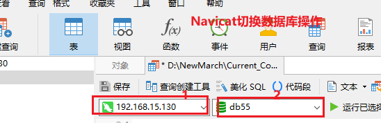
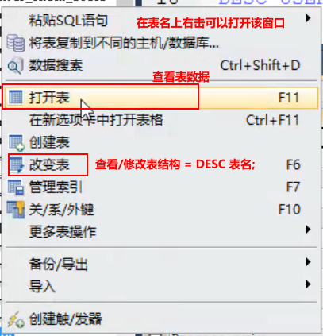
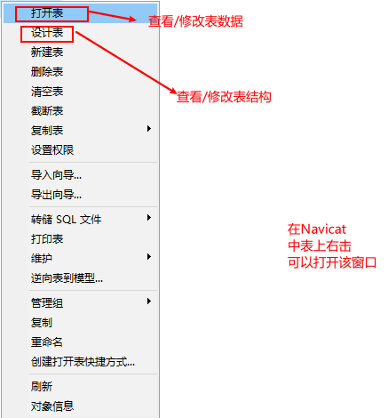
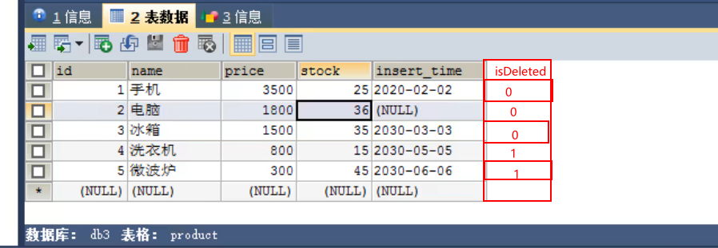
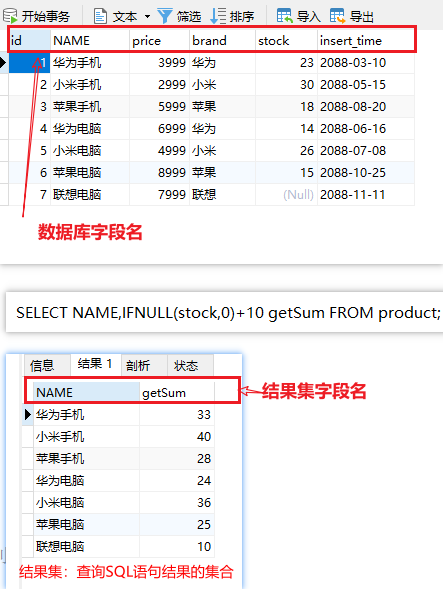

## 1. 数据库

### 1.0 前置概念

数据存储位置及其特点：

1. 内存：操作快，但是不安全
2. 文件：相对安全；在并发环境下数据可以不准确；每次读写基本上都要把文件内容全部加载到内存，IO性能会非常差。


上述两种情况，都不适合做数据稳定安全的大量存储。


DBA


数据库：能够高效的存储和管理海量数据的仓库。MySQL是关系型数据库。

数据库的分类：

- 关系型数据库。传统的数据库，Oracle、MySQL、SQLServer、DB2，数据之间有关联。
- 非关系型数据库。新型的内存数据库，Redis，数据之间没有关联，所有数据都存在一起，可以理解成一个大map。


### 1.1 相关概念


在程序中，可以快速、安全、高效的存储大量数据的仓库。

整个大的仓库可以理解成一个mysql数据库

| 数据库中概念       | 生活中概念                   | 备注 |
| ------------------ | ---------------------------- | ---- |
| 库                 | 仓库中每一个小的空间（房间） |      |
| 表                 | 房间中的货架                 |      |
| （每一样数据）记录 | 货架上的每一个货品           |      |


**操作数据库的方式**

​	对数据的操作：增删改查，通过SQL完成


### 1.2 数据库的安装

在linux安装，按照文档《安装mysql步骤详解.txt》操作

使用SQLyog或者Navicat连接


### 1.3 SQL语法和分类


通过专门的数据库管理软件来操作数据库，使用的语言就是SQL（Structured Query Language）结构化查询语言。

**通用语法规则**

SQL 语句可以单行或多行书写，以分号结尾

可使用空格和缩进来增强语句的可读性

MySQL 数据库的 SQL 语句不区分大小写，关键字建议使用大写，非关键字不要使用大写

单行注释：-- 注释内容 #注释内容(MySQL特有)

多行注释：/* 注释内容 */


**SQL 分类**

DDL(Data Definition Language) ：数据定义语言。用来操作数据库，表，列等。

DML(Data Manipulation Language) ：数据操作语言。用来对数据库中表的记录（数据）进行增删改。

**DQL(Data Query Language) ：数据查询语言。用来查询数据库中表的记录(数据)。**

~~DCL(Data Control Language) ：数据控制语言。用来定义数据库的访问权限和安全级别，及创建用户。~~


### 1.4 DDL (了解)

数据定义语言

**关于数据库的操作**

```sql
/*
	查询所有数据库
	标准语法：
		SHOW DATABASES;
*/
-- 查询所有数据库
SHOW DATABASES;


/*
	查询某个数据库的创建语句，可以查看字符集（码表）
	标准语法：
		SHOW CREATE DATABASE 数据库名称;
*/
-- 查询mysql数据库的创建语句（编码）
SHOW CREATE DATABASE mysql;


/*
	创建数据库
	标准语法：
		CREATE DATABASE 数据库名称;
*/
-- 创建db1数据库
CREATE DATABASE db1;


/*
	创建数据库，判断、如果不存在则创建
	标准语法：
		CREATE DATABASE IF NOT EXISTS 数据库名称;
*/
-- 创建数据库db2(判断，如果不存在则创建)
CREATE DATABASE IF NOT EXISTS db2;


/*
	创建数据库、并指定字符集
	标准语法：
		CREATE DATABASE 数据库名称 CHARACTER SET 字符集名称;
*/
-- 创建数据库db3、并指定字符集utf8
CREATE DATABASE db3 CHARACTER SET utf8;

-- 查看db3数据库的字符集
SHOW CREATE DATABASE db3;


-- 练习：创建db4数据库、如果不存在则创建，指定字符集为gbk
CREATE DATABASE IF NOT EXISTS db4 CHARACTER SET gbk;


-- 查看db4数据库的字符集
SHOW CREATE DATABASE db4;


/*
	完整的创建数据库的语法
	
	CREATE DATABASE [IF NOT EXISTS] 数据库名字 [CHARACTER SET 字符集名称];

	第三方工具中，SQL语法校验不严格，；可以不写
*/
CREATE DATABASE db55


/*
	修改数据库的字符集
	标准语法：
		ALTER DATABASE 数据库名称 CHARACTER SET 字符集名称;
*/
-- 修改数据库db4的字符集为utf8
ALTER DATABASE db4 CHARACTER SET utf8;

-- 查看db4数据库的字符集
SHOW CREATE DATABASE db4;


/*
	删除数据库
	标准语法：
		DROP DATABASE 数据库名称;
*/
-- 删除db1数据库
DROP DATABASE db1;

/*
	删除数据库，判断、如果存在则删除
	标准语法：
		DROP DATABASE IF EXISTS 数据库名称;
*/
-- 删除数据库db2，如果存在
DROP DATABASE IF EXISTS db2;


/*
	使用数据库（切换数据库）
	标准语法：
		USE 数据库名称;
*/
-- 使用db4数据库
USE db4;


/*
	查询当前使用的数据库
	标准语法：
		SELECT DATABASE();
*/
-- 查询当前正在使用的数据库
SELECT DATABASE();
```


Navicat图形化界面切库




**数据库中表的操作**

查询

```sql
-- 使用mysql数据库
USE mysql;

/*
	查询所有数据表
	标准语法：
		SHOW TABLES;
*/
-- 查询库中所有的表
SHOW TABLES;

/*
	查询表结构
	标准语法：
		DESC 表名;
*/
-- 查询user表结构
DESC USER;

/*
	查询数据表的所有属性信息
	标准语法：
		SHOW TABLE STATUS FROM 数据库名称 [LIKE '表名'];
*/
-- 查看mysql数据库中user查询数据表的所有属性信息
SHOW TABLE STATUS FROM mysql LIKE 'user';


/*
	查询当前的字符集(建表语句)
*/
SHOW CREATE TABLE user;
```


创建数据表（重点）

```sql
/*
	创建数据表
	标准语法：
		CREATE TABLE 表名(
			列名 数据类型 [约束],
			列名 数据类型 [约束],
			...
			列名 数据类型 [约束]
		);
*/
-- 创建一个product商品表(商品编号、商品名称、商品价格、商品库存、上架时间)
-- 自己定义的标识符不要使用大写，容易产生一些莫名其妙的问题
CREATE TABLE product(
	id INT,
	`NAME` VARCHAR(20),
	price DOUBLE,
	stock INT,
	insert_time DATE
);

-- 查看product表详细结构
DESC product;
```







数据类型（应用）

> double在Sql中同样不精确，不能进行财务等对精度有要求的计算。
>
> 解决方式1：
>
> ​	int/long	存储时把小数放大`10^小数点后位数`倍存储，使用时取出后缩小相同倍数即可。
>
> 解决方式2：
>
> ​	decimal 可以进行精确运算，会降低性能。


修改表结构（**慎重**，优先考虑增强）

```sql
-- 使用mysql数据库
USE mysql;

/*
	查询所有数据表
	标准语法：
		SHOW TABLES;
*/
-- 查询库中所有的表
SHOW TABLES;

/*
	查询表结构
	标准语法：
		DESC 表名;
*/
-- 查询user表结构
DESC USER;

/*
	查询数据表的属性信息
	标准语法：
		SHOW TABLE STATUS FROM 数据库名称 [LIKE '表名'];
*/
-- 查看mysql数据库中user表详细状态信息
SHOW TABLE STATUS FROM mysql LIKE 'user';
-- 查看mysql数据库中user表字符集
SHOW CREATE TABLE mysql.`user`;


/*
	创建数据表
	标准语法：
		CREATE TABLE 表名(
			列名 数据类型 约束,
			列名 数据类型 约束,
			...
			列名 数据类型 约束
		);
		
		数据类型
			整数：
				TINYINT	SMALLINT	MEDIUMINT INT BIGINT 都表示整数，占字节数分别是1/2/3/4/8个字节
			浮点数：
				FLOAT	DOUBLE DECIMAL
				FLOAT	DOUBLE 可以做浮点运算，但是不精确，性能较高，能表示的范围较小
				DECIMAL  运算非常精确，性能较低，能表达的范围很大
				
				技巧：把浮点数放大10^n后存入数据库，使用的时候缩小相同倍数之后再使用。
				eg：3000.02  存入之前改成  300002 
				
			时间类型：
				DATE
				DATETIME
				TIMESTAMP	这个有默认值，不指定的时候默认为当前操作的时间
		
*/
-- 创建一个product商品表(商品编号、商品名称、商品价格、商品库存、上架时间)
CREATE TABLE product(
	id INT,
	NAME VARCHAR(20),
	price DOUBLE,
	stock INT,
	insert_time DATE
);

-- 查看product表详细结构
DESC product;

/*
	修改表名
	标准语法：
		ALTER TABLE 旧表名 RENAME TO 新表名;
*/
-- 修改product表名为product2
ALTER TABLE product RENAME TO product2;


/*
	修改表的字符集
	标准语法：
		ALTER TABLE 表名 CHARACTER SET 字符集名称;
*/
-- 查看db3数据库中product2数据表字符集
SHOW TABLE STATUS FROM db3 LIKE 'product2';

-- 修改product2数据表字符集为gbk
ALTER TABLE product2 CHARACTER SET gbk;


/*
	给表添加列（重点）
	标准语法：
		ALTER TABLE 表名 ADD 列名 数据类型;
		
		
		
	新需求需要添加列的解决方案
		1. 在需要的时候添加一个列
		2. 在数据库设计之初，就预留多列冗余字段。
*/
-- 给product2表添加一列color
ALTER TABLE product2 ADD color VARCHAR(10);


/*
	修改表中列的数据类型
	标准语法：
		ALTER TABLE 表名 MODIFY 列名 数据类型;
*/
-- 将color数据类型修改为int
ALTER TABLE product2 MODIFY color INT;

-- 查看product2表详细信息
DESC product2;

/*
	修改表中列的名称和数据类型
	标准语法：
		ALTER TABLE 表名 CHANGE 旧列名 新列名 数据类型;
*/
-- 将color修改为address
ALTER TABLE product2 CHANGE color address VARCHAR(200);

-- 查看product2表详细信息


/*
	删除表中的列
	标准语法：
		ALTER TABLE 表名 DROP 列名;
*/
-- 删除address列
ALTER TABLE product2 DROP address;


```


删除表

```sql
/*
	删除表
	标准语法：
		DROP TABLE 表名;
*/
-- 删除product2表
DROP TABLE product2;

/*
	删除表，判断、如果存在则删除
	标准语法：
		DROP TABLE IF EXISTS 表名;
*/
-- 删除product2表，如果存在则删除
DROP TABLE IF EXISTS product2;
```


**经验分享**

做修改，如果可以进行健壮性判断(if exists  / if not exists)，就加上。


### 1.5 DML（重要）

表数据修改（增、删、改）


**添加数据**

```sql
/*
	给指定列添加数据(工作中推荐写法)
	标准语法：
	该写法好处：
		1. 可以直观的看出添加数据的列
		2. 数据库添加新的字段之后，不会受到影响
		INSERT INTO 表名(列名1,列名2,...) VALUES (值1,值2,...);
        
     表结构字段设计经验：
     	后期可能根据需要为表增加新的字段(列)，有两种做法可以选：
     	1. 用的时候再加，修改了表结构
     	2. 提前设计好冗余的列，column1、column2....
*/
-- 向product表添加一条数据
INSERT INTO product (id,NAME,price,stock,insert_time) VALUES (1,'手机',1999.99,25,'2020-02-02');


-- 向product表添加指定列数据
INSERT INTO product (id,NAME,price) VALUES (2,'电脑',3999.99);

/*
	给全部列添加数据
	标准语法：
		INSERT INTO 表名 VALUES (值1,值2,值3,...);
*/
-- 默认给全部列添加数据
INSERT INTO product VALUES (3,'冰箱',1500,35,'2030-03-03');

/*
	批量添加所有列数据
	标准语法：
		INSERT INTO 表名 VALUES (值1,值2,值3,...),(值1,值2,值3,...),(值1,值2,值3,...);
*/
-- 批量添加数据
INSERT INTO product VALUES (4,'洗衣机',800,15,'2030-05-05'),(5,'微波炉',300,45,'2030-06-06');
```


**表数据的修改和删除**

```sql
/*
	修改表数据
	标准语法：
		UPDATE 表名 SET 列名1 = 值1,列名2 = 值2,... [where 条件];
*/
-- 修改手机的价格为3500
UPDATE product SET price=3500 WHERE NAME='手机';

-- 修改电脑的价格为1800、库存为36
UPDATE product SET price=1800,stock=36 WHERE NAME='电脑';

/*
	删除表数据
	标准语法：
		DELETE FROM 表名 [WHERE 条件];
*/
-- 删除product表中的微波炉信息
DELETE FROM product WHERE NAME='微波炉';

-- 删除product表中库存为10的商品信息
DELETE FROM product WHERE stock=10;
```


> 注意事项

一定要根据业务需要在修改和删除语句后面通过`where`关键字，添加条件，否则会造成整个表中数据受影响。


> 关于删除

分类

- 物理删除

  调用delete语句真的把数据删掉。

  

- 逻辑删除

  本质是更新。

  逻辑删除，依赖于一个额外的字段（是否删除）。

  如果查询所有未删除的数据，只需要在查询的语句中添加一个条件`isDeleted = 0`




### 1.6 DQL（重要）

1.6.1 准备数据

```sql
-- 创建db1数据库
CREATE DATABASE db1;

-- 使用db1数据库
USE db1;

-- 创建数据表
CREATE TABLE product(
	id INT,			-- 商品编号
	NAME VARCHAR(20),	-- 商品名称
	price DOUBLE,		-- 商品价格
	brand VARCHAR(10),	-- 商品品牌
	stock INT,		-- 商品库存
	insert_time DATE        -- 添加时间
);

-- 添加数据
INSERT INTO product VALUES 
(1,'华为手机',3999,'华为',23,'2088-03-10'),
(2,'小米手机',2999,'小米',30,'2088-05-15'),
(3,'苹果手机',5999,'苹果',18,'2088-08-20'),
(4,'华为电脑',6999,'华为',14,'2088-06-16'),
(5,'小米电脑',4999,'小米',26,'2088-07-08'),
(6,'苹果电脑',8999,'苹果',15,'2088-10-25'),
(7,'联想电脑',7999,'联想',NULL,'2088-11-11');
```


**查询的语法**

```sql
SELECT [DISTINCT]
	字段列表 [[AS] 别名]
FROM
	表名列表 
-- 下面的关键字不要求都出现。但是只要出现了，必须是下面的顺序，否则语法错误。
WHERE
	条件列表
GROUP BY
	分组字段
HAVING
	分组后的过滤条件
ORDER BY
	排序
LIMIT
	分页
```


**查询所有**

```sql
/*
	查询全部数据
	标准语法：
		SELECT * FROM 表名;
		
    查询出来的结果称为结果集（ResultSet）。
	
	不建议使用select *
		1. 冗余字段会被查出来，后期添加的字段也会被查出来
		2. select * 的性能低于 select 字段名列表
		
*/
-- 查询product表所有数据
SELECT * FROM product;


/*
	查询指定列
	标准语法：
		SELECT 列名1,列名2,... FROM 表名;
*/
-- 查询名称、价格、品牌
SELECT NAME,price,brand FROM product;


/*
	去除重复查询
	标准语法：
		SELECT DISTINCT 列名1,列名2,... FROM 表名;
*/
-- 查询品牌
SELECT brand FROM product;
-- 查询品牌，去除重复
SELECT DISTINCT brand FROM product;


/*
	计算列的值，一般不用，如果需要运算，会在Java代码中运算，传值给SQL
	标准语法：
		SELECT 列名1 运算符(+ - * /) 列名2 FROM 表名;
		
	如果某一列为null，可以进行替换
	ifnull(表达式1,表达式2)
	表达式1：想替换的列
	表达式2：想替换的值
*/
-- 查询商品名称和库存，库存数量在原有基础上加10
SELECT NAME,stock+10 FROM product;

-- 查询商品名称和库存，库存数量在原有基础上加10。进行null值判断
SELECT NAME,IFNULL(stock,0)+10 FROM product;


/*
	起别名，为结果集的字段名起别名，数据库字段名不受影响
	标准语法：
		SELECT 列名1,列名2,... AS 别名 FROM 表名;
*/
-- 查询商品名称和库存，库存数量在原有基础上加10。进行null值判断。起别名为getSum
SELECT NAME,IFNULL(stock,0)+10 AS getSum FROM product;
SELECT NAME,IFNULL(stock,0)+10 getSum FROM product;
```


**有关概念**

数据库字段名

结果集

结果集字段名





**条件查询**


条件规则

| 符号                | 功能                                      |
| ------------------- | ----------------------------------------- |
| >                   | 大于                                      |
| <                   | 小于                                      |
| >=                  | 大于等于                                  |
| <=                  | 小于等于                                  |
| =                   | 等于                                      |
| <> 或 !=            | 不等于                                    |
| BETWEEN ... AND ... | 在某个范围之内(都包含)                    |
| IN(...)             | 多选一                                    |
| LIKE 占位符         | 模糊查询  _单个任意字符  %0到多个任意字符 |
| IS NULL             | 是NULL                                    |
| IS NOT NULL         | 不是NULL                                  |
| AND 或 &&           | 并且                                      |
| OR 或 \|\|          | 或者                                      |
| NOT 或 !            | 非，不是                                  |


```sql
/*
	条件查询
	标准语法：
		SELECT 列名列表 FROM 表名 WHERE 条件;
		
    在MySQL中，null是一个占位符，而非数据，所以null <> null.
    要进行null或者非null的判断，就使用IS NULL 或者 IS NOT NULL
*/
-- 查询库存大于20的商品信息
SELECT * FROM product WHERE stock > 20;


-- 查询品牌为华为的商品信息
SELECT * FROM product WHERE brand='华为';

-- 查询金额在4000 ~ 6000之间的商品信息
SELECT * FROM product WHERE price >= 4000 AND price <= 6000;
SELECT * FROM product WHERE price BETWEEN 4000 AND 6000;


-- 查询库存为14、30、23的商品信息
SELECT * FROM product WHERE stock=14 OR stock=30 OR stock=23;
SELECT * FROM product WHERE stock IN(14,30,23);

-- 查询库存为null的商品信息
-- 在SQL  null <> null
SELECT * FROM product WHERE stock IS NULL;
-- 某条记录中，如果某个列的显示的是null，这里的null仅仅是一个占位符，并不表示该列的值为null。下面写法有误
SELECT * FROM product WHERE stock = NULL;

-- 查询库存不为null的商品信息
SELECT * FROM product WHERE stock IS NOT NULL;
-- 下面写法也不对
SELECT * FROM product WHERE stock != NULL;

-- 总结：所有关于是否为null的判断，全部使用is null 或者 is not null


-- 查询名称以小米为开头的商品信息 %表示0个或多个符号
SELECT * FROM product WHERE NAME LIKE '小米%';

-- 查询名称第二个字是为的商品信息
SELECT * FROM product WHERE NAME LIKE '_为%';

-- 查询名称为四个字符的商品信息
SELECT * FROM product WHERE NAME LIKE '____';

-- 查询名称中包含电脑的商品信息
SELECT * FROM product WHERE NAME LIKE '%电脑%';
```


**聚合函数查询**

在某列纵向统计查询

```sql
/*
	聚合函数
	标准语法：
		SELECT 函数名(列名) FROM 表名 [WHERE 条件];
		
	count(*)				表只有一列且没有主键，性能最好					不用
	★count(id主键)		表有主键（这一列的值不能为空，且不能重复）的时候，性能最好
	count(1)				表有多列，且没有主键的时候，性能最好		不用
*/
-- 计算product表中总记录条数
SELECT COUNT(*) FROM product;

-- 获取最高价格
SELECT MAX(price) FROM product;


-- 获取最低库存
SELECT MIN(stock) FROM product;


-- 获取总库存数量
SELECT SUM(stock) FROM product;


-- 获取品牌为苹果的总库存数量
SELECT SUM(stock) FROM product WHERE brand='苹果';

-- 获取品牌为小米的平均商品价格
SELECT AVG(price) FROM product WHERE brand='小米';
```


**对查询结果排序**

升序	ASC	默认的顺序   

降序	DESC

```sql
/*
	排序查询
	标准语法：
		SELECT 列名 FROM 表名 [WHERE 条件] ORDER BY 列名1 排序方式1,列名2 排序方式2;
*/
-- 按照库存升序排序
SELECT * FROM product ORDER BY stock ASC;

-- 查询名称中包含手机的商品信息。按照金额降序排序
SELECT * FROM product WHERE NAME LIKE '%手机%' ORDER BY price DESC;

-- 按照金额升序排序，如果金额相同，按照库存降序排列
-- 多个排序条件时，如果前面的条件无法决定顺序的时候，才会按照后面条件排序
SELECT * FROM product ORDER BY price ASC,stock DESC;
```


**分组查询**

把查询的结果按照指定条件进行分组，方便分组展示或者分组统计等。

```sql
/*
	分组查询
	标准语法：
		SELECT 列名 FROM 表名 [WHERE 条件] GROUP BY 分组列名 [HAVING 分组后条件过滤] [ORDER BY 排序列名 排序方式];
		
	分组查询的注意点：
		1. 要查询出来的所有列中，除了聚合函数相关的列之外，其他列都要出现在GROUP BY关键字后面
			SELECT id,brand,SUM(price) FROM product GROUP BY brand,id;
		2. GROUP BY 子句中可以使用别名进行分组
		
*/
-- 按照品牌分组，获取每组商品的总金额
SELECT brand ,SUM(price) FROM product GROUP BY brand;

SELECT * FROM product;

-- 对金额大于4000元的商品，按照品牌分组,获取每组商品的总金额
SELECT brand,SUM(price) FROM product WHERE price > 4000 GROUP BY brand;

-- 对金额大于4000元的商品，按照品牌分组，获取每组商品的总金额，只显示总金额大于7000元的
SELECT brand,SUM(price) getSum FROM product WHERE price > 4000 GROUP BY brand HAVING getSum > 7000;

/*
	按照数据库中已有的字段名进行筛选使用where
	按照结果集中的字段名进行筛选使用having
*/
/*
	Navicat中，选中某个SQL语句，点击菜单栏 美化SQL，可以格式化SQL
*/
-- 对金额大于4000元的商品，按照品牌分组，获取每组商品的总金额，只显示总金额大于7000元的、并按照总金额的降序排列
SELECT
	brand,
	SUM( price ) getSum 
FROM
	product 
WHERE
	price > 4000 
GROUP BY
	brand 
HAVING
	getSum > 7000 
ORDER BY
	getSum DESC;
```


**分页查询**

```sql
/*
	分页查询
	标准语法：
		SELECT 列名 FROM 表名 
		[WHERE 条件] 
		[GROUP BY 分组列名]
		[HAVING 分组后条件过滤] 
		[ORDER BY 排序列名 排序方式] 
		LIMIT 当前页数,每页显示的条数;
	
	LIMIT 当前页数(之前页已显示的所有记录数),每页显示的条数;
	公式：当前页数(之前页已显示的所有记录数) = (当前页数-1) * 每页显示的条数
	
	LIMIT 之前也已经显示的记录数, 本页要显示的记录数
	
	LIMIT n
		查询表中前n条记录，分页之前，可以使用条件过滤、排序等操作。
*/
-- 每页显示3条数据

-- 第1页  当前页数=(1-1) * 3 = 0
SELECT * FROM product ORDER BY id DESC LIMIT 5;

-- 第2页  当前页数=(2-1) * 3 = 3
SELECT * FROM product LIMIT 3,3;

-- 第3页  当前页数=(3-1) * 3 = 6
SELECT * FROM product LIMIT 6,3;
```


