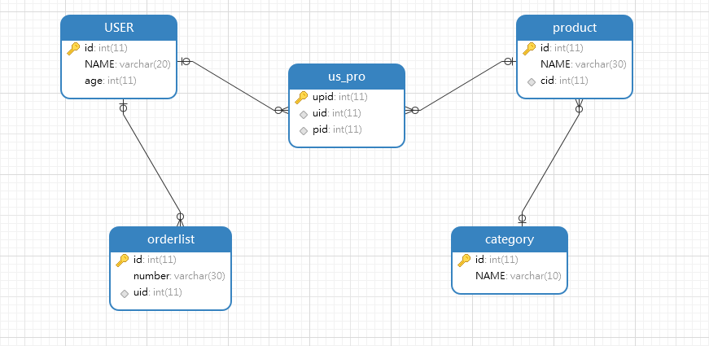

## 0.注意

不要使用SQL里面的保留字、关键字作为类名或者字段名 `user`、`name`、`order`

## 1. 约束（重点）

限制，在数据库中是对**某一列**（多列）进行限制。


### 主键约束

主键约束 = 唯一约束 + 非空约束；

一张表只能有一个主键；

主键一般用于表中记录的唯一标识，不参与业务逻辑（非业务字段）。

```sql
-- 创建学生表(编号、姓名、年龄)  编号设为主键   --- 推荐使用方式
CREATE TABLE student(
	id INT PRIMARY KEY,
	NAME VARCHAR(30),
	age INT
);

-- 查询学生表的详细信息
DESC student;

-- 添加数据
INSERT INTO student VALUES (1,'张三',23);
INSERT INTO student VALUES (2,'李四',24);

-- 删除主键
ALTER TABLE student DROP PRIMARY KEY;


-- 建表后单独添加主键约束
ALTER TABLE student MODIFY id INT PRIMARY KEY;
```


### 主键自增约束（重点）

```sql
-- 创建学生表(编号、姓名、年龄)  编号设为主键自增
/*
	int/bigint  自动增长
	自增一般和其他键约束配合使用，最常用的是和主键一起配合使用

*/
CREATE TABLE student(
	id INT PRIMARY KEY AUTO_INCREMENT,
	NAME VARCHAR(30),
	age INT
);

-- 查询学生表的详细信息
DESC student;

-- 添加数据
INSERT INTO student VALUES (NULL,'张三',23),(NULL,'李四',24);

-- 删除自增约束
ALTER TABLE student MODIFY id INT;
INSERT INTO student VALUES (NULL,'张三',23);

-- 建表后单独添加自增约束
ALTER TABLE student MODIFY id INT AUTO_INCREMENT;
```


### 唯一约束

```sql
-- 创建学生表(编号、姓名、年龄)  编号设为主键自增，年龄设为唯一
CREATE TABLE student(
	id INT PRIMARY KEY AUTO_INCREMENT,
	NAME VARCHAR(30),
	age INT UNIQUE
);

-- 查询学生表的详细信息
DESC student;

-- 添加数据
INSERT INTO student VALUES (NULL,'张三',23);
INSERT INTO student VALUES (NULL,'李四',23);

-- 删除唯一约束
ALTER TABLE student DROP INDEX age;

-- 建表后单独添加唯一约束
ALTER TABLE student MODIFY age INT UNIQUE;
```


### 非空约束

```sql
-- 创建学生表(编号、姓名、年龄)  编号设为主键自增，姓名设为非空，年龄设为唯一
CREATE TABLE student(
	id INT PRIMARY KEY AUTO_INCREMENT,
	NAME VARCHAR(30) NOT NULL,
	age INT UNIQUE
);

-- 查询学生表的详细信息
DESC student;

-- 添加数据
INSERT INTO student VALUES (NULL,'张三',23);

-- 删除非空约束
ALTER TABLE student MODIFY NAME VARCHAR(30);
INSERT INTO student VALUES (NULL,NULL,25);

-- 建表后单独添加非空约束
ALTER TABLE student MODIFY NAME VARCHAR(30) NOT NULL;
```


### 外键约束（重点）

描述的是多表（记录）之间关系，在A表中添加一个额外的字段（外键），并让该字段指向了另外一张表B的主键。

让两张表之间的记录产生关联关系，在新增和删除的时候，校验是否符合逻辑，已达到保证数据准确安全的目的。

校验是否mysql（的事务）来完成，消耗一定的性能。

```sql
-- 创建db2数据库
CREATE DATABASE db2;

-- 使用db2数据库
USE db2;

/*
	外键约束
	标准语法：
		CONSTRAINT 外键名 FOREIGN KEY (本表外键列名) REFERENCES 主表名(主表主键列名)
		
	外键分类：
		物理外键
				有外键字段，并且使用foreign key在数据库层面关联表；数据库维护外键关系，保证数据安全。
		逻辑外键
				有外键字段，但是没有使用foreign key在数据库层面关联表，而是在后台程序中Java代码维护外键关系
				
		应用场景分析
				互联网系统用户量大，并发度高。
							物理外键需要数据库维护事物的特性，资源消耗大。数据库服务器不易扩展，数据库性能容易成为系统的瓶颈。
							逻辑外键可以让数据库表的关系在后台项目代码内控制，让应用服务器承担此部分的压力，且应用服务器易拓展。
				传统行业软件项目并发量可控，数据量也一般不会超大。
							物理外键可以借助数据库产品自身的特性实现表与关联表之间的数据一致性和更新，降低开发成本
							逻辑外键会提高开发成本，降低开发效率和速度。

	物理外键适用于传统普通项目，逻辑外键适用于互联网大型项目。
*/
-- 建表时添加外键约束
-- 创建user用户表
CREATE TABLE USER(
	id INT PRIMARY KEY AUTO_INCREMENT,    -- id
	NAME VARCHAR(20) NOT NULL             -- 姓名
);
-- 添加用户数据
INSERT INTO USER VALUES (NULL,'张三'),(NULL,'李四');


-- 创建orderlist订单表
CREATE TABLE orderlist(
	id INT PRIMARY KEY AUTO_INCREMENT,    -- id
	number VARCHAR(20) NOT NULL,          -- 订单编号
	uid INT,			      -- 外键列
	CONSTRAINT ou_fk1 FOREIGN KEY (uid) REFERENCES USER(id)
);
-- 添加订单数据
INSERT INTO orderlist VALUES (NULL,'hm001',1),(NULL,'hm002',1),
(NULL,'hm003',2),(NULL,'hm004',2);


-- 添加一个订单，但是没有真实用户。添加失败
INSERT INTO orderlist VALUES (NULL,'hm005',3);

-- 删除李四用户。删除失败
DELETE FROM USER WHERE NAME='李四';


/*
	删除外键约束
	标准语法：
		ALTER TABLE 表名 DROP FOREIGN KEY 外键名;
*/
-- 删除外键约束
ALTER TABLE orderlist DROP FOREIGN KEY ou_fk1;


/*
	建表后单独添加外键约束
	标准语法：
		ALTER TABLE 表名 ADD CONSTRAINT 外键名 FOREIGN KEY (本表外键列名) REFERENCES 主表名(主键列名);
*/
-- 添加外键约束
ALTER TABLE orderlist ADD CONSTRAINT ou_fk1 FOREIGN KEY (uid) REFERENCES USER(id);
```


### 外键级联更新约束（了解）


### 外键级联删除约束（了解）


## 2. 多表关系（重点）

### 2.1 一对一（理解）

```sql
/*
	多表，一个系统中有多张数据库表
	
	多表之间的关系  就是  表中记录之间的关系
	A表 - 男性
	B表 - 女性
	
	A表中一个记录唯一对应B表中一个记录。工作中不常见。
	
	建表原则：
		外键唯一：在任意一个表中添加一个额外字段（外键），作为外键指定另外一张表中的主键（）
		
		这样做也行，只在person表中添加内容
		cid INT UNIQUE,
		CONSTRAINT cp_fk1 FOREIGN KEY (cid) REFERENCES card(id)
*/

-- 创建db3数据库
CREATE DATABASE db3;

-- 使用db3数据库
USE db3;

-- 创建person表
CREATE TABLE person(
	id INT PRIMARY KEY AUTO_INCREMENT,	-- 主键id
	NAME VARCHAR(20)                       -- 姓名，
	
);
-- 添加数据
INSERT INTO person VALUES (NULL,'张三'),(NULL,'李四');

-- 创建card表
CREATE TABLE card(
	id INT PRIMARY KEY AUTO_INCREMENT,	-- 主键id
	number VARCHAR(20) UNIQUE NOT NULL,	-- 身份证号
	pid INT UNIQUE,                         -- 外键列
	CONSTRAINT cp_fk1 FOREIGN KEY (pid) REFERENCES person(id)
);
-- 添加数据
INSERT INTO card VALUES (NULL,'12345',1),(NULL,'56789',2);
```


### 2.2 一对多（重要）

```sql
/*
	一对多
		A表中的一条记录，对应B表中的多条记录
			
	建表原则
		在多的表中添加一个额外字段，作为外键指向一的一方的主键。

*/

-- 创建user表
CREATE TABLE USER(
	id INT PRIMARY KEY AUTO_INCREMENT,	-- 主键id
	NAME VARCHAR(20)                        -- 姓名
);
-- 添加数据
INSERT INTO USER VALUES (NULL,'张三'),(NULL,'李四');

-- 创建orderlist表
CREATE TABLE orderlist(
	id INT PRIMARY KEY AUTO_INCREMENT,	-- 主键id
	number VARCHAR(20),                     -- 订单编号
	uid INT,				-- 外键列
	CONSTRAINT ou_fk1 FOREIGN KEY (uid) REFERENCES USER(id)
);
-- 添加数据
INSERT INTO orderlist VALUES (NULL,'hm001',1),(NULL,'hm002',1),(NULL,'hm003',2),(NULL,'hm004',2);


/*
	商品分类和商品
*/
-- 创建category表
CREATE TABLE category(
	id INT PRIMARY KEY AUTO_INCREMENT,	-- 主键id
	NAME VARCHAR(10)                        -- 分类名称
);
-- 添加数据
INSERT INTO category VALUES (NULL,'手机数码'),(NULL,'电脑办公');

-- 创建product表
CREATE TABLE product(
	id INT PRIMARY KEY AUTO_INCREMENT,	-- 主键id
	NAME VARCHAR(30),			-- 商品名称
	cid INT,				-- 外键列
	CONSTRAINT pc_fk1 FOREIGN KEY (cid) REFERENCES category(id)
);
-- 添加数据
INSERT INTO product VALUES (NULL,'华为P30',1),(NULL,'小米note3',1),
(NULL,'联想电脑',2),(NULL,'苹果电脑',2);
```


### 2.3 多对多（重要）

```sql
/*
	多对多
		A表多条记录和B表中多条记录有关系
	
	建表原则
		借助中间表，该表最少有两个字段，分别作为外键指向另外两张表的主键
		
	从A、B表任意一表的角度出发，都是多对多关系
		从中间表角度出发，是一对多关系。
		多对多的关系可以成分多个一对多。
		
	中间表建表原则
		
		该表仅仅是作为中间表使用，没有任何业务逻辑在里面。这个表就是一个普普通通的中间表，表中只需要有两个外键，分别指向另外两张表的主键；两个外键加在一起建立一个联合主键：
			利用两个外键作为该中间表的联合主键（多个列一起作为主键）使用
			CREATE TABLE stu_course2 (
				sid INT,
				cid INT,
				PRIMARY KEY (sid,cid),
				CONSTRAINT `stu_course2_ibfk_1` FOREIGN KEY (sid) REFERENCES student (id),
				CONSTRAINT `stu_course2_ibfk_2` FOREIGN KEY (cid) REFERENCES course (id)
			) 

		如果该中间表中有其他业务字段，此时是该表一张业务表，就需要定义一个额外主键
			增加一个字段，单独作为主键使用
			CREATE TABLE stu_course (
				id INT PRIMARY KEY AUTO_INCREMENT,
				sid INT,
				cid INT,
				score double,     -- 业务字段
				desc VARCHAR(120),
				CONSTRAINT `sc_fk1` FOREIGN KEY (sid) REFERENCES student (id),
				CONSTRAINT `sc_fk2` FOREIGN KEY (cid) REFERENCES course (id)
			) 
*/

-- 创建student表
CREATE TABLE student(
	id INT PRIMARY KEY AUTO_INCREMENT,	-- 主键id
	NAME VARCHAR(20)			-- 学生姓名
);
-- 添加数据
INSERT INTO student VALUES (NULL,'张三'),(NULL,'李四');

-- 创建course表
CREATE TABLE course(
	id INT PRIMARY KEY AUTO_INCREMENT,	-- 主键id
	NAME VARCHAR(10)			-- 课程名称
);
-- 添加数据
INSERT INTO course VALUES (NULL,'语文'),(NULL,'数学');


-- 创建中间表
CREATE TABLE stu_course(
	id INT PRIMARY KEY AUTO_INCREMENT,	-- 主键id
	sid INT,  -- 用于和student表中的id进行外键关联
	cid INT,  -- 用于和course表中的id进行外键关联
	CONSTRAINT sc_fk1 FOREIGN KEY (sid) REFERENCES student(id), -- 添加外键约束
	CONSTRAINT sc_fk2 FOREIGN KEY (cid) REFERENCES course(id)   -- 添加外键约束
);
-- 添加数据
INSERT INTO stu_course VALUES (NULL,1,1),(NULL,1,2),(NULL,2,1),(NULL,2,2);
```


## 3. 多表(联合)查询（重点）


### 3.1 数据准备

表关系模型图




| user_name | product_name |      |
| --------- | ------------ | ---- |
| 张三      | 口香糖       |      |
| 张三      | 饮料         |      |
|           |              |      |
|           |              |      |
|           |              |      |
|           |              |      |
|           |              |      |
|           |              |      |
|           |              |      |

```java
Class User{
    userName;
    List<Product> products;
        
}
```


建表语句

```sql
-- 创建db4数据库
DROP DATABASE IF EXISTS db4;
CREATE DATABASE db4;
-- 使用db4数据库
USE db4;

-- 创建user表
CREATE TABLE USER(
	id INT PRIMARY KEY AUTO_INCREMENT,	-- 用户id
	NAME VARCHAR(20),			-- 用户姓名
	age INT                                 -- 用户年龄
);
-- 添加数据
INSERT INTO USER VALUES (1,'张三',23);
INSERT INTO USER VALUES (2,'李四',24);
INSERT INTO USER VALUES (3,'王五',25);
INSERT INTO USER VALUES (4,'赵六',26);


-- 订单表
CREATE TABLE orderlist(
	id INT PRIMARY KEY AUTO_INCREMENT,	-- 订单id
	number VARCHAR(30),			-- 订单编号
	uid INT,    -- 外键字段
	CONSTRAINT ou_fk1 FOREIGN KEY (uid) REFERENCES USER(id)
);
-- 添加数据
INSERT INTO orderlist VALUES (1,'hm001',1);
INSERT INTO orderlist VALUES (2,'hm002',1);
INSERT INTO orderlist VALUES (3,'hm003',2);
INSERT INTO orderlist VALUES (4,'hm004',2);
INSERT INTO orderlist VALUES (5,'hm005',3);
INSERT INTO orderlist VALUES (6,'hm006',3);
INSERT INTO orderlist VALUES (7,'hm007',NULL);


-- 商品分类表
CREATE TABLE category(
	id INT PRIMARY KEY AUTO_INCREMENT,  -- 商品分类id
	NAME VARCHAR(10)                    -- 商品分类名称
);
-- 添加数据
INSERT INTO category VALUES (1,'手机数码');
INSERT INTO category VALUES (2,'电脑办公');
INSERT INTO category VALUES (3,'烟酒茶糖');
INSERT INTO category VALUES (4,'鞋靴箱包');


-- 商品表
CREATE TABLE product(
	id INT PRIMARY KEY AUTO_INCREMENT,   -- 商品id
	NAME VARCHAR(30),                    -- 商品名称
	cid INT, -- 外键字段
	CONSTRAINT cp_fk1 FOREIGN KEY (cid) REFERENCES category(id)
);
-- 添加数据
INSERT INTO product VALUES (1,'华为手机',1);
INSERT INTO product VALUES (2,'小米手机',1);
INSERT INTO product VALUES (3,'联想电脑',2);
INSERT INTO product VALUES (4,'苹果电脑',2);
INSERT INTO product VALUES (5,'中华香烟',3);
INSERT INTO product VALUES (6,'玉溪香烟',3);
INSERT INTO product VALUES (7,'计生用品',NULL);


-- 中间表
CREATE TABLE us_pro(
	upid INT PRIMARY KEY AUTO_INCREMENT,  -- 中间表id
	uid INT, -- 外键字段。需要和用户表的主键产生关联
	pid INT, -- 外键字段。需要和商品表的主键产生关联
	CONSTRAINT up_fk1 FOREIGN KEY (uid) REFERENCES USER(id),
	CONSTRAINT up_fk2 FOREIGN KEY (pid) REFERENCES product(id)
);
-- 添加数据
INSERT INTO us_pro VALUES (NULL,1,1);
INSERT INTO us_pro VALUES (NULL,1,2);
INSERT INTO us_pro VALUES (NULL,1,3);
INSERT INTO us_pro VALUES (NULL,1,4);
INSERT INTO us_pro VALUES (NULL,1,5);
INSERT INTO us_pro VALUES (NULL,1,6);
INSERT INTO us_pro VALUES (NULL,1,7);
INSERT INTO us_pro VALUES (NULL,2,1);
INSERT INTO us_pro VALUES (NULL,2,2);
INSERT INTO us_pro VALUES (NULL,2,3);
INSERT INTO us_pro VALUES (NULL,2,4);
INSERT INTO us_pro VALUES (NULL,2,5);
INSERT INTO us_pro VALUES (NULL,2,6);
INSERT INTO us_pro VALUES (NULL,2,7);
INSERT INTO us_pro VALUES (NULL,3,1);
INSERT INTO us_pro VALUES (NULL,3,2);
INSERT INTO us_pro VALUES (NULL,3,3);
INSERT INTO us_pro VALUES (NULL,3,4);
INSERT INTO us_pro VALUES (NULL,3,5);
INSERT INTO us_pro VALUES (NULL,3,6);
INSERT INTO us_pro VALUES (NULL,3,7);
INSERT INTO us_pro VALUES (NULL,4,1);
INSERT INTO us_pro VALUES (NULL,4,2);
INSERT INTO us_pro VALUES (NULL,4,3);
INSERT INTO us_pro VALUES (NULL,4,4);
INSERT INTO us_pro VALUES (NULL,4,5);
INSERT INTO us_pro VALUES (NULL,4,6);
INSERT INTO us_pro VALUES (NULL,4,7);
```


### 3.2 内连接查询（重要）

查询的是多个表之间有交集的记录

```sql
/*
	显示内连接
	标准语法：
		SELECT 列名 FROM 表名1 [INNER] JOIN 表名2 ON 主外键对等 [JOIN 表名3 ON 主外键对等] [WHERE 其他条件];
*/
-- 查询用户信息和对应的订单信息
SELECT * FROM USER INNER JOIN orderlist ON orderlist.uid = user.id;
SELECT * FROM USER INNER JOIN orderlist ON orderlist.uid = user.id INNER jion xxxx x ON o.xid=x.id;


-- 查询用户信息和对应的订单信息，起别名
SELECT * FROM USER u INNER JOIN orderlist o ON o.uid=u.id;


-- 查询用户姓名，年龄。和订单编号
SELECT
	u.name,		-- 用户姓名
	u.age,		-- 用户年龄
	o.number	-- 订单编号
FROM
	USER u          -- 用户表
INNER JOIN
	orderlist o     -- 订单表
ON
	o.uid=u.id;
--  添加更多表参与多表联查
INNER JOIN
	xxxx x
ON
	o.xid=x.id
WHERE
    u.age = 18


/*
	隐式内连接
	标准语法：
		SELECT 列名 FROM 表名1,表名2,表名3……N WHERE 多表之间的主外键对等条件;
*/
-- 查询用户姓名，年龄。和订单编号
SELECT
	u.name,		-- 用户姓名
	u.age,		-- 用户年龄
	o.number	-- 订单编号
FROM
	USER u,		-- 用户表
	orderlist o     -- 订单表
WHERE
	o.uid=u.id;
```


### 3.3 外链接查询（重要）

```sql
/*
	左外连接
	标准语法：
		SELECT 列名 FROM 表名1 LEFT [OUTER] JOIN 表名2 ON 主外键对等 [LEFT JOIN 表名3 ON 主外键对等] [WHERE 其他条件];
		
	如果要查询出主表所有的符合条件是数据，我们一般使用外链接，因为内连接可能会丢失部分数据
*/
-- 查询所有用户信息，以及用户对应的订单信息
SELECT
	u.*,
	o.number
FROM
	USER u
LEFT  JOIN
	orderlist o
ON
	o.uid=u.id;
	


/*
	右外连接
	标准语法：
		SELECT 列名 FROM 表名1 RIGHT [OUTER] JOIN 表名2 ON 条件;
*/
-- 查询所有订单信息，以及订单所属的用户信息
SELECT
	o.*,
	u.name
FROM
	USER u
RIGHT OUTER JOIN
	orderlist o
ON
	o.uid=u.id;
	
-- 查询所有订单信息，以及订单所属的用户信息(使用左外连接查询)
-- 左外/右外是可以相互转换的，我们只需要记一个就可以。
SELECT
	o.*,
	u.name
FROM
	orderlist o
LEFT OUTER JOIN
	USER u
ON
	o.uid=u.id;
```


### 3.4 子查询（理解）

```sql
/*
	子查询
		把第一次查询的结果作为第二次查询的条件/虚拟表 参与到第二次查询中，其中第一次查询就是一个子查询。
		
		子查询先执行，主查询后执行。

	按照子查询的结果集不同，有不同的使用方式。子查询结果集为：

	单行单列：作为条件，放在主查询的where后面

	多行单列/单行单列：作为条件，放在主查询的where后面，使用 IN() 
	
	多行多列/单行多列：作为虚拟表，放在from后面，这种情况下，一般会为虚拟表起别名，方便使用
		
	
	查询订单表中id大于4的订单信息和所属用户信息
	
	
	注意：
		很多情况，子查询和内外连接查询时可以相互转换  而达到相同的效果
		这个时候，优先使用内外连接查询，查询次数少，性能更高。
	
	
	标准语法：
		SELECT 列名 FROM 表名 WHERE 列名=(SELECT 列名 FROM 表名 [WHERE 条件]);
*/
-- 查询年龄最高的用户姓名
SELECT MAX(age) FROM USER;
SELECT NAME,age FROM USER WHERE age=(SELECT MAX(age) FROM USER);


/*
	结果是多行单列的
	标准语法：
		SELECT 列名 FROM 表名 WHERE 列名 [NOT] IN (SELECT 列名 FROM 表名 [WHERE 条件]); 
*/
-- 查询张三和李四的订单信息
SELECT * FROM orderlist WHERE uid IN (1,2);
SELECT id FROM USER WHERE NAME IN ('张三','李四');
SELECT * FROM orderlist WHERE uid IN (SELECT id FROM USER WHERE NAME IN ('张三','李四'));


/*
	结果是多行多列的
	标准语法：
		SELECT 列名 FROM 表名 [别名],(SELECT 列名 FROM 表名 [WHERE 条件]) [别名] [WHERE 条件];
*/
-- 查询订单表中id大于4的订单信息和所属用户信息
SELECT * FROM orderlist WHERE id > 4;
SELECT
	u.name,
	o.number
FROM
	USER u,
	(SELECT * FROM orderlist WHERE id > 4) o
WHERE
	o.uid=u.id
	
	
-- 能使用连接查询，就不需要使用子查询
SELECT
	u.*,o.*
FROM
	orderlist o
LEFT JOIN
	`USER` u
ON
	o.uid=u.id
WHERE
	o.id > 4;
	
/*
子查询分类
	按照子查询的结果集不同，有不同的使用方式。结果集为：

	单行单列：作为条件，放在主查询的where后面
		eg:
		-- 查询年龄最高的用户姓名
		SELECT MAX( age )  FROM USER;
			
		SELECT 
			name,
			age 
		FROM
			USER 
		WHERE
			age = ( SELECT MAX( age ) FROM USER );
	
	多/单行单列：作为条件，放在where后面，使用IN连接
		eg:
		-- 查询张三和李四的订单信息
		SELECT * FROM orderlist WHERE uid IN (1,2);
		SELECT id FROM USER WHERE NAME IN ('张三','李四');
		SELECT
			* 
		FROM
			orderlist 
		WHERE
			uid IN ( SELECT id FROM USER WHERE NAME IN ( '张三', '李四' ) );
			
	多行多列/单行多列：作为虚拟表，放在from后面
		-- 查询订单表中id大于4的订单信息和所属用户信息
		SELECT * FROM orderlist WHERE id > 4;
		SELECT
			u.name,
			o.number
		FROM
			USER u,
			(SELECT * FROM orderlist WHERE id > 4) o
		WHERE
			o.uid=u.id;

*/
```


### 3.5 自关联查询（理解）

```sql
-- 创建员工表
CREATE TABLE employee(
	id INT PRIMARY KEY AUTO_INCREMENT,	-- 员工编号
	NAME VARCHAR(20),			-- 员工姓名
	mgr INT,				-- 上级编号
	salary DOUBLE				-- 员工工资
);
-- 添加数据
INSERT INTO employee VALUES (1001,'孙悟空',1005,9000.00),
(1002,'猪八戒',1005,8000.00),
(1003,'沙和尚',1005,8500.00),
(1004,'小白龙',1005,7900.00),
(1005,'唐僧',NULL,15000.00),
(1006,'武松',1009,7600.00),
(1007,'李逵',1009,7400.00),
(1008,'林冲',1009,8100.00),
(1009,'宋江',NULL,16000.00);


-- 查询所有员工的姓名及其直接上级的姓名，没有上级的员工也需要查询
/*
分析
	员工信息 employee表
	条件：employee.mgr = employee.id
	查询左表的全部数据，和左右两张表有交集部分数据，左外连接
*/
SELECT
	e1.id,
	e1.`NAME`,
	e1.mgr,
	e2.id,
	e2.`NAME`  上级名称  -- 为了方便理解，开发中千万不要用中文
FROM
	employee e1			-- 员工表，作为左外的主表
LEFT OUTER JOIN
	employee e2			-- 上级表，作为左外的辅表
ON
	e1.mgr = e2.id;
```


### 3.6 综合练习

> 注意练习5、9、10，使用左外连接

```sql
-- 1.查询用户的编号、姓名、年龄。订单编号
/*
分析
	用户的编号、姓名、年龄  user表      订单编号 orderlist表
	条件：user.id=orderlist.uid
*/
SELECT
	u.id,
	u.name,
	u.age,
	o.number
FROM
	USER u,
	orderlist o
WHERE
	u.id=o.uid;


-- 2.查询所有的用户。用户的编号、姓名、年龄。订单编号
/*
分析
	用户的编号、姓名、年龄  user表    订单编号 orderlist表
	条件：user.id=orderlist.uid
	查询所有的用户，左外连接
*/
SELECT
	u.id,
	u.name,
	u.age,
	o.number
FROM
	USER u
LEFT OUTER JOIN
	orderlist o
ON
	u.id=o.uid;


-- 3.查询所有的订单。用户的编号、姓名、年龄。订单编号
/*
分析
	用户的编号、姓名、年龄 user表    订单编号 orderlist表
	条件：user.id=orderlist.uid
	查询所有的订单，右外连接
*/
SELECT
	u.id,
	u.name,
	u.age,
	o.number
FROM
	USER u
RIGHT OUTER JOIN
	orderlist o
ON
	u.id=o.uid;

	

-- 4.查询用户年龄大于23岁的信息。显示用户的编号、姓名、年龄。订单编号
/*
分析
	用户的编号、姓名、年龄 user表    订单编号 orderlist表
	条件：user.id=orderlist.uid AND user.age > 23
*/
SELECT
	u.id,
	u.name,
	u.age,
	o.number
FROM
	USER u,
	orderlist o
WHERE
	u.id=o.uid
	AND
	u.age > 23;


-- 5.查询张三和赵六用户的信息。显示用户的编号、姓名、年龄。订单编号
/*
分析
	用户的编号、姓名、年龄 user表   订单编号 orderlist表
	条件：user.id=orderlist.uid AND user.name IN ('张三','赵六')
	 
	 隐含的查询全部，使用外链接。
*/
SELECT
	u.id,
	u.name,
	u.age,
	o.number
FROM
	USER u
LEFT JOIN
	orderlist o
ON
	u.id=o.uid
WHERE
	u.name IN ('张三','李四');
	
	
-- 不要使用内连接，因为可能会丢失数据
SELECT
	u.id,
	u.name,
	u.age,
	o.number
FROM
	USER u,
	orderlist o
WHERE
	u.id=o.uid
AND
	u.name IN ('张三','赵六');
    
    

-- 6.查询商品分类的编号、分类名称。分类下的商品名称
/*
分析
	商品分类的编号、分类名称 category表    商品名称 product表
	条件：category.id=product.cid
*/
SELECT
	c.id,
	c.name,
	p.name
FROM
	category c,
	product p
WHERE
	c.id=p.cid;


-- 7.查询所有的商品分类。商品分类的编号、分类名称。分类下的商品名称
/*
分析
	商品分类的编号、分类名称 category表    商品名称 product表
	条件：category.id=product.cid
	查询所有的商品分类，左外连接
*/
SELECT
	c.id,
	c.name,
	p.name
FROM
	category c
LEFT OUTER JOIN
	product p
ON
	c.id=p.cid;


-- 8.查询所有的商品信息。商品分类的编号、分类名称。分类下的商品名称
/*
分析
	商品分类的编号、分类名称  category表   商品名称 product表
	条件：category.id=product.cid
	查询所有的商品信息，右外连接
*/
SELECT
	c.id,
	c.name,
	p.name
FROM
	category c
RIGHT OUTER JOIN
	product p
ON
	c.id=p.cid;
-- 9.查询所有的用户和该用户能查看的所有的商品。显示用户的编号、姓名、年龄。商品名称
/*
	分析
		`USER`表
				用户的编号、姓名、年龄
		product表
				商品名称
		us_pro表

	条件
		user.id = us_pro.uid   us_pro.pid = product.id
		
	注意：
		`USER` LEFT JOIN us_pro LEFT JOIN product

*/
SELECT
	u.id,
	u.`NAME`,
	u.age,
	p.`NAME`
FROM
	`USER` u
LEFT JOIN
	us_pro up
ON
	u.id = up.uid
LEFT JOIN
	product p
ON
	up.pid = p.id;


-- 10.查询张三和芳芳这两个用户可以看到的商品。显示用户的编号、姓名、年龄。商品名称
/*
分析
		`USER`表
				用户的编号、姓名、年龄
		product表
				商品名称
		us_pro表

	条件
		user.id = us_pro.uid   us_pro.pid = product.id user.Name in (张三 芳芳)
		
	注意：
		`USER` LEFT JOIN us_pro LEFT JOIN product

*/
SELECT
	u.id,
	u.`NAME`,
	u.age,
	p.`NAME`
FROM
	`USER` u
LEFT JOIN 
	us_pro up
ON
	u.id = up.uid
LEFT JOIN
	product p
ON
	up.pid = p.id
WHERE
	u.`NAME` IN ('张三','芳芳');
```


## 4. 视图（理解）

本质，就是把一条复杂的SQL语句存到数据库了。每次用到上述复杂SQL语句的结果集时，mysql会自动再次执行这条SQL。

DBA（数据库管理员）写的SQL简单了，但是至少多发起了一次查询。性能会受到影响。


数据准备

```sql
-- 创建db5数据库
CREATE DATABASE db5;

-- 使用db5数据库
USE db5;

-- 创建country表
CREATE TABLE country(
	id INT PRIMARY KEY AUTO_INCREMENT,	-- 国家id
	NAME VARCHAR(30)                        -- 国家名称
);
-- 添加数据
INSERT INTO country VALUES (NULL,'中国'),(NULL,'美国'),(NULL,'俄罗斯');

-- 创建city表
CREATE TABLE city(
	id INT PRIMARY KEY AUTO_INCREMENT,	-- 城市id
	NAME VARCHAR(30),			-- 城市名称
	cid INT, -- 外键列。关联country表的主键列id
	CONSTRAINT cc_fk1 FOREIGN KEY (cid) REFERENCES country(id)  -- 添加外键约束
);
-- 添加数据
INSERT INTO city VALUES (NULL,'北京',1),(NULL,'上海',1),(NULL,'纽约',2),(NULL,'莫斯科',3);
```


#### 4.1 视图的创建和查询

```sql
/*
	创建视图
	标准语法
		CREATE VIEW 视图名称 [(列名列表)] AS 查询语句;
*/
-- 创建city_country视图，保存城市和国家的信息(使用指定列名)
CREATE VIEW city_country (city_id,city_name,country_name) AS
SELECT
	c1.id,
	c1.name,
	c2.name
FROM
	city c1,
	country c2
WHERE
	c1.cid=c2.id;


	
/*
	查询视图
	标准语法
		SELECT * FROM 视图名称;
*/
-- 查询视图
SELECT * FROM city_country;
```


#### 4.2 视图的修改和删除

```sql
/*
	修改视图数据
	标准语法
		UPDATE 视图名称 SET 列名=值 WHERE 条件;
	
	修改视图结构
	标准语法
		ALTER VIEW 视图名称 (列名列表) AS 查询语句; 
*/
-- 修改视图数据,将北京修改为深圳。(注意：修改视图数据后，源表中的数据也会随之修改)
SELECT * FROM city_country;
UPDATE city_country SET city_name='深圳' WHERE city_name='北京';


-- 将视图中的country_name修改为name
ALTER VIEW city_country (city_id,city_name,NAME) AS
SELECT
	c1.id,
	c1.name,
	c2.name
FROM
	city c1,
	country c2
WHERE
	c1.cid=c2.id;


/*
	删除视图
	标准语法
		DROP VIEW [IF EXISTS] 视图名称;
*/
-- 删除city_country视图
DROP VIEW IF EXISTS city_country;
```


## 5. 备份和恢复（理解）

#### 5.1 命令行

cron

适用于定期备份，避免数据丢失。

备份：

```sql
mysqldump -u root -pxxxx 库 > /备份位置.sql
```


还原

> 登录mysql
>
> 创建并选择一个库
>
> source /备份文件


### 5.2 第三方工具


