## 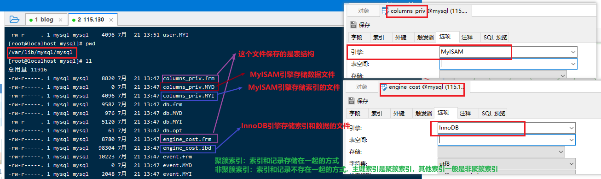1. 存储引擎

### ==1.1 概念相关（理解）==

> - MySQL 数据库使用不同的机制存取表文件, 包括存储方式、索引技巧、锁定水平等不同的功能。这些不同的技术以及配套的功能称为存储引擎。
>
> - Oracle、SqlServer 等数据库只有一种存储引擎。而 MySQL 针对不同的需求, 配置不同的存储引擎, 就会让数据库采取不同处理数据的方式和扩展功能。
>
> - MySQL中，存储引擎是表级别的。
>
> - MySQL 支持的存储引擎常见的有三种：InnoDB、MyISAM、MEMORY。
>
> - 特性对比
>   1. MyISAM 存储引擎：不支持事务和外键操作；针对只做“查询操作”的表，查询速度是最快的。
>   2. InnoDB 存储引擎：支持事务和外键操作，支持“增删改”并发，适用场景更加通用(MySQL 5.5版本后默认)
>   3. MEMORY 存储引擎：内存存储，速度快，不安全。相当于是一个大的Map集合，内存存储不安全，基本上不用。


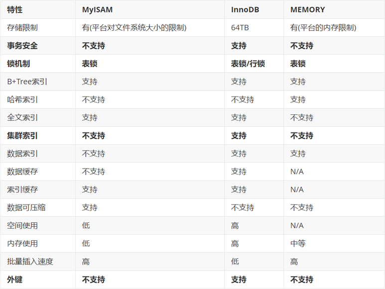


### 1.2 存储引擎的操作

一般不需要修改表的引擎，知道如何查询即可。

```sql
/*
	查询数据库支持的存储引擎
	SHOW ENGINES;
*/
-- 查询数据库支持的存储引擎
SHOW ENGINES;


/*
	查询某个数据库中所有数据表的存储引擎
	SHOW TABLE STATUS FROM 数据库名称;
*/
-- 查询db4数据库所有表的存储引擎
SHOW TABLE STATUS FROM db4;


/*
	查询某个数据库中某个表的存储引擎
	SHOW TABLE STATUS FROM 数据库名称 WHERE NAME = '数据表名称';
*/
-- 查看db4数据库中category表的存储引擎
SHOW TABLE STATUS FROM db4 WHERE NAME = 'category';


/*
	创建数据表指定存储引擎
	CREATE TABLE 表名(
	      列名,数据类型,
	      ...
	)ENGINE = 引擎名称;
*/
CREATE TABLE engine_test(
	id INT PRIMARY KEY AUTO_INCREMENT,
	NAME VARCHAR(10)
)ENGINE = MYISAM;

SHOW TABLE STATUS FROM db4;

/*
	修改数据表的存储引擎
	ALTER TABLE 表名 ENGINE = 引擎名称;
*/
-- 修改engine_test表的存储引擎为InnoDB
ALTER TABLE engine_test ENGINE = INNODB;

```


## ==2.索引(重点)==

数据存储的位置时在硬盘，查询的时候将硬盘上的数据加载到内存后再做操作

索引作用：解决大量数据频繁查询时的速度问题。

索引本质就是排序；排序完之后，可以快速高效的查询出我们想要的结果。

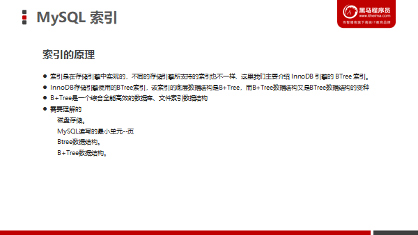

### 2.1 关于磁盘块（扇区）

想要达到更快的查询速度的效果

1. 尽可能少的读取扇区的个数
2. 尽可能较少寻道时间

以最终提高读取磁盘内容速度的目的

### 2.2 `MySQL`中页的概念

页是MySQL中最小的磁盘管理单元，页的默认大小是16kb。

```sql
show global variables like '%page%';  #InnoDB page size=16kB
```

MySQL中一次IO就可以理解成读取一个页的数据。

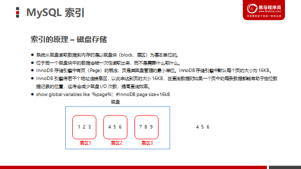


### 2.3 二叉树

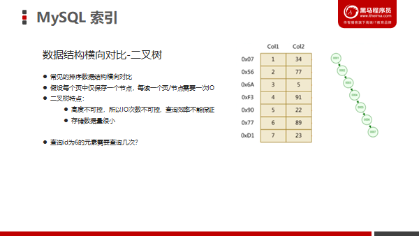

### 2.4红黑树

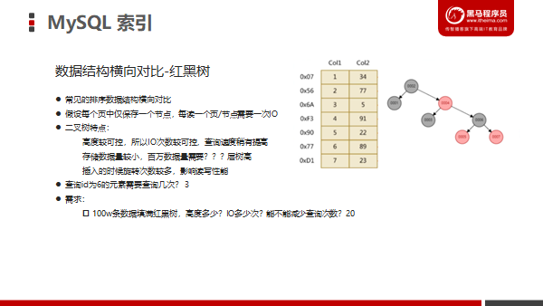

### 2.5 B-Tree

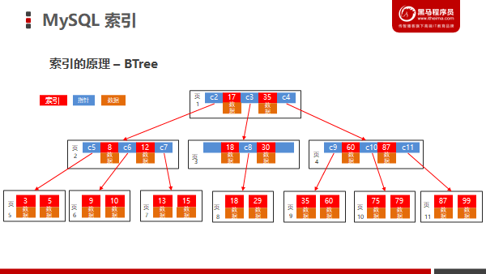

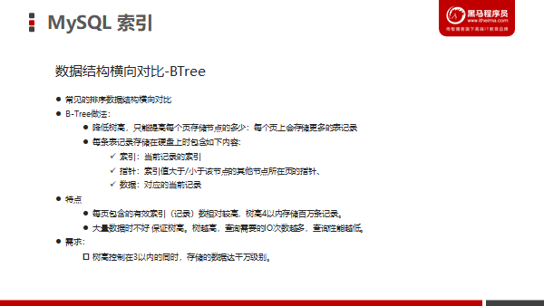


### 2.6 B+Tree(理解)

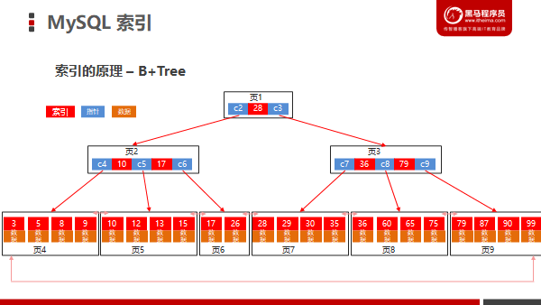

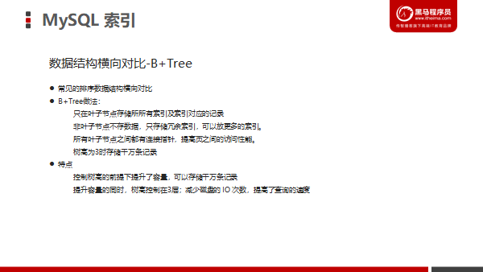


### 2.7 索引的添加和查询

准备数据

```sql
-- 创建db9数据库
CREATE DATABASE db9;

-- 使用db9数据库
USE db9;

-- 创建student表
CREATE TABLE student(
	id INT PRIMARY KEY AUTO_INCREMENT,
	NAME VARCHAR(10),
	age INT,
	score INT
);
-- 添加数据
INSERT INTO student VALUES (NULL,'张三',23,98),(NULL,'李四',24,95),
(NULL,'王五',25,96),(NULL,'赵六',26,94),(NULL,'周七',27,99);
```


创建和查看索引

```sql
/*
	创建索引
	CREATE [UNIQUE|FULLTEXT] INDEX 索引名称
	[USING 索引类型]  -- 默认是BTREE
	ON 表名(列名...);
*/
-- 为student表中的name列创建一个普通索引
CREATE INDEX idx_name ON student(NAME); 

-- 为student表中的age列创建一个唯一索引
CREATE UNIQUE INDEX idx_age ON student(age);


/*
	查询索引
	SHOW INDEX FROM 表名;
*/
-- 查询student表中的索引  (主键列自带主键索引)
SHOW INDEX FROM student;

    -- 查询db4数据库中的product表 (外键列自带外键索引)
SHOW INDEX FROM product;
```


```sql
/*
	ALTER添加索引
	-- 普通索引
	ALTER TABLE 表名 ADD INDEX 索引名称(列名);

	-- 组合索引
	ALTER TABLE 表名 ADD INDEX 索引名称(列名1,列名2,...);

	-- 主键索引
	ALTER TABLE 表名 ADD PRIMARY KEY(主键列名); 

	-- 外键索引(添加外键约束，就是外键索引)
	ALTER TABLE 表名 ADD CONSTRAINT 外键名 FOREIGN KEY (本表外键列名) REFERENCES 主表名(主键列名);

	-- 唯一索引
	ALTER TABLE 表名 ADD UNIQUE 索引名称(列名);

	-- 全文索引
	ALTER TABLE 表名 ADD FULLTEXT 索引名称(列名);
*/
-- 为student表中score列添加唯一索引
ALTER TABLE student ADD UNIQUE idx_score(score);


-- 查询student表的索引
SHOW INDEX FROM student;


/*
	删除索引
	DROP INDEX 索引名称 ON 表名;
*/
-- 删除idx_score索引
DROP INDEX idx_score ON student;
```


### 面试技术名词概念


……


**回表、索引覆盖**

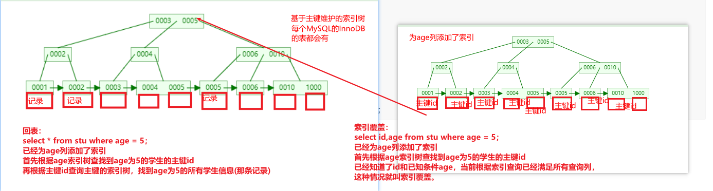

**(非)聚簇索引**


**最左匹配**

stu表根据name、age、score两个列建立联合索引

原理是：把`name,age,score`作为一个完整的字符串当做索引


```sql
ALTER TABLE student ADD INDEX idx_nas(`NAME`,age,score);

DROP INDEX idx_nas ON student;

DESC student;

-- 查看索引
SHOW INDEX FROM student;

-- EXPLAIN显示当前查询是否使用索引
-- 使用索引的情况
EXPLAIN select * from student where name ='xxx';
EXPLAIN select * from student where name ='xxx' AND age=11;
EXPLAIN select * from student where name ='xxx' AND age=11 AND score = 80;

EXPLAIN select * from student where  score = 80 AND name ='xxx' AND age=11;


-- 不使用索引的情况
EXPLAIN select * from student where age=11 AND score = 80;
EXPLAIN select * from student where score = 80;
EXPLAIN select * from student where age=11;

-- 不完全使用索引的情况
EXPLAIN select * from student where name ='xxx' AND score = 80;
EXPLAIN select * from student where name ='xxx' AND age>11 AND score = 80;

```


### 索引的优化

1. 不要为表中所有列建立索引，一个表中的索引不超过5个（索引是一种数据结构，首先是占据空间；其次维护这些数据结构是需要时间、磁盘IO性能的消耗。索引越多，增删的时候效率越慢，因为有太多的索引数需要维护）
2. 索引字段的选择，最佳候选列应当从 where 子句的条件中提取；
3. 不建议在数据库设计好之后就立即建立索引，运行一段时间之后根据执行查询SQL统计得出高频条件列；对查询频次较高，且数据量比较大的表建立索引。
4. 最左匹配原则
5. 索引列的值的长度要尽可能短，如果作为索引的列过程，可以通过`列名(长度的数字)`截取前面一段作为索引。要求第一要尽量短，第二要求要有区分度（80%以上）。
6. 其他基于B+Tree索引数据结构的优化


## 3. 锁(了解)

### 3.1 概念和分类

**概念：**锁机制类似多线程中的同步，作用就是可以保证数据的一致性和安全性。

- 按操作分类
  - 读锁：共享锁，读读共享。
  - 写锁：排他锁，读写/写写排他。
- 按粒度分
  - 表锁
  - 行锁
- 使用方式分
  - 悲观锁：借助于数据事务的特性来实现。
  - 乐观锁（CAS）：不是数据库本身的安全机制，而是我们通过自己的逻辑实现。

不同引擎对锁的支持不一样。

- InnoDB支持表锁和行锁
- MyISAM、MEMORY只支持表锁


### 3.2 InnoDB共享锁

读读共享，读写排他。

```sql
/*
	共享锁：数据可以被多个事务查询，但是不能修改
	创建锁的格式
		SELECT语句 LOCK IN SHARE MODE;
        一个事务中的增删改会自动加行级别的写锁
*/
-- 开启事务
START TRANSACTION;

-- 查询id为1数据，并加入共享锁
-- 给表的索引列加共享锁，此时是行级别，其他事务不允许对该行加写锁操作
SELECT * FROM student WHERE id=1 LOCK IN SHARE MODE;

-- 查询分数为99的数据，并加入共享锁
-- 给表的非索引列加共享锁，此时是表级别，其他事务不允许对该表加写锁操作
SELECT * FROM student WHERE score=99 LOCK IN SHARE MODE;

-- 提交事务
COMMIT;
```


```sql
-- 开启事务
START TRANSACTION;

-- 查询id为1数据,(普通查询没问题)
SELECT * FROM student WHERE id=1;

-- 查询id为1数据,也加入共享锁(共享锁和共享锁是兼容)
SELECT * FROM student WHERE id=1 LOCK IN SHARE MODE;

-- 修改id为1数据，姓名改成张三三(修改失败。会出现锁的情况。只有窗口1提交事务后才能修改成功)
UPDATE student SET NAME='张三三' WHERE id=1;

-- 修改id为2数据，姓名改成李四四(修改成功，InnoDB引擎默认加的是行锁)
UPDATE student SET NAME='李四四' WHERE id=2;

-- 修改id为3数据，姓名改成王五五(修改失败，InnoDB引擎如果不采用带索引的列加锁，加的就是表锁)
UPDATE student SET NAME='王五五' WHERE id=3;


-- 提交事务
COMMIT;
```


### 3.3 InnoDB排他锁

```sql
/*
	排他锁：加锁的数据，不能被其他事务加锁查询或修改
	排他锁创建格式
		SELECT 语句 FOR UPDATE;
*/
-- 开启事务
START TRANSACTION;

-- 查询id为1数据，并加入排他锁
-- 给表的索引列加排他锁，此时是行级别，其他事务不允许对该行做加锁操作（加锁查询和增删改都不行，不加锁的查询可以，不加锁的增删改不行）
SELECT * FROM student WHERE id=1 FOR UPDATE;

-- 给表的非索引列加排他锁，此时是表级别，其他事务不允许对该表做加锁操作（加锁查询和增删改都不行）
select *from student where score=99 for update;

-- 提交事务
COMMIT;
```


```sql
-- 开启事务
START TRANSACTION;

-- 查询id为1数据(普通查询没问题)
SELECT * FROM student WHERE id=1;

-- 查询id为1数据,并加入共享锁(排他锁和共享锁是不兼容的)
SELECT * FROM student WHERE id=1 LOCK IN SHARE MODE;

-- 查询id为1数据，并加入排他锁(排他锁和排他锁是不兼容的)
SELECT * FROM student WHERE id=1 FOR UPDATE;

-- 修改id为1数据，将姓名改成张三(修改失败，会出现锁的情况。只有窗口1提交事务后才能修改成功)
UPDATE student SET NAME='张三' WHERE id=1;

-- 提交事务
COMMIT;
```


### 3.4 MYISAM读锁

明确两个点

1. MyISAM引擎的表只有表锁，没有行锁。
2. MyISAM引擎的表不支持事务


```sql
/*
	读锁：所有连接只能读取数据，不能修改
	加锁
		LOCK TABLE 表名 READ;

	解锁
		UNLOCK TABLES;
*/
-- 为product表添加读锁
-- 给表加个表级别的读锁；所有会话（包括当前会话）都只能读，不能增删改
LOCK TABLE product READ;

-- 查询id为1数据
SELECT * FROM product WHERE id=1;

-- 修改id为1数据，将金额修改4999
UPDATE product SET price = 4999 WHERE id=1;

-- 解锁
UNLOCK TABLES;
```


```sql
-- 查询id为1数据
SELECT * FROM product WHERE id=1;

-- 修改id为1数据，将金额改成5999(修改失败，只有窗口1解锁后才能修改成功)
UPDATE product SET price=5999 WHERE id=1;
```


### 3.5 MyISAM写锁

```sql
/*
	写锁：其他连接不能查询和修改数据
	加锁
		LOCK TABLE 表名 WRITE;

	解锁
		UNLOCK TABLES;
*/
-- 为product表添加写锁
-- 给表加个表级别的写锁；当前会话可以执行任何操作，其他会话不能执行任何操作
LOCK TABLE product WRITE;

-- 查询
SELECT * FROM product;

-- 修改
UPDATE product SET price=1999 WHERE id=2;

-- 解锁
UNLOCK TABLES;
```


```sql
-- 查询(查询失败，只有窗口1解锁后才能查询成功)
SELECT * FROM product;

-- 修改(修改失败，只有窗口1解锁后才能修改成功)
UPDATE product SET price=2999 WHERE id=2;
```


### 3.6 悲观锁和乐观锁

```sql
/*
	悲观锁
		依赖于mysql本身的锁机制（事务管理机制），之前演示的各种锁都属于悲观锁。
		适用于修改频繁的场景
		
	乐观锁
		不是mysql原生支持的安全机制，不依赖于mysql本身的锁机制，而是我们根据需要自己完成安校验逻辑。
		本质上是添加一个字段，用于版本或者标识。
		乐观锁适用查询较多的场景，不适用修改比较多的场景。

*/

-- 创建city表
CREATE TABLE city(
	id INT PRIMARY KEY AUTO_INCREMENT,  -- 城市id
	NAME VARCHAR(20),                   -- 城市名称
	VERSION INT                         -- 版本号
);

-- 添加数据
INSERT INTO city VALUES (NULL,'北京',1),(NULL,'上海',1),(NULL,'广州',1),(NULL,'深圳',1);


-- 将北京修改为北京市
-- 1.将北京的版本号读取出来
SELECT VERSION FROM city WHERE NAME='北京';   -- 1
-- 2.修改北京为北京市，版本号+1.并对比版本号是否相同
UPDATE city SET NAME='北京市',VERSION=VERSION+1 WHERE NAME='北京' AND VERSION=1;

```

