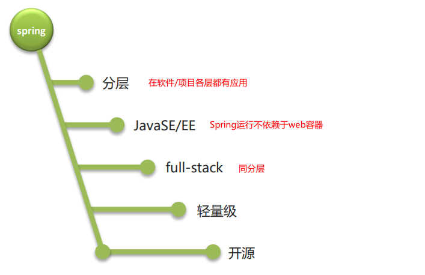
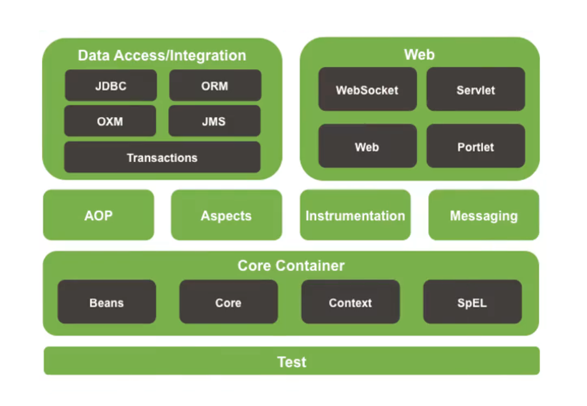

## 1. 概念相关

### 框架的学习思路

1. 了解框架的作用
2. 会用框架
   - 有哪些配置（重点、难点）
   - 少量API
   - 懂：学习其中原理

- 咬牙坚持配的多了；自然就会了，记不住（live template）（笔记）


### 学习安排

SSM

- S - Spring  -  每一层
- S - SpringMVC  -  WEB
- M - Mybatis    -   DAO


Spring

- 4天课 IoC  AOP 两大核心思想
- 2天 IoC
- 2天AOP
- 源码分析


SpringMVC

- 3天
- 融合了所有web核心的技术点


### Spring概念

- Spring是分层的JavaSE/EE应用 full-stack轻量级开源框架


- Spring之父 Rod Johnson
  - EJB ` Enterprise Java Bean`，sun公司提出来的大型web项目的架构
  - *Expert* One-on-One J2EE Design and Development   2002年  手把手教你怎么使用EJB开发大型web项目
  - Expert one-on-one J2EE Development without EJB  2004 手把手教你怎么不使用EJB开发大型web项目  （Spring的原型）
  - 官网：https://spring.io/projects
  - 课堂版本5.x


### Spring架构




### Spring优势

- 方便解耦，简化开发
- 方便集成各种优秀框架（不排斥、慢慢整合）
- AOP（面向切面编程）编程的支持
- 声明式事务的支持
- Java源码是经典学习范例


- 方便程序的测试（Spring整合junit）

  

### Spring两大核心思想

- IoC：Inverse of Control  控制反转
- AOP：Aspect Oriented Programming  面向切面编程


### IoC

- 内聚耦合

  内聚：

  耦合：


- Spring演化过程

  基于接口编程：service和dao之间高度耦合

  基于工厂：解除service和dao之间的耦合，但是带来的工厂和dao的耦合

  工厂+配置文件：解除了耦合，留下配置文件和dao/工厂耦合，这种耦合是我们期望的一种耦合方式


- IoC 控制反转

  把对象的创建权从程序员自己new反转到了Spring容器创建并提供


## 2.  Spring入门案例

#### 2.0 准备工作

新建模块/导入模块，配置私服

```xml
<!-- 为当前模块配置私服 -->
<repositories>
    <repository>
        <!-- 依赖仓库id，不可重复。repositories可以配置多个仓库，如果ID重复后面配置会覆盖之前的配置 -->
        <id>dependencies_Repositories</id>
        <!-- 私服仓库地址，即nexus仓库组的地址 -->
        <url>http://192.168.14.240:8081/repository/maven-public/</url>

        <!-- 是否下载releases构件 -->
        <releases>
            <enabled>true</enabled>
        </releases>

        <!-- 是否下载snapshots构件 -->
        <snapshots>
            <enabled>true</enabled>
        </snapshots>
    </repository>
</repositories>
<!-- 配置插件从私服下载 -->
<pluginRepositories>
    <pluginRepository>
        <id>plugins_Repositories</id>
        <url>http://192.168.14.240:8081/repository/maven-public/</url>
        <!-- 是否下载release版本构件 -->
        <releases>
            <enabled>true</enabled>
        </releases>
        <!-- 是否下载snapshots版本构件 -->
        <snapshots>
            <enabled>true</enabled>
        </snapshots>
    </pluginRepository>
</pluginRepositories>
```


#### 2.1 配置依赖坐标

```xml
<dependencies>
    <!--
        配置Spring的依赖坐标
        会根据依赖传传递自动导入其依赖的其他坐标
     -->
    <dependency>
        <groupId>org.springframework</groupId>
        <artifactId>spring-context</artifactId>
        <version>5.1.9.RELEASE</version>
    </dependency>
</dependencies>
```


#### 2.2 编写service/dao实现类和接口，service实现类中main方法测试


#### 2.3  新建Spring的配置文件并配置

`resources 右键  选择 new--》xml configration file --》Spring config（前提是Spring的依赖已经成功导入）`

```xml
<?xml version="1.0" encoding="UTF-8"?>
<beans xmlns="http://www.springframework.org/schema/beans"
       xmlns:xsi="http://www.w3.org/2001/XMLSchema-instance"
       xsi:schemaLocation="http://www.springframework.org/schema/beans http://www.springframework.org/schema/beans/spring-beans.xsd">

    <!-- 把Bean装配进Spring容器
        id 唯一标识，任意起名，但是尽量使用提示的名字
        class  全限定类名（用于反射创建对象）
     -->
    <bean class="com.itheima.dao.impl.UserDaoImpl" id="userDao"/>
</beans>
```


#### 2.4 创建Spring容器对象并获取bean对象

```java
/**
 * @Author Vsunks.v
 * @Date 2020/10/24 9:52
 * @Blog blog.sunxiaowei.net
 * @Description: 测试Spring容器创建和获取对象
 */
public class UserServiceImpl {

    public static void main(String[] args) {

        // 创建容器对象，并加载配置文件
        ApplicationContext app = new ClassPathXmlApplicationContext("classpath:beans.xml");

        // 从容器对象中获取bean对象
        UserDao userDao = (UserDao) app.getBean("userDao");

        // 使用获取的bean对象
        List<User> allUser = userDao.getAllUser();
    }
}
```


## 3. Spring配置-Bean标签

#### ==3.1 id&class属性==

id：唯一标识，同一个Spring容器中不允许重复

class：全限定类名，用于反射创建对象

XML配置

```xml
<?xml version="1.0" encoding="UTF-8"?>
<beans xmlns="http://www.springframework.org/schema/beans"
       xmlns:xsi="http://www.w3.org/2001/XMLSchema-instance"
       xsi:schemaLocation="http://www.springframework.org/schema/beans http://www.springframework.org/schema/beans/spring-beans.xsd">

    <bean class="com.itheima.dao.impl.UserDaoImpl" id="userDao"/>

</beans>
```


测试代码 

```java

```


#### 3.2 name属性(了解)

XML配置

```xml

```


测试代码

```java

```


#### ==3.3 scope(重要但不需要配置)==

控制Spring容器中的bean是单例还是多例的，默认单例，也是推荐的配置。

XML配置`beans-scope.xml`

```xml
<bean class="com.itheima.domain.User" id="user2" scope="singleton"/>
<bean class="com.itheima.domain.User" id="user1" scope="singleton"/>
```


测试代码

```java
// 需求1：测试单例和多例的Bean分别在什么时候创建，请在beans_scope.xml配置并完成测试
// Spring会在创建Spring容器的时候创建所有单例的Bean
@Test
public void test01() {
    app = new ClassPathXmlApplicationContext("beans-scope.xml");
    User user1 = (User) app.getBean("user1");
    User user3 = (User) app.getBean("user1");
    User user2 = (User) app.getBean("user2");
	System.out.println(user1 == user3);
    System.out.println(user1 == user2);

    Object book = app.getBean("book");
    Object book2 = app.getBean("book");
    System.out.println("book = " + book);
    System.out.println("book2 = " + book2);


}
```


#### 3.4 lazy-init

==思想重要，配置不重要==

结论：Spring会在初始化Spring容器的时候创建所有非懒加载的单例Bean

XML配置`beans-lazy.xml`

```xml
<bean class="com.itheima.domain.User" id="user" scope="singleton" lazy-init="true"/>
```


测试代码

```java
// 需求2：单例Bean能不能在我们获取使用的时候再创建？如果可以请在beans_lazy.xml文件中配置并完成测试
// Spring会在初始化Spring容器的时候创建所有非懒加载的单例Bean
@Test
public void test02() {
    app = new ClassPathXmlApplicationContext("beans-lazy.xml");

    User user = (User) app.getBean("user");
    User user1 = (User) app.getBean("user");
}
```


#### 3.5 depends-on(了解)

XML配置`beans-order.xml`

```xml
<!-- 把 user  book car 装配进Spring容器
    1. 默认情况下，Bean标签的配置顺序就是实例化顺序
    2. 通过配置depends-on属性，调整顺序；会先实例化属性中的bean，再实例化当前bean

    注意：
        这里仅仅是调整了bean的实例化顺序，无他。
 -->

<bean class="com.itheima.domain.Car" id="car" depends-on="user,book"/>

<bean class="com.itheima.domain.Book" id="book"/>

<bean class="com.itheima.domain.User" id="user"/>
```


测试代码

```java
// 需求3：请按照User、Book、Car的顺序实例化三个Bean，请在beans-order.xml中配置并完成测试
@Test
public void test03() {
    app = new ClassPathXmlApplicationContext("beans-order.xml");
}
```


其他代码

```java
public class User {

    public User(){
        System.out.println("User创建成功……");
    }
}
public class Book {
    public Book() {
        System.out.println("Book创建成功……");
    }
}
public class Car {
    public Car() {
        System.out.println("汽车创建成功……");
    }
}
```


#### 3.6  init-method&destroy-mehtod(理解)

配置bean对象初始化的方法和销毁的方法

注意：

1. 提前准备好两个方法，方法名任意 xxx  yyy

   ```xml
   <bean id="userDao" class="com.itheima.dao.UserDao" init-method="xxx" destroy-method="yyy">
   ```

2. 属性值不用带小括号

3. 多例bean的生命周期不归Spring容器管理


#### 3.7 factory-bean& factory-method

用于指定工厂bean或者工厂中的创建对象的方法


**工厂创建对象使用场景**：

当某些对象的创建过程非常复杂（耗时、内存、性能）的时候，优先使用工厂的方式。


#### 3.8 对象的创建方式

**Java中**

```java
public void test01(){

    // 1. 直接new 创建对象
    User user = new User();
    System.out.println("user = " + user);

    // 2. 通过工厂实例获取一个car对象
    CarFactory carFactory = new CarFactory();
    Car car = carFactory.getCar();
    System.out.println("car = " + car);

    Car car1 = carFactory.getCar();
    System.out.println("car1 = " + car1);


    // 3. 通过工厂静态方法获取一个car对象
    Car car2 = CarFactoryStatic.getCar();
    System.out.println("car2 = " + car2);

    Car car3 = CarFactoryStatic.getCar();
    System.out.println("car3 = " + car3);
}
```

**Spring中**

无参构造

```java
User user = new User();
```

对应Spring中配置

```xml
<bean id="user" class="com.itheima.daomian.User">
```


工厂实例

```java
CarFactory carFactory = new CarFactory();
Car car = carFactory.getCar();
```

对应Spring中配置

```xml
<!-- 把CarFactory装配进Spring容器，创建CarFactory对象 --> 
<bean id="carFactory" class = "com.itheima.facotry.CarFactory"/>
<!-- 通过CarFactory对象，获取car对象 --> 
<bean id="car" factory-bean="carFactory" factory-method="getCar">
```


工厂静态

```java
Car car = carFactory.getCar();
```

对应Spring中配置

```xml
<!-- 通过CarFactory的静态方法，获取car对象 --> 
<bean id="car" class = "com.itheima.facotry.CarFactory" factory-method="getCar">
```


## 4. 依赖注入

### 4.1 概念

依赖：在A类中用到了B类，就说A依赖B；

依赖注入：Spring会把B类对象自动注入到A类中B类型的属性上，这就是依赖注入。

依赖注入可以理解成IoC的一种应用场景，反转的是对象间`依赖关系维护`。

### 4.2 IoC和DI的关系(面试题)

IoC是一种思想（规范），可以把对象的创建权、对象间依赖关系的维护权等从程序员手中，反转到了Spring容器中；

DI依赖注入，只是IoC在某个方面的一个具体实现，在 依赖关系维护 方面的一个实现。


### 4.3 注入方式

本质上就是为某个类的成员变量赋值的方式：setter/有参构造


### ==4.4 Setter方式注入==

1. 保证两个bean都已经装配到Spring容器

   ```xml
   <bean id="userDao" class="com.itheima.dao.impl.UserDao"/>
   <bean id="userService" class="com.itheima.dao.impl.UserServiceImpl"/>
   ```

2. 在UserServiceImpl类中添加UserDao的属性并提供setter

   ```java
   class UserServiceImpl{
       private UserDao xxx;
       
       // 属性指的是通过getter/setter方法名截取得到的，与成员变量名无关
       public void setUserDao(UserDao userDao){
           this.xxx = userDao;
       }
   }
   
   ```

3. 通过`<property>`子标签完成注入

   ```xml
   <bean id="userDao" class="com.itheima.dao.impl.UserDao"/>
   <bean id="userService" class="com.itheima.dao.impl.UserServiceImpl">
       <!--  name属性名，通过getter/getter截得
    		  ref 当前Spring容器中已经存在的bean的id值
   	-->
   	<property name="userDao" ref=“userDao”/>
       <!-- 注入普通类型（基本类型 + String）  不是ref，而是使用value；
   		都要有有settter
   	-->
   </bean>
   
   ```

   

### 4.5 p标签注入(本质是property)

需要导入p命名空间，写完`p: + Alter&Enter`

```xml
 <bean class="com.itheima.service.impl.UserServiceImpl" id="userService" 
       p:userDao-ref="userDao" />

```


### 4.6 构造方法注入(了解)

```java
public class UserServiceImpl implements UserService {

    private UserDao userDao;
    private int num;
    private String version;

    public UserServiceImpl(UserDao userDao, int num, String version){
        this.userDao = userDao;
        this.num = num;
        this.version = version;
    }
}

```


如果要使用构造器注入，建议使用name+ref/value，index/type不要用

```xml
<bean id="userService" class="com.itheima.service.impl.UserServiceImpl">
    &lt;!&ndash;使用构造方法进行注入，需要保障注入的属性与bean中定义的属性一致&ndash;&gt;
    &lt;!&ndash;一致指顺序一致或类型一致或使用index解决该问题&ndash;&gt;
    <constructor-arg name="userDao" ref="userDao"/>
    <constructor-arg name="num" value="666666"/>
    <constructor-arg name="version" value="itcast"/>
</bean>

```


#### 4.7 C标签注入(本质是构造器注入)(了解)

<font sytle="color: red">需要</font>导入c命名空间，写完`c: + Alter&Enter`

```xml
<bean id="userService" class="com.itheima.service.impl.UserServiceImpl"
      c:userDao-ref="userDao" c:num="666" c:version="itcast">

```


### 4.8 集合注入(了解)

```xml
<bean class="com.itheima.domain.Book" id="book1">
    <property name="bookName" value="Java编程思想"/>
</bean>


<bean class="com.itheima.domain.Book" id="book2">
    <property name="bookName" value="新Java编程思想"/>
</bean>

<bean id="birth" class="java.util.Date"/>

<bean id="bmw" class="com.itheima.domain.Car">
    <property name="band" value="BMW"/>
</bean>


<!--
    单列集合  list  set  array
        配置通用  ，建议使用list
    双列集合  map properties
        配置通用 ，建议使用Map


-->

<bean class="com.itheima.domain.User" id="user" >
    <property name="username" value="张三"/>
    <property name="age" value="28"/>
    <!--<property name="birthday" ref="birth"/>-->
    <property name="birthday"  >
        <bean class="java.util.Date" />
    </property>
    <property name="car" ref="bmw"/>

    <!-- 书单 -->
    <property name="bookList">
        <list>
            <ref bean="book1"></ref>
            <bean class="com.itheima.domain.Book" >
                <property name="bookName" value="Java从入门到精通"/>
            </bean>
            <bean class="com.itheima.domain.Book"
                  p:bookName="Effective Java"/>
            <bean class="com.itheima.domain.Book" p:bookName="深入理解Java虚拟机"/>
            <bean class="com.itheima.domain.Book" p:bookName="颈椎病诊疗与自我康复"/>
        </list>
    </property>
    <!-- 昵称 -->
    <property name="nikeNameSet">
        <list>
            <value>程序员</value>
            <value>Programmer</value>
            <value>软件工程师</value>
            <value>码农</value>
            <value>IT民工</value>
            <value>修电脑的</value>
        </list>
    </property>

    <!-- 书单2-->
    <property name="shelfMap">
        <props>
            <prop key="111">2222</prop>
        </props>
    </property>

    <!--书单3-->
    <property name="bookProp">
        <map>
            <entry key="技术" value="程序员的自我修养"/>
            <entry key="生活" value="认识身体"/>
            <entry key="思维" value="刻意练习"/>
            <entry key="理财" value="从零开始学炒股"/>
            <entry key="思维" value="刻意练习"/>
            <entry key="娱乐" value="别做正常的傻瓜"/>
        </map>
    </property>
</bean>


```


### 4.9 SpEL

`Spring Expression Language`

简单，但是功能强大

```xml
<?xml version="1.0" encoding="UTF-8"?>
<beans xmlns="http://www.springframework.org/schema/beans"
       xmlns:xsi="http://www.w3.org/2001/XMLSchema-instance"
       xmlns:p="http://www.springframework.org/schema/p"
       xsi:schemaLocation="http://www.springframework.org/schema/beans http://www.springframework.org/schema/beans/spring-beans.xsd">

    <bean class="com.itheima.domain.Car" id="car" p:color="红">
        <property name="band" value="BMW"></property>
    </bean>
    <bean class="com.itheima.domain.User" id="user1" p:age="18"></bean>


    <!--
    [SpEL] Spring Expression Language
        Spring中的支持运行时查询和操作对象图的强大的表达式语言，语法类似于el。

            与EL类似，但是用法不同
            EL   是从域中取值  ${}
            SpEL 是从Spring容器中取值   #{}

        SpEl可以用在
            1. 配置文件中
            2. @Value("#{}")
            //3. 用在代码中（需要解析器）

        在SpEL可以操作内容
            字面值常量、
            引用其他bean、
            引用其他bean的某个属性值、
            调用非静态方法#{对象.非静态方法(参数列表)}
            调用静态方法#{T(全类名).静态方法(参数列表)}
            使用运算符
    -->
<!--
    <bean class="java.util.Date" id="date"/>
-->

    <bean class="com.itheima.domain.User" id="user">
        <property name="age" value="#{18-1}"/>
        <property name="car" value="#{car}"/>
        <property name="birthday" value="#{new java.util.Date()}"/>
        <property name="userId" value="#{T(java.util.UUID).randomUUID().toString()}"/>

    </bean>
</beans>

```


## 5. 引入properties文件

### 5.1 创建properties文件 `jdbc.properties`

```properties
jdbc.username=root
pwd=123321

```


### 5.2 `beans.xml`文件引入 `jdbc.properties`文件

```xml
<!-- 在类路径下加载指定名称的properties配置文件 -->
<context:property-placeholder location="classpath:data.properties"/>
<!-- 在类路径下加载所有的properties配置文件 -->
<context:property-placeholder location="classpath:*.properties"/>
<!-- 在类路径+jar包中(整个项目下)加载所有的properties配置文件
    统配会造成效率降低，速度变慢
 -->
<context:property-placeholder location="classpath*:*.properties"/>

<!--
    ${} 所有的框架都支持这个种写法，从当前容器对象中根据key获取值
    #{}  SpELl********

    Spring容器会把当前系统的内置变量整合进自己的容器 username=当前系统的用户名
    ${username} 会获取当前系统的用户名
 -->
<bean class="com.itheima.dao.impl.UserDaoImpl" id="userDao">
    <property name="userName" value="${jdbc.username}"/>
    <property name="password" value="${pwd}"/>
</bean>

```


### 5.3 代码测试

```java
ApplicationContext ctx = new ClassPathXmlApplicationContext("beans.xml");
UserDao userDao = (UserDao) ctx.getBean("userDao");
userDao.save();

```


### 6. 引入xml格式的Spring文件

配置文件拆分

`applicationContext.xml`

```xml
    <!--
        所有的配置都写在一个配置文件中，会造成该文件很臃肿，不易管理。
        所以可以把配置文件拆分，然后再主的配置文件中引入其他的Spring配置文件
        分层配置
            dao
            service
            web

        分模块配置
            user
            book
            order

        在主的配置文件中通过import标签的resource属性，引入其他的分配置文件

        或者在创建Spring容器对象的时候，一次性指定多个配置文件（此时没有主配置文件的概念）

    -->
<!--    <import resource="classpath:applicationContext-user.xml"/>
    <import resource="classpath:applicationContext-book.xml"/>
    <import resource="classpath:applicationContext-book2.xml"/>-->

    <bean class="com.itheima.dao.impl.UserDaoImpl" id="userDao">
        <property name="userName" value="${jdbc.username}"/>
        <property name="password" value="${pwd}"/>
    </bean>

```


`applicationContext-user.xml`

```xml
<context:property-placeholder location="classpath*:*.properties"/>

```


测试类

```java
public class UserApp {
    public static void main(String[] args) {
        //ApplicationContext ctx = new ClassPathXmlApplicationContext("applicationContext.xml");
        ApplicationContext ctx = new ClassPathXmlApplicationContext("applicationContext-user.xml","applicationContext.xml");
        UserDao userDao = (UserDao) ctx.getBean("userDao");
        userDao.save();
    }
}

```


## 6. ApplicationContext体系

-BeanFactory

--ApplicationContext

----ClassPathXmlApplicationContext   类路径

----FileSystemXmlApplicationContext  文件系统


---AnnotationConfigApplicationContext  注解


BeanFactory  ApplicationContext区别

- 懒加载
- BeanFactory自带懒加载效果，在使用到对象时才创建
- ApplicationContext在获取容器对象时即创建


## 7. Spring整合Mybatis

### 7.1 导入依赖坐标

```xml
<!-- mybatis整合Spring的依赖 -->
<dependency>
    <groupId>org.mybatis</groupId>
    <artifactId>mybatis-spring</artifactId>
    <version>1.3.0</version>
</dependency>

<!-- mysql 数据库驱动 -->
<dependency>
    <groupId>mysql</groupId>
    <artifactId>mysql-connector-java</artifactId>
    <version>5.1.47</version>
</dependency>


<!-- druid数据源 -->
<dependency>
    <groupId>com.alibaba</groupId>
    <artifactId>druid</artifactId>
    <version>1.1.16</version>
</dependency>


<!-- spring-jdbc -->
<dependency>
    <groupId>org.springframework</groupId>
    <artifactId>spring-jdbc</artifactId>
    <version>5.1.9.RELEASE</version>
</dependency>
<dependency>
    <groupId>org.springframework</groupId>
    <artifactId>spring-context</artifactId>
    <version>5.1.9.RELEASE</version>
</dependency>


<!-- mybatis -->
<dependency>
    <groupId>org.mybatis</groupId>
    <artifactId>mybatis</artifactId>
    <version>3.5.3</version>
</dependency>
```


### 7.2 在Spring配置文件中整合Mybatis核心配置文件

```xml
<!--spring整合mybatis后控制的创建连接用的对象
    注入了数据源和别名
-->
<bean class="org.mybatis.spring.SqlSessionFactoryBean">
    <property name="dataSource" ref="dataSource"/>
    <property name="typeAliasesPackage" value="com.itheima.domain"/>
</bean>

<!--加载mybatis映射配置的扫描，将其作为spring的bean进行管理
    引入了映射配置文件/接口
-->
<bean class="org.mybatis.spring.mapper.MapperScannerConfigurer">
    <property name="basePackage" value="com.itheima.dao"/>
</bean>
```


## 单例

### Java中的单例

在整个项目中，某个类的实例最多只能有一个，这种情况被称之为单例。

`Student.java`

```java
/**
 * @Author Vsunks.v
 * @Date 2020/10/24 10:30
 * @Blog blog.sunxiaowei.net
 * @Description:
 */
public class Student {
    // 自己创建对象，能有效控制对象个数
    // 私有构造方法
    private Student(){}

    // 类加载时就准备好一个当前类的对象
    private static Student instance = new Student();


    // 提供的静态公共的访问方式
    public static Student getInstance(){
        return instance;
    }

}
```


#### 单例设计模式


### Spring 中的单例

整个Spring容器中，某个Bean的实例有且只能有一个。

```java
// 代码及配置见本文档3.3

```


**Java中类的单例、Spring中Bean的单例的区别**

| 项目   | 类的单例                                     | Spring中Bean的单例                                           |
| ------ | -------------------------------------------- | ------------------------------------------------------------ |
| 概念   | 同一个软件项目中，某个类的实例有且只能有一个 | 整个Spring容器中，某个Bean的实例有且只能有一个               |
| 范围   | 整个项目                                     | 项目中的Spring容器                                           |
| 注意点 | 一个类最多只能有一个实例                     | 一个Bean标签最多只能有一个实例。<br>但是多个Bean标签可以配置相同的class属性值，所以Spring中单例Bean对应的一个类可能有多个实例 |


​	