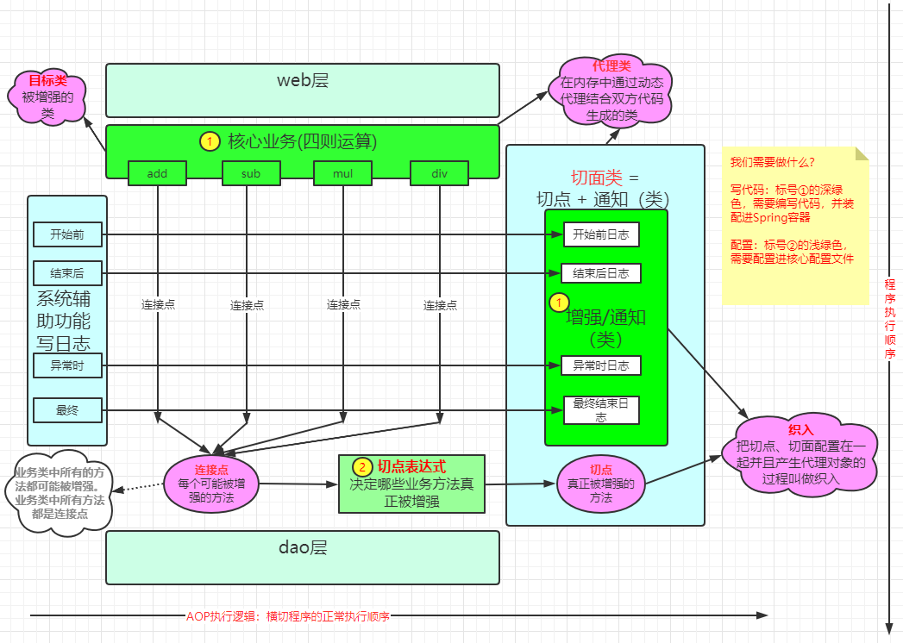
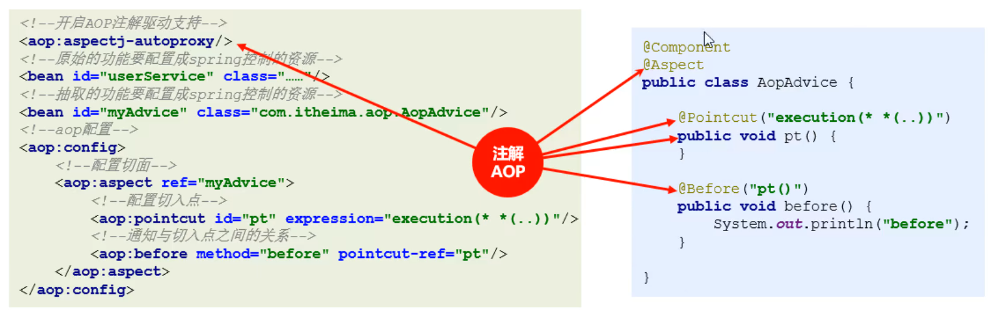
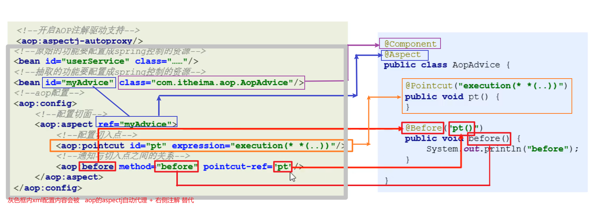
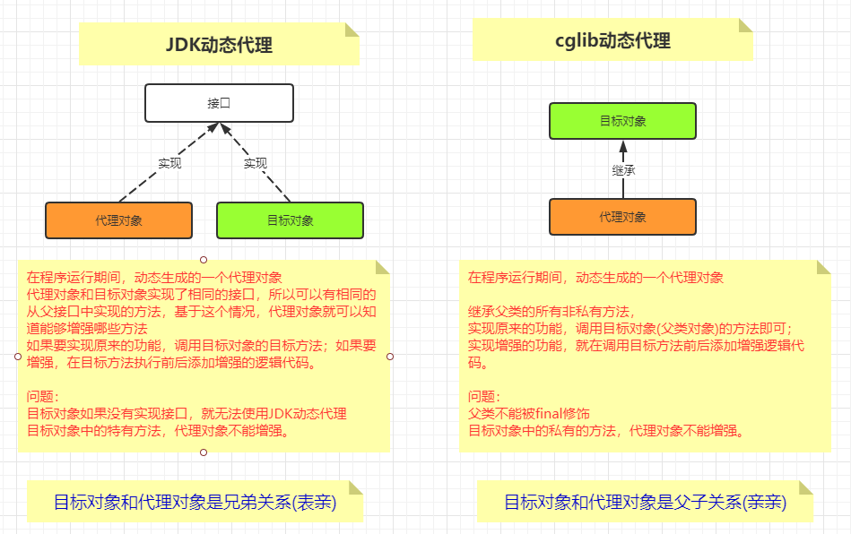

## 1. 引入案例(计算器记录日志)(理解)

**系统辅助功能**：记录日志

**系统核心业务功能**：加减乘除四则运算

### 1.1 实现方式1：直接耦合

直接在系统核心功能代码中编写系统辅助功能代码，

**缺点**：

1. 系统辅助功能代码严重入侵了系统核心业务功能代码
2. 记录日志代码重复冗余，复用性差


### 1.2 实现方式2：工具类

把日志抽取到日志工具类中，在系统核心功能代码中调用工具类中方法记录日志

**解决的问题**：

1. 提高了复用性

**缺点**：

1. 系统辅助功能代码严重入侵了系统核心业务功能代码


### 1.3 实现方式3：动态代理

使用动态代理完成记录日志的功能

**解决的问题**：

1. 提高了复用性
2. 解耦了系统辅助功能代码和核心业务代码

**缺点**：

1. 太难写
2. 如果目标对象没有实现任何接口，jdk动态代理就无能为力 了


**解决思路**

- 使用`AOP`
- 

**相关代码**

- 实现方式1代码`MyMathCalculatorWithLog.java`

  ```java
  public class MyMathCalculatorWithLog implements Calculator {
  
      @Override
      public int add(int i, int j) {
          System.out.println("【add】方法开始运行了，算式是【" + i + " + " + j + "】，时间：" + new Timestamp(System.currentTimeMillis()));
          int result = i + j;
          System.out.println("【add】方法计算结束了，结果是【" + result + "】，时间：" + new Timestamp(System.currentTimeMillis())+"\r\n");
          return result;
      }
  
      @Override
      public int sub(int i, int j) {
          System.out.println("【sub】方法开始运行了，算式是【" + i + " - " + j + "】，时间：" + new Timestamp(System.currentTimeMillis()));
          int result = i - j;
          System.out.println("【sub】方法计算结束了，结果是【" + result + "】，时间：" + new Timestamp(System.currentTimeMillis())+"\r\n");
          return result;
      }
  
      @Override
      public int mul(int i, int j) {
          System.out.println("【mul】方法开始运行了，算式是【" + i + " * " + j + "】，时间：" + new Timestamp(System.currentTimeMillis()));
          int result = i * j;
          System.out.println("【mul】方法计算结束了，结果是【" + result + "】，时间：" + new Timestamp(System.currentTimeMillis())+"\r\n");
          return result;
      }
  
      @Override
      public int div(int i, int j) {
  
          int result = i;
          try {
              System.out.println("【div】方法开始运行了，算式是【" + i + " ÷ " + j + "】，时间：" + new Timestamp(System.currentTimeMillis()));
              result = i / j;
              System.out.println("【div】方法计算结束了，结果是【" + result + "】，时间：" + new Timestamp(System.currentTimeMillis())+"\r\n");
          } catch (Exception e) {
              System.out.println("【div】方法出现异常了，异常信息是【" + e.getMessage() + "】，时间：" + new Timestamp(System.currentTimeMillis()));
          } finally {
              System.out.println("【div】方法结束了，不知道有没有计算成功，时间：" + new Timestamp(System.currentTimeMillis())+"\r\n");
          }
          return result;
      }
  }
  ```


- 实现方式2：日志记录功能抽取到工具类中

  工具类`logUtils.java`

  ```java
  /**
   * @Author Vsunks.v
   * @Blog blog.sunxiaowei.net
   * @Description: 记录日志的工具类
   */
  public class LogUtils {
  
  
  
      public static void logStart(String methodName, Object... args) {
          System.out.println("[" + methodName + "]方法开始计算了，参数是" + Arrays.asList(args) + "，时间：" + new Timestamp(System.currentTimeMillis()));
      }
  
      public static void logReturn(String methodName, Object result) {
          System.out.println("【" + methodName + "】方法计算结束了，结果是【" + result + "】，时间：" + new Timestamp(System.currentTimeMillis()) + "\r\n");
      }
  
      public static void logException(String methodName, Exception e) {
          System.out.println("【" + methodName + "】方法出现异常了，异常信息是" + e.getMessage() + "，时间：" + new Timestamp(System.currentTimeMillis()));
      }
  
      public static void logEnd(String methodName) {
          System.out.println("【" + methodName + "】方法结束了，不知道有没有计算成功，时间：" + new Timestamp(System.currentTimeMillis()) +
                  "\r\n");
      }
  }
  ```

  实现类：`MyMathCalculatorWithLogByUtils.java`

  ```java
  /**
   * @Author Vsunks.v
   * @Blog blog.sunxiaowei.net
   * @Description: 使用日志工具类记录日志的计算器实现类
   */
  public class MyMathCalculatorWithLogByUtils implements Calculator {
  
      @Override
      public int add(int i, int j) {
          LogUtils.logStart("add", i, j);
          int result = i + j;
          LogUtils.logReturn("add", result);
          return result;
      }
  
      @Override
      public int sub(int i, int j) {
          LogUtils.logStart("sub", i, j);
          int result = i - j;
          LogUtils.logReturn("sub", result);
          return result;
      }
  
      @Override
      public int mul(int i, int j) {
          LogUtils.logStart("mul", i, j);
          int result = i * j;
          LogUtils.logReturn("mul", result);
          return result;
      }
  
      @Override
      public int div(int i, int j) {
  
          int result = i;
          try {
              LogUtils.logStart("div", i, j);
              result = i / j;
              LogUtils.logReturn("div", result);
          } catch (Exception e) {
              LogUtils.logException("div", e);
          } finally {
              LogUtils.logEnd("div");
          }
          return result;
      }
  }
  ```

  


- 实现方式3：使用动态代理记录日志

  ```java
  /**
   * @Author Vsunks.v
   * @Date 2020/10/27 10:07
   * @Blog blog.sunxiaowei.net
   * @Description:
   */
  public class MyCalculatorProxyFactory {
  
      /*
          使用动态代理对目标对象进行增强
              1. 调用目标对象的目标方法，实现原有的基础功能
              2. 在调用目标方法前后，添加增强的逻辑
          Proxy.newProxyInstance()
  
  
          动态代理特点：
              目标对象中所有的目标方法都会被拦截并增强
  
       */
  
      public static Calculator getProxyInstance(Calculator target){
          return (Calculator) Proxy.newProxyInstance(
                  // 类加载器，使用目标对象的类加载器即可
                  target.getClass().getClassLoader(),
                  // 目标对象已经实现的所有接口的字节码对象数组
                  target.getClass().getInterfaces(),
                  // 调用处理器（重点） 目标方法的调用、增强逻辑都通过该对象实现
                  new InvocationHandler() {
                      /**
                       * 目标方法的调用、增强逻辑都通过该对象实现
                       * @param proxy     代理对象，我们不用，给系统用
                       * @param method    目标方法封装的对象
                       * @param args      目标方法的实参
                       * @return          目标方法的返回值，该值必须return出去，否则外界无法获取该值（在有时）
                       * @throws Throwable
                       */
                      @Override
                      public Object invoke(Object proxy, Method method, Object[] args) throws Throwable {
  
                          // 目标方法的调用
                          Object returnValue = null;
                          try {
                              System.out.println(method.getName() + "方法开始执行了，参数是：" + Arrays.toString(args));
                              //LogUtils.logStart(method.getName(), Arrays.toString(args));
                              returnValue = method.invoke(target, args);
  
                              System.out.println(method.getName() +"方法执行成功了，结果是：" + returnValue);
                          } catch (Exception e) {
                              System.out.println(method.getName() +"方法执行异常了，异常信息是：" + e.getMessage());
                              e.printStackTrace();
                          } finally {
                              System.out.println(method.getName() +"方法执行结束了，成功与否我不管");
                          }
  
  
                          // 该值必须return出去，否则外界无法获取该值（在有时）
                          return returnValue;
                      }
                  }
          );
      }
  }
  ```

  测试类：

  ```java
  /**
   * @Author Vsunks.v
   * @Blog blog.sunxiaowei.net
   * @Description: 动态代理记录日志效果测试类
   * main方法内分割线以上是使用目标对象计算，分割线以下是获取代理对象并计算；
   * 代理对象计算时有记录日志的功能
   */
  public class ProxyCalculatorlogTest {
  
      public static void main(String[] args) {
          Calculator calculator = new MyMathCalculator();
          System.out.println(calculator.add(1, 2));
          System.out.println(calculator.div(2, 1));
  
          System.out.println("---------------------------");
  
          // JDK动态代理 生成一个代理对象（实现了和目标对象/被代理对象一样的接口），使用代理对象调用方
          
          Calculator proxyInstance = MyCalculatorProxyFactory.getProxyInstance(calculator);
          //
          proxyInstance.add(1, 2);
          proxyInstance.div(1, 0);
      }
  }
  ```

  

## 2. AOP相关概念

### ==2.1 AOP概念&作用==

**AOP**是一种思想，面向切面编程


**作用**：在不修改源码的前提下，在程序运行过程中对方法进行增强。

解耦、方便维护、开发效率高、代码复用。


**底层**是动态代理，分为两种：

**JDK动态代理**，基于接口的代理，能对接口或者接口的实现类进行增强

**cglib动态代理**，基于父类的代理，该类不能被final修饰。


Spring底层会根据目标对象的特性判断选用其中一个，如果实现了接口，用JDK；否则使用cglib。我们也可以强制Spring使用cglib。

不管使用任何一种实现，都不需要我们写代码。**只需要配置即可**.


### 2.2 AOP优势

耦合低：分离业务代码和系统辅助代码，高内聚低耦合，易维护

复用强：系统辅助代码复用性更高

易拓展：插拔式组件设计，拓展简单


### ==2.3 核心名词概念==

<font color="red">**Target（目标对象）**</font>：被代理的目标对象

**Proxy （代理）**：增强后的对象，是在程序运行期间动态生成的。

JoinPoint（连接点）：有可能被拦截并增强的方法，目标对象中所有的方法都是连接点；

<font color="red">**Pointcut（切入点）**</font>：也叫切点，真正被拦截并且增强的方法；

<font color="red">**Advice（通知/ 增强）**</font>：就是增强方法/增强的内容；

**Aspect（切面）**：通知/增强 + 切点（概念比较模糊）

**Weaving（织入）**：把通知、切点配置在一起并最终运行产生代理对象的过程就是织入，是一个过程概念。




### 2.4 AOP的应用场景

- **日志记录处理**
- **事务管理**
- **权限校验**
- **信息/邮件发送**
- **性能监控优化**
- **……**


### ==2.5 实现`AOP`需要做的事情==

1. 编码。核心业务代码、系统辅助代码
2. 配置。切点表达式，装配Bean进入Spring容器


## ==3. AOP快速入门==


### 3.1 导入 AOP 相关依赖坐标

- 

  ```xml
  <properties>
      <!-- 明确maven使用jdk1.8编译该模块 -->
      <project.build.sourceEncoding>utf-8</project.build.sourceEncoding>
      <maven.compiler.source>1.8</maven.compiler.source>
      <maven.compiler.target>1.8</maven.compiler.target>
  
      <!-- 统一模块中依赖版本-->
      <spring.version>5.1.9.RELEASE</spring.version>
      <aspectj.version>1.9.4</aspectj.version>
      <junit.version>4.12</junit.version>
  </properties>
  
  
  
  <dependencies>
      <!--
          Spring-context依赖
          会依赖导入spring-aop
       -->
      <dependency>
          <groupId>org.springframework</groupId>
          <artifactId>spring-context</artifactId>
          <version>${spring.version}</version>
      </dependency>
      <!-- SpringAOP依赖aspectj -->
      <dependency>
          <groupId>org.aspectj</groupId>
          <artifactId>aspectjweaver</artifactId>
          <version>${aspectj.version}</version>
      </dependency>
  
      <!-- spring测试 -->
      <dependency>
          <groupId>org.springframework</groupId>
          <artifactId>spring-test</artifactId>
          <version>${spring.version}</version>
      </dependency>
  
      <dependency>
          <groupId>junit</groupId>
          <artifactId>junit</artifactId>
          <version>4.12</version>
      </dependency>
  </dependencies>
  ```

  


### 3.2编写目标接口和目标类

- 目标接口

  ```java
  package com.itheima.calc;
  /**
   * @Author Vsunks.v
   * @Blog blog.sunxiaowei.net
   * @Description: 计算器接口
   */
  public interface Calculator {
  	/**
  	 * 加
  	 */
  	public int add(int i, int j);
  
  	/**
  	 * 减
  	 */
  	public int sub(int i, int j);
  
  	/**
  	 * 乘
  	 */
  	public int mul(int i, int j);
  
  	/**
  	 * 除
  	 */
  	public int div(int i, int j);
  
  }
  ```

- 目标接口实现类

  ```java
  package com.itheima.calc;
  /**
   * @Author Vsunks.v
   * @Blog blog.sunxiaowei.net
   * @Description: 计算器接口实现类
   */
  public class MyMathCalculator implements Calculator{
  
  	@Override
  	public int add(int i, int j) {
  		int result = i + j;
  		return result;
  	}
  
  	@Override
  	public int sub(int i, int j) {
  		int result = i - j;
  		return result;
  
  	}
  
  	@Override
  	public int mul(int i, int j) {
  		int result = i * j;
  		return result;
  	}
  
  	@Override
  	public int div(int i, int j) {
  
  		int result = i / j;
  
  		return result;
  	}
  
  }
  ```

  

### 3. 3 编写 通知/增强 类

- 通知类

  ```java
  package com.itheima.advice;
  
  /**
   * @Author Vsunks.v
   * @Blog blog.sunxiaowei.net
   * @Description: 计算机的通知类
   */
  public class CalculatorAdvice {
  
      public  void logStart() {
          System.out.println("方法开始计算了xxxxx");
      }
  }
  ```

  

### 3.4 将目标类和切面(通知/增强)类的对象创建权交给 spring

- `beans.xml`

  ```xml
  <!-- 装配  目标calculator-->
  <bean class="com.itheima.calc.MyMathCalculator" id="myMathCalculator"/>
  
  
  <!-- 装配  通知advice -->
  <bean class="com.itheima.advice.CalculatorAdvice" id="advice"/>
  ```

  

### 3.5 在 beans.xml 中配置织入关系

- `beans.xml`

  ```xml
  <!--
  aspect oriented programming
  -->
  <!-- 配置织入 -->
  <aop:config >
      <!--
          配置切面
          切面 = 切点 + 通知
          通知引入  ref属性指向Sprig容器中已经存在的一个通知对象
       -->
      <aop:aspect ref="advice">
          <!-- 切点 -->
          <!--<aop:pointcut id="pt" expression="execution(* *..*(..))"/>-->
          <!-- 
  			配置前置通知
   			aop:xxxx	表示在什么时机增强，前后/最终/异常
  			method      当前这个时机，到底要如何增强，通知类中的某个通知方法
  			pointcut[-ref]	明确切点
  		-->
          <aop:before method="logStart" pointcut="execution(* *..*(..))"/>
      </aop:aspect>
  </aop:config>
  ```

  


### 3.6 测试代码

- `LogAOPTest.java`

  ```java
  /**
   * @Author Vsunks.v
   * @Blog blog.sunxiaowei.net
   * @Description: 测试类
   */
  @RunWith(SpringJUnit4ClassRunner.class)
  @ContextConfiguration("classpath:beans.xml")
  //@ContextConfiguration(classes = {SpringConfig.class})
  public class LogAOPTest {
  
  
      // 使用接口类型的引用接收
      @Autowired
      Calculator myMathCalculator;
  
      // 需求：使用springAOP为MyMathCalculator类的所有方法添加记录日志的功能
      // 只需要完成在方法开始前记录日志即可。
      @Test
      public void test01() {
          System.out.println("myMathCalculator.add(1, 2) = " + myMathCalculator.add(1, 2));
  
      }
  }
  ```

  

## ==4. AOP的XML配置==

### ==4.1 基本配置==

```xml
<!--
aspect oriented programming
-->
<!-- 配置织入(可以配置多组同时生效) -->
<aop:config >
    <!--
        配置切面  (可以配置多组同时生效) 
        切面 = 切点 + 通知
        通知引入  ref属性指向Sprig容器中已经存在的一个通知对象
     -->
    <aop:aspect ref="advice">
        <!-- 切点 -->
        <!--<aop:pointcut id="pt" expression="execution(* *..*(..))"/>-->
        <!-- 配置前置通知 -->
        <aop:before method="logStart" pointcut="+"/>
    </aop:aspect>
</aop:config>
```


### ==4.2 切点表示式==

- 明确哪些连接点最终成为切点

  ```xml
  <!-- 
  切点表达式：
      格式：关键字([访问权限修饰符] 返回值类型 包名.类名.方法名(参数类型列表) [异常类型])
      execution(int com.itheima.*.*(int, int))
      访问权限修饰符/异常类型 可以不写
      返回值类型、包名、类名、方法名、参数类型列表中可以使用* 统配代表任意
      从后往前依次确定方法、类、包
      .表示当前包下的类
      .. 表示当前包及其子包下的类
      参数类型列表可以使用..代表任意参数类型及个数
      多个切点表示式之间可以通过  &&  ||  !运算，共同产生效果
  -->
  
  
  切割特定某个方法： execution(public void com.itheima.service.UserServiceImpl.method())  
  	切割所有方法： execution(* *..*.*(..))
  
  其他：
  execution(* *(..))
  execution(* *..*(..))
  execution(* *..*.*(..))
  execution(public * *..*.*(..))
  execution(public int *..*.*(..))
  execution(public void *..*.*(..))
  execution(public void com..*.*(..))
  execution(public void com..service.*.*(..))
  execution(public void com.itheima.service.*.*(..))
  execution(public void com.itheima.service.User*.*(..))
  execution(public void com.itheima.service.*Service.*(..))
  execution(public void com.itheima.service.UserService.*(..))
  execution(public User com.itheima.service.UserService.find*(..))
  execution(public User com.itheima.service.UserService.*Id(..))
  execution(public User com.itheima.service.UserService.findById(..))
  execution(public User com.itheima.service.UserService.findById(int))
  execution(public User com.itheima.service.UserService.findById(int,int))
  execution(public User com.itheima.service.UserService.findById(int,*))
  execution(public User com.itheima.service.UserService.findById(*,int))
  execution(public User com.itheima.service.UserService.findById())
  execution(List com.itheima.service.*Service+.findAll(..))
  ```

  


- 切点表达式的分类

  根据切点表达式的定义位置分类

  ```xml
  <aop:config>
      <!--配置公共切入点-->
      <aop:pointcut id="pt1" expression="execution(* *(..))"/>
      <aop:aspect ref="myAdvice">
          <!--配置局部切入点-->
          <aop:pointcut id="pt2" expression="execution(* *(..))"/>
          <!--引用公共切入点-->
          <aop:before method="logAdvice" pointcut-ref="pt1"/>
          <!--引用局部切入点-->
          <aop:before method="logAdvice" pointcut-ref="pt2"/>
          <!--直接配置切入点-->
          <aop:before method="logAdvice" pointcut="execution(* *(..))"/>
      </aop:aspect>
  </aop:config>
  ```

  

- 切点表达式经验

- 

  > 细心，在配置修改、代码修改前后一定要反复确认检查
  >
  > 企业开发命名规范严格遵循规范文档进行
  > ⚫ 先为方法配置局部切入点
  > ⚫ 再抽取类中公共切入点
  > ⚫ 最后抽取全局切入点
  > ⚫ 代码走查过程中检测切入点是否存在越界性包含
  > ⚫ 代码走查过程中检测切入点是否存在非包含性进驻
  > ⚫ 设定AOP执行检测程序，在单元测试中监控通知被执行次数与预计次数是否匹配
  > ⚫ 设定完毕的切入点如果发生调整务必进行回归测试
  > （以上规则适用于XML配置格式）

  

  

### ==4.3通知分类==

- Spring原生支持的通知类型

  前置、后置(返回)、异常、~~引介~~、环绕、没有最终。


- Aspectj支持的通知类型

  前置、后置(返回)、异常、最终、环绕、~~引介~~。

  


- 各种通知的执行时机和顺序

  ```java
  // 四种基本类型的通知执行的时机
  try{
      // 前置通知   <aop:before method="xxx" pointcut-ref="yyy"/>
      // 目标方法
      // 后置通知  <aop:after-returning method="xxx" pointcut-ref="yyy"/>
  }catch(Exception e){
      // 异常通知  <aop:after-throwing method="xxx" pointcut-ref="yyy"/>
  }finally{
      // 最终通知  <aop:after method="xxx" pointcut-ref="yyy"/>
  }
  
  // 环绕通知一个打4个 <aop:around method="xxx" pointcut-ref="yyy"/>
  // 环绕通知的用法
  public Object around(ProceedingJoinPoint pjp) {
      Object ret = null;
      try {
          System.out.println("前置");
          //对原始方法的调用
          ret = pjp.proceed();
          System.out.println("后置" + ret);
  
      } catch (Throwable throwable) {
          System.out.println("异常" + throwable.getMessage());
      } finally {
          System.out.println("最终" + ret);
      }
      return ret;
  }
  ```

  

- 注意事项

  > 1. 环绕通知最强大，也最特殊：通知方法内部需要手动调用目标方法
  > 2. 手动调用目标方法时的返回值需要return，要求，环绕通知的方法**必须**声明返回值并且返回出去
  > 3. 手动调用目标方法，不能明确目标方法是否有异常，所以用一个最大号的异常来处理throwable


### 4.4 通知的执行顺序

- 基本通知，只有一组通知的顺序

  > 没有异常：前置、后置、最终<后面两个的顺序取决于这两者的配置顺序>）
  >
  > 有异常：前置、异常、最终<后面两个的顺序取决于这两者的配置顺序>>

- 环绕通知，，只有一组通知的顺序

  > 没有异常：前置、后置、最终
  >
  > 有异常：前置、异常、最终

- 多组通知的顺序

  > 配置的顺序即为执行顺序


### 4.5 通知中获取目标方法的方法名

**所有类型通知都可以获取方法名**

- 四种基本通知

  通知方法上，第一个形参写成`JoinPonit jp`，方法中使用该对象获取方法名

  ```java
  public void before(JoinPonit jp){
      // 获取方法名
      jp.getSignature().getName();
  }
  ```

  


- 环绕通知

  通知方法上，第一个形参写成`ProceedingJoinPonit pjp`，方法中使用该对象获取方法名

  ```java
  public void before(ProceedingJoinPonit pjp){
      // 获取方法名
      pjp.getSignature().getName();
  }
  ```

  

### 4.6 通知中获取目标方法的实参

**所有类型通知都可以获取实参**

- 四种基本通知

  通知方法上，第一个形参写成`JoinPonit jp`，方法中使用该对象获取方法名

  ```java
  public void before(JoinPonit jp){
      // 获取实参数据
      Object[]  args = jp.getArgs();
  }
  ```

  


- 环绕通知

  通知方法上，第一个形参写成`ProceedingJoinPonit pjp`，方法中使用该对象获取方法名

  ```java
  public void before(ProceedingJoinPonit pjp){
      // 获取实参数据
      Object[]  args = pjp.getArgs();
  }
  ```


- argsName的方式不推荐使用


### 4.7 通知中获取目标方法的返回值

- 可以获取目标方法返回值的通知类型：`环绕通知`、`后置通知`

- 后置通知

  通知方法上，添加一个形参`Object xxx`，方法中可以直接使用，`JoinPonit /ProceedingJoinPonit`必须是第一个参数

  ```java
  public void afterReturningxxx(JoinPonit jp, Object xxx){
      // 直接使用xxx
  }
  ```

  `<aop:after-returning>`上添加`returning`属性，值与通知方法形参名一致。

  ```xml
  <aop:after-returning method="afterReturningxxx" pointcut-ref="pt" returning="xxx"/>
  ```


​		调用目标方法时生成的返回值，就会自动赋值到了xxx上面，可以在通知方法中使用了。


- 环绕通知

  在环绕通知的方法内部直接获取并使用即可

  ```java
  // **********************
  // 返回值类型必须定义，而且建议使用Object
  public Object around(ProceedingJoinPoint pjp) {
          // 返回值和异常对象可以直接获取
          // 方法名和方法参数通过切点对象获取
      	//方法名
          pjp.getSignature().getName();
      	//方法参数
          pjp.getArgs();
  
          Object ret = null;
          try {
              System.out.println(pjp.getSignature().getName() + "的环绕前置" + Arrays.toString(pjp.getArgs()));
              // ************************
              //对原始方法的调用，这里可以直接获取返回值并使用
              // ********************
              ret = pjp.proceed();
              System.out.println("后置" + ret);
  
          } catch (Throwable throwable) {
              System.out.println("异常" + throwable.getMessage());
          } finally {
              System.out.println("最终" + ret);
          }
      	// ***************************************** 
      	// 目标方法调用生成的返回值一定要return出去 
          return ret;
      }
  ```

  

### 4.8 通知中获取目标方法的异常对象

- 可以获取目标方法异常对象的通知类型：`环绕通知`、`异常通知`

- 后置通知

  通知方法上，添加一个形参`Throwable xxx`，方法中可以直接使用，`JoinPonit /ProceedingJoinPonit`必须是第一个参数

  ```java
  public void afterThrowingxxx(JoinPonit jp, Throwable xxx){
      // 直接使用xxx
  }
  ```

  `<aop:after-throwing>`上添加`throwing`属性，值与通知方法形参名一致。

  ```xml
  <aop:after-throwing method="afterThrowingxxx" pointcut-ref="pt" throwing="xxx"/>
  ```


​		调用目标方法时如果产生了异常，就会自动赋值到了通知方法的形参xxx上面，就可以在通知方法中使用。


- 环绕通知

  在环绕通知的方法内部直接获取并使用即可

  ```java
  public Object around(ProceedingJoinPoint pjp) {
          // 返回值和异常对象可以直接获取
          // 方法名和方法参数通过切点对象获取
          pjp.getSignature().getName();
          pjp.getArgs();
  
          Object ret = null;
          try {
              System.out.println(pjp.getSignature().getName() + "的环绕前置" + Arrays.toString(pjp.getArgs()));
              //对原始方法的调用
              ret = pjp.proceed();
              System.out.println("后置" + ret);
  
          } catch (Throwable throwable) {
              // ********************************
              // 这里直接可以获取该异常对象，并使用
              System.out.println("异常" + throwable.getMessage());
          } finally {
              System.out.println("最终" + ret);
          }
      	// 目标方法调用生成的返回值一定要return出去 
          return ret;
      }
  ```


- 注意

  使用环绕通知处理异常对象的时候，捕获后会不打印默认的日志堆栈信息，如果想要打印，可以：

  ```java
  throwable.printStackTrace();
  或者
  throw new RuntimeException(throwable);  
  ```

  

## ==5. AOP的注解配置==

### ==5.1 注解配置和XML配置对比==


此处是xml+注解，\<aop:aspectj-antoproxy\>不可省，开启注解驱动







### ==5.2 注解配置AOP步骤==

1. 导入依赖坐标

   ```xml
   <!-- 与xml配置完全相同 -->
   ```

   

2. 开启aspectj的自动代理

   - `<context:component-scan/>`和`@Component`成对出现
   - `<aop:aspectj-autoproxy/>`和`@Aspect`成对出现

- `Spring`配置文件`beans.xml`

  ```xml
   开启aspectj的自动代理
  <aop:aspectj-autoproxy/>
  开启组件扫描
  <context:component-scan base-package="com.itheima"/>
  
  ```


3. 在切面类及其方法上添加 各种注解实现功能

   <font color="red">**`切面 = 切点 + 通知`**，通过注解配置的时候体现的更加直观。</font>

   切面类`AOPAdvice.java`

   ```java
   @Component
   @Aspect
   public class AOPAdvice {
   
       // 切点最终体现为一个方法，无参无返回值，无实际方法体内容，但不能是抽象方法
       @Pointcut("execution(* *..*(..))")
       public void pt(){}
   
       // 引用切入点时必须使用方法调用名称，方法后面的（）不能省略
       @Before("pt()")
       public void before(){
           System.out.println("前置before...");
       }
   }
   ```


- 切点表达式可以单独写在一个类中，在其他类中使用

  ```java
  public class AOPPointcut {
      @Pointcut("execution(* *..*(..))")
      public void pt1(){}
  }
  ```

```java
  @Component
  @Aspect
  public class AOPAdvice {
  
      // 引用切入点时必须使用方法调用名称，方法后面的（）不能省略
      @Before("AOPPointcut.pt()")
      public void before(){
          System.out.println("前置before...");
      }
  }
```

​     


### 4.3 通知的执行顺序

- 基本通知，只有一组通知的顺序（绝对不要用，因为会先释放资源，再返回结果，可能会有问题）

  > 没有异常：前置、最终、后置
  >
  > 有异常：前置、最终、异常

- 环绕通知，只有一组的通知顺序（工作中推荐用法）

  > 没有异常：前置、后置|异常、最终

- 多组通知的顺序

  > 受类名和方法名影响，按照两者的字典顺序排序。


### ==4.4 全注解实现AOP==

使用注解开启AOP自动代理（同时组件扫描也建议使用注解实现，这样可以干掉xml配置文件）

- `@ComponentScan("basePackage")`和`@Component`成对出现

- `@EnableAspectJAutoProxy`和`@Aspect`成对出现

- 主配置类`SpringConfig.java`

  ```java
  //开启组件扫描
  @ComponentScan("com.itheima")
  //开始AOP注解驱动
  @EnableAspectJAutoProxy
  public class SpringConfig {
  }
  ```

- 切面类`AOPAdvice.java`（与XML实现方式一样）

  ```java
  @Component
  @Aspect
  public class AOPAdvice {
  
      // 切点最终体现为一个方法，无参无返回值，无实际方法体内容，但不能是抽象方法
      @Pointcut("execution(* *..*(..))")
      public void pt(){}
  
      // 引用切入点时必须使用方法调用名称，方法后面的（）不能省略
      @Before("pt()")
      public void before(){
          System.out.println("前置before...");
      }
  }
  ```

- 测试代码

  ```java
  @RunWith(SpringJUnit4ClassRunner.class)
  @ContextConfiguration(classes = SpringConfig.class)
  public class UserServiceTest {
      @Autowired
      private UserService userService;
  
      @Test
      public void testSave(){
          int ret = userService.save(888, 666);
          Assert.assertEquals(100,ret);
      }
  }
  ```

- 目标接口和目标接口实现类

  ```java
  public interface UserService {
      int save(int i, int m);
  }
  ```

  ```java
  @Service("userService")
  public class UserServiceImpl implements UserService {
  
      public int save(int i,int m){
          System.out.println("user service running..."+i+","+m);
          //System.out.println("1/0 = " + 1 / 0);
          return 100;
      }
  }
  ```

  

- 运行结果

  ```shell
  环绕前around before...
  user service running...888,666
  环绕后around after-returning...
  环绕最终around after...
  ```

  

## 6. 执行性能统计案例

1. 切面类`RunTimeMonitorAdvice.java`，使用环绕通知完成

   ```java
   @Component
   @Aspect
   public class RunTimeMonitorAdvice {
   
       //切入点，监控业务层接口
       @Pointcut("execution(* com.itheima.service.*Service.find*(..))")
       public void pt(){}
   
       @Around("pt()")
       public Object runtimeAround(ProceedingJoinPoint pjp) throws Throwable {
           //获取执行签名信息
           Signature signature = pjp.getSignature();
           //通过签名获取执行类型（接口名）
           String className = signature.getDeclaringTypeName();
           //通过签名获取执行操作名称（方法名）
           String methodName = signature.getName();
   
           //执行时长累计值
           long sum = 0L;
   
           for (int i = 0; i < 10000; i++) {
               //获取操作前系统时间beginTime
               long startTime = System.currentTimeMillis();
               //原始操作调用
               pjp.proceed(pjp.getArgs());
               //获取操作后系统时间endTime
               long endTime = System.currentTimeMillis();
               sum += endTime-startTime;
           }
           //打印信息
           System.out.println(className+":"+methodName+"   (万次）run:"+sum+"ms");
           return null;
       }
   }
   ```

   

2. dao层接口实现类/service层接口实现类

   ```java
   // 略
   ```

3. 配置类`SpringConfig.java`

   ```java
   //@Configuration
   @ComponentScan("com.itheima")
   @PropertySource("classpath:jdbc.properties")
   @Import({JDBCConfig.class,MyBatisConfig.class})
   @EnableAspectJAutoProxy
   public class SpringConfig {
   }
   ```

   `MyBatisConfig.java`略

   

4. 测试类

   ```java
   package com.itheima.service;
   
   import com.itheima.config.SpringConfig;
   import com.itheima.domain.Account;
   import org.junit.Assert;
   import org.junit.Test;
   import org.junit.runner.RunWith;
   import org.springframework.beans.factory.annotation.Autowired;
   import org.springframework.context.annotation.EnableAspectJAutoProxy;
   import org.springframework.test.context.ContextConfiguration;
   import org.springframework.test.context.junit4.SpringJUnit4ClassRunner;
   
   import java.util.List;
   
   //设定spring专用的类加载器
   @RunWith(SpringJUnit4ClassRunner.class)
   //设定加载的spring上下文对应的配置
   @ContextConfiguration(classes = SpringConfig.class)
   public class UserServiceTest {
   
       @Autowired
       private AccountService accountService;
   
       @Test
       public void testFindById(){
           Account ac = accountService.findById(2);
       }
   
       @Test
       public void testFindAll(){
           List<Account> list = accountService.findAll();
       }
   }
   
   ```

5. 测试结果

   ```shell
   
   ```

   

## 7. AOP底层原理


### 7.1 JDK和cglib动态代理的区别




### 7.2 JDK动态代理

- 目标接口和目标接口实现类`Calculator.java`

  ```java
  public interface Calculator {
  
  	/**
  	 * 加
  	 */
  	public int add(int i, int j);
  
  	/**
  	 * 减
  	 */
  	public int sub(int i, int j);
  
  	/**
  	 * 乘
  	 */
  	public int mul(int i, int j);
  
  	/**
  	 * 除
  	 */
  	public int div(int i, int j);
  
  }
  ```

  ```java
  /**
   * @Author Vsunks.v
   * @Blog blog.sunxiaowei.net
   * @Description: 计算器实现类，没有记录日志的功能
   */
  public class MyMathCalculator implements Calculator{
  
  	@Override
  	public int add(int i, int j) {
  		int result = i + j;
  		System.out.println("目标方法执行了：add方法调用成功111111");
  		return result;
  	}
  
  	@Override
  	public int sub(int i, int j) {
  		int result = i - j;
  		return result;
  
  	}
  
  	@Override
  	public int mul(int i, int j) {
  		System.out.println("目标方法执行了：mul方法调用成功111111");
  		int result = i * j;
  		return result;
  	}
  
  	@Override
  	public int div(int i, int j) {
  		System.out.println("目标方法执行了：div方法调用成功111111");
  		int result = i / j;
  		return result;
  	}
  
  }
  ```

  


- JDK动态代理生成代理对象代码`MyCalculatorProxyFactory.java`

  ```java
  /**
   * @Author Vsunks.v
   * @Date 2020/10/27 10:07
   * @Blog blog.sunxiaowei.net
   * @Description:
   */
  public class MyCalculatorProxyFactory {
  
      /*
          使用动态代理对目标对象进行增强
              1. 调用目标对象的目标方法，实现原有的基础功能
              2. 在调用目标方法前后，添加增强的逻辑
          Proxy.newProxyInstance()
  
  
          动态代理特点：
              目标对象中所有的目标方法都会被拦截并增强
  
       */
  
      public static Calculator getProxyInstance(Calculator target){
          return (Calculator) Proxy.newProxyInstance(
                  // 类加载器，使用目标对象的类加载器即可
                  target.getClass().getClassLoader(),
                  // 目标对象已经实现的所有接口的字节码对象数组
                  target.getClass().getInterfaces(),
                  // 调用处理器（重点） 目标方法的调用、增强逻辑都通过该对象实现
                  new InvocationHandler() {
                      /**
                       * 目标方法的调用、增强逻辑都通过该对象实现
                       * @param proxy     代理对象，我们不用，给系统用
                       * @param method    目标方法封装的对象
                       * @param args      目标方法的实参
                       * @return          目标方法的返回值，该值必须return出去，否则外界无法获取该值（在有时）
                       * @throws Throwable
                       */
                      @Override
                      public Object invoke(Object proxy, Method method, Object[] args) throws Throwable {
  
                          // 目标方法的调用
                          Object returnValue = null;
                          try {
                              System.out.println(method.getName() + "方法开始执行了，参数是：" + Arrays.toString(args));
                              //LogUtils.logStart(method.getName(), Arrays.toString(args));
                              returnValue = method.invoke(target, args);
  
                              System.out.println(method.getName() +"方法执行成功了，结果是：" + returnValue);
                          } catch (Exception e) {
                              System.out.println(method.getName() +"方法执行异常了，异常信息是：" + e.getMessage());
                              e.printStackTrace();
                          } finally {
                              System.out.println(method.getName() +"方法执行结束了，成功与否我不管");
                          }
  
  
                          // 该值必须return出去，否则外界无法获取该值（在有时）
                          return returnValue;
                      }
                  }
          );
      }
  }
  ```


- 测试类代码

  ```java
  /**
   * @Author Vsunks.v
   * @Blog blog.sunxiaowei.net
   * @Description: 动态代理记录日志效果测试类
   * main方法内分割线以上是使用目标对象计算，分割线以下是获取代理对象并计算；
   * 代理对象计算时有记录日志的功能
   */
  public class ProxyCalculatorlogTest {
  
      public static void main(String[] args) {
          Calculator calculator = new MyMathCalculator();
          System.out.println(calculator.add(1, 2));
          System.out.println(calculator.div(2, 1));
  
          System.out.println("---------------------------");
  
          // JDK动态代理 生成一个代理对象（实现了和目标对象/被代理对象一样的接口），使用代理对象调用方法
  
          Calculator proxyInstance = MyCalculatorProxyFactory.getProxyInstance(calculator);
          //
          proxyInstance.add(1, 2);
          //proxyInstance.div(1, 0);
  
          // proxyInstance.getClass().getSuperclass() = class java.lang.reflect.Proxy
          // proxyInstance.getClass().getInterfaces()[0] = interface com.itheima.calc.Calculator
          System.out.println("proxyInstance.getClass().getSuperclass() = " + proxyInstance.getClass().getSuperclass());
          System.out.println("proxyInstance.getClass().getInterfaces()[0] = " + proxyInstance.getClass().getInterfaces()[0]);
      }
  }
  ```

  


### 7.3 cglib动态代理

`code generation library`代码生成库


- 目标类`UserServiceImpl.java`

  ```java
  public class UserServiceImpl{
      public void save() {
          System.out.println("水泥墙");
      }
  }
  ```

  

- `CGlib`创建代理对象代码`UserServiceCglibProxy.java`

  ```java
  public class UserServiceCglibProxy {
  
      public static UserServiceImpl createUserServiceCglibProxy(Class clazz){
          //创建Enhancer对象（可以理解为内存中动态创建了一个类的字节码）
          Enhancer enhancer = new Enhancer();
          //设置Enhancer对象的父类是指定类型UserServerImpl
          enhancer.setSuperclass(clazz);
          //设置回调方法
          enhancer.setCallback(new MethodInterceptor() {
              /**
               *
               * @param proxyObject       代理对象
               * @param targetMethod      目标方法
               * @param args              目标方法调用时传递的实参
               * @param methodProxy       代理方法(增强后的方法)
               * @return                  目标方法的返回值
               * @throws Throwable
               */
              public Object intercept(Object proxyObject, Method targetMethod, Object[] args, MethodProxy methodProxy) throws Throwable {
                  //通过调用父类的方法实现对原始方法的调用
                  // 用错了，可能会调子类对象的代理方法（方法自己调用自己，递归，没有出口）
                  Object ret = methodProxy.invokeSuper(proxyObject, args);
                  //后置增强内容，与JDKProxy区别：JDKProxy仅对接口方法做增强，cglib对所有方法做增强，包括Object类中的方法
                  if(targetMethod.getName().equals("save")) {
                      System.out.println("刮大白3");
                      System.out.println("贴墙纸3");
                  }
                  return ret;
              }
          });
          //使用Enhancer对象创建对应的对象
          return (UserServiceImpl) enhancer.create();
      }
  }
  ```

  

- 测试代码

  ```java
  public class App {
      public static void main(String[] args) {
          UserServiceImpl userServiceImpl = UserServiceCglibProxy.createUserServiceCglibProxy(UserServiceImpl.class);
          userServiceImpl.save();
          //userServiceImpl.getClass() = class base.cglib.UserServiceImpl$$EnhancerByCGLIB$$b1102cf3
          //userServiceImpl.getClass().getSuperclass() = class base.cglib.UserServiceImpl
          System.out.println("userServiceImpl.getClass() = " + userServiceImpl.getClass());
          System.out.println("userServiceImpl.getClass().getSuperclass() = " + userServiceImpl.getClass().getSuperclass());
      }
  }
  ```

  


### 7.4 强制Spring底层使用cglib动态代理

- 纯XML配置

  ```xml
  <aop:config proxy-target-class="false"></aop:config>
  ```


- XML配置 + 注解配置

  ```xml
  <aop:aspectj-autoproxy proxy-target-class="false"/>
  ```

  

- 纯注解配置

  ```java
  @EnableAspectJAutoProxy(proxyTargetClass = true)
  ```

  


