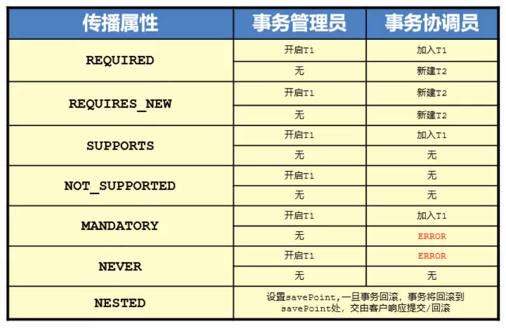

## 1. 事务相关概念回顾

### 1.1 相关概念回顾

**概念**：一组对数据库的操作，要么同时成功，要么同时失败。

**作用**：保证一组对数据库的操作是一个原子操作，同时保证多个同时对数据库的操作尽量不受影响。

**四大特性**：ACID；原子性、一致性，隔离性，持久性。

**事务并发访问的问题及隔离级别**

- 脏读 。解决方案，隔离级别调整为Read Committed（表级读锁）
- 不可重复读。提高隔离级别到 RepeatableRead （行级写锁）
- 幻读。提高隔离毕节到Serializable（表级写锁）

**传播行为**：见7。

### ==1.2 事务控制位置==

- 事务控制在业务层（service层）


## 2. Spring事务管理的核心对象(了解)

学顶层，用底层。学习Spring事务管理的核心高层接口。

- ==**PlatformTransactionManager**==

  平台事务管理器，作用进行事务管理。

  有但不仅限于以下实现类

  - <font color="red">**DataSourceTransactionManager 适用于SpringJDBC或MyBatis**</font>
  - HibernateTransactionManager 适用于Hibernate3.0及以上版本
  - JpaTransactionManager 适用于JPA
  - JdoTransactionManager 适用于JDO
  - JtaTransactionManager 适用于JTA

  

  此接口定义了事务的基本操作

  获取事务：`TransactionStatus getTransaction(TransactionDefinition definition)`

  提交事务：`void commit(TransactionStatus status) `

  回滚事务：`void rollback(TransactionStatus status)`

  

- **TransactionDefinition**

  封装定义事务参数的值（参数：隔离级别、是否只读、超时时间、传播行为）

  获取事务定义名称：`String getName()`

  获取事务的读写属性：`boolean isReadOnly()`

  获取事务隔离级别：`int getIsolationLevel()`

  获取事务超时时间：`int getTimeout()`

  获取事务传播行为特征：`int getPropagationBehavior()`

     

  Spring采用int类型枚举的方式表示不同的参数及其值

  ```java
  int ISOLATION_DEFAULT = -1;
  int ISOLATION_READ_UNCOMMITTED = 1
  int ISOLATION_READ_COMMITTED = 2
  int ISOLATION_REPEATABLE_READ = 4
  int ISOLATION_SERIALIZABLE = 8
  ```

  

- **TransactionStatus**

  封装定义事务在某个时刻的状态信息（是否已经开启、是否已经提交、是否已经回滚）

  获取事务是否处于新开启事务状态：`boolean isNewTransaction()`

  获取事务是否处于已完成状态：`boolean isCompleted()`

  获取事务是否处于回滚状态：`boolean isRollbackOnly()`

  刷新事务状态：`void flush()`

  获取事务是否具有回滚存储点：`boolean hasSavepoint()`

  设置事务处于回滚状态：`void setRollbackOnly()`


- 三者之间的关系

  `平台事务管理器`是Spring进行事务控制的`核心对象`，要根据`事务属性定义器`为当前事务设置好的参数来进行事务管理；事务在不同的时刻，其事务状态不一样，这个状态封装在`TransactionStatus`中，其中状态也可以做为影响事务管理的条件。


## 4. 案例环境

### 4.1 业务逻辑

银行转账业务

### 4.2 技术选型

基于`Spring`+`Mybatis`

### 4.3 相关配置和代码

- 业务层接口提供转账操作

  ```java
  /**
  * 转账操作
  * @param outName 出账用户名
  * @param inName 入账用户名
  * @param money 转账金额
  */
  public void transfer(String outName,String inName,Double money);
  ```


- 业务层实现提供转账操作

  ```java
  public void transfer(String outName,String inName,Double money){
      accountDao.inMoney(outName,money);
      accountDao.outMoney(inName,money);
  }
  ```


- 数据层提供对应的入账与出账操作

  ```xml
  <update id="inMoney">
  update account set money = money + #{money} where name = #{name}
  </update>
  <update id="outMoney">
  update account set money = money - #{money} where name = #{name}
  </update>
  ```

  ```java
  void inMoney(String name, double money);
  void outMoney(String name, double money);
  ```

  


## 5. 编程式事务(理解)

### ==5.0 Spring控制事务的方式==

- ~~编程式事务~~

- 声明式事务

  - xml方式的声明式事务

  - <font color="red">注解+`XML`方式的声明式事务(推荐)</font>

  - 全注解方式的声明式事务

    


### 5.1 基本的编程式事务

修改业务层转账代码（核心业务代码），`系统辅助功能代码入侵了核心业务代码`

```java
public void transfer(String outName,String inName,Double money){
    //创建事务管理器
    DataSourceTransactionManager dstm = new DataSourceTransactionManager();
    //为事务管理器设置与数据层相同的数据源
    dstm.setDataSource(dataSource);
    //创建事务定义对象
    TransactionDefinition td = new DefaultTransactionDefinition();
    //创建事务状态对象，用于控制事务执行
    TransactionStatus ts = dstm.getTransaction(td);
    
    accountDao.inMoney(outName,money);
    // int i = 1/0; //模拟业务层事务过程中出现错误
    accountDao.outMoney(inName,money);

    //提交事务
    dstm.commit(ts);
}
```


**注意**：业务层要注入与dao层相同的dataSource对象（底层原理：保证使用的是同一个连接对象）


### 5.2 使用AOP改造编程式事务

实现了，系统辅助功能代码 和 核心业务代码  解耦

业务层核心转账代码

```java
public void transfer(String outName, String inName, Double money) {
    accountDao.inMoney(outName,money);
    int i = 1/0;
    accountDao.outMoney(inName,money);
}
```


切面类中事务增强代码

```java
public class TxAdvice {

    // 保证使用的是同一个DataSource，所以要在切面类中注入dataSource（dao层同一个对象）
    private DataSource dataSource;
    public void setDataSource(DataSource dataSource) {
        this.dataSource = dataSource;
    }

    public Object transactionManager(ProceedingJoinPoint pjp) throws Throwable {
        //开启事务
        PlatformTransactionManager ptm = new DataSourceTransactionManager(dataSource);
        //事务定义
        TransactionDefinition td = new DefaultTransactionDefinition();
        //事务状态
        TransactionStatus ts = ptm.getTransaction(td);

        Object ret = pjp.proceed(pjp.getArgs());

        //提交事务
        ptm.commit(ts);
        return ret;
    }
}
```


配置织入关系

```xml
<bean id="txAdvice" class="com.itheima.aop.TxAdvice">
    <property name="dataSource" ref="dataSource"/>
</bean>

<aop:config>
    <aop:pointcut id="pt" expression="execution(* *..transfer(..))"/>
    <aop:aspect ref="txAdvice">
        <aop:around method="transactionManager" pointcut-ref="pt"/>
    </aop:aspect>
</aop:config>
```


## ==6. 声明式事务==

声明式事务：以配置的方式管理事务

配置方式有两种：`xml`、`注解`

### 6.1 XML（理解）

#### 6.1.1 入门范例，`beans.xml`

```xml
<!--装配平台事务管理器对象-->
<bean id="txManager" class="org.springframework.jdbc.datasource.DataSourceTransactionManager">
    <property name="dataSource" ref="dataSource"/>
</bean>

<!--
    配置事务的切面类，不需要我们自己编写这个类了
    定义事务管理的通知类，需要指定一个平台事务管理器对象
-->
<tx:advice id="txAdvice" transaction-manager="txManager">
    <!--定义哪些业务方法会被事务控制，以及使用什么样的参数进行控制-->
    <tx:attributes>
        <!-- tx:method必须写，否则任何一个业务方法都不会被事务控制 -->
        <tx:method name="transfer" read-only="false" />
    </tx:attributes>
</tx:advice>

<!-- 配置织入关系 -->
<aop:config>
    <aop:pointcut id="pt" expression="execution(* com.itheima.service..*ServiceImpl.*(..))"/>
    <!--
        aop:advisor 和 aop:aspect 功能一样，用于配置切面的信息
        前者是Spring专门为事务管理添加的一个新标签
     -->
    <aop:advisor advice-ref="txAdvice" pointcut-ref="pt"/>
</aop:config>
```


#### 6.1.2 `tx:attributes`&`tx:method`

`tx:attributes`对不同的方法进行事务控制、事务控制参数配置的父标签

`tx:method`配置哪些方法被事务控制、以及使用什么样的参数进行控制

```xml
<tx:advice id="txAdvice" transaction-manager="txManager">
    <!--
        Spring进行事务控制的级别：
            方法级别
     -->

    <!--定义哪些业务方法会被事务控制，以及使用什么样的参数进行控制-->
    <!-- 对不同的方法进行事务控制、事务控制参数配置的父标签 -->
    <tx:attributes>
        <!-- 配置哪些方法被事务控制、以及使用什么样的参数进行控制
            name属性用于指定哪些方法会被控制
            read-only="false"   只读/读写事务，默认是读写事务
            isolation="DEFAULT"  默认数据库的隔离级别
            timeout="-1"         默认不会超时
            propagation=""       传播行为
            rollback-for=""      配置异常类型名，抛出指定异常后必须回滚
            no-rollback-for=""   配置异常类型名，抛出指定异常后不回滚
         -->
        <tx:method name="transfer"/>
    </tx:attributes>
</tx:advice>
```


#### 6.1.3 切点表达式和`tx:method`的`name值`关系

前者仅仅明确了哪些方法会被事务控制，但是没有事务控制是具体细节

后者指定被拦截成功的所有方法中，每个方法的事务到底是什么属性参数进行控制


#### 6.1.4 工作中用法

```xml
<tx:advice transaction-manager="transactionManager" id="txAdvice">
    
    <tx:attributes>
        <!-- 工作中如何配置
            匹配原则：从上往下挨个匹配，只有匹配成功
         -->
        <tx:method name="find*" read-only="true" timeout="10"/>
        <!-- log代表的是系统辅助功能，不应该影响核心业务的运行 -->
        <tx:method name="*log" propagation="REQUIRES_NEW"/>
        <!-- 其他所有方法都走默认的事务管理 -->
        <tx:method name="*"/>
    </tx:attributes>
</tx:advice>
```


### 6.2 注解

#### ==6.2.1 注解 + `XML`配置==

在`Spring`配置文件`beans.xml`开启**注解驱动**

```xml
<tx:annotation-driven transaction-manager="txManager"/>
```


在要被事务控制的接口或者接口方法上添加`@Transactional`注解

```java
@Transactional
public interface AccountService {}
```

通过注解的属性，调整事务的参数（工作中用法）

```java
@Transactional  //保证当前类中所有的方法都被事务控制
public interface AccountService {
    
    @Transactional(readOnly= true,timeout=10) // 为当前方法的事务添加个性需求
    List<Account> findAll();
    
}
```


> 注意：
>
> 1. 配置注解驱动的时候，注意选择tx的命名空间（否则会报错）
> 2. 当类(接口)上、方法上都有事务注解并且参数不一致的时候，按照就近原则，以最近的为准
> 3. 成对出现：`tx:annotation-driven`和`@Transactional`
> 4. 建议：`@Transactional`配置在接口上，该接口所有实现类都会被事务控制


#### 6.2.1 全注解

在`Spring`配置类`SpringConfig.java`开启**注解驱动**，并通过`@Bean`注入平台事务管理器

在`SpringConfig.java`中注入`dataSource`

```java
@ComponentScan("com.itheima")
@PropertySource("classpath:jdbc.properties")
@EnableTransactionManagement
public class SpringConfig(){
    @Value("${jdbc.driver}")
    private String driver;
    @Value("${jdbc.url}")
    private String url;
    @Value("${jdbc.username}")
    private String userName;
    @Value("${jdbc.password}")
    private String password;

    @Bean("dataSource")
    public DataSource getDataSource(){
        DruidDataSource ds = new DruidDataSource();
        ds.setDriverClassName(driver);
        ds.setUrl(url);
        ds.setUsername(userName);
        ds.setPassword(password);
        return ds;
    }
	//注意 平台事务管理器必须装配
    @Bean
    public PlatformTransactionManager getTransactionManager(@Autowired DataSource dataSource){
        return new DataSourceTransactionManager(dataSource);
    }
```


在要被事务控制的接口或者接口方法上添加`@Transactional`注解

```java
@Transactional
public interface AccountService {}
```

通过注解的属性，调整事务的参数（工作中用法）

```java
@Transactional  //保证当前类中所有的方法都被事务控制
public interface AccountService {
    
    @Transactional(readOnly= true,timeout=10) // 为当前方法的事务添加个性需求
    List<Account> findAll();
    
}
```


> `注意事项`：
>
> 1. 成对出现：`@EnableTransactionManagement`和`@Transactional`


## 7. 传播行为

### 7.1 概念

传播行为研究的是：业务层A方法调用其他方法B（C、D……）时，A、B（C、D……）这些方法执行期间如何控制事务的问题。


### 7.2 分类

总共七种




### 7.3 工作中用法

`REQUIRED` 这个是默认值

`REQUIRES_NEW` 应用场景，eg：取钱时候，打印小票方法可以配置该传播行为。


## 8. Spring模板

高频常用的代码封装成模板，通过AOP的方式，使用的时候直接在模板上填充个性数据即可。


### 8.1 Spring中常见的模板

- TransactionTemplate

- **JdbcTemplate**
- **RedisTemplate**
- RabbitTemplate
- JmsTemplate 
- HibernateTemplate 
- RestTemplate 


### 8.2 JDBCTemplate(了解)

- 导入依赖坐标

  ```xml
  <!-- Spring-jdbc 内含JDBCTemplate --> 
  <dependency>
      <groupId>org.springframework</groupId>
      <artifactId>spring-jdbc</artifactId>
      <version>5.1.9.RELEASE</version>
  </dependency>
  
  
  <!-- MySQL数据库驱动 --> 
  <dependency>
      <groupId>mysql</groupId>
      <artifactId>mysql-connector-java</artifactId>
      <version>5.1.47</version>
  </dependency>
  <!-- Spring-context --> 
  <dependency>
      <groupId>org.springframework</groupId>
      <artifactId>spring-context</artifactId>
      <version>5.1.9.RELEASE</version>
  </dependency>
  
  <!-- 数据源 --> 
  <dependency>
      <groupId>com.alibaba</groupId>
      <artifactId>druid</artifactId>
      <version>1.1.16</version>
  </dependency>
  <!-- Junit单元测试 --> 
  <dependency>
      <groupId>junit</groupId>
      <artifactId>junit</artifactId>
      <version>4.12</version>
  </dependency>
  <!-- Spring整合Junit --> 
  <dependency>
      <groupId>org.springframework</groupId>
      <artifactId>spring-test</artifactId>
      <version>5.1.9.RELEASE</version>
  </dependency>
  ```

  


- JDBCTemplate注入进Spring容器

  ```java
  public class JDBCConfig {
      @Value("${jdbc.driver}")
      private String driver;
      @Value("${jdbc.url}")
      private String url;
      @Value("${jdbc.username}")
      private String userName;
      @Value("${jdbc.password}")
      private String password;
  
      @Bean("dataSource")
      public DataSource getDataSource(){
          DruidDataSource ds = new DruidDataSource();
          ds.setDriverClassName(driver);
          ds.setUrl(url);
          ds.setUsername(userName);
          ds.setPassword(password);
          return ds;
      }
  
      //注册JdbcTemplate模块对象bean
      @Bean("jdbcTemplate")
      public JdbcTemplate getJdbcTemplate(@Autowired DataSource dataSource){
          return new JdbcTemplate(dataSource);
      }
  
      @Bean("jdbcTemplate2")
      public NamedParameterJdbcTemplate getJdbcTemplate2(@Autowired DataSource dataSource){
          return new NamedParameterJdbcTemplate(dataSource);
      }
  }
  ```

  


- `Dao`层接口：`AccountDao.java`

  ```java
  package com.itheima.dao;
  
  public interface AccountDao {
      void save(Account account);
      void delete(Integer id);
      void update(Account account);
      String findNameById(Integer id);
      Account findById(Integer id);
      List<Account> findAll();
      List<Account> findAll(int pageNum,int preNum);
      Long getCount();
  }
  ```

  


- `Dao`层接口实现类：`AccountDaoImpl.java`

  ```java
  package com.itheima.dao.impl;
  
  //dao注册为bean
  @Repository("accountDao")
  public class AccountDaoImpl implements AccountDao {
  
      //注入模板对象
      @Autowired
      private JdbcTemplate jdbcTemplate;
  
      public void save(Account account) {
          String sql = "insert into account(name,money)values(?,?)";
          jdbcTemplate.update(sql,account.getName(),account.getMoney());
      }
  
      public void delete(Integer id) {
          String sql = "delete from account where id = ?";
          jdbcTemplate.update(sql,id);
      }
  
      public void update(Account account) {
          String sql = "update account set name = ? , money = ? where id = ?";
          jdbcTemplate.update(sql, account.getName(),account.getMoney(),account.getId());
      }
  
      public String findNameById(Integer id) {
          String sql = "select name from account where id = ? ";
          //单字段查询可以使用专用的查询方法，必须制定查询出的数据类型，例如name为String类型
          return jdbcTemplate.queryForObject(sql,String.class,id );
      }
  
      public Account findById(Integer id) {
          String sql = "select * from account where id = ? ";
          //支持自定义行映射解析器
          RowMapper<Account> rm = new RowMapper<Account>() {
              public Account mapRow(ResultSet rs, int rowNum) throws SQLException {
                  Account account = new Account();
                  account.setId(rs.getInt("id"));
                  account.setName(rs.getString("name"));
                  account.setMoney(rs.getDouble("money"));
                  return account;
              }
          };
          return jdbcTemplate.queryForObject(sql,rm,id);
      }
  
      public List<Account> findAll() {
          String sql = "select * from account";
          //使用spring自带的行映射解析器，要求必须是标准封装
          return jdbcTemplate.query(sql,new BeanPropertyRowMapper<Account>(Account.class));
      }
  
      public List<Account> findAll(int pageNum, int preNum) {
          String sql = "select * from account limit ?,?";
          //分页数据通过查询参数赋值
          return jdbcTemplate.query(sql,new BeanPropertyRowMapper<Account>(Account.class),(pageNum-1)*preNum,preNum);
      }
  
      public Long getCount() {
          String sql = "select count(id) from account ";
          //单字段查询可以使用专用的查询方法，必须制定查询出的数据类型，例如数据总量为Long类型
          return jdbcTemplate.queryForObject(sql,Long.class);
      }
  }
  ```

  


- `Dao`层接口实现类：`AccountDaoImpl.java`（使用具名参数传值）

  ```java
  package com.itheima.dao.impl;
  
  
  //dao注册为bean
  @Repository
  //@Primary
  public class AccountDaoImpl2 implements AccountDao {
  
      //注入模板对象
      @Autowired
      private NamedParameterJdbcTemplate jdbcTemplate;
  
      public void save(Account account) {
          String sql = "insert into account(name,money)values(:name,:money)";
          Map pm = new HashMap();
          pm.put("name",account.getName());
          pm.put("money",account.getMoney());
          jdbcTemplate.update(sql,pm);
      }
  
      public void delete(Integer id)  { return null; }
      public void update(Account account)  { return null; }
      public String findNameById(Integer id)  { return null; }
      public Account findById(Integer id)  { return null; }
      public List<Account> findAll()  { return null; }
      public List<Account> findAll(int pageNum, int preNum) { return null; }
      public Long getCount() { return null; }
  }
  ```

  


### ==8.3 RedisTemplate(掌握)==

#### 8.3.1 环境准备

1. 开启Redis服务

   > **注意**：
   >
   > - 要求启动时使用的配置文件中绑定可以连通的外部网卡，禁用受保护模式。否则启动会报错

   ```ini
   bind 192.168.115.130
   prot 6379
   protected-mode no
   ```


2. 导入Jedis依赖坐标

   ```xml
   <!-- Jedis  -->
   <dependency>
       <groupId>redis.clients</groupId>
       <artifactId>jedis</artifactId>
       <version>2.9.0</version>
   </dependency>
   ```


3. 创建Jedis对象，并使用

   ```java
   public class App {
       public static void main(String[] args) {
           Jedis jedis = new Jedis("192.168.115.130",6379);
           jedis.set("name","itheima");
           jedis.close();
       }
   }
   ```

   

#### 8.3.2 使用RedisTemplate

- 导入依赖坐标

  ```xml
  <!-- Spring-Context -->
  <dependency>
      <groupId>org.springframework</groupId>
      <artifactId>spring-context</artifactId>
      <version>5.1.9.RELEASE</version>
  </dependency>
  
  <!-- junit单元测试 -->
  <dependency>
      <groupId>junit</groupId>
      <artifactId>junit</artifactId>
      <version>4.12</version>
  </dependency>
  
  <!-- Spring整合junit -->
  <dependency>
      <groupId>org.springframework</groupId>
      <artifactId>spring-test</artifactId>
      <version>5.1.9.RELEASE</version>
  </dependency>
  
  <!-- Spring-redis 内含RedisTemplate -->
  <dependency>
      <groupId>org.springframework.data</groupId>
      <artifactId>spring-data-redis</artifactId>
      <version>2.0.6.RELEASE</version>
  </dependency>
  
  <!-- jedis，被Spring-redis依赖 -->
  <dependency>
      <groupId>redis.clients</groupId>
      <artifactId>jedis</artifactId>
      <version>2.9.0</version>
  </dependency>
  </dependencies>
  ```


- Redis配置文件

  ```propertie
  # redis服务器主机地址
  redis.host=192.168.115.130
  #redis服务器主机端口
  redis.port=6379
  
  #redis服务器登录密码
  #redis.password=itheima
  
  #最大活动连接
  redis.maxActive=20
  #最大空闲连接
  redis.maxIdle=10
  #最小空闲连接
  redis.minIdle=0
  #最大等待时间
  redis.maxWait=-1
  ```

  

- `RedisTemplate`装配进`Spring`容器

  Redis配置类：`ReidsConfig.java`

  ```java
  @PropertySource("redis.properties")
  public class RedisConfig {
  
      @Value("${redis.host}")
      private String hostName;
  
      @Value("${redis.port}")
      private Integer port;
  
  //    @Value("${redis.password}")
  //    private String password;
  
      @Value("${redis.maxActive}")
      private Integer maxActive;
      @Value("${redis.minIdle}")
      private Integer minIdle;
      @Value("${redis.maxIdle}")
      private Integer maxIdle;
      @Value("${redis.maxWait}")
      private Integer maxWait;
  
  
  
      @Bean
      //配置RedisTemplate
      public RedisTemplate createRedisTemplate(RedisConnectionFactory redisConnectionFactory){
          //1.创建对象
          RedisTemplate redisTemplate = new RedisTemplate();
          //2.设置连接工厂
          redisTemplate.setConnectionFactory(redisConnectionFactory);
          //3.设置redis生成的key的序列化器，对key编码进行处理
          RedisSerializer stringSerializer = new StringRedisSerializer();
          redisTemplate.setKeySerializer(stringSerializer);
          redisTemplate.setHashKeySerializer(stringSerializer);
          //4.返回
          return redisTemplate;
      }
  
      @Bean
      //配置Redis连接工厂
      public RedisConnectionFactory createRedisConnectionFactory(RedisStandaloneConfiguration redisStandaloneConfiguration,GenericObjectPoolConfig genericObjectPoolConfig){
          //1.创建配置构建器，它是基于池的思想管理Jedis连接的
          JedisClientConfiguration.JedisPoolingClientConfigurationBuilder builder = (JedisClientConfiguration.JedisPoolingClientConfigurationBuilder)JedisClientConfiguration.builder();
          //2.设置池的配置信息对象
          builder.poolConfig(genericObjectPoolConfig);
          //3.创建Jedis连接工厂
          JedisConnectionFactory jedisConnectionFactory = new JedisConnectionFactory(redisStandaloneConfiguration,builder.build());
          //4.返回
          return jedisConnectionFactory;
      }
  
      @Bean
      //配置spring提供的Redis连接池信息
      public GenericObjectPoolConfig createGenericObjectPoolConfig(){
          //1.创建Jedis连接池的配置对象
          GenericObjectPoolConfig genericObjectPoolConfig = new GenericObjectPoolConfig();
          //2.设置连接池信息
          genericObjectPoolConfig.setMaxTotal(maxActive);
          genericObjectPoolConfig.setMinIdle(minIdle);
          genericObjectPoolConfig.setMaxIdle(maxIdle);
          genericObjectPoolConfig.setMaxWaitMillis(maxWait);
          //3.返回
          return genericObjectPoolConfig;
      }
  
  
      @Bean
      //配置Redis标准连接配置对象
      public RedisStandaloneConfiguration createRedisStandaloneConfiguration(){
          //1.创建Redis服务器配置信息对象
          RedisStandaloneConfiguration redisStandaloneConfiguration = new RedisStandaloneConfiguration();
          //2.设置Redis服务器地址，端口和密码（如果有密码的话）
          redisStandaloneConfiguration.setHostName(hostName);
          redisStandaloneConfiguration.setPort(port);
  //        redisStandaloneConfiguration.setPassword(RedisPassword.of(password));
          //3.返回
          return redisStandaloneConfiguration;
      }
  }
  ```

  Spring核心配置类：`SpringConfig.java`

  ```java
  // @Configuration
  @ComponentScan("com.itheima")
  @Import(RedisConfig.class)
  public class SpringConfig {
  }
  ```

  


- 业务层注入并使用RedisTemplate

  ```java
  @Service("accountService")
  public class AccountServiceImpl implements AccountService {
  
      @Autowired
      private RedisTemplate redisTemplate;
  
      public void save(Account account) {
      }
  
      public void changeMoney(Integer id, Double money) {
          //等同于redis中set account:id:1 100
          redisTemplate.opsForValue().set("account:id:"+id,money);
      }
  
      public Double findMondyById(Integer id) {
          //等同于redis中get account:id:1
          Object money = redisTemplate.opsForValue().get("account:id:" + id);
          return new Double(money.toString());
      }
  }
  ```

  


- 测试类

  ```java
  //设定spring专用的类加载器
  @RunWith(SpringJUnit4ClassRunner.class)
  //设定加载的spring上下文对应的配置
  @ContextConfiguration(classes = SpringConfig.class)
  public class AccountServiceTest {
      @Autowired
      private AccountService accountService;
  
      /*@Test
      public void test(){
          Jedis jedis = new Jedis("192.168.40.130",6378);
          jedis.set("name","itheima");
          jedis.close();
      }*/
  
      @Test
      public void save(){
          Account account = new Account();
          account.setName("Jock");
          account.setMoney(666.66);
  
      }
  
      @Test
      public void changeMoney() {
          accountService.changeMoney(1,200D);
      }
  
      @Test
      public void findMondyById() {
          Double money = accountService.findMondyById(1);
          System.out.println(money);
      }
  }
  ```

  


## 9. 相关设计模式

**设计模式**：在不断的编码摸索过程中，总结出来的解决某些需求的思路（解决方案）

- 策略模式，根据不同的条件，提供了多种解决方案供使用者选择，并最终解决问题。

  `JDBCTemplate`在封装结果集的时候，让使用者根据结果集字段名和实体属性名是否一致，选择手动封装或自动封装

- 装饰者模式

  静态代理。

  目标对象：JDBCTemplate

  代理对象{	NamedParamterJDBCTemplate（从使用`?`作为占位符 增强成了  使用`:名称`作为占位符）

  ​	//持有目标对象，并且增强目标对象

  }


## 3. POJO&JavaBean

**Model**，模型，封装数据。

**JavaBean**

0. sun提出来的针对实体对象的规范，要求如下：
1. 必须实现序列化接口
2. 必须要有无参构造
3. 成员变量必须私有化
4. 必须提供公共的getter/setter
5. 其他图形化相关的内容


**POJO**（推荐使用该概念）

0. Plain Ordinary Java Object简写，普通的java对象
1. 阿里巴巴java开发手册规定，只要包含了getter/setter/toString内容的类，都可以称之为POJO


~~DO、DTO、VO、AO、BO~~

