## 0. 前置知识复习

### 0.1 Servlet

`UserServlet.java`

```java
/**
 * Servlet的作用
 * 1. 获取请求的参数，封装成POJO
 * 2. 调用业务方法
 * 3. 页面跳转响应数据
 * 
 * request功能
 * 1. 获取请求参数
 * 2. 域对象存取数据
 * 3. 页面跳转：请求转发实现
 * 
 * respone功能
 * 1. 回写数据到响应体（页面之前的内容会被覆盖掉）
 * 2. 页面跳转：请求重定向
 * <p>
 * <p>
 * respone
 */
 public class UserServlet extends HttpServlet {
    @Override
    protected void doGet(HttpServletRequest req, HttpServletResponse resp) throws ServletException, IOException {
        // 通过servletConfig对象获取初始化参数
        String initParameter = this.getServletConfig().getInitParameter("xxxx");
        System.out.println("initParameter = " + initParameter);

        // request作为域对象共享数据，在页面中可以通过el获取该值
        req.setAttribute("xxxx", initParameter);

        // String realPath = this.getServletContext().getRealPath(initParameter);

        // 通过输入获取该文件并使用
        System.out.println("通过输入获取该文件并使用");


        // 页面跳转
        req.getRequestDispatcher("/success.jsp").forward(req, resp);
    }

    @Override
    protected void doPost(HttpServletRequest req, HttpServletResponse resp) throws ServletException, IOException {
        doGet(req, resp);
    }
}
```


配置`web.xml`

```xml
<servlet>
    <servlet-name>userServlet</servlet-name>
    <servlet-class>com.itheima.UserServlet</servlet-class>
    <!--
            servlet初始化参数
            当前Servlet初识化的之后，可以获取到该值，并使用
         -->
    <init-param>
        <param-name>xxxx</param-name>
        <param-value>a.properties</param-value>
    </init-param>
    <load-on-startup>1</load-on-startup>
</servlet>

<servlet-mapping>
    <servlet-name>userServlet</servlet-name>
    <url-pattern>/user</url-pattern>
</servlet-mapping>
```


页面`success.jsp`

```html
<%@ page contentType="text/html;charset=UTF-8" language="java" %>
<html>
<head>
    <title>成功了</title>
</head>
<body>

成功了
${xxxx}
</body>
</html>
```


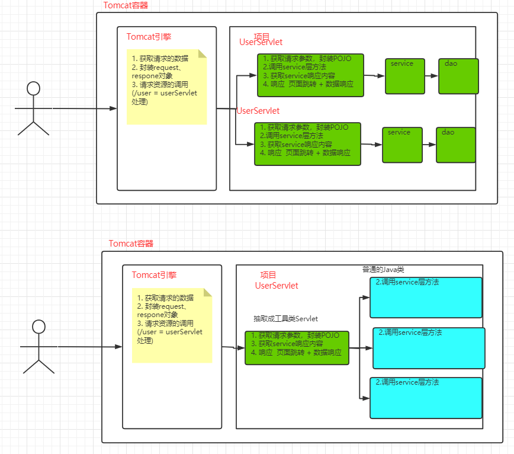


### 0.2 MVC

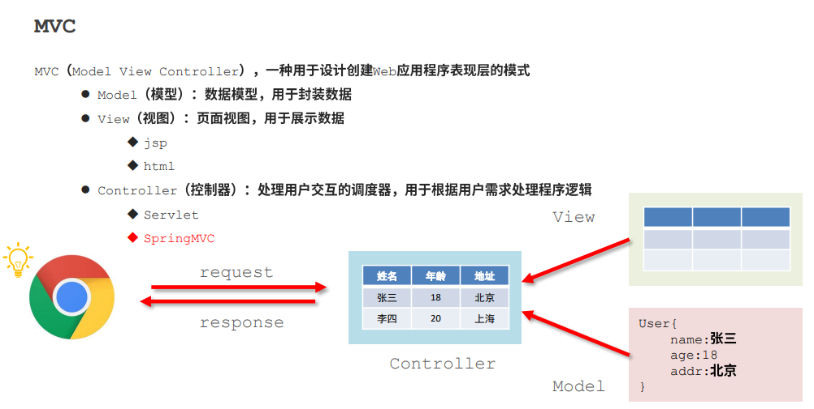

## ==1. SpringMVC入门==

### 1.1 概念相关

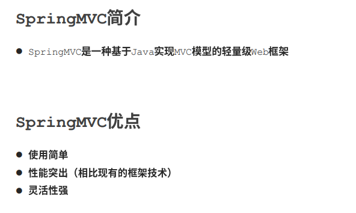


### 1.2 快速入门

#### 1.2.1 导入依赖

```xml
<dependencies>
    <!-- servlet3.1规范的坐标 -->
    <dependency>
        <groupId>javax.servlet</groupId>
        <artifactId>javax.servlet-api</artifactId>
        <version>3.1.0</version>
        <scope>provided</scope>
    </dependency>
    <!--jsp坐标-->
    <dependency>
        <groupId>javax.servlet.jsp</groupId>
        <artifactId>jsp-api</artifactId>
        <version>2.1</version>
        <scope>provided</scope>
    </dependency>

    <!--springmvc的坐标，依赖引入Spring-context、spring-web-->
    <dependency>
        <groupId>org.springframework</groupId>
        <artifactId>spring-webmvc</artifactId>
        <version>5.1.9.RELEASE</version>
    </dependency>
</dependencies>
```


#### 1.2.2 编写`Controller`代码

其实一个普通的Java类

```java
public class UserController {
    public void save(){
        System.out.println("user mvc controller is running ...");
        // return "success.jsp";
    }
}
```


#### 1.2.3 配置`SpringMVC`的组件扫描

```xml
<!--
    组件扫描，Spring和SpringMVC要分开扫描
    SPringMVC只扫描controller包即可
-->
<context:component-scan base-package="com.itheima.controller"/>
```


#### 1.2.4 配置`DispatcherServlet`及其映射

SpringMVC进行请求分发的核心控制器：`前端控制器DispatcherServlet`

```xml
<servlet>
    <servlet-name>DispatcherServlet</servlet-name>
    <servlet-class>org.springframework.web.servlet.DispatcherServlet</servlet-class>
    <!--
        为当前Servlet提供初始化参数的
        加载SpringMVC的配置文件
     -->
    <init-param>
        <param-name>contextConfigLocation</param-name>
        <param-value>classpath*:spring-mvc.xml</param-value>
    </init-param>
    <!--
        指定项目启动的时候就初始化DispatcherServlet
     -->
    <load-on-startup>1</load-on-startup>
</servlet>
<servlet-mapping>
    <servlet-name>DispatcherServlet</servlet-name>
    <!--
        /           表示当前servlet映射除jsp之外的所有请求（包含静态资源）
        /*          表示当前servlet映射所有请求（包含静态资源）
        *.do        struct1 请求默认后缀，表示当前servlet映射以.do结尾的请求
        *.action    struct2 请求默认后缀，表示当前servlet映射以.action结尾的请求
    -->
    <url-pattern>/</url-pattern>
</servlet-mapping>
```


#### 1.2.5 设置`Controller`访问路径

```java
//设置当前类为Spring的控制器类
@Controller
public class UserController {
    //设定当前方法的访问映射地址
    //@RequestMapping("save")
    @RequestMapping("/save")
    //设置当前方法返回值类型为String，用于指定请求完成后跳转的页面
    public String save(){
        System.out.println("user mvc controller is running ...");
        //设定具体跳转的页面
        return "success.jsp";
    }
}
```


#### 1.2.6 页面

```html
<%@page pageEncoding="UTF-8" language="java" contentType="text/html;UTF-8" %>
<html>
    <body>
    	<h1>第一个spring-mvc页面</h1>
    </body>
</html>
```


#### 1.2.7 执行流程图示

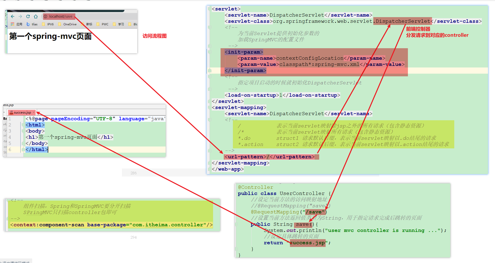


#### ==1.2.8 完整版执行流程及SpringMVC结构==(超重点，面试题)

http://localhost/    img/logo.png

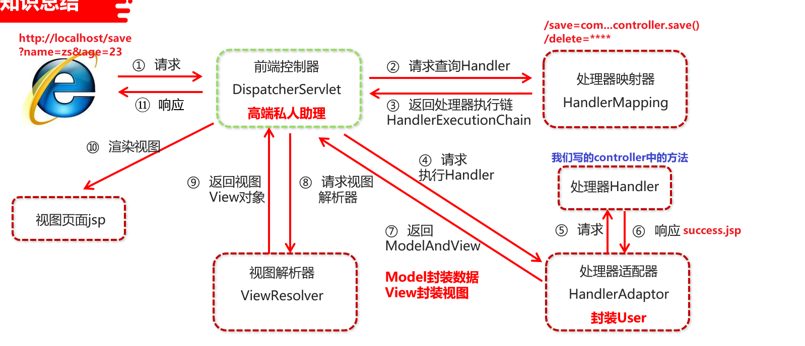


`spring-webmvc.jar`中`DispatcherServlet.properties`描述了默认加载的组件

SpringMVC默认加载 的组件


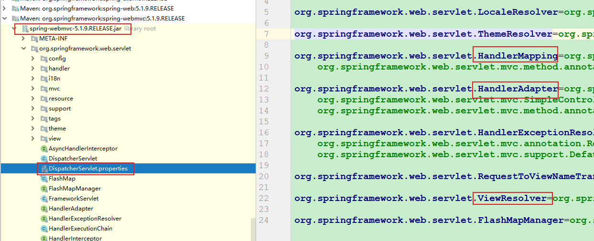


## ==2. SpringMVC基本配置==

### 2.1  组件扫描

SpringMVC 和 Spring分别有自己的容器，装配属于自己控制范围的`Bean`，所以要分开扫描，只扫描自己范围即可。

`spring.xml`

```xml
<context:component-scan base-package="com.itheima">
    <!-- 排除指定注解 -->
    <context:exclude-filter type="annotation"
                            expression="org.springframework.stereotype.Controller"/>
</context:component-scan>

```

`spring-mvc.xml`

```xml
<!-- 扫描指定包 -->
<context:component-scan base-package="com.itheima.controller"/>
```


### 2.2 放行静态资源

两种方式

img/logo.png

- 手动映射：指定请求URL和对应静态资源的映射路径
- 自动映射：转交`Tomcat`默认的`servlet`处理

```xml
<!-- 手动映射：指定请求URL和对应静态资源的映射路径
    mapping：请求的url  /img/xxx/yyy/logo.png
        * 表示一级路径
        ** 表示多级路径

    location：表示对应资源的位置
 -->
<mvc:resources mapping="/img/**" location="/img/"/>
<mvc:resources mapping="/css/**" location="/css/"/>

<!-- 自动映射：转交`Tomcat`默认的`servlet`（default）处理 -->
<mvc:default-servlet-handler/>
<mvc:annotation-driven>
```

如果显示的配置了静态资源放行，那么之前默认加载的处理器适配器、处理器映射器就不会自动加载了，所以这个时候就只有这些静态资源可以被访问，其他的都失效了。

只需要配置`注解驱动`，就可以实现自动加载常用的`处理器适配器、处理器映射器`

### 2.3 注解驱动


```xml
<mvc:annotation-driven>
```

配置后，可以实现自动装配常用的`处理器适配器、处理器映射器`。


> 注：
>
> Spring 配置文件一级标签的解析，会通过`BeanDefinitionParser`的子类实现。MVC注解驱动这个标签对应的实现类为：
>
> ```java
> org.springframework.web.servlet.config.AnnotationDrivenBeanDefinitionParser
> ```
>
> 


### 2.4 统一编码处理

**`Post`请求乱码问题解决方案**

使用`Filter`做统一编码处理，把`SpringMVC`提供好的编码`Filter`配置进`Web`容器即可

```xml
<!--乱码处理过滤器，与Servlet中使用方式的完全相同，差异之处在于处理器的类由Spring提供-->
<!-- 处理post请求乱码 -->
<filter>
    <filter-name>CharacterEncodingFilter</filter-name>
    <filter-class>org.springframework.web.filter.CharacterEncodingFilter</filter-class>
    <init-param>
        <param-name>encoding</param-name>
        <param-value>UTF-8</param-value>
    </init-param>
</filter>
<filter-mapping>
    <filter-name>CharacterEncodingFilter</filter-name>
    <url-pattern>/*</url-pattern>
</filter-mapping>
```


**`Get`请求乱码问题解决方案**

- tomcat8及以上版本，默认解决了乱码问题。

- maven-tomcat7插件可以配置`<uriEncoding>`为`UTF-8`解决请求乱码问题

  ```xml
  <plugin>
    <groupId>org.apache.tomcat.maven</groupId>
    <artifactId>tomcat7-maven-plugin</artifactId>
    <version>2.1</version>
    <configuration>
      <port>80</port>
      <path>/</path>
      <uriEncoding>utf-8</uriEncoding>
    </configuration>
  </plugin>
  ```


**响应乱码问题解决方案**

- 在`SpringMVC`配置文件中添加消息转换器，并指定编码为`UTF-8`

  ```xml
  <mvc:annotation-driven >
      <mvc:message-converters>
          <bean class="org.springframework.http.converter.StringHttpMessageConverter">
              <constructor-arg value="utf-8"/>
          </bean>
      </mvc:message-converters>
  </mvc:annotation-driven>
  ```

  


**控制台乱码解决方案**

- debug的时候，变量的值没有乱码，但是打印到控制台的时候出现了乱码

- 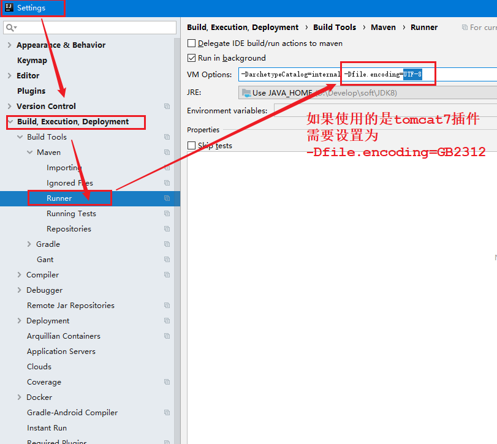


### 2.5 `web.xml`中必配内容

```xml
<!--乱码处理过滤器，与Servlet中使用方式的完全相同，差异之处在于处理器的类由Spring提供-->
<!-- 这里解决的是post请求乱码问题 -->
<filter>
    <filter-name>CharacterEncodingFilter</filter-name>
    <filter-class>org.springframework.web.filter.CharacterEncodingFilter</filter-class>
    <init-param>
        <param-name>encoding</param-name>
        <param-value>UTF-8</param-value>
    </init-param>
</filter>
<filter-mapping>
    <filter-name>CharacterEncodingFilter</filter-name>
    <url-pattern>/*</url-pattern>
</filter-mapping>

<!-- 配置SpringMVC的前端控制器 -->
<servlet>
    <servlet-name>dispatcherServlet</servlet-name>
    <servlet-class>org.springframework.web.servlet.DispatcherServlet</servlet-class>
    <init-param>
        <param-name>contextConfigLocation</param-name>
        <param-value>classpath:spring-mvc.xml</param-value>
    </init-param>
</servlet>
<servlet-mapping>
    <servlet-name>dispatcherServlet</servlet-name>
    <url-pattern>/</url-pattern>
</servlet-mapping>
```


### 2.6  `spring-mvc.xml`中必配内容

```xml
<!-- 放行静态资源 -->
<mvc:default-servlet-handler/>
<!-- 注解驱动，默认加载常用的处理器映射器  处理器适配器 -->
<mvc:annotation-driven>
```


## ==3. 请求自动封装==

### 3.1 原则

**要求处理器`Handler`方法形参名称、层级关系  与  请求参数对应，即可大多数情况的自动完成封装。**

例外情况见最后。


- 请求`URL`

  ```http
  http://ip地址:端口/项目虚拟路径/资源路径?参数名1=参数值1&参数名2=参数值2
  ```

  eg：

  ```http
  //http://localhost/requestParam1?name=itheima&age=14
  ```

  

- `Controller`中`Handler`形参书写

  ```java
  //http://localhost/requestParam1?name=itheima&age=14
  @RequestMapping("/requestParam1")
  public String requestParam1(String name,int age){
      System.out.println(name+","+age);
      return "page.jsp";
  }
  ```


完整代码

```java
public class UserController {
    //方法传递普通类型参数，数量任意，类型必须匹配
    //http://localhost/requestParam1?name=itheima
//http://localhost/requestParam1?name=itheima&age=14
    @RequestMapping("/requestParam1")
    public String requestParam1(String name, int age) {
        System.out.println(name + "," + age);
        return "page.jsp";
    }

    //方法传递普通类型参数，使用@RequestParam参数匹配URL传参中的参数名称与方法形参名称
    //http://localhost/requestParam2?userName=Jock
    @RequestMapping("/requestParam2")
    public String requestParam2(@RequestParam(name = "userName", required = true) String name) {
        System.out.println(name);
        return "page.jsp";
    }

    //方法传递POJO类型参数，URL地址中的参数作为POJO的属性直接传入对象
    //http://localhost/requestParam3?name=Jock&age=39
    @RequestMapping("/requestParam3")
    public String requestParam3(User user) {
        System.out.println(user);
        return "page.jsp";
    }

    //当方法参数中具有POJO类型参数与普通类型参数时，URL地址传入的参数不仅给POJO对象属性赋值，也给方法的普通类型参数赋值
    //http://localhost/requestParam4?name=Jock&age=39
    @RequestMapping("/requestParam4")
    public String requestParam4(User user, int age) {
        System.out.println("user=" + user + ",age=" + age);
        return "page.jsp";
    }

    //使用对象属性名.属性名的对象层次结构可以为POJO中的POJO类型参数属性赋值
    //http://localhost/requestParam5?address.city=beijing
    @RequestMapping("/requestParam5")
    public String requestParam5(User user) {
        System.out.println(user.getAddress().getCity());
        return "page.jsp";
    }

    //通过URL地址中同名参数，可以为POJO中的集合属性进行赋值，集合属性要求保存简单数据
    //http://localhost/requestParam6?nick=Jock1&nick=Jockme&nick=zahc
    @RequestMapping("/requestParam6")
    public String requestParam6(User user) {
        System.out.println(user);
        return "page.jsp";
    }

    //POJO中List对象保存POJO的对象属性赋值，使用[数字]的格式指定为集合中第几个对象的属性赋值
    //http://localhost/requestParam7?addresses[0].city=beijing&addresses[1].province=hebei
    @RequestMapping("/requestParam7")
    public String requestParam7(User user) {
        System.out.println(user.getAddresses());
        return "page.jsp";
    }

    //POJO中Map对象保存POJO的对象属性赋值，使用[key]的格式指定为Map中的对象属性赋值
    //http://localhost/requestParam8?addressMap['job'].city=beijing&addressMap['home'].province=henan
    @RequestMapping("/requestParam8")
    public String requestParam8(User user) {
        System.out.println(user.getAddressMap());
        return "page.jsp";
    }

    //方法传递普通类型的数组参数，URL地址中使用同名变量为数组赋值
    //http://localhost/requestParam9?nick=Jockme&nick=zahc
    @RequestMapping("/requestParam9")
    public String requestParam9(String[] nick) {
        System.out.println(nick[0] + "," + nick[1]);
        return "page.jsp";
    }

    //方法传递保存普通类型的List集合时，无法直接为其赋值，需要使用@RequestParam参数对参数名称进行转换
    //http://localhost/requestParam10?nick=Jockme&nick=zahc
    @RequestMapping("/requestParam10")
    public String requestParam10(@RequestParam("nick") List<String> nick) {
        System.out.println(nick);
        return "page.jsp";
    }

    //数据类型转换，使用自定义格式化器或@DateTimeFormat注解设定日期格式
    //两种方式都依赖springmvc的注解启动才能运行
    //http://localhost/requestParam11?date=1999-09-09
    @RequestMapping("/requestParam11")
    public String requestParam11(@DateTimeFormat(pattern = "yyyy-MM-dd") Date date) {
        System.out.println(date);
        return "page.jsp";
    }

    //数据类型转换，使用自定义格式化器或@DateTimeFormat注解设定日期格式
    //两种方式都依赖springmvc的注解启动才能运行
    //http://localhost/requestParam112?date=1999-09-09
    @RequestMapping("/requestParam112")
    public String requestParam112(Date date) {
        System.out.println(date);
        return "page.jsp";
    }

    //数据类型转换，使用自定义类型转换器，需要配置后方可使用
    //http://localhost/requestParam12?date=1999-09-09
    @RequestMapping("/requestParam12")
    public String requestParam12(Date date) {
        System.out.println(date);
        return "page.jsp";
    }

    //无类映射地址访问格式
    //http://localhost/requestURL1
    @RequestMapping("/requestURL1")
    public String requestURL1() {
        return "page.jsp";
    }


    // 限定请求方式
    //http://localhost/requestURL4
    @RequestMapping(value = "/requestURL4", method = RequestMethod.POST)
    public String requestURL4() {
        return "page.jsp";
    
    }
    
    // 限定请求方式
    //http://localhost/requestURL4
    //@RequestMapping(value = "/requestURL4",method = RequestMethod.POST)
    @PostMapping(value = "/requestURL41")
    public String requestURL41() {
        return "page.jsp";
    }
    
    // 限定请求方式
    //@RequestMapping(value = "/requestURL4",method = RequestMethod.GET)
    @GetMapping(value = "/requestURL42")
    public String requestURL42() {
        return "page.jsp";
    }

    // 限制请求头
    @RequestMapping(value = "/requestURL43", headers = {"device-type=ios"})
    //@PostMapping(value = "/requestURL4")
    public String requestURL43() {
        return "page.jsp";
    }

    // 限制请求头
    @RequestMapping(value = "/requestURL43", headers = {"device-type=android"})
    //@PostMapping(value = "/requestURL4")
    public String requestURL431() {
        return "page.jsp";
    }

    //带有类映射地址访问格式，需要将类映射地址作为前缀添加在实际映射地址的前面
    //最终返回的页面如果未设定绝对访问路径，将从类映射地址所在目录中查找
    //http://localhost/user/requestURL2     （注意：要配合类上定义的路径使用）
    @RequestMapping("/requestURL2")
    public String requestURL2() {
        return "/page.jsp";
    }

    //@RequestMapping参数，一个路径参数，6个访问限定性参数（了解）
    @RequestMapping(value = "/requestURL3", params = "name")
    public String requestURL3() {
        return "page.jsp";
    }
}
```


### 3.2 例外情况List

```java
//方法传递保存普通类型的List集合时，无法直接为其赋值，需要使用@RequestParam参数对参数名称进行转换
//http://localhost/requestParam10?nick=Jockme&nick=zahc
@RequestMapping("/requestParam10")
public String requestParam10(@RequestParam("nick") List<String> nick) {
    System.out.println(nick);
    return "page.jsp";
}
```


### 3.3 例外情况2：Date

`SpringMVC`默认的`类型转换器`只支持`yyyy/MM/dd`格式的字符串与`java.util.Date`类型的转换

不支持`yyyy-MM-dd`，可以通过以下两种方式实现支持

- 修改支持的格式从`yyyy/MM/dd`到`yyyy-MM-dd`
- 自定义类型转换器，实现`yyyy-MM-dd`格式的支持


#### 解决方式1：

通过配置来实现，修改支持的格式从`yyyy/MM/dd`编程`yyyy-MM-dd`

```xml
<mvc:annotation-driven conversion-service="conversionService1"/>
<!--自定义格式化转换器-->
<bean id="conversionService1"
      class="org.springframework.format.support.FormattingConversionServiceFactoryBean">
    <!--覆盖格式化转换器定义规则，该规则是一个set集合，对格式化转换器来说是追加和替换的思想，而不是覆盖整体格式化转换器-->
    <property name="formatters">
        <set>
            <!--具体的日期格式化转换器-->
            <bean class="org.springframework.format.datetime.DateFormatter">
                <!--具体的规则，不具有通用性，仅适用于当前的日期格式化转换器-->
                <property name="pattern" value="yyyy-MM-dd"/>
            </bean>
        </set>
    </property>
</bean>
```

> `注意`：
>
> 1. 原格式不再支持
> 2. 通过该方式添加转换器之后，整个项目中全部生效。


#### 方式1简化写法：(最推荐）

处理器`Handler`方法形参上添加注解（）

```java
    //数据类型转换，使用自定义格式化器或@DateTimeFormat注解设定日期格式
    //两种方式都依赖springmvc的注解启动才能运行
    //http://localhost/requestParam11?date=1999-09-09
    @RequestMapping("/requestParam11")
    public String requestParam11(@DateTimeFormat(pattern = "yyyy-MM-dd") Date date){
        System.out.println(date);
        return "page.jsp";
    }

    @RequestMapping("/requestParam11")
    public String requestParam12( Date date){
        System.out.println(date);
        return "page.jsp";
    }
```


> `注意事项`：
>
> 1. 原格式不支持
> 2. @DateTimeFormat(pattern = "yyyy-MM-dd")只对当前参数有效
> 3. 后台需开启注解驱动


#### 解决方式2：(推荐)

自定义类型转换器，实现`Converter`接口

```java
//自定义类型转换器，实现Converter接口，接口中指定的泛型即为最终作用的条件
//本例中的泛型填写的是String，Date，最终出现字符串转日期时，该类型转换器生效
public class MyDateConverter implements Converter<String, Date> {
    //重写接口的抽象方法，参数由泛型决定
    public Date convert(String source) {
        DateFormat df = new SimpleDateFormat("yyyy-MM-dd");
        Date date = null;
        //类型转换器无法预计使用过程中出现的异常，因此必须在类型转换器内部捕获，不允许抛出，框架无法预计此类异常如何处理
        try {
            date = df.parse(source);
        } catch (ParseException e) {
            e.printStackTrace();
        }
        return date;
    }
}
```


把自定义的类型转换器配置进注解驱动（最终装配进SpringMVC容器）

```xml
<mvc:annotation-driven conversion-service="conversionService"/>
<!--自定义类型转换器-->

<bean id="conversionService" class="org.springframework.context.support.ConversionServiceFactoryBean">
    <!--覆盖类型转换器定义规则，该规则是一个set集合，对类型转换器来说是追加和替换的思想，而不是覆盖整体格式化转换器-->
    <property name="converters">
        <set>
            <!--添加自定义的类型转换器，会根据定义的格式覆盖系统中默认的格式-->
            <!--当前案例中是将String转换成Date的类型转换器进行了自定义，所以添加后，系统中原始自带的String——>Date的类型转换器失效-->
            <bean class="com.itheima.converter.MyDateConverter"/>
        </set>
    </property>
</bean>
```


> `注意`：
>
> 1. 原格式不再支持
> 2. 通过该方式添加转换器之后，整个项目中全部生效。


## 4. 响应

### 4.1 同步项目响应方式（jsp）

- 页面跳转（重定向、转发）

- 页面跳转（转发）带数据

- 直接写数据到响应体，整个页面会刷新，原有的所有数据都被覆盖（该方式在同步项目中体验非常差，但是确是异步项目推荐使用的前后台数据交换方式）


### 4.2 不带数据页面跳转

在`handler`方法中直接返回一个视图名称字符串，即可完成页面跳转。

```java
@RequestMapping("/showPage")
public String showPage() {
    System.out.println("user mvc controller is running ...");
    // 要跳转的页面，在SpringMVC中称之为视图（View）
    // 支持的视图包括 JSP FreeMaker HTML....
    // 直接返回的字符串，一般称之为逻辑视图
    // 通过视图解析器解析后的视图（字符串拼接）后的视图，就是物理视图
    //return "/WEB-INF/page/page.jsp";
}
```


有关视图解析器更多内容，见章节`5. 视图解析`


### 4.3 带数据页面跳转

直接在`Handler`方法上添加`Model`、`Map`、`ModelMap`、`ModelAndView`类型的形参，`SpringMVC`会自动创建对应类型的对象；通过为上述对象设置数据后，在跳转的页面上就可以获取到对应的数据，**其本质和`Handler`形参位置添加`request`对象一样**。

除`ModelAndView` 外，所有类型的底层实现类都是`org.springframework.validation.support.BindingAwareModelMap`类型


`ModelAndView` 除了可以设置数据外，还可以设置视图，直接return该类型对象就可以携带数据页面跳转；所以，使用`ModelAndView`可以


```java
public class BookController {
    //使用原生request对象传递参数
    @RequestMapping("/showPageAndData1")
    public String showPageAndData1(HttpServletRequest request) {
        request.setAttribute("name","itheima");
        return "page";
    }

    // class org.springframework.validation.support.BindingAwareModelMap
    //使用Model形参传递参数
    @RequestMapping("/showPageAndData2")
    public String showPageAndData2(Model model) {
        System.out.println("model.getClass() = " + model.getClass());
        //添加数据的方式，key对value
        model.addAttribute("name","Jock");
        Book book  = new Book();
        book.setName("SpringMVC入门案例");
        book.setPrice(66.66d);
        //添加数据的方式，key对value
        model.addAttribute("book",book);
        return "page";
    }
    /// class org.springframework.validation.support.BindingAwareModelMap
    //使用Map形参传递参数
    @RequestMapping("/showPageAndData21")
    public String showPageAndData21(Map map) {
        System.out.println("map.getClass() = " + map.getClass());
        //添加数据的方式，key对value
        map.put("name","Jock");
        Book book  = new Book();
        book.setName("SpringMVC入门案例");
        book.setPrice(66.66d);
        //添加数据的方式，key对value
        map.put("book",book);
        return "page";
    }

    // class org.springframework.validation.support.BindingAwareModelMap
    //使用modelMap形参传递参数
    @RequestMapping("/showPageAndData22")
    public String showPageAndData22(ModelMap modelMap) {
        System.out.println("modelMap.getClass() = " + modelMap.getClass());
        modelMap.addAttribute("name","Jock");
        Book book  = new Book();
        book.setName("SpringMVC入门案例");
        book.setPrice(66.66d);
        //添加数据的方式，key对value
        modelMap.addAttribute("book",book);
        return "page";
    }


    //使用ModelAndView形参传递参数，该对象还封装了页面信息
    @RequestMapping("/showPageAndData3")
    public ModelAndView showPageAndData3(ModelAndView modelAndView) {
        //ModelAndView mav = new ModelAndView();    替换形参中的参数
        Book book  = new Book();
        book.setName("SpringMVC入门案例");
        book.setPrice(66.66d);

        //添加数据的方式，key对value
        modelAndView.addObject("book",book);
        //添加数据的方式，key对value
        modelAndView.addObject("name","Jockme");
        //设置页面的方式，该方法最后一次执行的结果生效
        modelAndView.setViewName("page");
        //返回值设定成ModelAndView对象
        return modelAndView;
    }

    //ModelAndView对象支持转发的手工设定，该设定不会启用前缀后缀的页面拼接格式
    @RequestMapping("/showPageAndData4")
    public ModelAndView showPageAndData4(ModelAndView modelAndView) {
        modelAndView.setViewName("forward:/WEB-INF/page/page.jsp");
        return modelAndView;
    }

    //ModelAndView对象支持重定向的手工设定，该设定不会启用前缀后缀的页面拼接格式
    @RequestMapping("/showPageAndData5")
    public ModelAndView showPageAndData6(ModelAndView modelAndView) {
        modelAndView.setViewName("redirect:page.jsp");
        return modelAndView;
    }
}
```


### ==4.4 直接写入响应体==（超重点,异步常用）

1. 导入`JackSon`依赖坐标

   ```xml
   <!-- 只导入databind即可，会依赖导入core和annotation -->
   <dependency>
       <groupId>com.fasterxml.jackson.core</groupId>
       <artifactId>jackson-databind</artifactId>
       <version>2.9.0</version>
   </dependency>
   ```

   

2. 开启注解驱动

   ```xml
   <mvc:annotation-driven>
   ```

   

3. 在`Controller`中`Handler`方法中，直接返回`POJO`对象/集合

   ```java
   @Controller
   public class AccountController {
   
       //使用SpringMVC注解驱动，对标注@ResponseBody注解的控制器方法进行结果转换，由于返回值为引用类型，自动调用jackson提供的类型转换器进行格式转换
       @RequestMapping("/showData4")
       @ResponseBody
       public Book showData4() {
           Book book  = new Book();
           book.setName("SpringMVC入门案例");
           book.setPrice(66.66d);
           return book;
       }
   
       //转换集合类型数据
       @RequestMapping("/showData5")
       @ResponseBody
       public List showData5() {
           Book book1  = new Book();
           book1.setName("SpringMVC入门案例");
           book1.setPrice(66.66d);
   
           Book book2  = new Book();
           book2.setName("SpringMVC入门案例");
           book2.setPrice(66.66d);
   
           ArrayList al = new ArrayList();
           al.add(book1);
           al.add(book2);
           return al;
       }
   }
   ```

   


- **原生写法，不推荐**

  ```java
  @Controller
  public class AccountController {
      //使用原生response对象响应数据
      @RequestMapping("/showData1")
      public void showData1(HttpServletResponse response) throws IOException {
          response.getWriter().write("message");
      }
  
      //使用@ResponseBody将返回的结果作为响应内容，而非响应的页面名称
      @RequestMapping("/showData2")
      @ResponseBody
      public String showData2(){
          return "{'name':'Jock'}";
      }
  
      //使用jackson进行json数据格式转化
      @RequestMapping("/showData3")
      @ResponseBody
      public String showData3() throws JsonProcessingException {
          Book book  = new Book();
          book.setName("SpringMVC入门案例");
          book.setPrice(66.66d);
  
          ObjectMapper om = new ObjectMapper();
          return om.writeValueAsString(book);
      }
  }
  ```


- 实现原理

  `<mvc:annotation-driven>`装配了常用的处理器映射器和处理器适配器，其中`RequestMappingHandlerMapping`使用了`MappingJackson2HttpMessageConverter`转换器，底层帮我们完成了实体对象到json格式字符串的转换，并解决了`POJO`对象转`String`的中文乱码问题。

  

  一言以蔽之：`<mvc:annotation-driven>`帮我们完成了实体对象到`json`格式字符串的转换。

```xml
<bean class="org.springframework.web.servlet.mvc.method.annotation.RequestMappingHandlerAdapter">
    <property name="messageConverters">
        <list>
        	<bean class="org.springframework.http.converter.json.MappingJackson2HttpMessageConverter"/>
        </list>
    </property>
</bean>
```


## 5. 视图解析

要跳转的页面，在SpringMVC中称之为视图（View）

支持的视图包括 JSP FreeMaker HTML....

加载视图文件并响应到浏览器的过程称之为视图解析，通俗讲就是请求后的页面跳转。

在`handler`方法中直接返回一个视图名称字符串，即可完成页面跳转。

```java
@RequestMapping("/showPage")
public String showPage() {
    System.out.println("user mvc controller is running ...");
    // 要跳转的页面，在SpringMVC中称之为视图（View）
    // 支持的视图包括 JSP FreeMaker HTML....
    // 直接返回的字符串，一般称之为逻辑视图
    // 通过视图解析器解析后的视图（字符串拼接）后的视图，就是物理视图
    //return "/WEB-INF/page/page.jsp";
}
```


### 5.1 视图解析器


当大多数视图页面后缀相同，且都放在同一个目录下时，这些视图的前缀和后缀会基本相同，eg：

```powershell
├─webapp
│  ├─WEB-INF
│  │  ├─page
│  │  │  ├─page.jsp
│  │  │  ├─springmvc.jsp
│  │  │  ├─success.jsp
│  │  │  ├─error.jsp
```

以上`jsp`视图资源的完整资源路径是

```powershell
/WEB-INF/page/page.jsp
/WEB-INF/page/springmvc.jsp
/WEB-INF/page/success.jsp
/WEB-INF/page/error.jsp
```

有用共同的前后缀

| 前缀             | 后缀   |
| ---------------- | ------ |
| `/WEB-INF/page/` | `.jsp` |


为了方便，可以把相同的部分抽取出去，`Handler`只返回的视图文件名。eg：

```java
// 原来返回完整的视图路径名称，一般称为物理视图
return  "/WEB-INF/page/page.jsp";  

// 返回视图文件主体名，不用考虑前后缀。一般称为逻辑视图
return "page"
```


**逻辑视图**：`Handler`返回的视图字符串，一般称之为逻辑视图

**物理视图**：逻辑视图经过视图解析器解析后，得到的是物理视图


`Handler`返回的视图文件名，不会直接作为跳转的页面，而是经过视图解析器解析后再做跳转。

`SpringMVC`项目启动的时候默认加载了`InternalResourceViewResolver`视图解析器，该视图解析器通常会在`逻辑视图`的基础上做字符串的前后缀拼接，得到`物理视图`。


> 注：
>
> 有关默认加载的视图解析 器，详见`spring-webmvc.jar`中`DispatcherServlet.properties`


### 5.2 InternalResourceViewResolver

该类的父类`UrlBasedViewResolver`部分源码如下：

```java
public class UrlBasedViewResolver extends AbstractCachingViewResolver implements Ordered {
    
    // 请求重定向响应方式常量
    public static final String REDIRECT_URL_PREFIX = "redirect:";
    
    // 请求转发响应方式常量，该值为响应的默认值，即：请求转发为默认页面跳转的方式
    public static final String FORWARD_URL_PREFIX = "forward:";

    // 逻辑视图前后缀
    private String prefix = "";
    private String suffix = "";
    
    // setter
    public void setPrefix(@Nullable String prefix) {
		this.prefix = (prefix != null ? prefix : "");
	}
    
    // setter
    public void setSuffix(@Nullable String suffix) {
		this.suffix = (suffix != null ? suffix : "");
	}
}
```


这时就可以把`InternalResourceViewResolver`重新装配进`SpringMVC`容器；并指定前后缀，这样在`Handler`返回的之后，只返回视图主体名称即可，而不用考虑前缀后缀，也就是不用考虑前面路径和后面的文件格式。

```xml
<bean class="org.springframework.web.servlet.view.InternalResourceViewResolver">
    <property name="prefix" value="/WEB-INF/page/"/>
    <property name="suffix" value=".jsp"/>
</bean>
```

> 注：
>
> 这样配置会覆盖掉系统默认加载的相同类型的`InternalResourceViewResolver`视图解析器


所以，之后就可以按照下个小节做法轻松完成视图跳转。


### 5.3 配置视图解析器

在`SpringMVC`配置文件中装配视图解析器，并根据需要指定前后缀。

```xml
<bean class="org.springframework.web.servlet.view.InternalResourceViewResolver">
    <property name="prefix" value="/WEB-INF/page/"/>
    <property name="suffix" value=".jsp"/>
</bean>
```


在`Handler`方法中，直接返回视图文件主体名称。

```java
@RequestMapping("/showPage")
public String showPage() {
    System.out.println("user mvc controller is running ...");
    // 直接返回逻辑视图page
    // 视图解析器会在逻辑视图的基础上拼接得到物理视图/WEB-INF/page/page.jsp
    //return "page";
}
```


### 5.4 `forward:`&`redirect:`

当不指定跳转页面的方式时，默认使用`请求转发`跳转到目的视图。

也可以在逻辑视图字符串首，显式的通过添加 `forward:`或者`redirect:`用于指定跳转方式。


> **注意**：
>
> 如果手动指定了请求转发或请求重定向，本次跳转时，视图解析器会自动停止拼接。

> **显式指定跳转方式的应用场景**
>
> 1. 跳转到非标准路径的视图页面
> 2. 请求转发 / 重定向到另外一个请求的虚拟路径


### 5.5 默认逻辑视图


`Handler`方法返回值类型为`void`，默认以访问路径作为逻辑视图名。

```java
//最简页面配置方式，使用访问路径作为页面名称，省略返回值
// 本案中以showPage55作为返回值
@RequestMapping("/showPage55")
public void showPage5() {
    System.out.println("user mvc controller is running ...");
}
```


## 相关注解（多看）

### ==@RequestMapping==

**作用**：

- 建立`请求的URL` 与 `处理该请求的处理器`之间的映射关系，
- 限定请求方式、参数、头等内容，
- `value`值的`/`可以省略

**位置**：类上 、方法上

**属性**：

- `path`、`name`、`value`一样，都指的是路径

- `method`、`params`、`headers`、`consumes`、`produces`用于限制请求相关内容

  请求方式、参数、消息头、接收请求的`MiME`类型、响应的`MIME`类型

- `params`：用于指定限制请求参数的条件。它支持简单的表达式。要求请求参数的key和value必须和配置的一模一样。`Headers`也是一样。eg：

  ```java
  params = {"accountName"}，表示请求参数必须有accountName
  params = {"moeny!100"}，表示请求参数中money不能是100
  Header= { "device-type=Android"}  指定了请求头中的key和value
  Header= {"device-type=ios"}  指定了请求头中的key和value
  ```


- 限定请求方式

  ```java
  // 限定请求方式
  //http://localhost/requestURL4
  @RequestMapping(value = "/requestURL4", method = RequestMethod.POST)
  public String requestURL4() {
      return "page.jsp";
  }
  ```


### @RequestParam

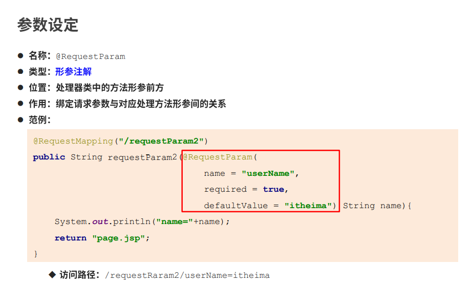


### @PostMapping

相当于`@RequestMapping(value = "/requestURL4", method = RequestMethod.POST)`

```java
// 限定请求方式
//http://localhost/requestURL4
@RequestMapping(value = "/requestURL4", method = RequestMethod.POST)
public String requestURL4() {
    return "page.jsp";

}

// 限定请求方式
//http://localhost/requestURL4
//@RequestMapping(value = "/requestURL4",method = RequestMethod.POST)
@PostMapping(value = "/requestURL41")
public String requestURL41() {
    return "page.jsp";
}
```


### @GetMapping

相当于`@RequestMapping(value = "/requestURL4", method = RequestMethod.GET)`

```java
// 限定请求方式
//http://localhost/requestURL4
@RequestMapping(value = "/requestURL4", method = RequestMethod.POST)
public String requestURL4() {
    return "page.jsp";

}

// 限定请求方式
//@RequestMapping(value = "/requestURL4",method = RequestMethod.GET)
@GetMapping(value = "/requestURL42")
public String requestURL42() {
    return "page.jsp";
}
```


### @DateTimeFormat


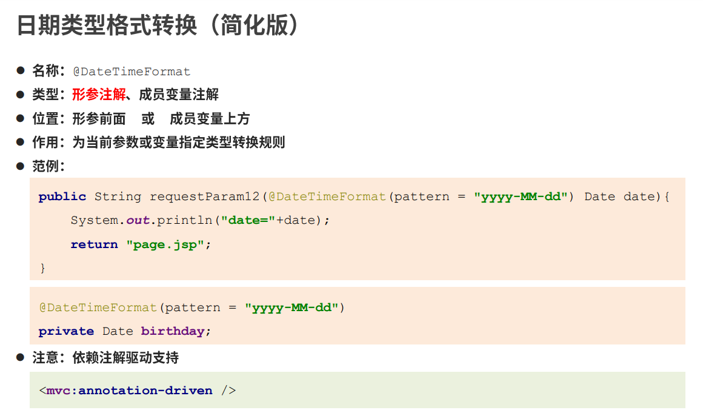


### @ResponseBody


### @RequestHeader

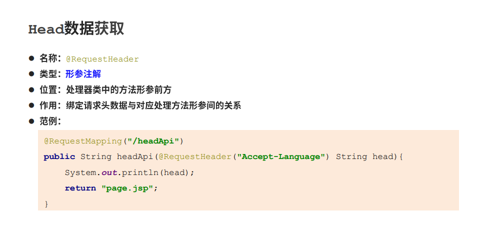


### @CookieValue

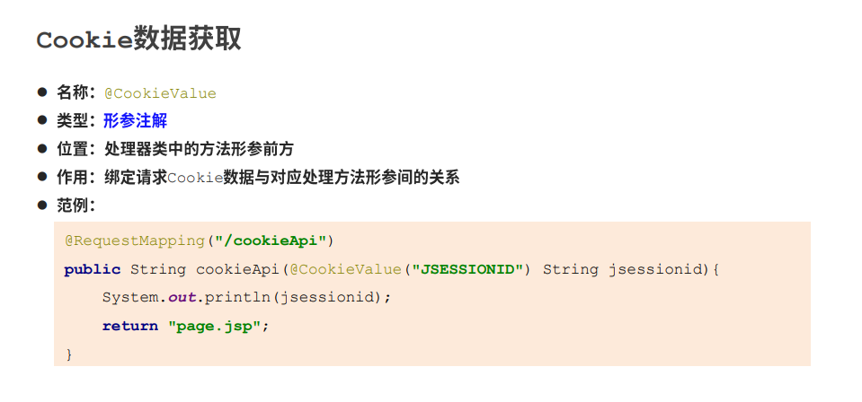

### @SessionAttribute


### @SessionAttributes

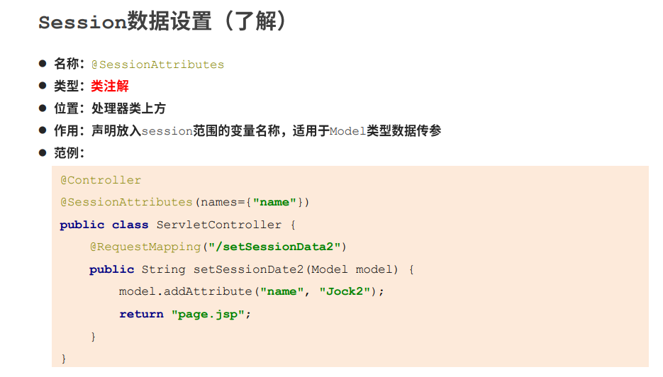


### @EnableWebMvc

相当于`xml`文件中配置的`<mvc:annotation-driven>`


该注解源码如下：

```java
@Retention(RetentionPolicy.RUNTIME)
@Target(ElementType.TYPE)
@Documented
// 引入了一个配置类DelegatingWebMvcConfiguration
@Import(DelegatingWebMvcConfiguration.class)
public @interface EnableWebMvc {
}
```

`DelegatingWebMvcConfiguration.java`类中并未装配组件，其父类中装配了大量组件

```java
public class DelegatingWebMvcConfiguration extends WebMvcConfigurationSupport {}
```

`WebMvcConfigurationSupport.java`装配了大量组件，包括但不仅限于

`RequestMappingHandlerMapping`（处理器映射器）和`RequestMappingHandlerAdapter`（处理器适配器）共18个Bean（组件）

```java
public class WebMvcConfigurationSupport implements ApplicationContextAware, ServletContextAware {

    @Bean
    public RequestMappingHandlerMapping requestMappingHandlerMapping() {
        // ......
    }
    @Bean
    public RequestMappingHandlerAdapter requestMappingHandlerAdapter() {
        // ****
    }
}
```


### 


## SpringMVC执行流程

// 待梳理


## 处理器映射器

// 待讲解


## 处理器适配器

// 待讲解

