## 今日内容

1. <font color="red">SpringMVC异步请求响应(Json)</font>
2. <font color="red">跨域问题及解决方式</font>
3. <font color="red">SpringMVC中的拦截器</font>
4. SpringMVC的异常处理
5. SpringMVC实现文件上传
6. Restful风格

## ==1. 异步调用==

### 1.1 发送请求接收参数

原则：

1. 后台在`Handler`方法形参上添加一个注解`@RequestBody`读取异步请求，请求正文的内容
2. 请求的`json`格式字符串的层级结构和形参层次结构一致，即可完成自动封装。


页面异步发送请求

```js
//为id="testAjax1"的组件绑定点击事件
$("#testAjax1").click(function(){
    //发送异步调用  $.post()
    $.ajax({
       type:"POST",//请求方式：POST请求
       url:"testAjax1",//请求的地址
       data:'ajax message',//请求参数（也就是请求内容）
       dataType:"text",//响应正文类型
       contentType:"application/text",//请求正文的MIME类型
    });
});
$("#testAjaxPojo").click(function(){
    $.ajax({
       type:"POST",
       url:"ajaxPojoToController",
       data:'{"name":"Jock","age":39}',
       dataType:"text",
       contentType:"application/json",
    });
});

//为id="testAjaxList"的组件绑定点击事件
$("#testAjaxList").click(function(){
    $.ajax({
       type:"POST",
       url:"ajaxListToController",
       data:'[{"name":"Jock","age":39},{"name":"Jockme","age":40}]',
       dataType:"text",
       contentType:"application/json",
    });
});
```


后台接收数据

```java
@RequestMapping("/ajaxController")
//使用@RequestBody注解，可以将请求体内容封装到指定参数中
public String ajaxController(@RequestBody String message){
    System.out.println("ajax request is running..."+message);
    return "page.jsp";
}
@RequestMapping("/ajaxPojoToController")
//如果处理参数是POJO，且页面发送的请求数据格式与POJO中的属性对应，@RequestBody注解可以自动映射对应请求数据到POJO中
//注意：POJO中的属性如果请求数据中没有，属性值为null，POJO中没有的属性如果请求数据中有，不进行映射
public String  ajaxPojoToController(@RequestBody User user){
    System.out.println("controller pojo :"+user);
    return "page.jsp";
}

@RequestMapping("/ajaxListToController")
//如果处理参数是List集合且封装了POJO，且页面发送的数据是JSON格式的对象数组，数据将自动映射到集合参数中
public String  ajaxListToController(@RequestBody List<User> userList){
    System.out.println("controller list :"+userList);
    return "page.jsp";
}
```


### 1.2 `@ResponseBody`和`@RequestBody`  区别

| 类目     | `@ResponseBody`                                  | `@RequestBody`                                       |
| -------- | ------------------------------------------------ | ---------------------------------------------------- |
| 标注位置 | 类 \| 方法                                       | 方法形参                                             |
| 作用     | 把返回的数据写入响应体                           | 从请求体中获取请求数据                               |
| 数据格式 | 把`POJO`对象转成`Json`格式字符串，<br>写入响应体 | 前端请求的`Json`格式字符串，<br>读取并封装成POJO对象 |


### 1.2 响应数据并处理

原则：

1. 后台数据要直接写入响应体（而不是存入域对象做页面跳转）
2. 前端通过回调函数，解析处理响应的数据


前台页面

```js
//为id="testAjaxReturnString"的组件绑定点击事件
$("#testAjaxReturnString").click(function(){
    //发送异步调用
    $.ajax({
       type:"POST",
       url:"ajaxReturnString",
       //回调函数
       success:function(data){
            //打印返回结果
            alert(data);
       }
    });
});

//为id="testAjaxReturnJson"的组件绑定点击事件
$("#testAjaxReturnJson").click(function(){
    //发送异步调用
    $.ajax({
       type:"POST",
       url:"ajaxReturnJson",
       //回调函数
       success:function(data){
            alert(data);
            alert(data['name']+" ,  "+data['age']);
       }
    });
});

//为id="testAjaxReturnJsonList"的组件绑定点击事件
$("#testAjaxReturnJsonList").click(function(){
    //发送异步调用
    $.ajax({
       type:"POST",
       url:"ajaxReturnJsonList",
       //回调函数
       success:function(data){
            alert(data);
            alert(data.length);
            alert(data[0]["name"]);
            alert(data[1]["age"]);
       }
    });
});


//为id="testCross81"的组件绑定点击事件
$("#testCross81").click(function(){
    //发送异步调用
    $.ajax({
        type:"POST",
        url:"http://blog.sunxiaowei.net",
        //回调函数
        success:function(data){
            alert("跨域调用信息反馈："+data['name']+" ,  "+data['age']);
        }
    });
});

//为id="testCross"的组件绑定点击事件
$("#testCross").click(function(){
    //发送异步调用
    $.ajax({
       type:"POST",
       url:"http://www.jock.com/cross",
       //回调函数
       success:function(data){
           alert("跨域调用信息反馈："+data['name']+" ,  "+data['age']);
       }
    });
});
```


后台处理代码

```java
//使用注解@ResponseBody可以将返回的页面不进行解析，直接返回字符串，该注解可以添加到方法上方或返回值前面
@RequestMapping("/ajaxReturnString")
//    @ResponseBody
public @ResponseBody String ajaxReturnString(){
    System.out.println("controller return string ...");
    return "page.jsp";
}


@RequestMapping("/ajaxReturnJson")
@ResponseBody
//基于jackon技术，使用@ResponseBody注解可以将返回的POJO对象转成json格式数据
public User ajaxReturnJson(){
    System.out.println("controller return json pojo...");
    User user = new User();
    user.setName("Jockme");
    user.setAge(39);
    return user;
}

@RequestMapping("/ajaxReturnJsonList")
@ResponseBody
//基于jackon技术，使用@ResponseBody注解可以将返回的保存POJO对象的集合转成json数组格式数据
public List ajaxReturnJsonList(){
    System.out.println("controller return json list...");
    User user1 = new User();
    user1.setName("Tom");
    user1.setAge(3);

    User user2 = new User();
    user2.setName("Jerry");
    user2.setAge(5);

    ArrayList al = new ArrayList();
    al.add(user1);
    al.add(user2);

    return al;
}

@RequestMapping("/cross")
@ResponseBody
//使用@CrossOrigin开启跨域访问
//标注在处理器方法上方表示该方法支持跨域访问
//标注在处理器类上方表示该处理器类中的所有处理器方法均支持跨域访问
//@CrossOrigin
public User cross(HttpServletRequest request){
    System.out.println("controller cross..."+request.getRequestURL());
    User user = new User();
    user.setName("Jockme");
    user.setAge(39);
    return user;
}
```


## ==2. 跨域访问问题==

### 2.1 概念相关

1. 同源策略

   > 同源策略（Sameoriginpolicy）是一种约定，它是浏览器最核心也最基本的安全功能。
   >
   > 如果访问请求使用的`协议`，`端口`和`域名(IP)`都相同，则两个页面具有相同的源，任意一个不同及为不同源，也就是**跨域**。


2. 跨域示例

   | 当前页面url                  | 被请求页面url                          | 是否跨域 | 原因     |
   | ---------------------------- | -------------------------------------- | -------- | -------- |
   | http://blog.sunxiaowei.net   | http://blog.sunxiaowei.net/db/207.html | 否       | 同源     |
   | `http`://blog.sunxiaowei.net | `https`://blog.sunxiaowei.net          | 是       | 协议不同 |
   | http://blog.sunxiaowei.net   | http://baidu.com                       | 是       | 域名不同 |
   | http://blog.sunxiaowei.net   | http://blog.sunxiaowei.net:4399        | 是       | 端口不同 |

   

3. 非同源限制

   - 无法读取非同源网页的 Cookie等保存在浏览器端的信息
   - 无法向非同源地址发送 AJAX 请求
   - **归根结底是对js的限制**

4. 哪些请求不受同源策略限制

   - src/href的请求，不受该限制

- 简单来说：**当前项目页面发起异步请求了另外一个项目的资源，就出现了跨域访问的问题，这种访问是不被允许的。**


5. 解决方案
   - 添加响应头，允许跨域
   - @CrossOrigin
   - jsonp（原理就是html原生的src/href属性不存在跨域问题）
   - 反向代理
   - iframe
   - 跨域资源共享CORS（Cross-Origin Resource Sharing）

### 2.2 数据准备

同一个项目，端口不同，就不属于同源，相互访问就会存在跨域问题。本案使用不同端口启动同一个项目，相互访问，模拟跨域问题并解决。


- `index.jsp`

  ```jsp
     <%@ page contentType="text/html;charset=UTF-8" language="java" %>
     <html>
     <head>
         <title>Title</title>
         <script src="js/jquery-3.3.1.js"></script>
     </head>
     <body>
         <h1>localhost:82 当前域</h1>
         <h1>localhost:83 另外一个域（服务器）</h1>
         <button id="crossBLog">跨域访问blog</button>
         <br>
         <button id="crossSelf">不跨域访问本项目82</button>
         <br>
         <button id="cross83">跨域访问项目83</button>
         <br>
         <button id="cross83withHeader">跨域访问项目83，设置响应头解决跨域问题</button>
         <br>
         <button id="cross83withAnnotation">跨域访问项目83，使用SpringMVC注解</button>
     </body>
     <script>
         // 为id为crossBLog的按钮绑定点击事件，发起跨域请求
         $("#crossBLog").click(function () {
             $.get("http://blog.sunxiaowei.net");
         });
     
         // 为id为crossSelf的按钮绑定点击事件，请求本项目资源（同源不跨越）
         $("#crossSelf").click(function () {
             $.get("http://localhost:82/test",function (data) {
                 alert(data);
             });
         });
     
         // 为id为cross83的按钮绑定点击事件，请求本项目资源（同源不跨越）
         $("#cross83").click(function () {
             $.get("http://localhost:83/test",function (data) {
                 alert(data);
             });
         });
     
         // 为id为cross83withHeader的按钮绑定点击事件，请求本项目资源（同源不跨越）
         $("#cross83withHeader").click(function () {
             $.get("http://localhost:83/test",function (data) {
                 alert(data);
             });
         });
     
         // 为id为cross83withAnnotation的按钮绑定点击事件，请求本项目资源（同源不跨越）
         $("#cross83withAnnotation").click(function () {
             $.get("http://localhost:83/test",function (data) {
                 alert(data);
             });
         });
     
     </script>
     </html>
  ```

  

- `UserServlet.java`

  ```java
  @Controller
  public class UserController {
  
      @RequestMapping(value = "test" )
      @ResponseBody
      public String test(HttpServletResponse response){
  
          return "access successful";
      }
  }
  ```


- `Spring-mvc.xml`

  ```xml
  <!--组件扫描-->
  <context:component-scan base-package="com.itheima"/>
  
  <!-- 注解驱动 -->
  <mvc:annotation-driven>
  </mvc:annotation-driven>
  
  <!-- 放行静态资源 -->
  <mvc:default-servlet-handler/>
  ```

  

- `web.xml`

  ```xml
  <!-- SpringMVC相关配置，并通过初始化参数指定SpringMVC配置文件，项目启动时创建前端控制器 -->
  <!-- 拦截了除jsp外的所有请求，需要在MVC配置文件中放行静态资源 -->
  
  <!--配置全局过滤器，设置编码为UTF-8，解决post请求乱码问题-->
  ```

  

### 2.3 解决方案

#### 2.3.1 解决方式 1：

- 设置响应头

  ```java
  @Controller
  public class UserController {
  
      @RequestMapping(value = "test" )
      @ResponseBody
      public String test(HttpServletResponse response){
  		response.setHeader("Access-Control-Allow-Origin", "*");
          return "access successful";
      }
  }
  ```

  

#### 2.3.1 解决方式 1：

- `SpringMVC`提供的注解(本质同方式1)

  ```java
  @Controller
  public class UserController {
  
      @RequestMapping(value = "test" )
      @ResponseBody
      @CrossOrigin
      public String test(HttpServletResponse response){
  		
          return "access successful";
      }
  }
  ```

  


### 2.4 原理解析

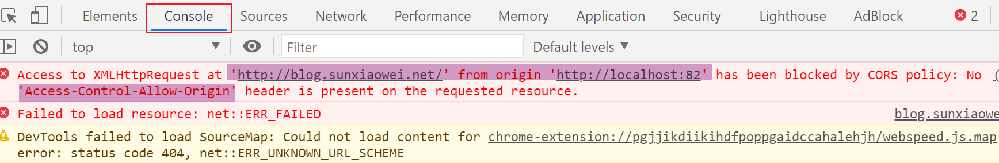


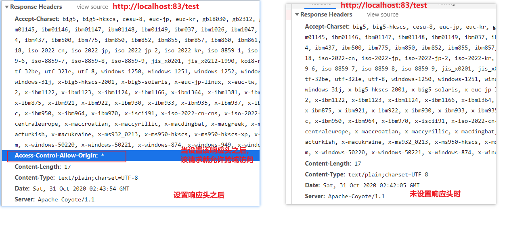

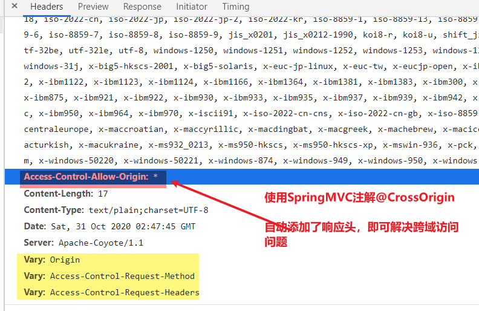


## ==3. 拦截器==

### 3.1 概念

**拦截器（`Interceptor`）**：一种动态拦截方法调用的机制

**作用**：

1. 在`指定的方法`调用前后执行预先设定好的代码
2. 阻止原始方法的执行

**原理**：`AOP`（动态代理）

**拦截器链**：多个拦截器按照一定的顺序，对原始被调用功能进行增强


### 3.2 拦截器VS过滤器

| 项目     | `intercept`拦截器                                            | `Filter`过滤器                                               |
| -------- | ------------------------------------------------------------ | ------------------------------------------------------------ |
| 规范     | `SpringMVC`定义的规范，限SpringMVC使用                       | `servlet`规范的一部分，任何框架都可用                        |
| 依赖容器 | `SpringMVC`容器                                              | `tomcat`容器                                                 |
| 粒度     | 方法级别，基于AOP在方法执行前后拦截                          | 类级别，基于回调访问servlet前后进行拦截                      |
| 拦截范围 | 取决于前端控制器`url-pattern`+<br>拦截器`mvc:mapping`+`mvc:exclude-mapping` | 取决`Filter`中`url-pattern`的配置<br/>`/*`拦截所有请求，包括静态资源、jsp页面 |


思路：先经过`DispatcherServlet`，被前者拦截过之后，才有可能被后者拦截；

是否真的被后者拦截，取决于拦截器`mvc:mapping`配置。

| `DispatcherServlet`拦截配置 | 拦截器mvc:mapping配置 | 拦截器是否拦截                  |
| --------------------------- | --------------------- | ------------------------------- |
| `/`                         | `/**`                 | 拦截所有，除了jsp               |
| `*.do`                      | `/**`                 | 拦截`*.do`，`jsp`、静态资源不拦 |


### 3.3 自定义拦截器开发步骤

1. 实现拦截器接口`HandlerInteceptor`，非强制实现三个default方法

   ```java
   public class MyInterceptor implements HandlerInterceptor {
       //处理器运行之前执行
       @Override
       public boolean preHandle(HttpServletRequest request,
                                HttpServletResponse response,
                                Object handler) throws Exception {
           System.out.println("前置运行----a1");
           // 这里先返回true，否则目标Handler方法，以及后面的两个实现方法将无法执行
           return true;
       }
   
       //处理器运行之后执行
       @Override
       public void postHandle(HttpServletRequest request,
                              HttpServletResponse response,
                              Object handler,
                              ModelAndView modelAndView) throws Exception {
           System.out.println("后置运行----b1");
       }
   
       @Override
       public void afterCompletion(HttpServletRequest request,
                                   HttpServletResponse response,
                                   Object handler,
                                   Exception ex) throws Exception {
           System.out.println("完成运行----c1");
       }
   }
   ```

   

2. 配置`<inteceptors>`的`<inteceptor>`的`mvc:Mapping[path]+bean`

   ```xml
   <mvc:interceptors>
       <!--开启具体的拦截器的使用，可以配置多个-->
       <mvc:interceptor>
           <!--
   			mvc:mapping 拦截哪些请求
   			path 
   				/* 当前节点所有  /user     /test
   				/** 拦截当前节点及子孙节点  /user/xxx     /test/yyy...
   		-->
           <mvc:mapping path="/*"/>
           <!--在使用通配符的过程中 排除指定拦截 -->
           <mvc:exclude-mapping path="/js/**"/>
           <bean class="com.itheima.interceptor.MyInterceptor"/>
       </mvc:interceptor>
   </mvc:interceptors>
   ```

   

### 3.4 单个拦截器拦截过程

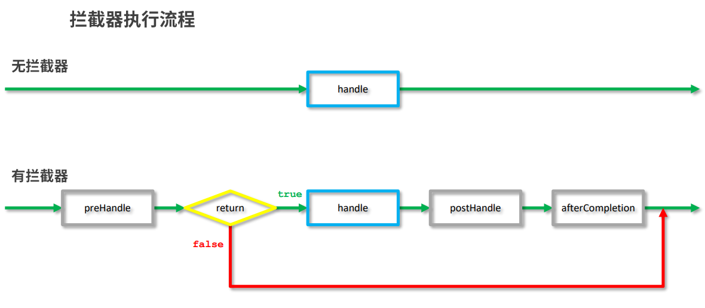


```java
public class MyInterceptor implements HandlerInterceptor {
    //处理器运行之前执行
    @Override
    public boolean preHandle(HttpServletRequest request,
                             HttpServletResponse response,
                             Object handler) throws Exception {
        System.out.println("前置运行----a1");
        //返回值为false将拦截原始处理器的运行
        //如果配置多拦截器，返回值为false将终止当前拦截器后面配置的拦截器的运行
        return true;
    }
    
    //处理器运行之后执行
    @Override
    public void postHandle(HttpServletRequest request,
                           HttpServletResponse response,
                           Object handler,
                           ModelAndView modelAndView) throws Exception {
        System.out.println("后置运行----b1");
    }

    // 全部拦截完成之后执行
    @Override
    public void afterCompletion(HttpServletRequest request,
                                HttpServletResponse response,
                                Object handler,
                                Exception ex) throws Exception {
        System.out.println("完成运行----c1");
    }
}
```


### 3.5 拦截器参数

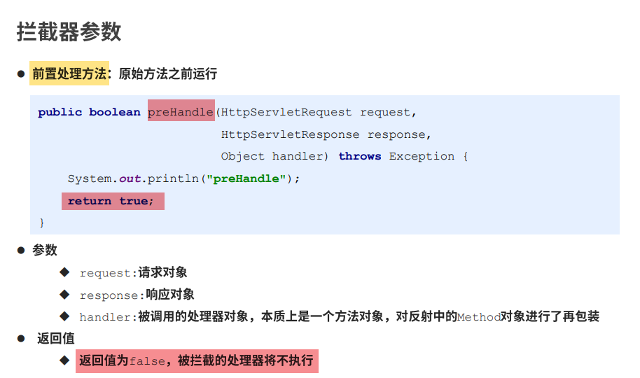


------


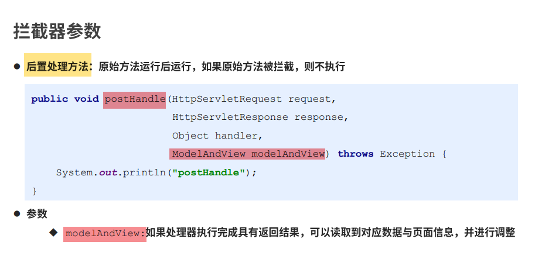


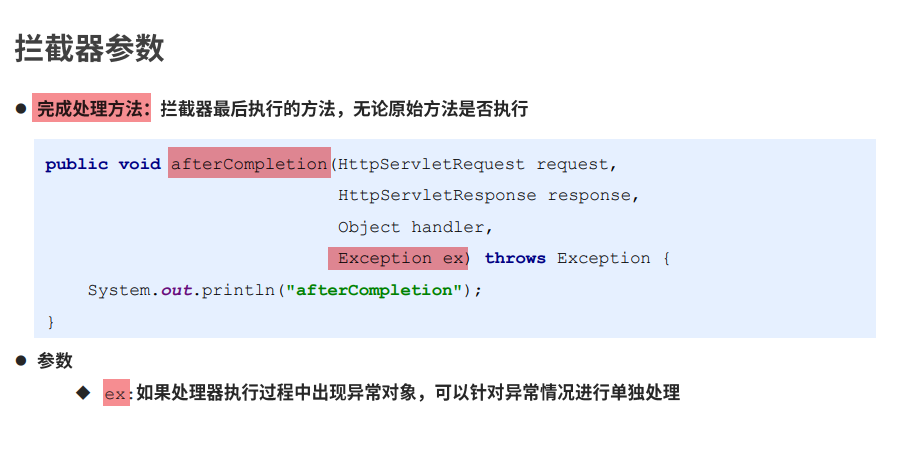


### 3.6 多个拦截器拦截过程


- 运行顺序

  `preHandler`与配置顺序相同

  `postHandler`与配置顺序相反，可能不运行

  `afterCompletion`与配置顺序相反，可能不运行


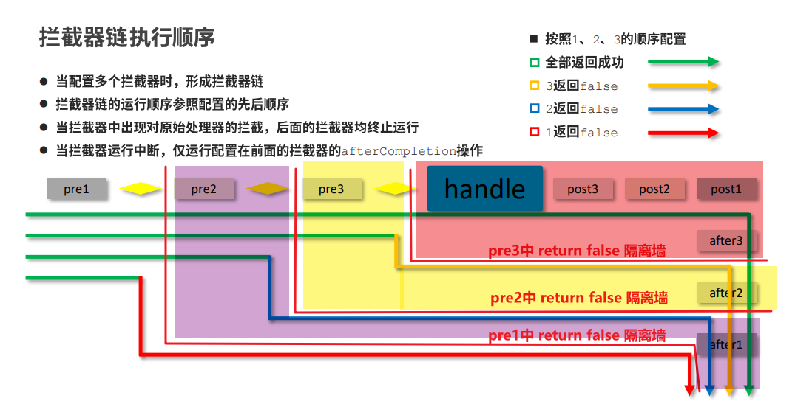


### 3.7 责任链模式

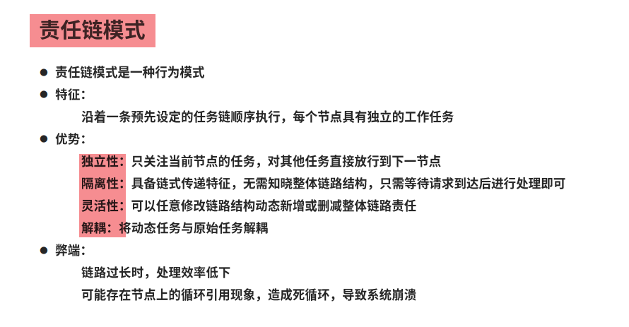


## 4. 异常处理器

**处理总原则**：

1. 不可以把异常抛给用户
2. 统一在web层做异常处理

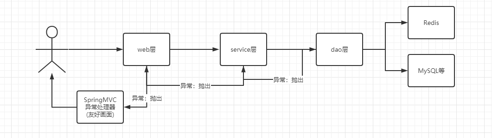

### 4.1 常规异常处理器

编写一个类实现`HandlerExceptionResolver`接口，并添加注解`@Component`；

出异常时自动调用该类中`resolveException`方法

```java
@Component
public class ExceptionResolver implements HandlerExceptionResolver {
    /**
     * 异常处理逻辑在该方法内实现
     * @param request
     * @param response
     * @param handler   handler方法的封装对象
     * @param ex        异常对象
     * @return          ModelAndView，出现异常时要跳转的页面和传递的参数
     */
    @Override
    public ModelAndView resolveException(HttpServletRequest request,
                                         HttpServletResponse response,
                                         Object handler,
                                         Exception ex) {
        System.out.println("my exception is running ...."+ex);
        ModelAndView modelAndView = new ModelAndView();
        if( ex instanceof NullPointerException){
            modelAndView.addObject("msg","空指针异常");
        }else if ( ex instanceof  ArithmeticException){
            modelAndView.addObject("msg","算数运算异常");
        }else{
            modelAndView.addObject("msg","未知的异常");
        }
        modelAndView.setViewName("error.jsp");
        return modelAndView;
    }
}
```


### ==4.2 注解方式异常处理器==

```java
@Component          // 把该类装配进SpringMVC容器
@ControllerAdvice  // 声明该类是一个Controller的通知类，声明后该类就会被加载成异常处理器
public class ExceptionAdvice {

    //类中定义的方法携带@ExceptionHandler注解的会被作为异常处理器，后面添加实际处理的异常类型
    @ExceptionHandler(NullPointerException.class)
    @ResponseBody
    public String doNullException(Exception ex){
        return "空指针异常";
    }

    @ExceptionHandler(ArithmeticException.class)
    @ResponseBody
    public String doArithmeticException(Exception ex){
        return "ArithmeticException";
    }

    @ExceptionHandler(Exception.class)
    @ResponseBody
    public String doException(Exception ex){
        return "all";
    }

}
```


### 4.3  工作中使用

第二种，书写简单，更灵活，处理方法的返回值类型可以自定义：`String`、`POJO`、`ModelAndView`等。


### 4.4 异常处理解决方案

**业务异常**：

- 用户原因导致的异常
- BusinessException、SystemException、DaoException、ServiceException
- 解决思路：发送对应消息给用户，提醒用户规范操作

**系统异常**：

- 系统代码本身产生的异常
- ArithmeticException、NullPointerException、ClassCastException、SQLException
- 解决思路：发送对应消息给用户，安抚用户；
- 重要的是：发送邮件、短息、甚至电话给指定的运维人员、项目负责人，提醒维护

**其它异常**：

- 未预期的其他异常
- Exception
- 解决思路：发送对应消息给用户，安抚用户；
- 更重要的是：发送邮件、短息、甚至电话给指定的运维人员、项目负责人；纳入预期范围内


自定义异常，继承`RuntimeException`

```java
public class BusinessException extends RuntimeException {

    public BusinessException() {
    }

    public BusinessException(String msg) {
        super(msg);
    }
}
```


抛出业务异常

```java
@RequestMapping(value = "/save")
@ResponseBody
public User find(String id) {

    //ArithmeticException、NullPointerException、ClassCastException、NumberFormatException、BindException
    //对用户的非法操作进行判定，并包装成异常对象进行处理，便于统一管理
    if (user.getAge() < 0) {
        //抛出一个业务异常
        throw new BusinessException("用户年龄小于0，数据不合法!");
    }
    return user;
}

```


抛出系统异常

```java
@RequestMapping(value = "/save")
@ResponseBody
public String save(User user) {

    
    //对用户的非法操作进行判定，并包装成异常对象进行处理，便于统一管理
    if (user.getAge() < 0) {
        
        userService.save(user);
        //ArithmeticException、NullPointerException、ClassCastException、NumberFormatException、
        //抛出一个业务异常
        throw new BusinessException("网络错误，请重试");
       
    }
    return "success";
}

```


自定义异常处理器

```java
@Component       
@ControllerAdvice  
public class ExceptionAdvice {

    @ExceptionHandler(BusinessException.class)
    @ResponseBody
    public String doBusinessException(Exception ex){
        return ex.getMessage(); //友善提醒用户
    }

    @ExceptionHandler(ArithmeticException.class)
    @ResponseBody
    public String doArithmeticException(Exception ex){
         // ************************************
        // 发送邮件、短息、甚至电话给指定的运维人员、项目负责人
        // **********************************
        return ex.getMessage(); //友善提醒用户
    }
}
```


## 5. 文件上传

### 5.1 文件上传三要素：

- 表单中需要有个`input:type=file`的表单项
- 表单的提交方式是`POST`
- 表单的`entype`属性必须是`multipart/form-data`


- entype属性取值不同时，提交表单的抓包演示
- 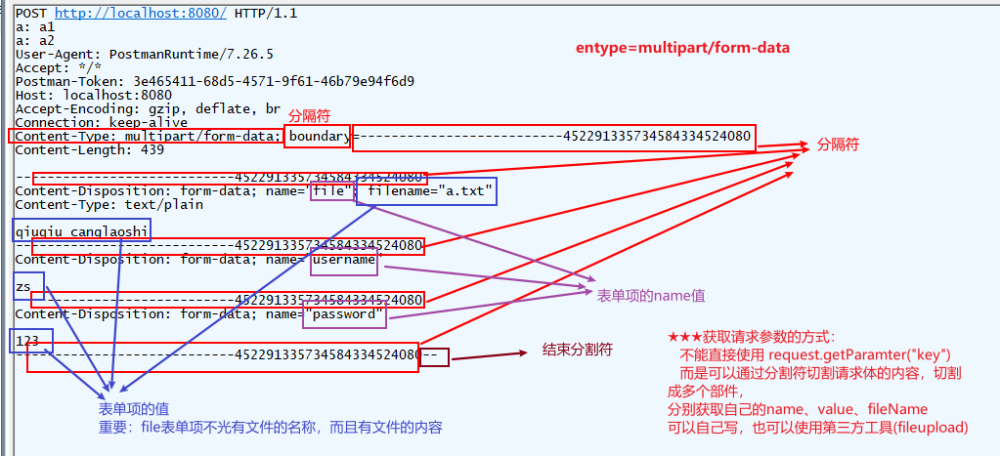
- 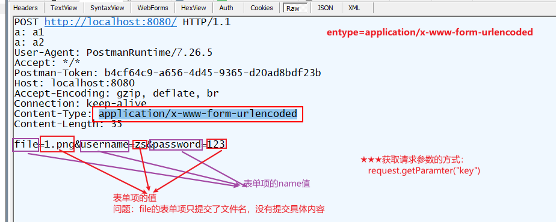


### 5.1 SpringMVC文件上传实现

使用了`Apache`提供的`commons-fileupload`组件（依赖），封装成一个`MultipartResolver`接口；

开发的时候使用该类的实现类`CommonsMultipartResovler`

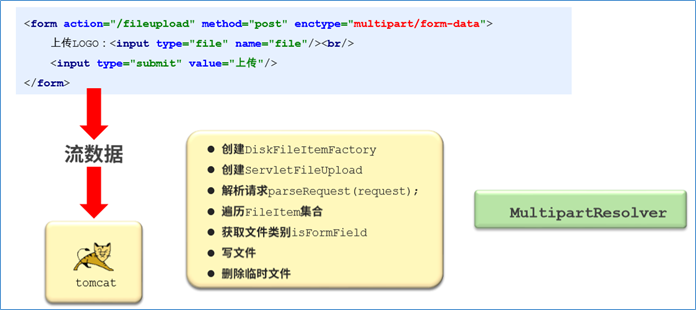

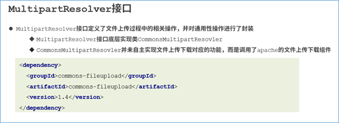


### 5.2 实现步骤

- 导入依赖坐标`commons-fileupload`

  ```xml
  <!-- 导入commons-fileupload，会依赖导入其他相关依赖commons-io -->
  <dependency>
      <groupId>commons-fileupload</groupId>
      <artifactId>commons-fileupload</artifactId>
      <version>1.4</version>
  </dependency>
  ```


- `SpringMVC`配置文件中配置`多部件解析器`，id必须是

  ```xml
  <!--
          多部件文件上传解析器
          id 必须为 multipartResolver
      -->
  <bean id="multipartResolver" class="org.springframework.web.multipart.commons.CommonsMultipartResolver">
      <!-- 设置默认支付编码 -->
      <property name="defaultEncoding" value="utf-8"/>
      <!-- 表单上传(多个)文件的总大小最大值，Spring配置文件默认支持SpELl -->
      <property name="maxUploadSize" value="#{1024*1024*100}"/>
  
      <!-- 表单上传文件每个的最大值，Spring配置文件默认支持SpELl-->
      <property name="maxUploadSizePerFile" value="#{1024*1024*100}"/>
  </bean>
  ```

  

- 访问页面

  ```html
  <form action="/fileupload" method="post" enctype="multipart/form-data">
      <%--文件上传表单的name属性值一定要与controller处理器中方法的参数对应，否则无法实现文件上传--%>
      上传LOGO：<input type="file" name="file"/><br/>
      上传照片：<input type="file" name="file1"/><br/>
      上传任意文件：<input type="file" name="file2"/><br/>
      <input type="submit" value="上传"/>
  </form>
  ```

  

- `Controller`类中`Handler`方法

  ```java
  @RequestMapping(value = "/fileupload")
  //参数中定义MultipartFile参数，用于接收页面提交的type=file类型的表单，要求表单名称与参数名相同
  public String fileupload(MultipartFile file) throws IOException {
      System.out.println("file upload is running ..."+file);
      //保存文件的方法，指定保存的位置和文件名即可，通常文件名使用随机生成策略产生，避免文件名冲突问题
      file.transferTo(new File(realPath,file.getOriginalFilename()));
    
      return "page.jsp";
  }
  ```

  

- 自动封装要求

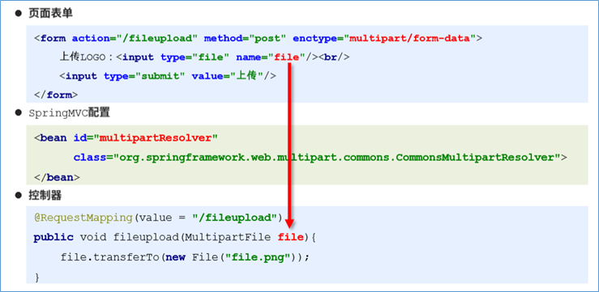


### 5.3 注意事项

- 文件保存位置
- 多文件上传
- 文件名重复
- 文件保存路径过长
- 单个文件夹中文件数量过多

```java
@Controller
public class FileUploadController {

    @RequestMapping(value = "/fileupload")
    //参数中定义MultipartFile参数，用于接收页面提交的type=file类型的表单，要求表单名称与参数名相同
    public String fileupload(MultipartFile file,MultipartFile file1,MultipartFile file2, HttpServletRequest request) throws IOException {
        System.out.println("file upload is running ..."+file);
//        MultipartFile参数中封装了上传的文件的相关信息
//        System.out.println(file.getSize());
//        System.out.println(file.getBytes().length);
//        System.out.println(file.getContentType());
//        System.out.println(file.getName());
//        System.out.println(file.getOriginalFilename());
//        System.out.println(file.isEmpty());
        //首先判断是否是空文件，也就是存储空间占用为0的文件
        if(!file.isEmpty()){
            //如果大小在范围要求内正常处理，否则抛出自定义异常告知用户（未实现）
            //获取原始上传的文件名，可以作为当前文件的真实名称保存到数据库中备用
            String fileName = file.getOriginalFilename();
            //设置保存的路径
            String realPath = request.getServletContext().getRealPath("/images");
            //保存文件的方法，指定保存的位置和文件名即可，通常文件名使用随机生成策略产生，避免文件名冲突问题
            file.transferTo(new File(realPath,file.getOriginalFilename()));
        }
        //测试一次性上传多个文件
        if(!file1.isEmpty()){
            String fileName = file1.getOriginalFilename();
            //可以根据需要，对不同种类的文件做不同的存储路径的区分，修改对应的保存位置即可
            String realPath = request.getServletContext().getRealPath("/images");
            file1.transferTo(new File(realPath,file1.getOriginalFilename()));
        }
        if(!file2.isEmpty()){
            String fileName = file2.getOriginalFilename();
            String realPath = request.getServletContext().getRealPath("/images");
            file2.transferTo(new File(realPath,file2.getOriginalFilename()));
        }
        return "page.jsp";
    }
}
```


```html
<form action="/fileupload" method="post" enctype="multipart/form-data">
    <%--文件上传表单的name属性值一定要与controller处理器中方法的参数对应，否则无法实现文件上传--%>
    上传LOGO：<input type="file" name="file"/><br/>
    上传照片：<input type="file" name="file1"/><br/>
    上传任意文件：<input type="file" name="file2"/><br/>
    <input type="submit" value="上传"/>
</form>
```


## 6. RestFul开发风格

### 6.1 概念

**Restful**是一种软件架构风格、设计风格，而不是标准，只是提供了一组设计原则和约束条件。

主要用于客户端和服务器交互类的软件，基于这个风格设计的软件可以更简洁，更有层次，更易于实现缓存机制等。

 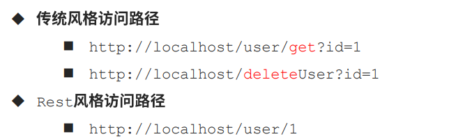

Restful风格的请求是使用`“url + 请求方式`表示一次请求，请求方式使用HTTP 协议中常用的四种方式：

GET：用于获取资源

POST：用于新建资源

PUT：用于更新资源

DELETE：用于删除资源 


> 注：
>
> Restful风格一般使用在异步请求中，两者都是为了提高用户体验。


### 6.2 Restful入门

```java
//@Controller
//@ResponseBody
@RestController   // = @ResponseBody + @Controller 类中所有方法的返回值都写入到了响应体中
//设置公共访问路径，配合下方访问路径使用
@RequestMapping("/user/")
public class UserController {

    //rest风格访问路径完整书写方式
    @RequestMapping("{id}")
    //使用@PathVariable注解获取路径上配置的具名变量，该配置可以使用多次
    public String restLocation(@PathVariable Integer id){
        System.out.println("restful is running ....");
        return "success.jsp";
    }
}
```


> 注

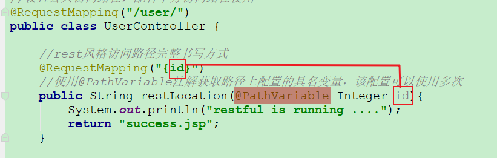


### 6.3 发送`put`/`delete`请求

1. 表单中添加`name="_method"`的隐藏域表单项，值为`PUT` | `DELETE`

   ```html
   <%@page pageEncoding="UTF-8" language="java" contentType="text/html;UTF-8" %>
   <h1>restful风格请求表单</h1>
   <%--切换请求路径为restful风格--%>
   <%--GET请求通过地址栏可以发送，也可以通过设置form的请求方式提交--%>
   <%--POST请求必须通过form的请求方式提交--%>
   <form action="/user/1" method="post">
       <%--当添加了name为_method的隐藏域时，可以通过设置该隐藏域的值，修改请求的提交方式，切换为PUT请求或DELETE请求，但是form表单的提交方式method属性必须填写post--%>
       <%--该配置需要配合HiddenHttpMethodFilter过滤器使用，单独使用无效，请注意检查web.xml中是否配置了对应过滤器--%>
       <input type="hidden" name="_method" value="PUT"/>
       <input type="submit"/>
   </form>
   ```

   

   

2. 配置`SpringMVC`提供的请求过滤器

   ```xml
   <!--配置拦截器，解析请求中的参数_method，否则无法发起PUT请求与DELETE请求，配合页面表单使用-->
   <filter>
       <filter-name>HiddenHttpMethodFilter</filter-name>
       <filter-class>org.springframework.web.filter.HiddenHttpMethodFilter</filter-class>
   </filter>
   <filter-mapping>
       <filter-name>HiddenHttpMethodFilter</filter-name>
       <!-- 表示所有被DispatcherServlet处理的请求，都会经过该拦截器 -->
       <servlet-name>DispatcherServlet</servlet-name>
   </filter-mapping>
   
   <servlet>
       <servlet-name>DispatcherServlet</servlet-name>
       <servlet-class>org.springframework.web.servlet.DispatcherServlet</servlet-class>
       <init-param>
           <param-name>contextConfigLocation</param-name>
           <param-value>classpath*:spring-mvc.xml</param-value>
       </init-param>
   </servlet>
   <servlet-mapping>
       <servlet-name>DispatcherServlet</servlet-name>
       <url-pattern>/</url-pattern>
   </servlet-mapping>
   ```

   

3. `Controller`类的`Handler`方法上添加注解，解析请求参数

   ```java
   //@Controller
   //@ResponseBody
   //设置rest风格的控制器
   @RestController   // = @ResponseBody + @Controller 类中所有方法的返回值都写入到了响应体中
   //设置公共访问路径，配合下方访问路径使用
   @RequestMapping("/user/")
   public class UserController { 
   
       //接收GET请求配置方式
       // @RequestMapping(value = "{id}",method = RequestMethod.GET)
       //接收GET请求简化配置方式
       @GetMapping("{id}")
       public String get(@PathVariable Integer id){
           System.out.println("restful is running ....get:"+id);
           return "success.jsp";
       }
   
       //接收POST请求配置方式
       // @RequestMapping(value = "{id}",method = RequestMethod.POST)
       //接收POST请求简化配置方式
       @PostMapping("{id}")
       public String post(@PathVariable Integer id){
           System.out.println("restful is running ....post:"+id);
           return "success.jsp";
       }
   
       //接收PUT请求简化配置方式
       // @RequestMapping(value = "{id}",method = RequestMethod.PUT)
       //接收PUT请求简化配置方式
       @PutMapping("{id}")
       public String put(@PathVariable Integer id){
           System.out.println("restful is running ....put:"+id);
           return "success.jsp";
       }
   
       //接收DELETE请求简化配置方式
       // @RequestMapping(value = "{id}",method = RequestMethod.DELETE)
       //接收DELETE请求简化配置方式
       @DeleteMapping("{id}")
       public String delete(@PathVariable Integer id){
           System.out.println("restful is running ....delete:"+id);
           return "success.jsp";
       }
   }
   ```

   

> 注：
>
> 使用隐藏域的做法，不适合发送get请求。


## PostMan

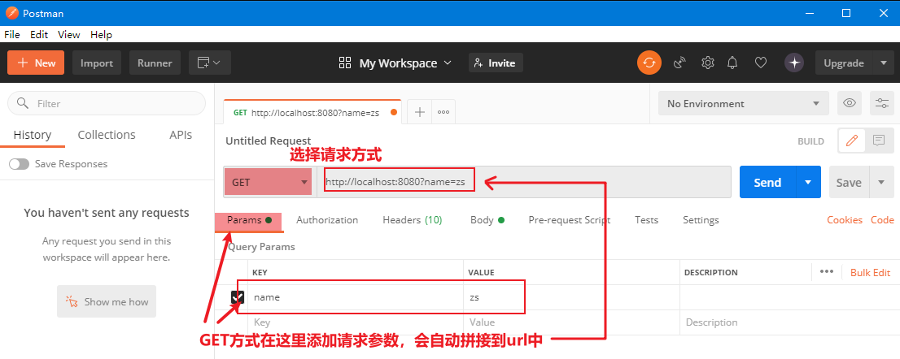

------


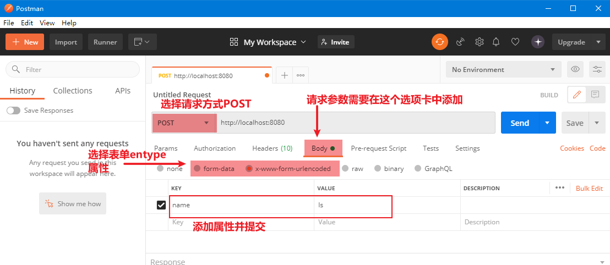


## 处理器映射器

解析并保存  请求URL和处理该请求的`Handler`之间的映射关系，返回`Handler`时会提供当前`Handler`的执行链（包含了相关的`Interceptors`）。


## 处理器适配器

根据前端控制器（`DispatcherServlet`）提供的目标`Handler`，调用目标`Handler`方法；

在调用目标`Handler`之前，处理器适配器`HandlerAdapter`会做请求参数的转换封装，和调用Interceptor链的`preHandle`方法；

在调用目标`Handler`之后，处理器适配器`HandlerAdapter`会做相应数据的转换解析（`POJO`转Json格式字符串、字符串形式视图封装进`ModelAndView`中……

- 解析并转换封装请求参数到实体
- 自动创建并注入业务方法上的形参对象
- 调用过滤器相关方法
- 响应数据的格式转换


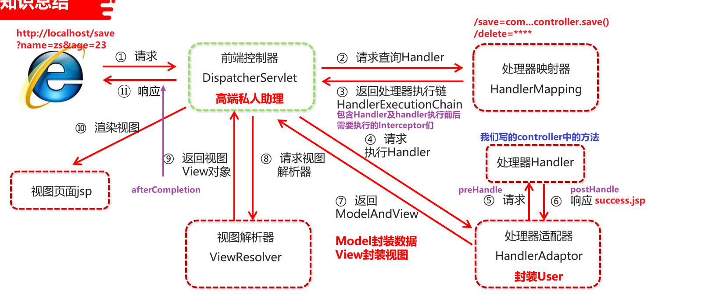


## 相关注解

### @RequestBody

**标注位置**：`Handler`方法形参上

**注解作用**：将异步提交的数据解析封装成形参需要的形式并赋值给形参

```java

```


### @ResponseBody

**标注位置**：`Handler`方法、`Controller`类

**注解作用**：设置当前处理器方法或`Controller`类中所有方法的返回值直接写入响应体

配合注解驱动可以实现直接返回POJO/集合对象时，自动将其转换成`JSON`格式字符串候写入响应体。

```java
@RequestMapping("/ajaxReturnString")
@ResponseBody
public User ajaxReturnString(){
    User user = userService.findById(1);
    return user;
}
```


### @CrossOrigin

**标注位置**：`Handler`方法、`Controller`类

**注解作用**：设置当前处理器方法 / 处理器类中所有方法支持跨域访问

**范例**：

```java
@RequestMapping("/ajaxReturnJson")
@ResponseBody
@CrossOrigin
public User ajaxReturnJson(){
    User user = new User();
    user.setName("Jockme");
    user.setAge(40);
    return user;
}
```


### @ControllerAdvice

**标注位置**：异常处理器类上

**注解作用**：声明该类是一个Controller的通知类，该类就会被加载成异常处理器

**范例**：

```java
@Component
@ControllerAdvice
public class ExceptionAdvice { }
```


### @ExceptionHandler

**标注位置**：异常处理器类中方法

**注解作用**：标注该方法用于处理指定类型的异常，异常类型可以通过该注解的`value`属性指定。

**范例**：

```java
@ExceptionHandler(Exception.class)
@ResponseBody
public String doOtherException(Exception ex){
    return " ";
}
```


### @PathVariable

**标注位置**：`Handler`方法形参上

**注解作用**：从`Restful`方法的请求`url`中获取参数，要求`Handler`请求`URL`中{}内的名称与形参名一致。

**范例**：

```java
@RequestMapping("/user/")
public class UserController {

    //rest风格访问路径完整书写方式
    @RequestMapping("{id}")
    //使用@PathVariable注解获取路径上配置的具名变量，该配置可以使用多次
    public String restLocation(@PathVariable Integer id){
        System.out.println("restful is running ....");
        return "success.jsp";
    }
}
```


### @RestController

=  @ResponseBody + @Controller 

**标注位置**：`Handler`方法、`Controller`类

**注解作用**：类中所有方法的返回值都写入到了响应体中，常用在异步请求项目中或`Restful`风格项目中

**范例**：

```java
//@Controller
//@ResponseBody
@RestController   // = @ResponseBody + @Controller 类中所有方法的返回值都写入到了响应体中
//设置公共访问路径，配合下方访问路径使用
public class UserController {}
```


### @GetMapping

= `@RequestMapping(value = "{id}",method = RequestMethod.GET)`

### @PostMapping

= `@RequestMapping(value = "{id}",method = RequestMethod.POST)`

### @PutMapping

= `@RequestMapping(value = "{id}",method = RequestMethod.PUT)`

### @DeleteMapping

= `@RequestMapping(value = "{id}",method = RequestMethod.DELETE)`

