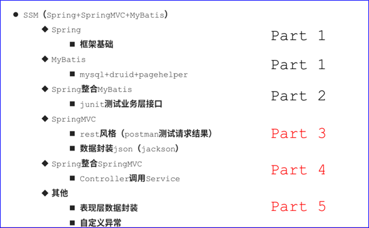
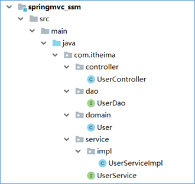
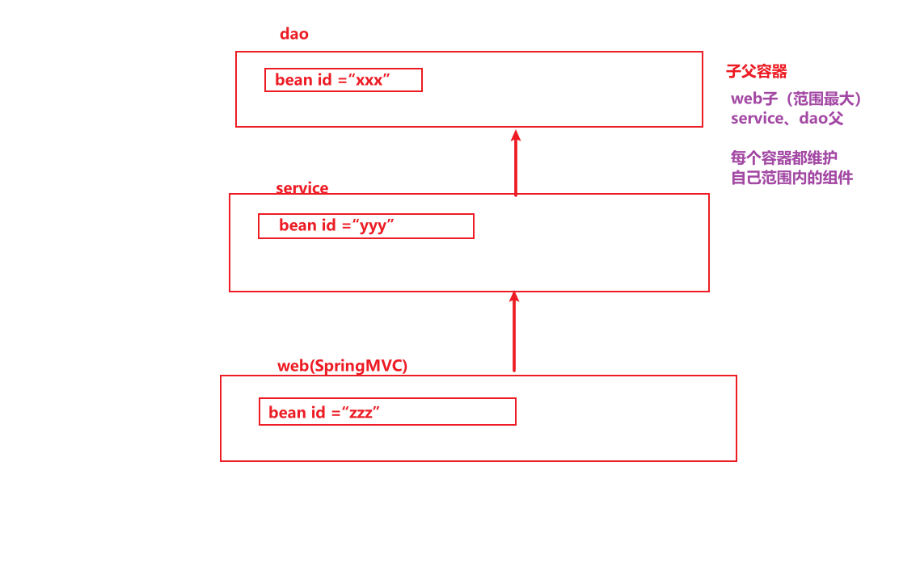
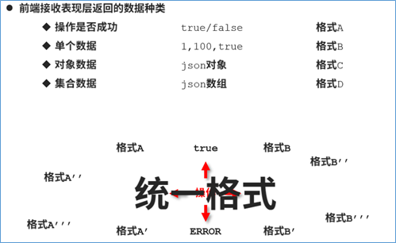
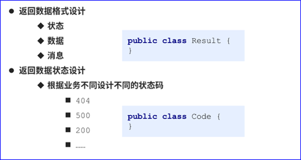

## 今日内容

1. 校验框架（了解）
2. <font color="red">XML+注解完成SSM整合</font>
3. <font color="red">Spring整合SpringMVC</font>
4. 全注解完成SSM整合


## 1. 表单校验

### 1.1 在哪校验

**前端**：用户输入数据之后，立即校验给用户一个好的体验

**后台**：前台发送的数据，判断是否合法，保证系统、数据完整安全

**前端后台都要做，前端做体验，后台做安全。**


### 1.2  后台如何校验


### 1.3 软件版本要求

> 因为`hibernate6.x`需要配合使用`tomcat8.5+`的版本;
>
> 我们项目的tomcat插件都是`7.x`的，所有需要`集成外部tomcat9`启动，不能使用`tomcat插件`，否则会报错。


### 1.4 开发步骤

```xml
<!--导入校验的jsr303规范-->
<dependency>
    <groupId>javax.validation</groupId>
    <artifactId>validation-api</artifactId>
    <version>2.0.1.Final</version>
</dependency>
<!--hiberntae校验框架-->
<dependency>
    <groupId>org.hibernate</groupId>
    <artifactId>hibernate-validator</artifactId>
    <version>6.1.0.Final</version>
</dependency>
```


页面表单

```html
<form action="/addemployee" method="post">
    										<%--页面使用${}获取后台传递的校验信息--%>
    员工姓名：<input type="text" name="name"><span style="color:red">${name}</span><br/>
    员工年龄：<input type="text" name="age"><br/>
    <input type="submit" value="提交">
</form>
```


 

实体类中通过注解添加约束和提示

```java
//提供给各位同学一套实用的校验范例，仅供参考
public class Employee2 implements Serializable {

    private String id;//员工ID
    private String code;//员工编号

    @NotBlank(message = "员工名称不能为空")
    private String name;//员工姓名

    @NotNull(message = "员工年龄不能为空")
    @Max(value = 60,message = "员工年龄不能超过60岁")
    @Min(value = 18,message = "员工年里不能小于18岁")
    private Integer age;//员工年龄

    @NotNull(message = "员工生日不能为空")
    @Past(message = "员工生日要求必须是在当前日期之前")
    private Date birthday;//员工生日

    @NotBlank(message = "请选择员工性别")
    private String gender;//员工性别

    @NotEmpty(message = "请输入员工邮箱")
    @Email(regexp = "@",message = "邮箱必须包含@符号")
    private String email;//员工邮箱

    @NotBlank(message = "请输入员工电话")
    @Pattern(regexp = "^((13[0-9])|(14[5,7])|(15[0-3,5-9])|(17[0,3,5-8])|(18[0-9])|166|198|199|(147))\\d{8}$",message = "手机号不正确")
    private String telephone;//员工电话

    @NotBlank(message = "请选择员工类别")
    private String type;//员工类型：正式工为1，临时工为2

    @Valid//表示需要嵌套验证
    private Address address;//员工住址

```


`Controller`中`Handler`添加处理逻辑

```java
    @RequestMapping(value = "/addemployee")
    public String addEmployee(@Validated({GroupA.class}) Employee employee, Errors errors, Modelm){
        if(errors.hasErrors()){
            List<FieldError> fieldErrors = errors.getFieldErrors();
            System.out.println(fieldErrors.size());
            for(FieldError error : fieldErrors){
                System.out.println(error.getField());
                System.out.println(error.getDefaultMessage());
                m.addAttribute(error.getField(),error.getDefaultMessage());
            }
            return "addemployee.jsp";
        }
        return "success.jsp";
    }

    @RequestMapping(value = "/addemployee2")
    //使用@Valid开启校验，使用@Validated也可以开启校验
    //Errors对象用于封装校验结果，如果不满足校验规则，对应的校验结果封装到该对象中，包含校验的属性名和校验不通过返回的消息
    public String addEmployee2(@Valid Employee employee, Errors errors, Model m){
        //判定Errors对象中是否存在未通过校验的字段
        if(errors.hasErrors()){
            //获取所有未通过校验规则的信息
            List<FieldError> fieldErrors = errors.getFieldErrors();
            System.out.println(fieldErrors.size());
            for(FieldError error : fieldErrors){
                System.out.println(error.getField());
                System.out.println(error.getDefaultMessage());
                //将校验结果信息添加到Model对象中，用于页面显示，后期实际开发中无需这样设定，返回json数据即可
                m.addAttribute(error.getField(),error.getDefaultMessage());
            }
            //当出现未通过校验的字段时，跳转页面到原始页面，进行数据回显
            return "addemployee.jsp";
        }
        return "success.jsp";
    }
```


## ==2. SSM整合（xml+注解）==

### 2.1  建表语句

```sql
CREATE TABLE `user`  (
  `uuid` int(11) NOT NULL AUTO_INCREMENT,
  `userName` varchar(255) CHARACTER SET utf8 COLLATE utf8_general_ci NULL DEFAULT NULL,
  `password` varchar(255) CHARACTER SET utf8 COLLATE utf8_general_ci NULL DEFAULT NULL,
  `realName` varchar(255) CHARACTER SET utf8 COLLATE utf8_general_ci NULL DEFAULT NULL,
  `gender` int(255) NULL DEFAULT NULL,
  `birthday` date NULL DEFAULT NULL,
  PRIMARY KEY (`uuid`) USING BTREE
) ENGINE = InnoDB AUTO_INCREMENT = 6 CHARACTER SET = utf8 COLLATE = utf8_general_ci ROW_FORMAT = Dynamic;

-- ----------------------------
-- Records of user
-- ----------------------------
INSERT INTO `user` VALUES (1, 'Jockme', 'root', 'JockIsMe', 1, '1980-07-25');
INSERT INTO `user` VALUES (2, 'lisi', '123456', '李四', 0, '2000-01-01');
INSERT INTO `user` VALUES (3, 'wangwu', '123456', '王五', 0, '2010-01-01');
INSERT INTO `user` VALUES (5, 'Jock', 'root', 'Jockme', 1, '1980-07-25'); 

```


### 2.2 要做的工作及相关技术




### Part 1 `service`&`dao`层配置编码

**搭建项目的基本结构**




**Spring + Mybatis环境配置&代码编写**

> Ø  配置service层组件扫描
>
> Ø  配置连接池数据源
>
> Ø  配置mybatis的核心类`SQLSessionFactoryBean`（用于整合）
>
> Ø  配置mybatis的分页插件（`PageHelpInterceptor`）
>
> Ø  配置mybatis的映射扫描器`MapperScannerConfiger`（用于整合）
>
> Ø  配置事务管理


### Part 2 `service`&`dao`测试

`Spring`整合`Junit`进行单元测试


### Part 3 `Web`层配置编码

`web`层使用`SpringMVC`

> Ø  `web.xml`加载`springmvc`容器（环境）
>
> Ø  配置乱码过滤器
>
> Ø  配置`controller`层组件扫描
>
> Ø  配置启用注解驱动
>
> Ø  放行静态资源
>
> Ø  `restful`风格请求
>
> Ø  Json封装


> 注：
>
> 1. 在注解驱动上添加配置解决响应乱码问题。
>
> 2. 登录请求虽然是查询，但是不能死守`Restful`使用`get`请求方式，从安全的角度考虑选用`Post`
>
>    所以，登录没有使用Restful。请求`Url`（http://localhost/user/login）映射`Handler`（`login`）方法，用户名和密码这些的登录参数通过请求体传递，在`Handler`形参接收。
>
> 3. `PostMan`发送`post`请求时，参数应该放入`body`中；如果放在`params`中，会被自动拼接进`URL`，但是数据也会提交到后台，请求方式还是`POST`。


```xml
<mvc:annotation-driven >
    <!-- 解决响应乱码（写入到响应体中的中文乱码） -->
    <mvc:message-converters>
        <bean class="org.springframework.http.converter.StringHttpMessageConverter">
            <constructor-arg value="utf-8"/>
        </bean>
    </mvc:message-converters>
</mvc:annotation-driven>
```


### ==Part 4 `Spring`整合`SpringMVC`==

> Ø  `web.xml`整合`Spring`容器（环境）
>
> - 通过全局初始化参数加载`Spring`配置文件
> - 通过`ContextLoadListener`监听`ServletContext`创建后读取`Spring`配置文件实例化Spring容器
>
> Ø  `Controller`中注入`service`并调用方法
>
> Ø 使用`PostMan`测试`Controller`层`Handler`

```xml
<!-- Spring相关配置 -->
<!-- 通过全局初始化参数指定Spring配置文件名称位置 -->
<context-param>
    <!-- 
		ContextLoaderListener获取Spring配置文件时通过param-name作为key，
		获取配置文件的名称（即param-value的值），加载该文件并解析
 		param-name  值固定不变contextConfigLocation
		param-value 配置自己提供的Spring的文件名
	-->
    <param-name>contextConfigLocation</param-name>
    <param-value>classpath:beans.xml</param-value>
</context-param>

<!-- ServletContext创建监听器，会触发创建Spring容器 -->
<listener>
    <listener-class>org.springframework.web.context.ContextLoaderListener</listener-class>
</listener>


<!-- SpringMVC相关配置，并通过初始化参数指定SpringMVC配置文件，项目启动时创建前端控制器 -->
<servlet>
    <servlet-name>dispatcherServlet</servlet-name>
    <servlet-class>org.springframework.web.servlet.DispatcherServlet</servlet-class>
    <init-param>
        <param-name>contextConfigLocation</param-name>
        <param-value>classpath:spring-mvc.xml</param-value>
    </init-param>
    <load-on-startup>1</load-on-startup>
</servlet>
<!--配置全局过滤器，设置编码为UTF-8，解决post请求乱码问题-->
<filter>
    <filter-name>encodingFilter</filter-name>
    <filter-class>org.springframework.web.filter.CharacterEncodingFilter</filter-class>
    <init-param>
        <param-name>encoding</param-name>
        <param-value>utf-8</param-value>
    </init-param>
    <init-param>
        <param-name>forceEncoding</param-name>
        <param-value>true</param-value>
    </init-param>
</filter>
<filter-mapping>
    <filter-name>encodingFilter</filter-name>
    <url-pattern>/*</url-pattern>
</filter-mapping>
```





### ==Part 5 `Web`层响应数据封装==






`Result.java`

```java
package com.itheima.controller.results;

@Data
@NoArgsConstructor
@AllArgsConstructor
public class Result {
    //    操作结果编码
    private Integer code;
    //    操作数据结果
    private Object data;
    //    消息
    private String message;

    public Result(Integer code) { this.code = code; }

    public Result(Integer code, Object data) {
        this.code = code;
        this.data = data;
    }
}
```

`Code.java`

```java
package com.itheima.controller.results;

public class Code {
    //    操作结果编码
    public static final Integer SAVE_OK = 20011;
    public static final Integer UPDATE_OK = 20021;
    public static final Integer DELETE_OK = 20031;
    public static final Integer GET_OK = 20041;

    public static final Integer SAVE_ERROR = 20010;
    public static final Integer UPDATE_ERROR = 20020;
    public static final Integer DELETE_ERROR = 20030;
    public static final Integer GET_ERROR = 20040;

    //    系统错误编码
    //    操作权限编码
    //    校验结果编码
}
```


`UserController.java`

```java
// 将web层所有方法的返回值类型修改为Result，把所有要返回的数据封装到result对象中返回
```


## 全注解整合SSM(理解)


