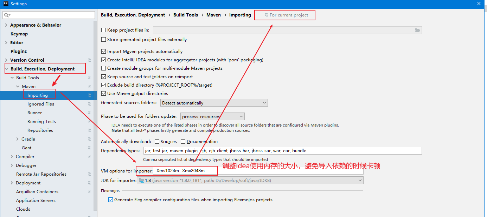
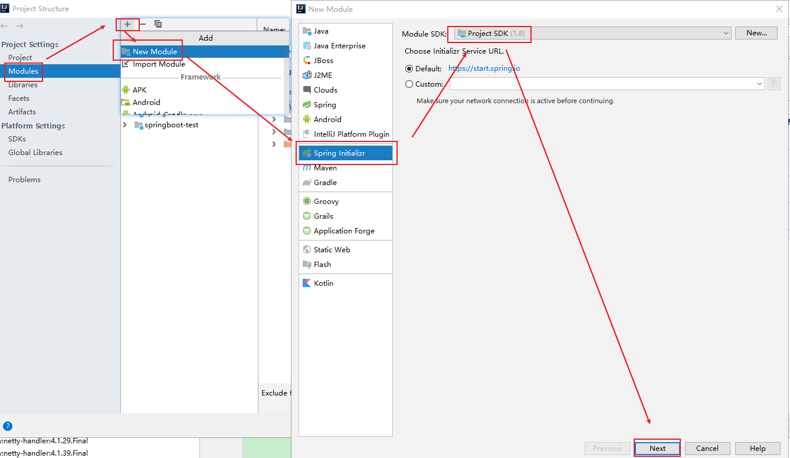
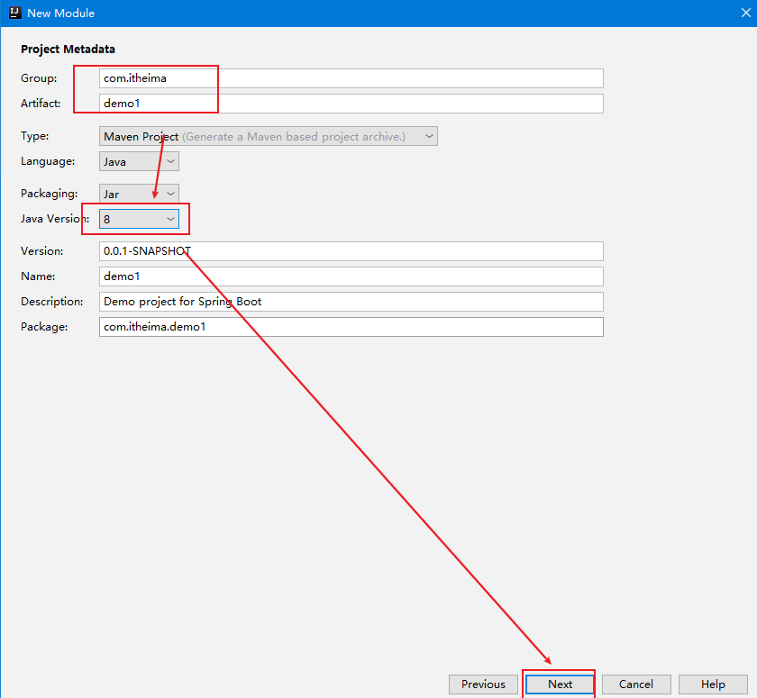
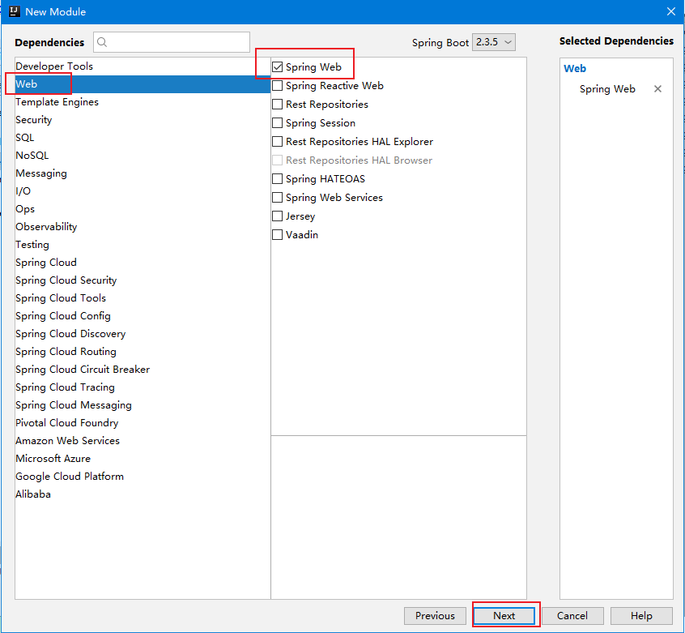
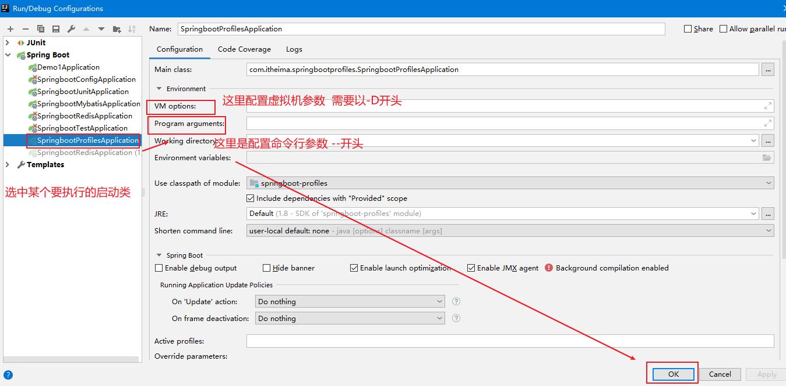

- [ ] `SpringBoot`概念
- [ ] `SpringBoot`快速入门
- [ ] `SpringBoot`场景启动器原理分析
- [ ] `SpringBoot`配置
- [ ] `SpringBoot`整合其他框架


## 1. `SpringBoot`入门

### 1.1 概述

**作用**：快速开发`Spring`项目：简化配置 ，简化依赖引入。

**`Spring`的缺点**：配置繁琐、依赖繁琐。

可以使用`SpringBoot`的自动配置和场景启动器克服上述缺点。

`SpringBoot`实现0配置，1个依赖完成项目搭建。内部提供了大量默认配置，按照约定方式编码即可；针对不同的场景封装了`启动器`，web场景启动器中引入了所有web需要的依赖，只引入`场景启动器`坐标即可。

SpringBoot提供了一种**<font color="red">快速使用Spring的方式</font>**，基于**<font color="red">约定优于配置</font>**的思想，可以让开发人员不必在配置与逻辑业务之间进行思维的切换，全身心的投入到逻辑业务的代码编写中，从而大大提高了开发的效率，一定程度上缩短了项目周期。

`SpringBoot`还提供了一些非功能性特性嵌入式服务器、安全、指标、健康监测、外部配置等。

`SpringBoot`提供了一种快速开发Spring项目的方式，而不是对Spring功能上的增强。

### 1.2 快速入门

- `pom.xml`

  ```xml
  <groupId>com.itheima</groupId>
  <artifactId>springboot-helloworld</artifactId>
  <version>1.0-SNAPSHOT</version>
  
  <!-- 私服 -->
  
  <!--springboot工程需要继承的父工程-->
  <parent>
      <groupId>org.springframework.boot</groupId>
      <artifactId>spring-boot-starter-parent</artifactId>
      <version>2.3.5.RELEASE</version>
  </parent>
  
  <dependencies>
      <!--web开发的起步依赖/场景启动器-->
      <dependency>
          <groupId>org.springframework.boot</groupId>
          <artifactId>spring-boot-starter-web</artifactId>
      </dependency>
  </dependencies>
  ```

  

- 编写`controller`-`HelloController.java`

  ```java
  //@RestController
  @Controller
  @ResponeBody
  public class HelloController {
  
      @RequestMapping("/hello")
      public String hello(){
          return " hello Spring Boot !";
      }
  }
  ```

  

- 编写启动类/引导类

  ```java
  @SpringBootApplication
  public class HelloApplication {
  
      public static void main(String[] args) {
          SpringApplication.run(HelloApplication.class,args);
      }
  }
  ```

  

- 运行启动类的`main`方法即可发布项目并启动web容器，访问8080即可


> 注意
>
> 1. SpringBoot在创建项目时，使用jar的打包方式。继承统一的父模块。
> 2. `web`场景启动器会自动引入`web`相关的依赖和插件
> 3. SpringBoot的引导类，是项目入口，运行main方法就可以启动项目。**该类需要在主包下**。
> 4. 使用SpringBoot和Spring构建的项目，业务代码编写方式完全一样。简单的是配置和依赖导入。





### 1.3 快速构建

- 已经连接外网
- 依赖最好是提前下载好的（目前使用这种方式，默认选用springboot是2.3.5.RELEASE）











## 2. 场景启动器starter

官网链接：https://docs.spring.io/spring-boot/docs/current/reference/html/using-spring-boot.html#using-boot-starter

### 2.1 `spring-boot-starter-parent`

当前模块

```xml
<parent>
    <groupId>org.springframework.boot</groupId>
    <artifactId>spring-boot-starter-parent</artifactId>
    <version>2.3.5.RELEASE</version>
    <relativePath/> 
</parent>
<groupId>com.itheima</groupId>
<artifactId>helloApplication</artifactId>
<version>0.0.1-SNAPSHOT</version>
```


当前模块父模块

```xml
<parent>
    <groupId>org.springframework.boot</groupId>
    <artifactId>spring-boot-dependencies</artifactId>
    <version>2.3.5.RELEASE</version>
</parent>
<artifactId>spring-boot-starter-parent</artifactId>
<packaging>pom</packaging>
```

父模块的父模块中进行版本管理锁定

```xml
<groupId>org.springframework.boot</groupId>
<artifactId>spring-boot-dependencies</artifactId>
<version>2.3.5.RELEASE</version>
<packaging>pom</packaging>
<properties>
    <!-- 维护了大量的版本自定义属性 -->
    <activemq.version>5.15.13</activemq.version>
    <antlr2.version>2.7.7</antlr2.version>
    <xxx.version>很多版本</xxx.version>
</properties>
<!-- 依赖、版本锁定 -->
<dependencyManagement>
    <dependencies>
        <dependency>
            <groupId>org.apache.activemq</groupId>
            <artifactId>activemq-amqp</artifactId>
            <version>${activemq.version}</version>
        </dependency>
         <dependency>
            <很多其他依赖></很多其他依赖>
        </dependency>
    </dependencies>
</dependencyManagement>
```


### 2.2 `spring-boot-starter-web`

当前项目引入`web`启动器依赖

```xml
<dependencies>
    <!--
		web开发的起步依赖/场景启动器
		大多数的依赖我们只需要提供groupId和artifactId，版本已经在父模块中锁定好	
	-->
    <dependency>
        <groupId>org.springframework.boot</groupId>
        <artifactId>spring-boot-starter-web</artifactId>
    </dependency>
</dependencies>
```


`spring-boot-starter-web`中配置

```xml
<modelVersion>4.0.0</modelVersion>
<groupId>org.springframework.boot</groupId>
<artifactId>spring-boot-starter-web</artifactId>
<version>2.3.5.RELEASE</version>
<dependencies>
    <!-- 引入SpringBoot默认根启动器 -->
    <dependency>
      <groupId>org.springframework.boot</groupId>
      <artifactId>spring-boot-starter</artifactId>
      <version>2.3.5.RELEASE</version>
      <scope>compile</scope>
    </dependency>
    <!-- 引入SpringBoot的json依赖 -->
    <dependency>
      <groupId>org.springframework.boot</groupId>
      <artifactId>spring-boot-starter-json</artifactId>
      <version>2.3.5.RELEASE</version>
      <scope>compile</scope>
    </dependency>
    <!-- 引入SpringBoot的tomcat依赖，一个嵌入式的tomcat -->
    <dependency>
      <groupId>org.springframework.boot</groupId>
      <artifactId>spring-boot-starter-tomcat</artifactId>
      <version>2.3.5.RELEASE</version>
      <scope>compile</scope>
    </dependency>
    <!-- 引入Spring-web依赖 -->
    <dependency>
      <groupId>org.springframework</groupId>
      <artifactId>spring-web</artifactId>
      <version>5.2.10.RELEASE</version>
      <scope>compile</scope>
    </dependency>
    <!-- 引入Spring-webmvc依赖 -->
    <dependency>
      <groupId>org.springframework</groupId>
      <artifactId>spring-webmvc</artifactId>
      <version>5.2.10.RELEASE</version>
      <scope>compile</scope>
    </dependency>
  </dependencies>
```


### 2.3 自定义依赖及版本

可以根据自己的需要，如果用到了用到了场景启动器中未提供的依赖或者版本，自己导入对应的依赖/版本即可。

```xml
<dependency>
    <groupId>mysql</groupId>
    <artifactId>mysql-connector-java</artifactId>
    <version>5.1.48</version>
</dependency>
```


## 3. 配置文件

### 3.1 配置文件分类

`SpringBoot`支持`yml/yaml`和`properties`等格式的配置文件。

按照约定，配置文件的文件名为`application.xxx`

三种配置文件的优先级：`properties > yml > yaml`，

多个配置文件中配置了相同的key，优先级高的生效；多个配置文件中配置了不同的key，同时生效。


### 3.2 `yaml`配置语法

- `YAML`全称是 `YAML Ain't Markup Language` 。`YAML`是一种简单直观的数据序列化格式，被主流的语言支持
- `YAML`文件是以数据为核心的，比传统的`xml`方式更加简洁。
- `YAML`文件的扩展名可以使用`.yml`或者`.yaml`。


#### 3.2.1 `yaml`简洁，以数据为核心

- properties

  ```properties
  server.port=8080
  server.address=127.0.0.1
  ```

- `xml`

  ```java
  <server>
      <port>8080</port>
      <address>127.0.0.1</address>
  </server>
  ```

- `yml/yaml`-简洁，以数据为核心

  ```yaml
  server: 
    port: 8080
    address: 127.0.0.1
  ```

#### 3.2.2 YAML：基本语法

- 大小写敏感

- 数据值前边必须有空格，作为分隔符

- 使用缩进表示层级关系

- 缩进时不允许使用`Tab`键，只允许使用空格（各个系统 Tab对应的 空格数目可能不同，导致层次混乱）。

- 缩进的空格数目不重要，只要相同层级的元素左侧对齐即可

- `# `表示注释，从这个字符一直到行尾，都会被解析器忽略。

  ```yaml
  server: 
    port: 8080
    address: 127.0.0.1
  name: abc
  ```


### 3.3 yml数据格式

编写中需要遵循`YAML`语法规则。

支持三种数据格式，推荐缩进方式，不推荐行内方式。

- 对象(map)：键值对的集合。

  ```yaml
  person:
    name: zhangsan
  # 行内写法
  person: {name: zhangsan}
  ```

- 数组：一组按次序排列的值，使用 “- ”表示数组每个元素

  ```yaml
  address:
    - beijin
    - shanghai
  
  # 行内写法
  address: [beijing,shanghai]
  ```

- 纯量（常量）：单个的、不可再分的值

  ```yaml
  msg1: 'hello \n world'  # 单引忽略转义字符，原样输出
  msg2: "hello \n world"  # 双引识别转义字符SpringBoot 配置，转义特殊符号
  ```

- 参数引用： `${key}`

  ```yaml
  name: lisi
  
  person:
    name: ${name} # 引用已经定义好的name值
  ```


### 3.4 读取配置文件

- `SpringBoot`内置的`key`可以被读取并自动识别使用

- 自定义的`key`已被读取，但是需要手动获取。

- 配置yml文件`application.yml`

  ```yaml
  name: lisi
  
  address:
      - hangzhou
      - xiasha
  msg1:
    提示信息1
  msg2:
    提示信息2
  person:
    name: zhangsan
    age: 20
    address:
    - beijing
    - shanghai
  ```

  

### 3.4.1 通过`@Value`读取

- `Controller`类中，在成员变量上添加`@Value`注解读取并注入

  ```java
  @RestController
  public class HelloController {
      @Value("${name}")
      private String name;
      @Value("${person.name}")
      private String name2;
      @Value("${person.age}")
      private int age;
      @Value("${address[0]}")
      private String address1;
      @Value("${msg1}")
      private String msg1;
  
      @RequestMapping("/hello2")
      public String hello2() {
          System.out.println(name);
          System.out.println(name2);
          System.out.println(age);
          System.out.println(address1);
          System.out.println(msg1);
      }
  }
  ```

  


### 3.4.2 通过环境变量对象读取

- `Controller`类中，添加`Environment`类型成员变量并`@Autowired`注入，使用该变量的`getProperty("key")`

  ```java
  @RestController
  public class HelloController {
  
      @Autowired
      private Environment env;
  
      @RequestMapping("/hello2")
      public String hello2() {
          System.out.println(env.getProperty("person.name"));
          System.out.println(env.getProperty("address[0]"));
          return "hello Spring Boot 222!";
      }
  }
  ```

  

### ==3.4.3 通过`@ConfigurationProperties`==

- 绑定配置内容与实体对象`POJO`，配置文件中配置的属性要与`POJO`中属性一一对应

- `POJO`类定义，并添加两个注解

  ```java
  @Component      // 装配进Spring容器，只有容器中的组件才能使用下面注解的功能
  // @ConfigurationProperties 告诉SpringBoot将本类中的所有属性和配置文件中相关的配置进行绑定
  // prefix 要读取配置文件的前缀，如果配置则在当前指定的前缀路径下按照属性名匹配；
  // 		否则直接在配置文件一级路径下匹配，匹配失败则初始化默认值
  @ConfigurationProperties(prefix = "person")
  @Data
  @NoArgsConstructor
  @AllArgsConstructor
  public class Person {
  
      private String name;
      private int age;
      private String[] address;
      // 配置文件没有这个属性，匹配失败，获取person对象中的gender就是器默认值 null/zhangsan
      private String gender = “zhangsan”;  
  }
  ```


- `Controller`类中，添加`Person`类型成员变量并`@Autowired`注入，即可直接使用

  ```java
  @RestController
  public class HelloController {
  
      @Autowired
      private Person person;
  
      @RequestMapping("/hello2")
      public String hello2() {
          System.out.println(person);
          String[] address = person.getAddress();
          for (String s : address) {
              System.out.println(s);
          }
          return "hello Spring Boot 222!";
      }
  }
  ```


- SpringBoot配置处理器

  ```xml
  <!--SpringBoot配置处理器，让配置文件中自定义的属性有提示-->
  <dependency>
      <groupId>org.springframework.boot</groupId>
      <artifactId>spring-boot-configuration-processor</artifactId>
  </dependency>
  ```

  

## 4. `profile`多环境配置

项目中可以配置多套环境，方便在不同的时期快速切换到不同的环境。

配置方式有两种

- 使用`properties`多文件
- 使用`yml`单文件多文档

激活其中某个`profile`的方式有三种

- 配置文件方式：已讲，使用`spring.profiles.active`
- 虚拟机参数：`-Dspring.profiles.active=test`(run/debug configurations中)
- 命令行参数：`--spring.profiles.active=pro`
- 命令行参数祖籍：`java -jar xxx.jar --spring.profiles.active=pro --第2个参数`


### 4.1 使用`properties`多文件配置

- 新建多个环境的配置文件

  > 配置文件需要以`application-`开头，后面的内容为配置的名字

- dev：`application-dev.properties`

  ```properties
  server.port=8081
  ```

  pro：`application-pro.properties`

  ```properties
  server.port=8082
  ```

  test：`application-test.properties`

  ```properties
  server.port=8083
  ```

- 使用三种激活方式的一种激活其中一个profile即可。eg：使用配置文件的方式激活

  `application.properties`

  ```properties
  spring.profiles.active=dev
  ```

  

  

  


### 4.2 使用`yml`单文件多文档配置

在`application.yml`中，使用`---`三个横杠分割多个`profile`

```yaml
# 每个profile的参数独立即可，通过---与其他配置参数分割
server:
  port: 8081

spring:
  profiles: dev
---

server:
  port: 8082

spring:
  profiles: test
---
server:
  port: 8083

spring:
  profiles: pro
  
---  # 通过配置文件的方式激活某个配置
spring:
  profiles:
    active: test
```


### 4.3 `profile`激活方式




## 5. 配置文件加载顺序


https://docs.spring.io/spring-boot/docs/current/reference/html/spring-boot-features.html#boot-features-external-config-application-property-files

按照下面的优先级加载配置文件。

多个配置文件中配置了相同的key，优先级高的生效；多个配置文件中配置了不同的key，同时生效。

1. `file:./config/`
2. `file:./config/*/`
3. `file:./`
4. `classpath:/config/`
5. `classpath:/`


### 5.1 配置文件的加载顺序

1. [Devtools global settings properties](https://docs.spring.io/spring-boot/docs/current/reference/html/using-spring-boot.html#using-boot-devtools-globalsettings) in the `$HOME/.config/spring-boot` directory when devtools is active.
2. [`@TestPropertySource`](https://docs.spring.io/spring/docs/5.2.10.RELEASE/javadoc-api/org/springframework/test/context/TestPropertySource.html) annotations on your tests.
3. `properties` attribute on your tests. Available on [`@SpringBootTest`](https://docs.spring.io/spring-boot/docs/2.3.5.RELEASE/api/org/springframework/boot/test/context/SpringBootTest.html) and the [test annotations for testing a particular slice of your application](https://docs.spring.io/spring-boot/docs/current/reference/html/spring-boot-features.html#boot-features-testing-spring-boot-applications-testing-autoconfigured-tests).
4. **<font color="red">Command line arguments.</font>**
5. Properties from `SPRING_APPLICATION_JSON` (inline JSON embedded in an environment variable or system property).
6. `ServletConfig` init parameters.
7. `ServletContext` init parameters.
8. JNDI attributes from `java:comp/env`.
9. Java System properties (`System.getProperties()`).
10. OS environment variables.
11. A `RandomValuePropertySource` that has properties only in `random.*`.
12. **<font color="red">[Profile-specific application properties](https://docs.spring.io/spring-boot/docs/current/reference/html/spring-boot-features.html#boot-features-external-config-profile-specific-properties) outside of your packaged jar (`application-{profile}.properties` and YAML variants).</font>**
13. **<font color="red">[Profile-specific application properties](https://docs.spring.io/spring-boot/docs/current/reference/html/spring-boot-features.html#boot-features-external-config-profile-specific-properties) packaged inside your jar (`application-{profile}.properties` and YAML variants).</font>**
14. **<font color="red">[Application properties](https://docs.spring.io/spring-boot/docs/current/reference/html/spring-boot-features.html#boot-features-external-config-application-property-files) outside of your packaged jar (`application.properties` and YAML variants).</font>**
15. **<font color="red">[Application properties](https://docs.spring.io/spring-boot/docs/current/reference/html/spring-boot-features.html#boot-features-external-config-application-property-files) packaged inside your jar (`application.properties` and YAML variants).</font>**
16. [`@PropertySource`](https://docs.spring.io/spring/docs/5.2.10.RELEASE/javadoc-api/org/springframework/context/annotation/PropertySource.html) annotations on your `@Configuration` classes. Please note that such property sources are not added to the `Environment` until the application context is being refreshed. This is too late to configure certain properties such as `logging.*` and `spring.main.*` which are read before refresh begins.
17. Default properties (specified by setting `SpringApplication.setDefaultProperties`).


配置文件可以放在任意位置，通过命令行添加参数读取

```shell
java -jar xxx.jar --spring.config.location=文件的绝对路径
```


加载默认文件名称的配置文件，这个时候不需要指定文件名

但是需要文件放在指定的位置，启动的时候不用指定参数，默认加载。

1. jar包外面同级`application.properties/application.yml`
2. jar包中classpath下`application.properties/application.yml`

```shell
java -jar xxx.jar
```


### 5.2 相关参数及其作用

| 参数                            | 含义                                                        |
| :------------------------------ | ----------------------------------------------------------- |
| `--server.prot`                 | 项目服务端口，默认8080                                      |
| `--server.servlet.context-path` | 项目虚拟路径，默认`/`                                       |
| `--spring.config.location`      | 加载外部配置文件，多个使用`,`分割，`classpath:`类路径       |
| `--spring.config.name=xx`       | 修改默认的配置文件名，默认`application.yml`，修改为`xx.yml` |


## 6. 整合第三方框架

### 6.1  整合`junit`

- 创建`SpringBoot`模块，引入`test场景启动器`

  ```xml
  <parent>
      <groupId>org.springframework.boot</groupId>
      <artifactId>spring-boot-starter-parent</artifactId>
      <version>2.3.5.RELEASE</version>
  </parent>
  <groupId>com.itheima</groupId>
  <artifactId>springboot-test</artifactId>
  <version>0.0.1-SNAPSHOT</version>
  
  <properties>
      <java.version>1.8</java.version>
  </properties>
  
  <dependencies>
      <!-- 引入test场景启动器 -->
      <dependency>
          <groupId>org.springframework.boot</groupId>
          <artifactId>spring-boot-starter-test</artifactId>
          <scope>test</scope>
      </dependency>
  </dependencies>
  ```

- 编写测试类，并添加注解修改单元测试的运行器

  ```java
  @RunWith(SpringRunner.class)  // 修改单元测试的运行器，junit4需要，5不需要
  // @SpringBootTest(classes=SpringBootTestApplicantion.class) //指定当前SpringBoot的启动类
  @SpringBootTest  //如果当前测试类在SpringBoot项目的主包下，启动类可以省略不写
  public class UserServiceTest {
  ```

- 注入要测试的对象并测试

  ```java
  @RunWith(SpringRunner.class)
  @SpringBootTest
  public class UserServiceTest {
  
      @Autowired
      private UserService userService;
  
      @Test  //junit4，@Test的包时org.junit.***  junit5的包
      public void testAdd() {
          userService.add();
      }
  }
  ```

  

### 6.2 整合 `mybatis`

#### 6.2.1 `Mapper`使用注解绑定SQL

- 创建`SpringBoot`模块，引入`mybatis场景启动器、mysql数据库驱动`

  ```xml
  <parent>
      <groupId>org.springframework.boot</groupId>
      <artifactId>spring-boot-starter-parent</artifactId>
      <version>2.3.5.RELEASE</version>
  </parent>
  <groupId>com.itheima</groupId>
  <artifactId>springboot-test</artifactId>
  <version>0.0.1-SNAPSHOT</version>
  
  <properties>
      <java.version>1.8</java.version>
  </properties>
  
  <dependencies>
      <!-- mybatis场景启动器 -->
      <dependency>
          <groupId>org.mybatis.spring.boot</groupId>
          <artifactId>mybatis-spring-boot-starter</artifactId>
          <version>2.1.0</version>
      </dependency>
  
      <!-- mysql数据库驱动 -->
      <dependency>
          <groupId>mysql</groupId>
          <artifactId>mysql-connector-java</artifactId>
          <version>5.1.48</version>
          <!--<scope>runtime</scope>-->
      </dependency>
      <!-- test场景启动器 -->
      <dependency>
          <groupId>org.springframework.boot</groupId>
          <artifactId>spring-boot-starter-test</artifactId>
          <scope>test</scope>
      </dependency>
      <!-- lombok -->
      <dependency>
          <groupId>org.projectlombok</groupId>
          <artifactId>lombok</artifactId>
          <scope>provided</scope>
      </dependency>
  </dependencies>
  ```

- `application.yml`配置文件

  ```yaml
  spring:
    datasource:
      # 如果使用的是高版本的mysql数据库驱动，强制要求使用时区
  	# url: jdbc:mysql:///springboot?serverTimezone=UTC
      url: jdbc:mysql:///springboot
      username: root
      password: root
      # 如果使用的是高版本的mysql数据库驱动，建议使用新的驱动，类名如下：
      # com.mysql.cj.jdbc.Driver
      driver-class-name: com.mysql.jdbc.Driver
  ```


- 编写`UserMapper.java`接口

  ```java
  @Mapper   // Mybatis提供的mapper标记注解，会被自动装配到容器中
  // Spring提供的装配Bean的注解，如果已经@Mapper了，可以不用@Repository，不能反过来。
  // @Repository   
  public interface UserMapper {
  
      @Select("select * from t_user")
      List<User> findAll();
  }
  ```

  

- 注入要测试的对象并测试

  ```java
  @RunWith(SpringRunner.class)
  @SpringBootTest
  public class SpringbootMybatisApplicationTests {
  
      @Autowired
      private UserMapper userMapper;
      
      @Test
      public void testFindAll() {
          List<User> list = userMapper.findAll();
          System.out.println(list);
      }
  }
  ```

  


#### 6.2.1 `Mapper`使用XML绑定SQL

- 创建`SpringBoot`模块，引入`mybatis场景启动器、mysql数据库驱动`

  ```xml
  <!-- 与上相同，可以使用上述环境，略 -->
  ```

- `application.yml`配置文件

  ```yaml
  spring:
    datasource:
      # 如果使用的是高版本的mysql数据库驱动，强制要求使用时区
  	# url: jdbc:mysql:///springboot?serverTimezone=UTC
      url: jdbc:mysql:///springboot
      username: root
      password: root
      # 如果使用的是高版本的mysql数据库驱动，建议使用新的驱动，类名如下：
      # com.mysql.cj.jdbc.Driver
      driver-class-name: com.mysql.jdbc.Driver
      
  # mybatis 如果mybatis按照约定的格式配置，下面的内容可以不用配置
  # mybatis:
  # mapper-locations: classpath:mapper/*Mapper.xml # mapper映射文件路径
    #type-aliases-package: com.itheima.springbootmybatis.domain
  
    # config-location:  # 指定mybatis的核心配置文件
  ```


- 编写`UserXmlMapper.java`接口

  ```java
  @Mapper
  @Repository
  public interface UserXmlMapper {
  
      public List<User> findAll();
  }
  ```

- 编写`UserXmlMapper.xml`映射配置文件，路径与对应的接口相同

  ```xml
  <?xml version="1.0" encoding="UTF-8" ?>
  <!DOCTYPE mapper PUBLIC "-//mybatis.org//DTD Mapper 3.0//EN" "http://mybatis.org/dtd/mybatis-3-mapper.dtd">
  <mapper namespace="com.itheima.springbootmybatis.mapper.UserXmlMapper">
      <select id="findAll" resultType="com.itheima.springbootmybatis.domain.User">
          select * from t_user
      </select>
  </mapper>
  ```

  

- 注入要测试的对象并测试

  ```java
  @RunWith(SpringRunner.class)
  @SpringBootTest
  public class SpringbootMybatisApplicationTests {
  
      @Autowired
      private UserMapper userMapper;
      
      @Test
      public void testFindAll() {
          List<User> list = userMapper.findAll();
          System.out.println(list);
      }
  }
  ```

  


### 6.3 整合`redis`

- 创建`SpringBoot`模块，引入`redis场景启动器`

  ```xml
  <parent>
      <groupId>org.springframework.boot</groupId>
      <artifactId>spring-boot-starter-parent</artifactId>
      <version>2.3.5.RELEASE</version>
  </parent>
  <groupId>com.itheima</groupId>
  <artifactId>springboot-test</artifactId>
  <version>0.0.1-SNAPSHOT</version>
  
  <properties>
      <java.version>1.8</java.version>
  </properties>
  
  <!-- 私服  -->
  
  <dependencies>
      <!-- 引入redis场景启动器 -->
      <dependency>
          <groupId>org.springframework.boot</groupId>
          <artifactId>spring-boot-starter-data-redis</artifactId>
          <scope>test</scope>
      </dependency>
      <!-- 引入test场景启动器 -->
      <dependency>
          <groupId>org.springframework.boot</groupId>
          <artifactId>spring-boot-starter-test</artifactId>
          <scope>test</scope>
      </dependency>
  </dependencies>
  ```

- `SpringBoot`的`redis场景启动器`中默认使用以下参数连接`redis`服务

  ```properties
  # 如果使用的本机默认端口的redis服务器，可以不用配置
  # 如果要指定其他值，可以在默认配置文件中添加如下redis相关配置
  spring.redis.host=127.0.0.1
  spring.redis.prot=6379
  ```

  

- 注入要测试的`RedisTemplate`对象并测试

  ```java
  @RunWith(SpringRunner.class)
  @SpringBootTest
  public class SpringbootRedisApplicationTests {
  
      @Autowired
      private RedisTemplate redisTemplate;
  
      @Test
      public void testSet() {
          //存入数据
          redisTemplate.boundValueOps("name").set("zhangsan");
      }
  
      @Test
      public void testGet() {
          //获取数据
          Object name = redisTemplate.boundValueOps("name").get();
          System.out.println(name);
      }
  
  }
  ```

  

- 测试时，提示因为保护模式被拒绝，解决思路如下，任选其一即可：
  1. 配置文件中`使用bind 192.168.x.xx`绑定只能使用指定的网卡端口连接`redis`
  2. 配置文件中`protected-mode`设置为`no`


### Google chrome插件

- Tampermonkey  
  - 智能划词翻译脚本：https://greasyfork.org/zh-CN/scripts/35251-%E6%99%BA%E8%83%BD%E5%88%92%E8%AF%8D%E7%BF%BB%E8%AF%91