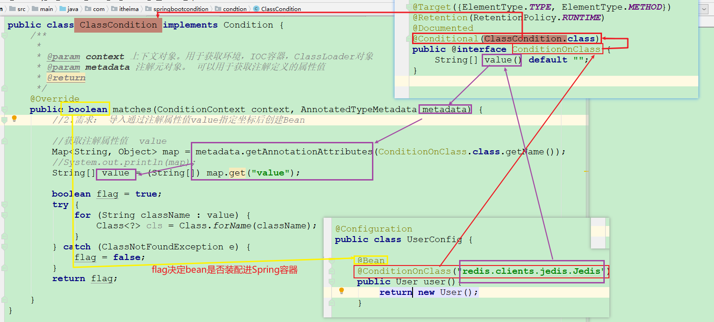

## 今日内容

- [ ] SpringBoot 自动配置原理
- [ ] SpringBoot 监听机制
- [ ] SpringBoot 启动流程分析


## 1. Condition按条件注入

`Condition` 是在Spring 4.0 增加的条件判断功能，通过这个可以功能根据`condition`的要求选择性的创建 `Bean`。


### 1.1 只要启动项目就把User装配进Spring容器

准备user类

```java
// 略
```


`UserConfig.java`

```java
@Configuration
public class UserConfig {

    @Bean
    public User user(){
        return new User();
    }
}
```


### 1.2 项目中有`jedis`类时才装配User进Spring容器


`UserConfig.java`

```java
@Configuration
public class UserConfig {

    @Bean
    // 该注解的属性值为一个Condition的实现类，
    // 根据类中matches的返回值决定是否装配@Conditional标注的方法返回值进Spring容器
    @Conditional(ClassCondition.class)
    public User user(){
        return new User();
    }

    @Bean
    @ConditionalOnProperty(name = "itcast",havingValue = "itheima")
    public User user2(){
        return new User();
    }

}
```

`ClassCondition.java`

```java
public class ClassCondition implements Condition {
    /**
     * 该方法的返回值决定：标注@Conditional并且注解的属性值为当前类的方法的返回值是否装配进Spring容器
     * @param context 上下文对象。用于获取环境，IOC容器，ClassLoader对象
     * @param metadata 注解元对象。 可以用于获取注解定义的属性值
     * @return
     */
    @Override
    public boolean matches(ConditionContext context, AnnotatedTypeMetadata metadata) {
        
        //1.需求： 导入Jedis坐标后创建Bean
        //思路：判断redis.clients.jedis.Jedis.class文件是否存在
        boolean flag = true;
        try {
            Class<?> cls = Class.forName("redis.clients.jedis.Jedis");
        } catch (ClassNotFoundException e) {
            flag = false;
        }
        return flag;
    }
}
```


### 1.3 优化1.2中代码，实现动态配置

自定义注解，封装`@Conditional`

```java
@Target({ElementType.TYPE, ElementType.METHOD})
@Retention(RetentionPolicy.RUNTIME)
@Documented
@Conditional(ClassCondition.class)
public @interface ConditionOnClass {
    String[] value() default "";
}
```


之后，所有标注`@Conditional(ClassCondition.class)`的地方都可以标注`@ConditionOnClass`达到一样的效果：

根据`ClassCondition`中`matches`方法的返回值判断是否装配指定的`Bean`，目前逻辑与1.2的相同，写死的`redis.clients.jedis.Jedis`

```java
public class ClassCondition implements Condition {
    /**
     * 该方法的返回值决定：标注@Conditional并且注解的属性值为当前类的方法的返回值是否装配进Spring容器
     * @param context 上下文对象。用于获取环境，IOC容器，ClassLoader对象
     * @param metadata 注解元对象。 可以用于获取注解定义的属性值
     * @return
     */
    @Override
    public boolean matches(ConditionContext context, AnnotatedTypeMetadata metadata) {
        
        //1.需求： 导入Jedis坐标后创建Bean
        //思路：判断redis.clients.jedis.Jedis.class文件是否存在
        boolean flag = true;
        try {
            Class<?> cls = Class.forName("redis.clients.jedis.Jedis");
        } catch (ClassNotFoundException e) {
            flag = false;
        }
        return flag;
    }
}
```

但是，其中的`redis.clients.jedis.Jedis`是写死了，应该通过自定的注解属性传递，并且在`Condition`的实现类`ClassCondition`中获取并判断，代码如下：

```java
public class ClassCondition implements Condition {
    /**
     *
     * @param context 上下文对象。用于获取环境，IOC容器，ClassLoader对象
     * @param metadata 注解元对象。 可以用于获取注解定义的属性值
     * @return
     */
    @Override
    public boolean matches(ConditionContext context, AnnotatedTypeMetadata metadata) {

        //2.需求： 导入通过注解属性值value指定坐标后创建Bean

        //获取注解属性值  value = redis.clients.jedis.Jedis
        Map<String, Object> map = metadata.getAnnotationAttributes(ConditionOnClass.class.getName());
        //System.out.println(map);
        String[] value = (String[]) map.get("value"); //redis.clients.jedis.Jedis

        boolean flag = true;
        try {
            for (String className : value) {
                Class<?> cls = Class.forName(className);
            }
        } catch (ClassNotFoundException e) {
            flag = false;
        }
        return flag;
    }
}
```


这样`UserConfig.java`中就可以为对应的方法添加`@ConditionOnClass`注解，并且通过属性传递要判断的全类名，即可以该全类名作为判断条件

```java
@Configuration
public class UserConfig {

    @Bean
    @ConditionOnClass("redis.clients.jedis.Jedis")
    public User user(){
        return new User();
    }
}
```





`SpringBoot` 的自动配置jar包`spring-boot-autoconfigure-2.3.5.RELEASE.jar`很多都是这样的实现逻辑

```java

```


## 2. @SpringBootApplication的作用

标注在`SpringBoot`的启动类上，该注解的作用

1. 被标注的启动类是一个配置类

   `@SpringBootApplication`

   - `@SpringBootConfiguration`
     - `@Configuration`

2. 明确当前模块的主包，通过

   `@SpringBootApplication`

   - **<font color="red">@EnableAutoConfiguration</font>**-->
     - `@AutoConfigurationPackage`-->
       - `@Import({Registrar.class})`-->
         - `Registrar.class`-->
           - `registerBeanDefinitions()`-->
           - `PackageImport()`
           - `ClassUtils.getPackageName(metadata.getClassName())`

3. 开启组件扫描，扫描范围即为上一步的主包

   `@SpringBootApplication`

   - `@ComponentScan`

4. 按照约定，自动配置。

   `@SpringBootApplication`-->

   - **<font color="red">@EnableAutoConfiguration</font>**-->
     - `@Import({AutoConfigurationImportSelector.class})`


## 3. 自动配置

重点是`@EnableAutoConfiguration`，但是需要一步一步来，先来看第一点。

### 3.1 怎么装配第三方jar中提供的类到Spring容器

- [x] ①启动类中(配置类)添加方法并标注@Bean
- [ ] ②启动类上组件扫描第三方的jar包路径
- [x] ③启动类上标注`@Import(User.class)`直接导入第三方jar包中的类
- [x] ④启动类上标注`@Import(UserConfig.class)`通过`UserConfig`类中导入第三方jar包中的类
- [ ] ⑤第三方jar中提供一个新注解`@EnableUser`，封装`@Import(UserConfig.class)`


演示代码。

- `User.java`

  ```java
  package com.itcast; // 使用不在主包中的类模拟第三方jar包中的类
  
  public class User {
  }
  ```

  


- ①启动类中(配置类)添加方法并标注@Bean

  ```java
  import com.itcast.User;
  
  @SpringBootApplication
  public class SpringbootEnableApplication {
  
      public static void main(String[] args) {
          ConfigurableApplicationContext context = SpringApplication.run(SpringbootEnableApplication.class, args);
          User bean = context.getBean(User.class);
          System.out.println("bean = " + bean);
  
      }
  
      @Bean
      public User user(){
          return new User();
      }
  }
  ```

  

- ③启动类上标注`@Import(User.class)`直接导入第三方jar包中的类

  ```java
  import com.itcast.User;
  
  @Import(User.class)   // 该注解会把被引入的类装配进Spring容器
  // @Import(UserConfig.class)
  @SpringBootApplication
  public class SpringbootEnableApplication {
  
      public static void main(String[] args) {
          ConfigurableApplicationContext context = SpringApplication.run(SpringbootEnableApplication.class, args);
          User bean = context.getBean(User.class);
          System.out.println("bean = " + bean);
  
      }
  }
  ```


- ④启动类上标注`@Import(UserConfig.class)`通过`UserConfig`类中导入第三方jar包中的类

  `UserConfig.java`

  ```java
  package com.itcast.config;
  
  import com.itcast.User;
  
  public class UserConfig {
      @Bean
      public User user() {
          return new User();
      }
  }
  ```

  `SpringbootEnableApplication.java`

  ```java
  import com.itcast.User;
  import com.itcast.config.UserConfig;
     
  @Import(UserConfig.class) // 该注解会把被引入的类装配进Spring容器
  @SpringBootApplication
  public class SpringbootEnableApplication {
  
      public static void main(String[] args) {
          ConfigurableApplicationContext context = SpringApplication.run(SpringbootEnableApplication.class, args);
          User bean = context.getBean(User.class);
          System.out.println("bean = " + bean);
  
      }
  }
  ```


以下代码见视频中老师代码，准备代码

- `springboot-enable-other`中`User.java`

  ```java
  package com.itheima.domain;
  
  public class User {}
  ```

- `springboot-enable-other`中`UserConfig.java`

  ```java
  package com.itheima.config;
  
  public class UserConfig {
      @Bean
      public User user() {
          return new User();
      }
  }
  ```

  

- ②启动类上组件扫描第三方的jar包

  ```java
  @ComponentScan("com.itheima.config")
  @SpringBootApplication
  public class SpringbootEnableApplication {
  
      public static void main(String[] args) {
          ConfigurableApplicationContext context = SpringApplication.run(SpringbootEnableApplication.class, args);
          User bean = context.getBean(User.class);
          System.out.println("bean = " + bean);
  
      }
  }
  ```

  

- ⑤第三方jar中提供一个新注解`@EnableUser`，封装@Import(UserConfig.class)

  自定义注解，其上标注`@Import(UserConfig.class)`

  ```java
  package com.itheima.config;
  
  @Target(ElementType.TYPE)
  @Retention(RetentionPolicy.RUNTIME)
  @Documented
  @Import(UserConfig.class)
  public @interface EnableUser {
  }
  ```

- `SpringbootEnableApplication.java`

  ```java
  import com.itcast.User;
  import com.itcast.config.UserConfig;
     
  @EnableUser // 该注解会把被引入的类装配进Spring容器
  @SpringBootApplication
  public class SpringbootEnableApplication {
  
      public static void main(String[] args) {
          ConfigurableApplicationContext context = SpringApplication.run(SpringbootEnableApplication.class, args);
          User bean = context.getBean(User.class);
          System.out.println("bean = " + bean);
  
      }
  }
  ```

### 3.2 @Import

**作用**：把一个类（配置类、普通POJO类）装配进Spring容器


接下来要讲的装配方式有下面四种：

1. 导入Bean
2. 导入配置类
3. 导入ImportSelector的实现类。
4. 导入ImportBeanDefinitionRegistrar实现类


### 3.3 `SpringBoot`自动配置源码分析

启动类上标注`@SpringBootApplication`

```java
@Target({ElementType.TYPE})
@Retention(RetentionPolicy.RUNTIME)
@Documented
@Inherited
@SpringBootConfiguration  //SpringBoot的配置类标志，功能与Spring原生注解@Congratulation相同
//*********************************************
@EnableAutoConfiguration  // 开启自动配置  我们要分析的
@ComponentScan			  // 组件扫描，扫描主包
public @interface SpringBootApplication {}
```

（接上）的父注解`@EnableAutoConfiguration`的父注解`@Import({AutoConfigurationImportSelector.class})`，把`AutoConfigurationImportSelector`装配进Spring容器。

```java
@Target({ElementType.TYPE})
@Retention(RetentionPolicy.RUNTIME)
@Documented
@Inherited
@AutoConfigurationPackage			// 根据启动类识别主包
// ************************************************************
@Import({AutoConfigurationImportSelector.class})  // 装配AutoConfigurationImportSelector
public @interface EnableAutoConfiguration {
    String ENABLED_OVERRIDE_PROPERTY = "spring.boot.enableautoconfiguration";

    Class<?>[] exclude() default {};

    String[] excludeName() default {};
}
```

`AutoConfigurationImportSelector`类中的`selectImports`读取了`spring.factories`，

```java
public class AutoConfigurationImportSelector implements DeferredImportSelector, BeanClassLoaderAware, ResourceLoaderAware, BeanFactoryAware, EnvironmentAware, Ordered {
    private static final String[] NO_IMPORTS = new String[0];
    private static final Log logger = LogFactory.getLog(AutoConfigurationImportSelector.class);
    private ClassLoader beanClassLoader;

    // 返回的是一个字符串数组，该数组中存多个类的全类名，这些类会被装配进Spring容器
    public String[] selectImports(AnnotationMetadata annotationMetadata) {
        // 判断是否导入
        if (!this.isEnabled(annotationMetadata)) {
            return NO_IMPORTS;
        } else {
            // 执行到这里说明通过@Import导入了
            // 获取自动配置的元数据
            AutoConfigurationMetadata autoConfigurationMetadata = AutoConfigurationMetadataLoader.loadMetadata(this.beanClassLoader);
            // ***********************************************
            // 调用当前类的 getAutoConfigurationEntry方法
            // 读取spring-boot-autoconfigure-2.3.5.RELEASE.jar中
            // META-INF/spring.factories文件中配置的EnableAutoConfiguration对应的值
            AutoConfigurationImportSelector.AutoConfigurationEntry autoConfigurationEntry = this.getAutoConfigurationEntry(autoConfigurationMetadata, annotationMetadata);
            return StringUtils.toStringArray(autoConfigurationEntry.getConfigurations());
        }
    }
}
```

同一个类中`getAutoConfigurationEntry`方法

```java
protected AutoConfigurationImportSelector.AutoConfigurationEntry getAutoConfigurationEntry(AutoConfigurationMetadata autoConfigurationMetadata, AnnotationMetadata annotationMetadata) {
    if (!this.isEnabled(annotationMetadata)) {
        return EMPTY_ENTRY;
    } else {
        AnnotationAttributes attributes = this.getAttributes(annotationMetadata);
        // ******************************************
        // 调用当前类的getCandidateConfigurations方法
  	  	// 读取spring-boot-autoconfigure-2.3.5.RELEASE.jar中
    	// META-INF/spring.factories文件中配置的EnableAutoConfiguration对应的值
        List<String> configurations = this.getCandidateConfigurations(annotationMetadata, attributes);
        // 以下代码在移出一些重复的、需要排除的配置类的字符串
        configurations = this.removeDuplicates(configurations);
        Set<String> exclusions = this.getExclusions(annotationMetadata, attributes);
        this.checkExcludedClasses(configurations, exclusions);
        configurations.removeAll(exclusions);
        configurations = this.filter(configurations, autoConfigurationMetadata);
        this.fireAutoConfigurationImportEvents(configurations, exclusions);
        return new AutoConfigurationImportSelector.AutoConfigurationEntry(configurations, exclusions);
    }
}
```

同一个类中`getCandidateConfigurations`方法

```java
protected List<String> getCandidateConfigurations(AnnotationMetadata metadata, AnnotationAttributes attributes) {
    // 调用 loadFactoryNames 方法
    // 调用另外一个类的loadFactoryNames()方法
    // 读取spring-boot-autoconfigure-2.3.5.RELEASE.jar中
    // META-INF/spring.factories文件中配置的EnableAutoConfiguration对应的值
    // ******************** 也可以通过下面一行代码的提示，找到配置文件************************
    List<String> configurations = SpringFactoriesLoader.loadFactoryNames(this.getSpringFactoriesLoaderFactoryClass(), this.getBeanClassLoader());
    //  ******可以根据异常提示信息找到配置有所有需要导入的自动配置bean的文件名称********
    Assert.notEmpty(configurations, "No auto configuration classes found in META-INF/spring.factories. If you are using a custom packaging, make sure that file is correct.");
    return configurations;
}
```

调用`SpringFactoriesLoader`类的`loadFactoryNames`方法。

```java
public final class SpringFactoriesLoader {
    // 常量
    public static final String FACTORIES_RESOURCE_LOCATION = "META-INF/spring.factories";

    public static List<String> loadFactoryNames(Class<?> factoryClass, @Nullable ClassLoader classLoader) {
        String factoryClassName = factoryClass.getName();
        // *****************************
        // 调用本类 loadSpringFactories 方法，加载读取properties文件
        // 读取spring-boot-autoconfigure-2.3.5.RELEASE.jar中
    	// META-INF/spring.factories文件中配置的EnableAutoConfiguration对应的值
        return loadSpringFactories(classLoader).getOrDefault(factoryClassName, Collections.emptyList());
    }
}
```

调用`SpringFactoriesLoader`类的 `loadSpringFactories`

```java
public final class SpringFactoriesLoader {
    // ***********************2***************************
    // 该常量定义了 配置有所有需要导入的自动配置bean的文件名 的  配置文件(本质是一个properties，只是换了后缀)
    public static final String FACTORIES_RESOURCE_LOCATION = "META-INF/spring.factories";

    public static List<String> loadFactoryNames(Class<?> factoryClass, @Nullable ClassLoader classLoader) {
        String factoryClassName = factoryClass.getName();
        return loadSpringFactories(classLoader).getOrDefault(factoryClassName, Collections.emptyList());
    }
    
    private static Map<String, List<String>> loadSpringFactories(@Nullable ClassLoader classLoader) {
		MultiValueMap<String, String> result = cache.get(classLoader);
		if (result != null) {
			return result;
		}

		try {
            // *************************1****************************
            // 读取配置文件，文件名称和位置定义在当前类常量中FACTORIES_RESOURCE_LOCATION 
            
			Enumeration<URL> urls = (classLoader != null ?
					classLoader.getResources(FACTORIES_RESOURCE_LOCATION) :
					ClassLoader.getSystemResources(FACTORIES_RESOURCE_LOCATION));
			result = new LinkedMultiValueMap<>();
			while (urls.hasMoreElements()) {
				URL url = urls.nextElement();
				UrlResource resource = new UrlResource(url);
				Properties properties = PropertiesLoaderUtils.loadProperties(resource);
				for (Map.Entry<?, ?> entry : properties.entrySet()) {
					String factoryClassName = ((String) entry.getKey()).trim();
					for (String factoryName : StringUtils.commaDelimitedListToStringArray((String) entry.getValue())) {
						result.add(factoryClassName, factoryName.trim());
					}
				}
			}
			cache.put(classLoader, result);
			return result;
		}
		catch (IOException ex) {
			throw new IllegalArgumentException("Unable to load factories from location [" +
					FACTORIES_RESOURCE_LOCATION + "]", ex);
		}
	}
}
```


在配置文件中个，通过key=`org.springframework.boot.autoconfigure.EnableAutoConfiguration`，获得对应的值，就是那么多`xxxAutoConfiguration`；

`spring.factories`中部分内容

```properties
# Auto Configure
org.springframework.boot.autoconfigure.EnableAutoConfiguration=\
org.springframework.boot.autoconfigure.admin.SpringApplicationAdminJmxAutoConfiguration,\
org.springframework.boot.autoconfigure.aop.AopAutoConfiguration,\
org.springframework.boot.autoconfigure.amqp.RabbitAutoConfiguration,\
org.springframework.boot.autoconfigure.batch.BatchAutoConfiguration,\
org.springframework.boot.autoconfigure.cache.CacheAutoConfiguration,\
org.springframework.boot.autoconfigure.cassandra.CassandraAutoConfiguration,\
org.springframework.boot.autoconfigure.cloud.CloudServiceConnectorsAutoConfiguration,\
org.springframework.boot.autoconfigure.context.ConfigurationPropertiesAutoConfiguration,\
org.springframework.boot.autoconfigure.context.MessageSourceAutoConfiguration,\
org.springframework.boot.autoconfigure.context.PropertyPlaceholderAutoConfiguration,\
org.springframework.boot.autoconfigure.couchbase.CouchbaseAutoConfiguration,\
org.springframework.boot.autoconfigure.dao.PersistenceExceptionTranslationAutoConfiguration,\
org.springframework.boot.autoconfigure.data.cassandra.CassandraDataAutoConfiguration,\
org.springframework.boot.autoconfigure.data.cassandra.CassandraReactiveDataAutoConfiguration,\
org.springframework.boot.autoconfigure.data.cassandra.CassandraReactiveRepositoriesAutoConfiguration,\
org.springframework.boot.autoconfigure.data.cassandra.CassandraRepositoriesAutoConfiguration,\
org.springframework.boot.autoconfigure.data.couchbase.CouchbaseDataAutoConfiguration,\
org.springframework.boot.autoconfigure.data.couchbase.CouchbaseReactiveDataAutoConfiguration,\
org.springframework.boot.autoconfigure.data.couchbase.CouchbaseReactiveRepositoriesAutoConfiguration,\
org.springframework.boot.autoconfigure.data.couchbase.CouchbaseRepositoriesAutoConfiguration,\
org.springframework.boot.autoconfigure.data.elasticsearch.ElasticsearchAutoConfiguration,\
org.springframework.boot.autoconfigure.data.elasticsearch.ElasticsearchDataAutoConfiguration,\
org.springframework.boot.autoconfigure.data.elasticsearch.ElasticsearchRepositoriesAutoConfiguration,\
org.springframework.boot.autoconfigure.data.jdbc.JdbcRepositoriesAutoConfiguration,\
org.springframework.boot.autoconfigure.data.jpa.JpaRepositoriesAutoConfiguration,\
org.springframework.boot.autoconfigure.data.ldap.LdapRepositoriesAutoConfiguration,\
org.springframework.boot.autoconfigure.data.mongo.MongoDataAutoConfiguration,\
org.springframework.boot.autoconfigure.data.mongo.MongoReactiveDataAutoConfiguration,\
org.springframework.boot.autoconfigure.data.mongo.MongoReactiveRepositoriesAutoConfiguration,\
org.springframework.boot.autoconfigure.data.mongo.MongoRepositoriesAutoConfiguration,\
org.springframework.boot.autoconfigure.data.neo4j.Neo4jDataAutoConfiguration,\
org.springframework.boot.autoconfigure.data.neo4j.Neo4jRepositoriesAutoConfiguration,\
org.springframework.boot.autoconfigure.data.solr.SolrRepositoriesAutoConfiguration,\
org.springframework.boot.autoconfigure.data.redis.RedisAutoConfiguration,\
org.springframework.boot.autoconfigure.data.redis.RedisReactiveAutoConfiguration,\
org.springframework.boot.autoconfigure.data.redis.RedisRepositoriesAutoConfiguration,\
org.springframework.boot.autoconfigure.data.rest.RepositoryRestMvcAutoConfiguration,\
org.springframework.boot.autoconfigure.data.web.SpringDataWebAutoConfiguration,\
org.springframework.boot.autoconfigure.elasticsearch.jest.JestAutoConfiguration,\
org.springframework.boot.autoconfigure.elasticsearch.rest.RestClientAutoConfiguration,\
org.springframework.boot.autoconfigure.flyway.FlywayAutoConfiguration,\
org.springframework.boot.autoconfigure.freemarker.FreeMarkerAutoConfiguration,\
org.springframework.boot.autoconfigure.gson.GsonAutoConfiguration,\
org.springframework.boot.autoconfigure.h2.H2ConsoleAutoConfiguration,\
org.springframework.boot.autoconfigure.hateoas.HypermediaAutoConfiguration,\
org.springframework.boot.autoconfigure.hazelcast.HazelcastAutoConfiguration,\
org.springframework.boot.autoconfigure.hazelcast.HazelcastJpaDependencyAutoConfiguration,\
org.springframework.boot.autoconfigure.http.HttpMessageConvertersAutoConfiguration,\
org.springframework.boot.autoconfigure.http.codec.CodecsAutoConfiguration,\
org.springframework.boot.autoconfigure.influx.InfluxDbAutoConfiguration,\
org.springframework.boot.autoconfigure.info.ProjectInfoAutoConfiguration,\
org.springframework.boot.autoconfigure.integration.IntegrationAutoConfiguration,\
org.springframework.boot.autoconfigure.jackson.JacksonAutoConfiguration,\
org.springframework.boot.autoconfigure.jdbc.DataSourceAutoConfiguration,\
org.springframework.boot.autoconfigure.jdbc.JdbcTemplateAutoConfiguration,\
org.springframework.boot.autoconfigure.jdbc.JndiDataSourceAutoConfiguration,\
org.springframework.boot.autoconfigure.jdbc.XADataSourceAutoConfiguration,\
org.springframework.boot.autoconfigure.jdbc.DataSourceTransactionManagerAutoConfiguration,\
org.springframework.boot.autoconfigure.jms.JmsAutoConfiguration,\
org.springframework.boot.autoconfigure.jmx.JmxAutoConfiguration,\
org.springframework.boot.autoconfigure.jms.JndiConnectionFactoryAutoConfiguration,\
org.springframework.boot.autoconfigure.jms.activemq.ActiveMQAutoConfiguration,\
org.springframework.boot.autoconfigure.jms.artemis.ArtemisAutoConfiguration,\
org.springframework.boot.autoconfigure.groovy.template.GroovyTemplateAutoConfiguration,\
org.springframework.boot.autoconfigure.jersey.JerseyAutoConfiguration,\
org.springframework.boot.autoconfigure.jooq.JooqAutoConfiguration,\
org.springframework.boot.autoconfigure.jsonb.JsonbAutoConfiguration,\
org.springframework.boot.autoconfigure.kafka.KafkaAutoConfiguration,\
org.springframework.boot.autoconfigure.ldap.embedded.EmbeddedLdapAutoConfiguration,\
org.springframework.boot.autoconfigure.ldap.LdapAutoConfiguration,\
org.springframework.boot.autoconfigure.liquibase.LiquibaseAutoConfiguration,\
org.springframework.boot.autoconfigure.mail.MailSenderAutoConfiguration,\
org.springframework.boot.autoconfigure.mail.MailSenderValidatorAutoConfiguration,\
org.springframework.boot.autoconfigure.mongo.embedded.EmbeddedMongoAutoConfiguration,\
org.springframework.boot.autoconfigure.mongo.MongoAutoConfiguration,\
org.springframework.boot.autoconfigure.mongo.MongoReactiveAutoConfiguration,\
org.springframework.boot.autoconfigure.mustache.MustacheAutoConfiguration,\
org.springframework.boot.autoconfigure.orm.jpa.HibernateJpaAutoConfiguration,\
org.springframework.boot.autoconfigure.quartz.QuartzAutoConfiguration,\
org.springframework.boot.autoconfigure.reactor.core.ReactorCoreAutoConfiguration,\
org.springframework.boot.autoconfigure.security.servlet.SecurityAutoConfiguration,\
org.springframework.boot.autoconfigure.security.servlet.UserDetailsServiceAutoConfiguration,\
org.springframework.boot.autoconfigure.security.servlet.SecurityFilterAutoConfiguration,\
org.springframework.boot.autoconfigure.security.reactive.ReactiveSecurityAutoConfiguration,\
org.springframework.boot.autoconfigure.security.reactive.ReactiveUserDetailsServiceAutoConfiguration,\
org.springframework.boot.autoconfigure.sendgrid.SendGridAutoConfiguration,\
org.springframework.boot.autoconfigure.session.SessionAutoConfiguration,\
org.springframework.boot.autoconfigure.security.oauth2.client.servlet.OAuth2ClientAutoConfiguration,\
org.springframework.boot.autoconfigure.security.oauth2.client.reactive.ReactiveOAuth2ClientAutoConfiguration,\
org.springframework.boot.autoconfigure.security.oauth2.resource.servlet.OAuth2ResourceServerAutoConfiguration,\
org.springframework.boot.autoconfigure.security.oauth2.resource.reactive.ReactiveOAuth2ResourceServerAutoConfiguration,\
org.springframework.boot.autoconfigure.solr.SolrAutoConfiguration,\
org.springframework.boot.autoconfigure.task.TaskExecutionAutoConfiguration,\
org.springframework.boot.autoconfigure.task.TaskSchedulingAutoConfiguration,\
org.springframework.boot.autoconfigure.thymeleaf.ThymeleafAutoConfiguration,\
org.springframework.boot.autoconfigure.transaction.TransactionAutoConfiguration,\
org.springframework.boot.autoconfigure.transaction.jta.JtaAutoConfiguration,\
org.springframework.boot.autoconfigure.validation.ValidationAutoConfiguration,\
org.springframework.boot.autoconfigure.web.client.RestTemplateAutoConfiguration,\
org.springframework.boot.autoconfigure.web.embedded.EmbeddedWebServerFactoryCustomizerAutoConfiguration,\
org.springframework.boot.autoconfigure.web.reactive.HttpHandlerAutoConfiguration,\
org.springframework.boot.autoconfigure.web.reactive.ReactiveWebServerFactoryAutoConfiguration,\
org.springframework.boot.autoconfigure.web.reactive.WebFluxAutoConfiguration,\
org.springframework.boot.autoconfigure.web.reactive.error.ErrorWebFluxAutoConfiguration,\
org.springframework.boot.autoconfigure.web.reactive.function.client.ClientHttpConnectorAutoConfiguration,\
org.springframework.boot.autoconfigure.web.reactive.function.client.WebClientAutoConfiguration,\
org.springframework.boot.autoconfigure.web.servlet.DispatcherServletAutoConfiguration,\
org.springframework.boot.autoconfigure.web.servlet.ServletWebServerFactoryAutoConfiguration,\
org.springframework.boot.autoconfigure.web.servlet.error.ErrorMvcAutoConfiguration,\
org.springframework.boot.autoconfigure.web.servlet.HttpEncodingAutoConfiguration,\
org.springframework.boot.autoconfigure.web.servlet.MultipartAutoConfiguration,\
org.springframework.boot.autoconfigure.web.servlet.WebMvcAutoConfiguration,\
org.springframework.boot.autoconfigure.websocket.reactive.WebSocketReactiveAutoConfiguration,\
org.springframework.boot.autoconfigure.websocket.servlet.WebSocketServletAutoConfiguration,\
org.springframework.boot.autoconfigure.websocket.servlet.WebSocketMessagingAutoConfiguration,\
org.springframework.boot.autoconfigure.webservices.WebServicesAutoConfiguration,\
org.springframework.boot.autoconfigure.webservices.client.WebServiceTemplateAutoConfiguration
```


其中每个`xxxAutoConfiguration`中，通过`@Bean`装配一些默认配置，装配前后都有一些条件。


## 4. 事件监听

### 4.1 三要素

1. 事件源（违停的车）
2. 事件（违停）
3. 监听器（摄像头）

### 4.2 SpringBoot提供了四种监听器

1. CommandLineRunner
2. ApplicationRunner
3. ApplicationContextInitializer
4. SpringApplicationRunListener

### 4.3 使用方式

用法和`Servlet`中相同，编写一个实现类，实现其中一个接口，并重写其中方法。

其中前两个不编写好之后自动调用执行，不需要配置。另外两个需要配置：META-INF/spring.factories`中`接口名=实现类名`。

Servlet 中，配置：web.xml <listener>  @WebListerner


### 4.4 运行时机及作用

1. `CommandLineRunner`：项目启动`Spring`容器初始化后，自动调用其中run方法
2. `ApplicationRunner`：项目启动`Spring`容器初始化后，自动调用其中run方法
3. `ApplicationContextInitializer`：`Spring`容器初始化之前监听执行
4. `SpringApplicationRunListener`：`Spring`容器初整个生命周期监听执行

相关代码见最后

### 4.5 相关文档

- `CommandLineRunner`和`ApplicationRunner`：[官方文档说明连接](https://docs.spring.io/spring-boot/docs/current/reference/html/spring-boot-features.html#boot-features-command-line-runner)。
- `SpringApplication`完整的事件监听：[官方文档说明连接](https://docs.spring.io/spring-boot/docs/current/reference/html/spring-boot-features.html#boot-features-application-events-and-listeners)，描述整个生命周期所有内容，不区分监听器`SpringApplicationRunListener`源码是非常好的学习文档，注释写的非常清楚。


## 5. SpringApplication

`SpringApplication`初始化和调用`run`方法源码解析

// TODO


 

## 6. actuator

监控指定的`SpringBoot`应用的信息。

### 6.1 使用步骤

1. 导入依赖坐标:：`actuator`场景启动器

   ```xml
   <dependency>
       <groupId>org.springframework.boot</groupId>
       <artifactId>spring-boot-starter-actuator</artifactId>
   </dependency>
   ```

   

2. 默认暴露两个`endpoint`：`info`  &   `health`

   启动项目后，通过http://localhost:8080/actuator/info或http://localhost:8080/actuator/health访问即可查看大到对应的信息

   `info`相关信息可以在`application.properties`中配置

   ```properties
   info.name=zhangsan
   info.age=23
   ```

   `health`详细信息可以通过开启详细信息查看

   ```properties
   # 开启健康检查的完整信息
   management.endpoint.health.show-details=always
   ```

   

3. 暴露除`shutdown`之外的所有`endpoints`

   ```properties
   # 将所有的监控endpoints暴露出来
   management.endpoints.web.exposure.include=*
   ```

   

4. 暴露`shutdown`-`endpoint`，优雅关机

   ```properties
   # 优雅关机，保证数据不会丢失，需要post方式提交请求
   management.endpoint.shutdown.enabled=true
   ```

   

### 6.2 springboot-admin

图形化管理`SpringBoot`的`actuator`。

- 客户端（即：被监控端）添加依赖

  ```xml
  <dependency>
      <groupId>de.codecentric</groupId>
      <artifactId>spring-boot-admin-starter-client</artifactId>
  </dependency>
  ```

  完整的`pom.xml`如下：

  ```xml
  <parent>
      <groupId>org.springframework.boot</groupId>
      <artifactId>spring-boot-starter-parent</artifactId>
      <version>2.3.5.RELEASE</version>
      <relativePath/> <!-- lookup parent from repository -->
  </parent>
  <groupId>com.itheima</groupId>
  <artifactId>springboot-admin-client</artifactId>
  <version>0.0.1-SNAPSHOT</version>
  <name>springboot-admin-client</name>
  <description>Demo project for Spring Boot</description>
  
  <properties>
      <java.version>1.8</java.version>
      <spring-boot-admin.version>2.1.5</spring-boot-admin.version>
  </properties>
  
  <dependencies>
      <dependency>
          <groupId>org.springframework.boot</groupId>
          <artifactId>spring-boot-starter-web</artifactId>
      </dependency>
      <dependency>
          <groupId>de.codecentric</groupId>
          <artifactId>spring-boot-admin-starter-client</artifactId>
      </dependency>
      
  </dependencies>
  ```

  `application.properties`添加如下内容

  ```properties
  # 执行admin.server地址
  spring.boot.admin.client.url=http://localhost:9000
  
  management.endpoint.health.show-details=always
  management.endpoints.web.exposure.include=*
  ```

  

- 服务器端

  添加依赖

  ```xml
  <dependency>
      <groupId>de.codecentric</groupId>
      <artifactId>spring-boot-admin-starter-server</artifactId>
  </dependency>
  ```

  完整`pom.xml`

  ```xml
  <?xml version="1.0" encoding="UTF-8"?>
  <project xmlns="http://maven.apache.org/POM/4.0.0" xmlns:xsi="http://www.w3.org/2001/XMLSchema-instance"
           xsi:schemaLocation="http://maven.apache.org/POM/4.0.0 https://maven.apache.org/xsd/maven-4.0.0.xsd">
      <modelVersion>4.0.0</modelVersion>
      <parent>
          <groupId>org.springframework.boot</groupId>
          <artifactId>spring-boot-starter-parent</artifactId>
          <version>2.1.8.RELEASE</version>
          <relativePath/> <!-- lookup parent from repository -->
      </parent>
      <groupId>com.itheima</groupId>
      <artifactId>springboot-admin-server</artifactId>
      <version>0.0.1-SNAPSHOT</version>
      <name>springboot-admin-server</name>
      <description>Demo project for Spring Boot</description>
  
      <properties>
          <java.version>1.8</java.version>
          <spring-boot-admin.version>2.1.5</spring-boot-admin.version>
      </properties>
  
      <dependencies>
          <dependency>
              <groupId>org.springframework.boot</groupId>
              <artifactId>spring-boot-starter-web</artifactId>
          </dependency>
          <dependency>
              <groupId>de.codecentric</groupId>
              <artifactId>spring-boot-admin-starter-server</artifactId>
          </dependency>
      </dependencies>
  </project>
  ```

  

  `application.properties`添加如下内容避免端口冲突

  ```properties
  server.port=9000
  ```


- 分别启动服务器和客户端，访问http://locahost:9000即可


## 7. SpringBoot部署

支持两种部署方式：

- `jar`  官方推荐方式
- `war`


### 7.1 打包成jar包

默认的方式，也是官方推荐的方式，会内部自动集成`tomcat`，运行`java -jar xxx.jar`即可正常访问。


### 7.2 打包成war包

- 启动类实现特性接口，并添加特定方法

  ```java
  // 继承SpringBootServletInitializer 类
  @SpringBootApplication
  public class SpringbootDeployApplication extends SpringBootServletInitializer {
  
      public static void main(String[] args) {
          SpringApplication.run(SpringbootDeployApplication.class, args);
      }
  
  
      // 重写configure方法，通过形参的builder.sources(启动类的字节码对象)
      @Override
      protected SpringApplicationBuilder configure(SpringApplicationBuilder builder) {
          return builder.sources(SpringbootDeployApplication.class);
      }
  }
  ```

  

- 修改打包方式

  ```xml
  <parent>
      <groupId>org.springframework.boot</groupId>
      <artifactId>spring-boot-starter-parent</artifactId>
      <version>2.1.8.RELEASE</version>
      <relativePath/> 
  </parent>
  <groupId>com.itheima</groupId>
  <artifactId>springboot-deploy</artifactId>
  <version>0.0.1-SNAPSHOT</version>
  <!-- 打包方式修改成war -->
  <packaging>war</packaging>
  
  <properties>
      <java.version>1.8</java.version>
  </properties>
  
  <dependencies>
      <dependency>
          <groupId>org.springframework.boot</groupId>
          <artifactId>spring-boot-starter-web</artifactId>
      </dependency>
  </dependencies>
  
  <build>
      <!-- 指定打包后war包的名称 -->
      <finalName>springboot</finalName>
      <plugins>
          <plugin>
              <groupId>org.springframework.boot</groupId>
              <artifactId>spring-boot-maven-plugin</artifactId>
          </plugin>
      </plugins>
  </build>
  ```

  

- 运行mvn的打包命令，会得到一个`war`包，放到t`omcat/wabapp`中即可访问，注意访问路径要以war的名字开头

