## 1. 微服务架构

### 1.1 什么是微服务架构

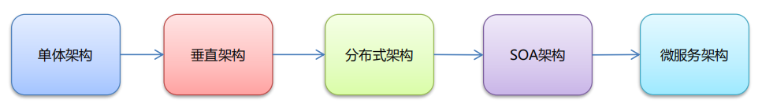

**SOA:面向服务开发的，不是一个完整的项目，dubbo用的时候，一般模块是没有controller的，外部想访问只能通过zk注册中心**

**而微服务是一个完整项目，独立的项目/数据库**

**微服务架构**

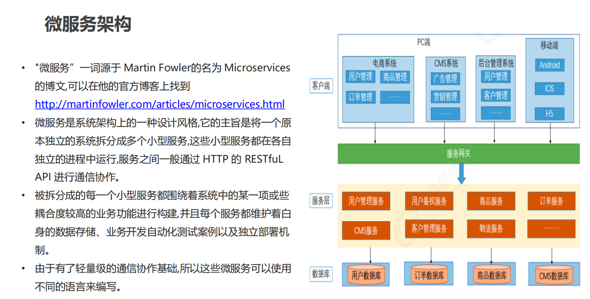

## 2.初识SpringCloud

### 2.1 什么是SpringCloud

- **什么是SpringCloud**

  > SpringCloud的出现是为了服务于微服务
  >
  > 在一个大项目中，拆分成的每个SpringBoot项目都属于这个大项目中的一个微服务
  >
  > SpringCloud就对微服务中的各个环节提供了相对应的组件进行管理
  
  

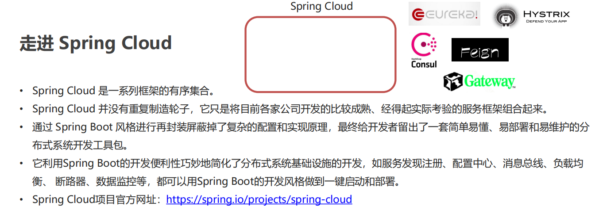

- **版本命名**

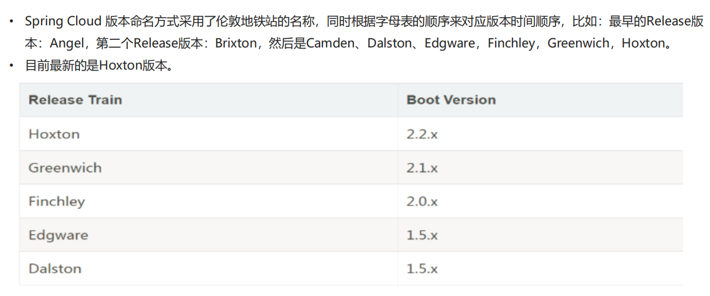

### 2.2 **Spring Cloud 与 Dubbo 对比**

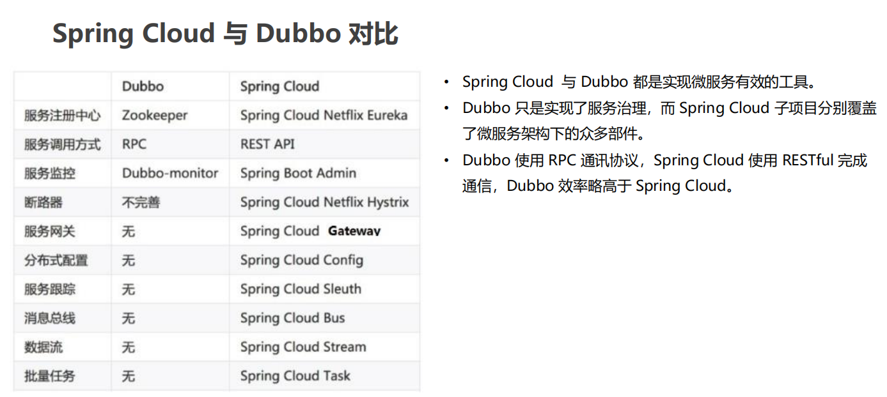

**==小结==**

- 微服务就是将项目的各个模块拆分为可独立运行、部署、测试的架构设计风格。

- Spring 公司将其他公司中微服务架构常用的组件整合起来，并使用 SpringBoot 简化其开发、配置。称为 Spring Cloud

- Spring Cloud 与 Dubbo都是实现微服务有效的工具。Dubbo 性能更好，而 Spring Cloud 功能更全面。

## 3.**Spring Cloud 服务治理**

### 3.1 Eureka

#### 3.1.1 Eureka简介

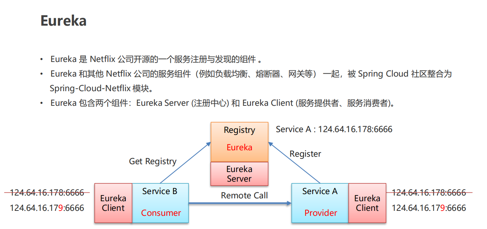

#### 3.1.2 **Eureka的服务治理的搭建入门**

—–步骤

> **Eureka – 远程调用**
>
> \1. 搭建 Provider 和 Consumer 服务。
>
> \2. 使用 RestTemplate 完成远程调用。
>
> \3. 搭建 Eureka Server 服务。
>
> \4. 改造 Provider 和 Consumer 称为 Eureka Client。
>
> \5. Consumer 服务 通过从 Eureka Server 中抓取 Provider 
>
> ​	地址 完成 远程调用

**eureka-server**

- pom依赖

~~~xml
<dependencies>

        <dependency>
            <groupId>org.springframework.boot</groupId>
            <artifactId>spring-boot-starter-web</artifactId>
        </dependency>

        <!-- eureka-server  -->
        <dependency>
            <groupId>org.springframework.cloud</groupId>
            <artifactId>spring-cloud-starter-netflix-eureka-server</artifactId>
        </dependency>

    </dependencies>
~~~

- 启动类

~~~java
@SpringBootApplication
@EnableEurekaServer // 注意：需要添加该注解
public class EurekaApp {

    public static void main(String[] args) {
        SpringApplication.run(EurekaApp.class,args);
    }
}
~~~

- yml配置

~~~shell
server:
  port: 8761

#  eureka 一共有4部分 配置
#
#  1. server: eureka 的服务端配置
#
#  2. client: eureka 的客户端配置
#
#  3. instance: eureka 的实例配置
#
#  4. dashboard: eureka 的web控制台配置
eureka:
  instance:
    hostname: localhost # 主机名

  client:
    service-url:
      defaultzone: http://${eureka.instance.hostname}:${server.port}/eureka # 其实是本项目作为一个eureka的客户端需要连接的eureka的server的地址，即使本项目就是eureka的server（eureka服务端地址，将来客户端使用该地址和eureka通信）

    register-with-eureka: false # 是否将自己的路径，注册到eureka上，eureka server不需要，eureka provider client 和 consumer client需要
    fetch-registry: false # 是否需要从eureka中抓取路径，eureka server不需要，eureka consumer client需要
~~~

**eureka-provider**

- pom依赖

~~~xml
<!--spring web-->
    <dependencies>

        <dependency>
            <groupId>org.springframework.boot</groupId>
            <artifactId>spring-boot-starter-web</artifactId>
        </dependency>

        <!-- eureka-client  -->
        <dependency>
            <groupId>org.springframework.cloud</groupId>
            <artifactId>spring-cloud-starter-netflix-eureka-client</artifactId>
        </dependency>

    </dependencies>
~~~

- 启动类

~~~java
package com.itheima.provider;

import org.springframework.boot.SpringApplication;
import org.springframework.boot.autoconfigure.SpringBootApplication;
import org.springframework.cloud.netflix.eureka.EnableEurekaClient;

/**
 * 启动类
 */
@SpringBootApplication
@EnableEurekaClient // 该注解在新版本中可以省略，但是不建议
public class ProviderApp {

    public static void main(String[] args) {
        SpringApplication.run(ProviderApp.class,args);
    }
}

~~~

- yml配置

~~~shell
server:
  port: 8001

eureka:
  instance:
    hostname: localhost # 主机名

  client:
    service-url:
      defaultzone: http://localhost:8761/eureka  # eureka服务端地址，将来客户端使用该地址和eureka通信

# 省略掉这两个，因为生产者也有可能是消费者，所以以下两个配置都是用的默认配置true
#    register-with-eureka: true # 是否将自己的路径，注册到eureka上，eureka server不需要，eureka provider client需要
#    fetch-registry: true # 是否需要从eureka中抓取路径，eureka server不需要，eureka consumer client需要

spring:
  application:
    name: eureka-provider # 设置当前应用的名称，将来会在eureka控制台的Application 那边显示，将来需要使用该名称获取路径
~~~

**eureka-consumer**

- pom依赖

~~~xml
<!--spring web-->
    <dependencies>

        <dependency>
            <groupId>org.springframework.boot</groupId>
            <artifactId>spring-boot-starter-web</artifactId>
        </dependency>

        <!-- eureka-client  -->
        <dependency>
            <groupId>org.springframework.cloud</groupId>
            <artifactId>spring-cloud-starter-netflix-eureka-client</artifactId>
        </dependency>

    </dependencies>
~~~

- 启动类

~~~java
package com.itheima.consumer;

import org.springframework.boot.SpringApplication;
import org.springframework.boot.autoconfigure.SpringBootApplication;
import org.springframework.cloud.netflix.eureka.EnableEurekaClient;

/**
 * 启动类
 */
@SpringBootApplication
@EnableEurekaClient // 该注解在新版本中可以省略，但是不建议
public class ConsumerApp {

    public static void main(String[] args) {
        SpringApplication.run(ConsumerApp.class,args);
    }
}

~~~

- yml配置

~~~shell
server:
  port: 9001

eureka:
  instance:
    hostname: localhost # 主机名

  client:
    service-url:
      defaultzone: http://localhost:8761/eureka  # eureka服务端地址，将来客户端使用该地址和eureka通信

# 省略掉这两个，因为生产者也有可能是消费者，所以以下两个配置都是用的默认配置true
#    register-with-eureka: true # 是否将自己的路径，注册到eureka上，eureka server不需要，eureka provider client需要
#    fetch-registry: true # 是否需要从eureka中抓取路径，eureka server不需要，eureka consumer client需要

spring:
  application:
    name: eureka-consumer # 设置当前应用的名称，将来会在eureka控制台的Application 那边显示。将来需要使用该名称获取路径

~~~

#### 3.1.3 **Eureka – 相关配置及特性**

> eureka 一共有4部分 配置
>
> 1. server : eureka 的服务端配置
>
> 2. client : eureka 的客户端配置
>
> 3. instance : eureka 的实例配置
>
> 4. dashboard : eureka 的web控制台配置

**application.yml**

~~~shell
server:
  port: 8761

#  eureka 一共有4部分 配置
#
#  1. server: eureka 的服务端配置
#
#  2. client: eureka 的客户端配置
#
#  3. instance: eureka 的实例配置
#
#  4. dashboard: eureka 的web控制台配置
eureka:
  instance:
    hostname: localhost # 主机名

  client:
    service-url:
      defaultzone: http://${eureka.instance.hostname}:${server.port}/eureka #eureka服务端地址，将来客户端使用该地址和eureka通信

    register-with-eureka: false # 是否将自己的路径，注册到eureka上，eureka server不需要，eureka provider client需要
    fetch-registry: false # 是否需要从eureka中抓取路径，eureka server不需要，eureka consumer client需要
~~~

#### 3.1.4 Eureka管理控制台

  配置好之后，访问Eureka默认地址：localhost:8761，即可访问控制台

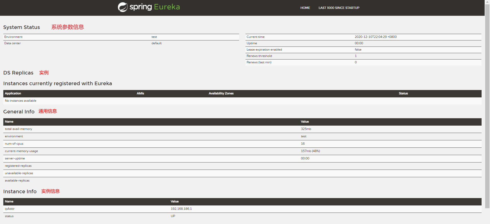

#### 3.1.5 动态获取provider 的 URL路径

> 在启动类添加注解：@EnableDiscoveryClient
>
> 激活DiscoveryClient 新版本可以不写 不建议

~~~java
package com.itheima.consumer.controller;

import com.itheima.consumer.domain.Goods;
import org.springframework.beans.factory.annotation.Autowired;
import org.springframework.cloud.client.ServiceInstance;
import org.springframework.cloud.client.discovery.DiscoveryClient;
import org.springframework.web.bind.annotation.GetMapping;
import org.springframework.web.bind.annotation.PathVariable;
import org.springframework.web.bind.annotation.RequestMapping;
import org.springframework.web.bind.annotation.RestController;
import org.springframework.web.client.RestTemplate;

import java.util.List;

/**
 * 服务的调用方
 */
@RestController
@RequestMapping("order")
public class OrderController {

    @Autowired
    private RestTemplate restTemplate;

    @Autowired
    private DiscoveryClient discoveryClient;

    @GetMapping("/goods/{id}")
    public Goods findGoodsById(@PathVariable("id") int id) {

    /*
       需要动态从eureka中 获取 provider ip 和端口
        1.注入DiscoveryClient对象，需要在启动类添加@EnableDiscoveryClient 激活
        2. 调用方法

     */

        List<ServiceInstance> instances = discoveryClient.getInstances("EUREKA-PROVIDER");
        // 健壮性判断
        if (instances == null || instances.size() == 0){
            return null;
        }

        // 拿到第一个对象，目前只有一个，后期如果搭建集群会有多个
        ServiceInstance serviceInstance = instances.get(0);
		// 动态获取port和host
        String host = serviceInstance.getHost();
        int port = serviceInstance.getPort();

        System.out.println("host = " + host);
        System.out.println("port = " + port);

		// 拼到url中
        String url = "http://"+ host + ":" +port+ "/goods/findOne/" + id;
        // 远程调用goods服务中的方法
        Goods goods = this.restTemplate.getForObject(url, Goods.class);
        return goods;
    }
}

~~~

#### 3.1.6 instance相关属性

>  ==prefer-ip-address: true== ：将当前实例的ip注册到eureka server中，默认值是false，那就是注册主机名
>
>  ==ip-address: 192.168.199.171==  # 设置当前实例的ip 也就是这个应用，我的机器上虚拟机的网卡ip被默认设置为当前实例ip了，所以需要使用这个配置手动指定！
>
>  ==instance-id: ${eureka.instance.ip-address}:${spring.application.name}:${server.port}==  #ip:应用名称：端口   设置web控制台显示的 实例id
>
>  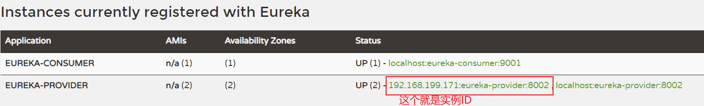

~~~shell
server:
  port: 8002

eureka:
  instance:
    hostname: localhost # 主机名
    prefer-ip-address: true #将当前实例的ip注册到eureka server中，默认值是false，那就是注册主机名
    ip-address: 192.168.199.171 # 设置当前实例的ip，配合上面那个prefer使用，如果不配置会是默认回环地址（127.0.0.1）之外的第一个ip，那么就有可能使虚拟机网卡的地址，那就没用了
    instance-id: ${eureka.instance.ip-address}:${spring.application.name}:${server.port} #ip:应用名称：端口   设置web控制台显示的 实例id：192.168.199.171:eureka-provider:8002
  client:
    service-url:
      defaultzone: http://localhost:8761/eureka  # eureka服务端地址，将来客户端使用该地址和eureka通信

# 省略掉这两个，因为生产者也有可能是消费者，所以以下两个配置都是用的默认配置true
#    register-with-eureka: true # 是否将自己的路径，注册到eureka上，eureka server不需要，eureka provider client需要
#    fetch-registry: true # 是否需要从eureka中抓取路径，eureka server不需要，eureka consumer client需要

spring:
  application:
    name: eureka-provider # 设置当前应用的名称，将来会在eureka控制台的Application 那边显示，将来需要使用该名称获取路径
~~~

#### 3.1.7 server相关属性

> 自我保护机制：当有些服务client失去连接时，不会随便放弃服务，不会剔除服务
>
> ==server:
>     enable-self-preservation: false==：# 关闭自我保护机制 开发中配置，生产环境用默认值true
>
> ​	==eviction-interval-timer-in-ms: 3000== # 检测服务的时间间隔 3000毫秒

期望心跳：

- 如果eureka-server没有将自己注册到server，`* 2 * 0.85` 是固定值
  - (2+1) * 2 *0.85
- 如果eureka-server将自己注册到了server
  - 2 * 2 * 0.85

实际发送的心跳：

- 根据client的每分钟发送心跳包的频率的总和，==注意：包含将自己注册到server的eureka-server，默认都是每分钟2次心跳==

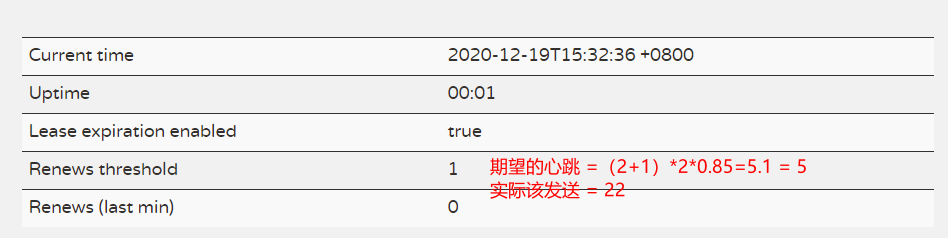

**server**

~~~shell
server:
  port: 8761

#  eureka 一共有4部分 配置
#
#  1. server: eureka 的服务端配置
#
#  2. client: eureka 的客户端配置
#
#  3. instance: eureka 的实例配置
#
#  4. dashboard: eureka 的web控制台配置
eureka:
  instance:
    hostname: localhost # 主机名

  client:
    service-url:
      defaultzone: http://${eureka.instance.hostname}:${server.port}/eureka #eureka服务端地址，将来客户端使用该地址和eureka通信

    register-with-eureka: false # 是否将自己的路径，注册到eureka上，eureka server不需要，eureka provider client需要
    fetch-registry: false # 是否需要从eureka中抓取路径，eureka server不需要，eureka consumer client需要
  server:
    enable-self-preservation: false # 关闭自我保护机制 开发中配置，生产环境用默认值true
    eviction-interval-timer-in-ms: 3000 # 检测服务的时间间隔 3000毫秒
~~~

**client**

> ==eureka:
>   		instance:==
>
> ​	==lease-renewal-interval-in-seconds: 3==  # 每隔3s发一次 心跳包
> ​    ==lease-expiration-duration-in-seconds: 9== # 如果9秒server 没有 接收到client 发的心跳包，server会把本服务剔除
>
> ​			

~~~shell
server:
  port: 8001

eureka:
  instance:
    hostname: localhost # 主机名
    prefer-ip-address: true #将当前实例的ip注册到eureka server中，默认值是false，那就是注册主机名
    ip-address: 192.168.199.171 # 设置当前实例的ip
    instance-id: ${eureka.instance.ip-address}:${spring.application.name}:${server.port} #ip:应用名称：端口   设置web控制台显示的 实例id
    lease-renewal-interval-in-seconds: 3  # 每隔3s发一次 心跳包
    lease-expiration-duration-in-seconds: 9 # 如果9秒没有发心跳包，server会把本服务剔除
  client:
    service-url:
      defaultzone: http://localhost:8761/eureka  # eureka服务端地址，将来客户端使用该地址和eureka通信

# 省略掉这两个，因为生产者也有可能是消费者，所以以下两个配置都是用的默认配置true
#    register-with-eureka: true # 是否将自己的路径，注册到eureka上，eureka server不需要，eureka provider client需要
#    fetch-registry: true # 是否需要从eureka中抓取路径，eureka server不需要，eureka consumer client需要

spring:
  application:
    name: eureka-provider # 设置当前应用的名称，将来会在eureka控制台的Application 那边显示，将来需要使用该名称获取路径
~~~

#### 3.1.8 Eureka高可用

> 搭建Eureka的高可用时必须保证两个服务不是同一个hostname或ip

**就是搭建集群，将多个server互相注册，客户端在访问时，注册多个server的地址**

**这里搭建用的hostname是两个不同的，所以需要去本机hosts文件中配置：C:\Windows\System32\drivers\etc\hosts**

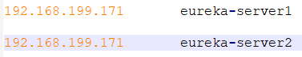

- eureka-server1

~~~shell
server:
  port: 8761

eureka:
  instance:
    hostname: eureka-server1 # 主机名

  client:
    service-url:
      defaultzone: http://eureka-server1:8762/eureka  #搭建高可用时，需要将server相互注册

    register-with-eureka: true # 是否将自己的路径，注册到eureka上，eureka server不需要，eureka provider client需要
    fetch-registry: true # 是否需要从eureka中抓取路径，eureka server不需要，eureka consumer client需要

spring:
  application:
    name: eureka-server-ha

~~~

- eureka-server2

~~~shell
server:
  port: 8762

eureka:
  instance:
    hostname: eureka-server2 # 主机名

  client:
    service-url:
      defaultzone: http://eureka-server1:8761/eureka #eureka服务端地址，将来客户端使用该地址和eureka通信

    register-with-eureka: true # 是否将自己的路径，注册到eureka上，eureka server不需要，eureka provider client需要
    fetch-registry: true # 是否需要从eureka中抓取路径，eureka server不需要，eureka consumer client需要

spring:
  application:
    name: eureka-server-ha
~~~

- provider
- ==defaultzone:== 客户端注册到多个server上

~~~shell
server:
  port: 8001

eureka:
  instance:
    hostname: localhost # 主机名
    prefer-ip-address: true #将当前实例的ip注册到eureka server中，默认值是false，那就是注册主机名
    ip-address: 192.168.199.171 # 设置当前实例的ip
    instance-id: ${eureka.instance.ip-address}:${spring.application.name}:${server.port} #ip:应用名称：端口   设置web控制台显示的 实例id
    lease-renewal-interval-in-seconds: 3  # 每隔3s发一次 心跳包
    lease-expiration-duration-in-seconds: 9 # 如果9秒没有发心跳包，server会把本服务剔除
  client:
    service-url:
      defaultzone: http://eureka-server1:8761/eureka,http://eureka-server2:8762/eureka # eureka服务端地址，将来客户端使用该地址和eureka通信

# 省略掉这两个，因为生产者也有可能是消费者，所以以下两个配置都是用的默认配置true
#    register-with-eureka: true # 是否将自己的路径，注册到eureka上，eureka server不需要，eureka provider client需要
#    fetch-registry: true # 是否需要从eureka中抓取路径，eureka server不需要，eureka consumer client需要

spring:
  application:
    name: eureka-provider # 设置当前应用的名称，将来会在eureka控制台的Application 那边显示，将来需要使用该名称获取路径
~~~

- consumer
- ==defaultzone:==客户端注册到多个server上

~~~shell
server:
  port: 9001

eureka:
  instance:
    hostname: localhost # 主机名

  client:
    service-url:
      defaultzone: http://eureka-server1:8761/eureka,http://eureka-server2:8762/eureka  # eureka服务端地址，将来客户端使用该地址和eureka通信

# 省略掉这两个，因为生产者也有可能是消费者，所以以下两个配置都是用的默认配置true
#    register-with-eureka: true # 是否将自己的路径，注册到eureka上，eureka server不需要，eureka provider client需要
#    fetch-registry: true # 是否需要从eureka中抓取路径，eureka server不需要，eureka consumer client需要

spring:
  application:
    name: eureka-consumer # 设置当前应用的名称，将来会在eureka控制台的Application 那边显示。将来需要使用该名称获取路径

~~~

**==注意：即使将高可用的所有eureka-server都停掉，事实上原请求路径也是可用的，这与dubbo的consumer一样，是具有本地缓存的，只不过不能再去获取新的服务。==**

### 3.2 **Consul**

#### 3.2.1 简介

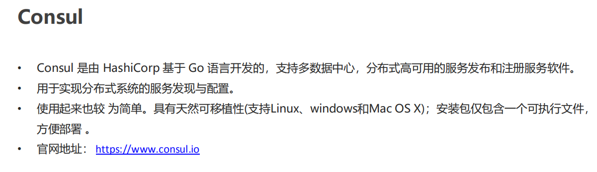

控制台是一个软件，下载之后解压为consul.exe文件，双击即可打开或者命令`consul.exe agent -dev`，访问地址：http://localhost:8500/

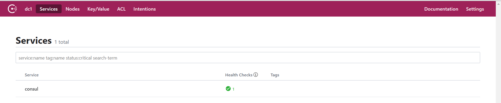

#### 3.2.2 快速入门

**步骤**

> \1. 搭建 Provider 和 Consumer 服务。
>
> \2. 使用 RestTemplate 完成远程调用。
>
> \3. 将Provider服务注册到Consul中。
>
> \4. Consumer 服务 通过从 Consul 中抓取 Provider 地 
>
> ​	址 完成 远程调用

**consumer**

- pom依赖

~~~xml
<?xml version="1.0" encoding="UTF-8"?>
<project xmlns="http://maven.apache.org/POM/4.0.0"
         xmlns:xsi="http://www.w3.org/2001/XMLSchema-instance"
         xsi:schemaLocation="http://maven.apache.org/POM/4.0.0 http://maven.apache.org/xsd/maven-4.0.0.xsd">
    <parent>
        <artifactId>spring-cloud-parent</artifactId>
        <groupId>com.itheima</groupId>
        <version>1.0-SNAPSHOT</version>
    </parent>
    <modelVersion>4.0.0</modelVersion>

    <artifactId>consul-consumer</artifactId>

    <dependencies>
        <!--consul 客户端-->
        <dependency>
            <groupId>org.springframework.cloud</groupId>
            <artifactId>spring-cloud-starter-consul-discovery</artifactId>
        </dependency>
        <dependency>
            <groupId>org.springframework.boot</groupId>
            <artifactId>spring-boot-starter-web</artifactId>
        </dependency>

        <dependency>
            <groupId>org.springframework.boot</groupId>
            <artifactId>spring-boot-starter-test</artifactId>
            <scope>test</scope>
        </dependency>

        <dependency>
            <groupId>org.springframework.boot</groupId>
            <artifactId>spring-boot-starter-actuator</artifactId>
        </dependency>

    </dependencies>

</project>
~~~

- yml配置

~~~shell
server:
  port: 9001

spring:
  cloud:
    consul:
      host: localhost # consul 服务端的 ip
      port: 8500 # consul 服务端的端口 默认8500
      discovery:
        service-name: ${spring.application.name} # 当前应用注册到consul的名称
        prefer-ip-address: true # 注册ip

  application:
    name: consul-consumer # 应用名称

~~~

**provider**

- pom依赖

~~~xml
<?xml version="1.0" encoding="UTF-8"?>
<project xmlns="http://maven.apache.org/POM/4.0.0"
         xmlns:xsi="http://www.w3.org/2001/XMLSchema-instance"
         xsi:schemaLocation="http://maven.apache.org/POM/4.0.0 http://maven.apache.org/xsd/maven-4.0.0.xsd">
    <parent>
        <artifactId>spring-cloud-parent</artifactId>
        <groupId>com.itheima</groupId>
        <version>1.0-SNAPSHOT</version>
    </parent>
    <modelVersion>4.0.0</modelVersion>

    <artifactId>consul-provider</artifactId>

    <dependencies>

        <!--consul 客户端-->
        <dependency>
            <groupId>org.springframework.cloud</groupId>
            <artifactId>spring-cloud-starter-consul-discovery</artifactId>
        </dependency>

        <dependency>
            <groupId>org.springframework.boot</groupId>
            <artifactId>spring-boot-starter-web</artifactId>
        </dependency>

        <dependency>
            <groupId>org.springframework.boot</groupId>
            <artifactId>spring-boot-starter-test</artifactId>
            <scope>test</scope>
        </dependency>

        <dependency>
            <groupId>org.springframework.boot</groupId>
            <artifactId>spring-boot-starter-actuator</artifactId>
        </dependency>

    </dependencies>

</project>
~~~

- yml配置

~~~shell
server:
  port: 8001
spring:
  cloud:
    consul:
      host: localhost # consul 服务端的 ip 或主机名
      port: 8500 # consul 服务端的端口 默认8500
      discovery:
        service-name: ${spring.application.name} # 当前应用注册到consul上的名称
        prefer-ip-address: true # 注册ip 是否以主机名还是ip注册，true代表注册ip

  application:
    name: consul-provider # 应用名称

~~~

### 3.3 **Nacos**

#### 3.3.1 简介

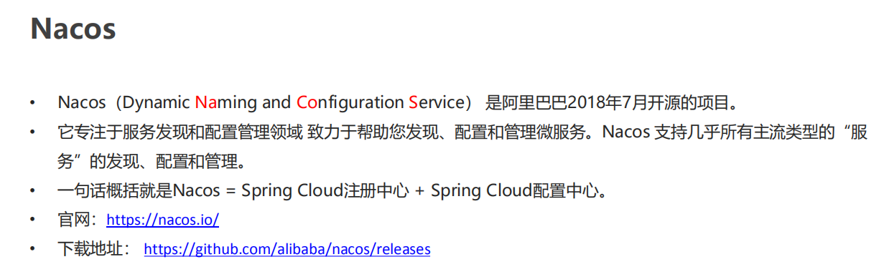

#### 3.3.2 服务端安装

解压consul_1.6.1_windows_amd64.zip，在bin目录中双击startup.cmd，访问http://localhost:8848/nacos/

首次打开需要登录，账户名密码都是：nacos

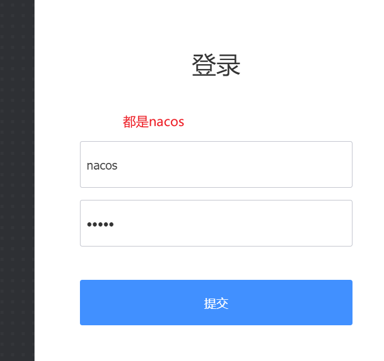

#### 3.3.3 快速入门

**provider**

- pom依赖

~~~xml
<?xml version="1.0" encoding="UTF-8"?>
<project xmlns="http://maven.apache.org/POM/4.0.0"
         xmlns:xsi="http://www.w3.org/2001/XMLSchema-instance"
         xsi:schemaLocation="http://maven.apache.org/POM/4.0.0 http://maven.apache.org/xsd/maven-4.0.0.xsd">
    <parent>
        <artifactId>spring-cloud-parent</artifactId>
        <groupId>com.itheima</groupId>
        <version>1.0-SNAPSHOT</version>
    </parent>
    <modelVersion>4.0.0</modelVersion>

    <artifactId>nacos-provider</artifactId>

    <dependencies>

        <!--nacos-->
        <dependency>
            <groupId>org.springframework.cloud</groupId>
            <artifactId>spring-cloud-starter-alibaba-nacos-discovery</artifactId>
            <version>0.2.2.RELEASE</version>
        </dependency>
        <dependency>
            <groupId>com.alibaba.nacos</groupId>
            <artifactId>nacos-client</artifactId>
            <version>1.1.0</version>
        </dependency>

        <dependency>
            <groupId>org.springframework.boot</groupId>
            <artifactId>spring-boot-starter-web</artifactId>
        </dependency>

        <dependency>
            <groupId>org.springframework.boot</groupId>
            <artifactId>spring-boot-starter-test</artifactId>
            <scope>test</scope>
        </dependency>

        <dependency>
            <groupId>org.springframework.boot</groupId>
            <artifactId>spring-boot-starter-actuator</artifactId>
        </dependency>

    </dependencies>

</project>
~~~

- yml配置

~~~shell
server:
  port: 8001

spring:
  cloud:
    nacos:
      discovery:
        server-addr: 127.0.0.1:8848 #配置nacos服务端地址
  application:
    name: nacos-provider # 服务名称

~~~

**consumer**

- pom依赖

~~~xml
<?xml version="1.0" encoding="UTF-8"?>
<project xmlns="http://maven.apache.org/POM/4.0.0"
         xmlns:xsi="http://www.w3.org/2001/XMLSchema-instance"
         xsi:schemaLocation="http://maven.apache.org/POM/4.0.0 http://maven.apache.org/xsd/maven-4.0.0.xsd">
    <parent>
        <artifactId>spring-cloud-parent</artifactId>
        <groupId>com.itheima</groupId>
        <version>1.0-SNAPSHOT</version>
    </parent>
    <modelVersion>4.0.0</modelVersion>

    <artifactId>nacos-consumer</artifactId>

    <dependencies>

        <!--nacos-->
        <dependency>
            <groupId>org.springframework.cloud</groupId>
            <artifactId>spring-cloud-starter-alibaba-nacos-discovery</artifactId>
            <version>0.2.2.RELEASE</version>
        </dependency>
        <dependency>
            <groupId>com.alibaba.nacos</groupId>
            <artifactId>nacos-client</artifactId>
            <version>1.1.0</version>
        </dependency>

        <dependency>
            <groupId>org.springframework.boot</groupId>
            <artifactId>spring-boot-starter-web</artifactId>
        </dependency>

        <dependency>
            <groupId>org.springframework.boot</groupId>
            <artifactId>spring-boot-starter-test</artifactId>
            <scope>test</scope>
        </dependency>

        <dependency>
            <groupId>org.springframework.boot</groupId>
            <artifactId>spring-boot-starter-actuator</artifactId>
        </dependency>

    </dependencies>

</project>
~~~

~~~shell
server:
  port: 9001

spring:
  cloud:
    nacos:
      discovery:
        server-addr: 127.0.0.1:8848 #配置nacos服务端地址
  application:
    name: nacos-consumer # 服务名称
~~~

## 4. Ribbon客户端负载均衡

### 4.1 Ribbon概述

> Ribbo主要两个功能：
>
> 	1. 简化远程调用
>
>  	2. 负载均衡

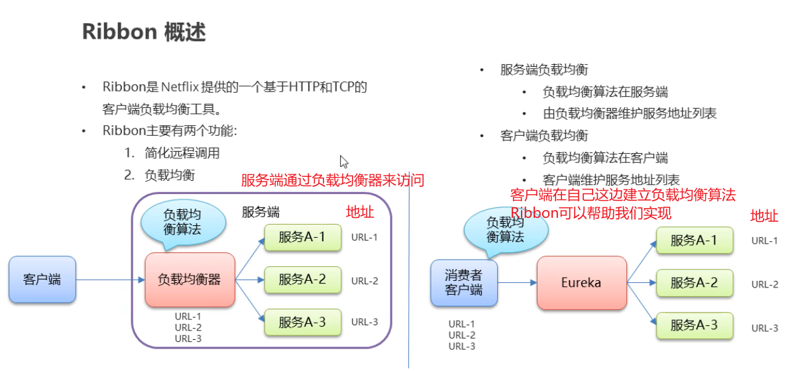

### 4.2 使用Ribbon简化RestTemplate的调用

- 在定义RestTemplate时，添加注解@LoadBalanced，使用Ribbon简化restTemplate的调用

~~~java
package com.itheima.consumer.config;

import org.springframework.cloud.client.loadbalancer.LoadBalanced;
import org.springframework.context.annotation.Bean;
import org.springframework.context.annotation.Configuration;
import org.springframework.web.client.RestTemplate;

@Configuration
public class RestTemplateConfig {

    @Bean
    @LoadBalanced // 使用Ribbon简化restTemplate的调用
    public RestTemplate restTemplate(){
        return new RestTemplate();
    }
}

~~~

- controller中使用：定义url时，host：port可以替换为 服务提供方provider的应用名称

~~~java
/**
     * 使用Ribbon来简化restTemplate的调用
     * 1. 在声明restTemplate的bean的时候，添加注解@LoadBalanced
     * 2. 在使用restTemplate发起请求时，定义url时，host：port可以替换为 服务提供方的应用名称
     * @param id
     * @return
     */
    @GetMapping("/goods2/{id}")
    public Goods findGoods2ById(@PathVariable("id") int id) {

        String url = "http://EUREKA-PROVIDER/goods/findOne/" + id;
        // 远程调用goods服务中的方法
        Goods goods = this.restTemplate.getForObject(url, Goods.class);

        return goods;
    }
~~~

### 4.3 Ribbo负载均衡

**负载均衡策略**

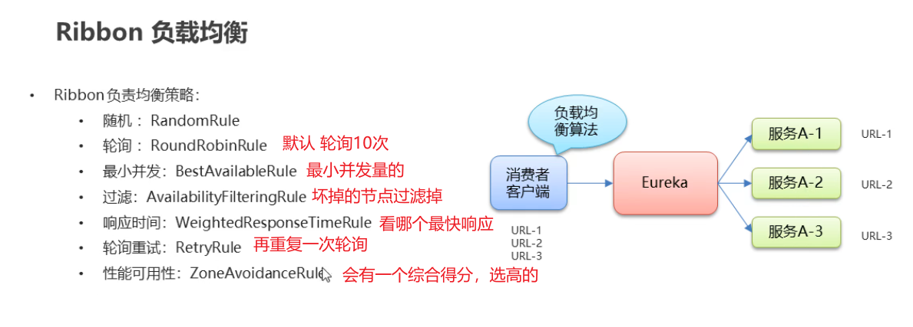

**设置负载均衡策略**

==负载均衡策略肯定是写在消费端consumer的==

两种方式选择：

1. 编码

**写一个配置类注入策略，同时启动类写一个注解：@RibbonClient(name = "EUREKA-PROVIDER",configuration = MyRule.class) 指定配置类和provider**

- 配置类

~~~java
package com.itheima.consumer.config;

import com.netflix.loadbalancer.IRule;
import com.netflix.loadbalancer.RandomRule;
import org.springframework.context.annotation.Bean;
import org.springframework.context.annotation.Configuration;

@Configuration
public class MyRule {

    @Bean
    public IRule rule(){
        // 这里可以看IRule接口的实现类，对应的就是各个策略类
        return new RandomRule();
    }

}

~~~

- 启动类

~~~java
package com.itheima.consumer;

import com.itheima.consumer.config.MyRule;
import org.springframework.boot.SpringApplication;
import org.springframework.boot.autoconfigure.SpringBootApplication;
import org.springframework.cloud.client.discovery.EnableDiscoveryClient;
import org.springframework.cloud.netflix.eureka.EnableEurekaClient;
import org.springframework.cloud.netflix.ribbon.RibbonClient;

/**
 * 启动类
 */
@SpringBootApplication
@EnableEurekaClient // 该注解在新版本中可以省略，但是不建议
@EnableDiscoveryClient // 激活DiscoveryClient 新版本可以不写 不建议

/*
 配置Ribbon的负载均衡策略
 name  设置服务提供方的应用名称
 configuration  设置负载均衡的bean
  */
@RibbonClient(name = "EUREKA-PROVIDER",configuration = MyRule.class)
public class ConsumerApp {

    public static void main(String[] args) {
        SpringApplication.run(ConsumerApp.class,args);
    }
}
~~~

2. 配置

**直接配置好即可**

~~~shell
#配置方式 实现ribbon的负载均衡策略
EUREKA-PROVIDER: # 设置的服务提供方provider的应用名称
  ribbon:
    NFloadBalancerRuleClassName: com.netflix.loadbalancer.RandomRule  #策略类
~~~

