# 1.Feign 声明式服务调用

## 1.1 Feign 

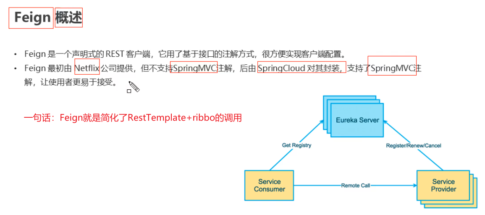

## 1.2 Feign快速入门

**步骤**

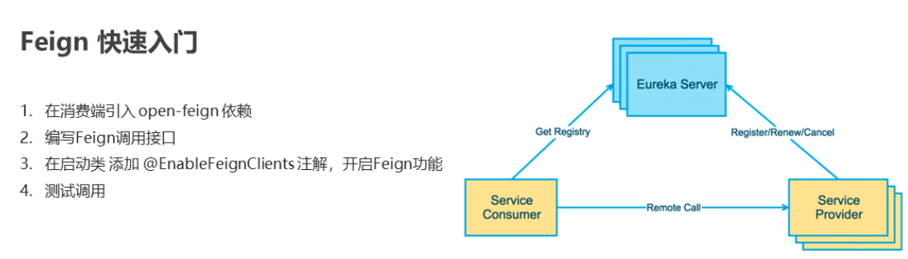

**pom**

~~~xml
<?xml version="1.0" encoding="UTF-8"?>
<project xmlns="http://maven.apache.org/POM/4.0.0"
         xmlns:xsi="http://www.w3.org/2001/XMLSchema-instance"
         xsi:schemaLocation="http://maven.apache.org/POM/4.0.0 http://maven.apache.org/xsd/maven-4.0.0.xsd">
    <parent>
        <artifactId>hystrix-parent</artifactId>
        <groupId>com.itheima</groupId>
        <version>1.0-SNAPSHOT</version>
    </parent>
    <modelVersion>4.0.0</modelVersion>

    <artifactId>hystrix-consumer</artifactId>

    <dependencies>

        <!--spring boot web-->
        <dependency>
            <groupId>org.springframework.boot</groupId>
            <artifactId>spring-boot-starter-web</artifactId>
        </dependency>

        <dependency>
            <groupId>org.springframework.boot</groupId>
            <artifactId>spring-boot-starter-actuator</artifactId>
        </dependency>


        <!-- eureka-client -->
        <dependency>
            <groupId>org.springframework.cloud</groupId>
            <artifactId>spring-cloud-starter-netflix-eureka-client</artifactId>
        </dependency>

        <!--feign-->
        <dependency>
            <groupId>org.springframework.cloud</groupId>
            <artifactId>spring-cloud-starter-openfeign</artifactId>
        </dependency>

    </dependencies>
</project>
~~~


**定义接口**

~~~java
package com.itheima.consumer.feign;

import com.itheima.consumer.domain.Goods;
import org.springframework.cloud.openfeign.FeignClient;
import org.springframework.web.bind.annotation.GetMapping;
import org.springframework.web.bind.annotation.PathVariable;

/**
 * feign的声明式接口，发起远程调用的
 *
 * 1. 定义接口
 * 2. 接口上添加注解 @FeignClient.设置value属性为服务提供者的应用名称
 * 3. 编写调用接口，接口的声明规则（也就是方法的定义、url等） 和 提供方 接口保持一致
 * 4. 注入该接口对象，调用接口对象方法
 */
// 这里写的是provider的应用名称
@FeignClient(value = "FEIGN-PROVIDER")
public interface GoodsFeignClient {
	// 这里是provider的提供的接口url
    @GetMapping("/goods/findOne/{id}")
    public Goods findGoodsById(@PathVariable("id") int id);
}

~~~

**启动类注解**

~~~java
package com.itheima.consumer;

import org.springframework.boot.SpringApplication;
import org.springframework.boot.autoconfigure.SpringBootApplication;
import org.springframework.cloud.client.discovery.EnableDiscoveryClient;
import org.springframework.cloud.netflix.eureka.EnableEurekaClient;
import org.springframework.cloud.openfeign.EnableFeignClients;

@EnableDiscoveryClient // 激活DiscoveryClient
@EnableEurekaClient
@SpringBootApplication

@EnableFeignClients // 开启feign功能
public class ConsumerApp {


    public static void main(String[] args) {
        SpringApplication.run(ConsumerApp.class,args);
    }
}
~~~

**controller调用**

~~~java
package com.itheima.consumer.controller;


import com.itheima.consumer.domain.Goods;
import com.itheima.consumer.feign.GoodsFeignClient;
import org.springframework.beans.factory.annotation.Autowired;
import org.springframework.web.bind.annotation.GetMapping;
import org.springframework.web.bind.annotation.PathVariable;
import org.springframework.web.bind.annotation.RequestMapping;
import org.springframework.web.bind.annotation.RestController;
import org.springframework.web.client.RestTemplate;

@RestController
@RequestMapping("/order")
public class OrderController {

    @Autowired
    private RestTemplate restTemplate;

    @Autowired
    private GoodsFeignClient goodsFeignClient;


    @GetMapping("/goods/{id}")
    public Goods findGoodsById(@PathVariable("id") int id){

        // 注入goodsFeignClient自定义的接口，调用方法
        Goods goods = this.goodsFeignClient.findGoodsById(id);

        return goods;

    }


}

~~~

## 1.3 Feign的超时配置

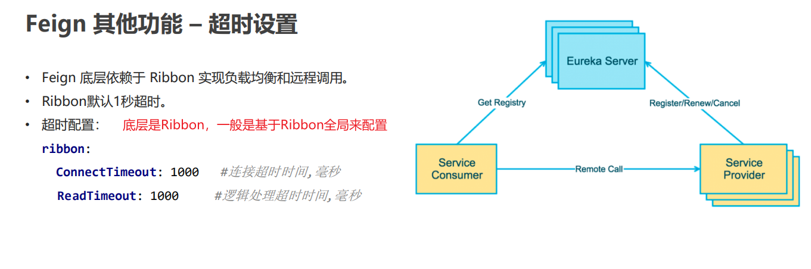

- yml配置，配置在consumer中

~~~shell
ribbon:
  ConnectTimeout: 1000 #连接超时时间，毫秒，也就是连接到provider的时间
  ReadTimeout: 3000 #逻辑处理超时时间，毫秒，也就是调用provider获取数据的这个时间
~~~

## 1.4 Feign的日志记录

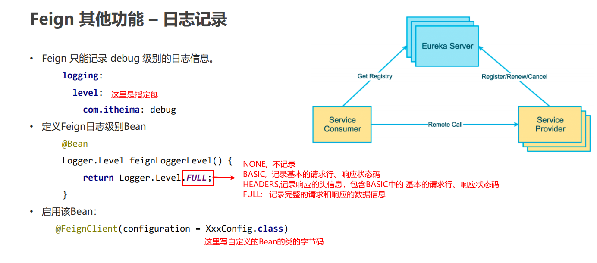

- yml配置，consumer中

~~~shell
# 设置当前的日志级别为debug，Feign只支持debug
logging:
  level:
    com.itheima: debug   # 这个包下的
~~~

- 配置bean

~~~java
package com.itheima.consumer.config;

import feign.Logger;
import org.springframework.context.annotation.Bean;
import org.springframework.context.annotation.Configuration;

@Configuration
public class FeignLogConfig {

    /*
        NONE,  不记录
        BASIC,  记录基本的请求行、响应状态码
        HEADERS,记录响应的头信息，包含BASIC中的 基本的请求行、响应状态码
        FULL;   记录完整的请求和响应的数据信息
     */
    @Bean
    public Logger.Level level(){
        return Logger.Level.FULL;
    }
}

~~~

==注意：还需要在feign的声明接口上配置注解：@FeignClient(value = "FEIGN-PROVIDER",configuration = FeignLogConfig.class)==

# 2. Hystrix 熔断器

## 2.1 概述

**雪崩：一个服务失败，导致整条链路的服务都失败的情形**

### 2.1.1 线程池隔离

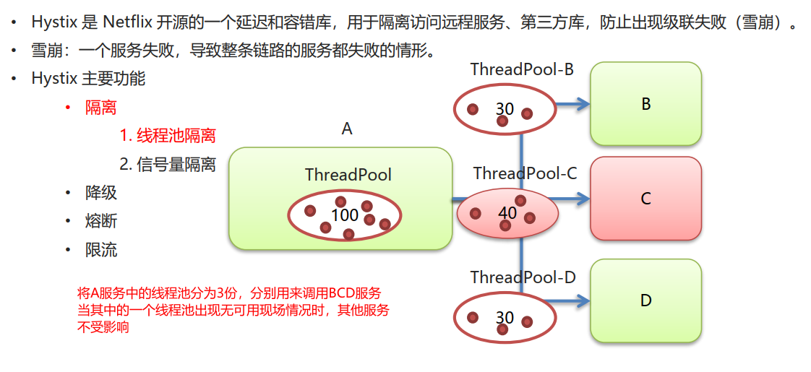

### 2.1.2 信号量隔离

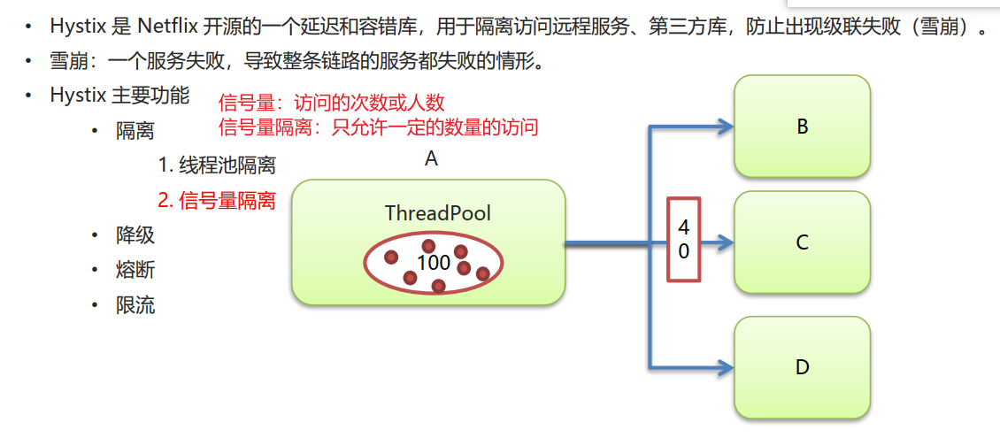

### 2.1.3 降级

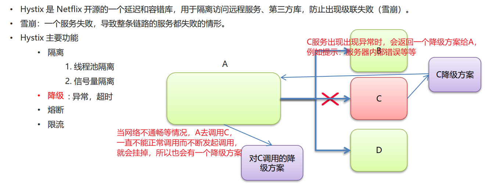

### 2.1.4 熔断

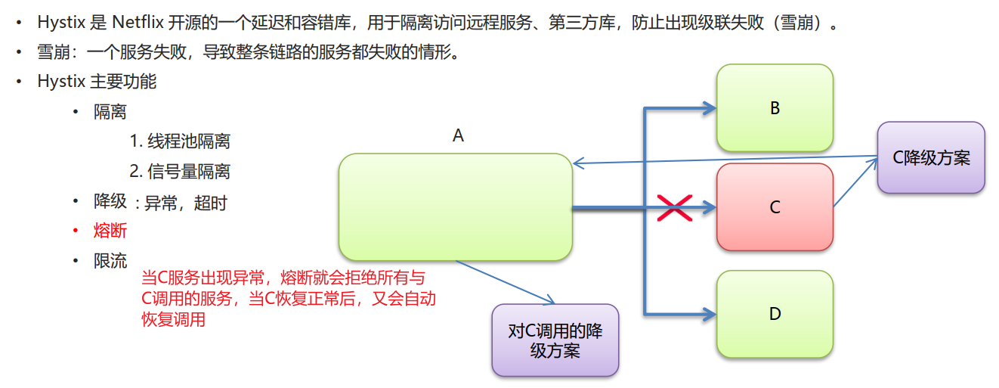

## 2.2 Hystrix 降级

- ==**默认全局降级**==

  > 全局降级可以和具体方法的降级一起使用，具体的方法的降级优先级更高。
  >
  > 一般全局降级方法返回值是自定义**result**对象或者**responseentity**对象
~~~java
@RestController
@RequestMapping("/goods")
// 设置默认的全局降级触发函数
@DefaultProperties(defaultFallback = "defaultFallback")
public class GoodsController {


    /* 定义全局的降级方法 */
    private Goods defaultFallback() {
        Goods goods = new Goods();
        goods.setTitle("网络开小差了，请稍后重试111···");
        return goods;
    }

}
~~~
- **==相关超时时间的配置==**
~~~shell
feign:
  hystrix:
    enabled: true

# 设置Ribbon的超时时间
#hystrix-provider:
#  ribbon:
#    ConnectTimeout: 3000 # 连接超时时间 默认1s
#    ReadTimeout: 3000 # 逻辑处理的超时时间 默认1s
#    # 设置所有服务的负载均衡策略 需要提供对应的Bean到Spring容器中
#    NFLoadBalancerRuleClassName: com.netflix.loadbalancer.RandomRule

# 服务降级的超时时间 全局配置
hystrix:
  command:
    default:
      execution:
        isolation:
          thread:
            timeoutInMilliseconds: 6000
# ribbon的超时时间，是全局配置
ribbon:
  ConnectTimeout: 5000
  ReadTimeout: 5000
  MaxAutoRetries: 0
  MaxAutoRetriesNextServer: 0
~~~

### 2.2.1 Hystrix 降级 – 服务提供方  

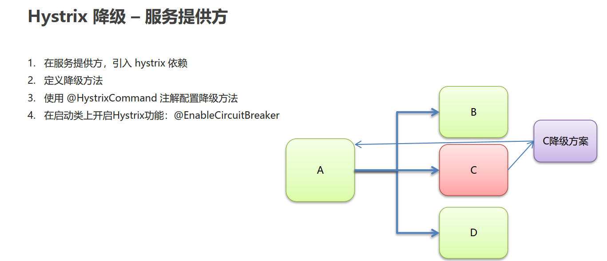

**引入依赖**

~~~xml
<dependencies>

        <!--spring boot web-->
        <dependency>
            <groupId>org.springframework.boot</groupId>
            <artifactId>spring-boot-starter-web</artifactId>
        </dependency>

        <dependency>
            <groupId>org.springframework.boot</groupId>
            <artifactId>spring-boot-starter-actuator</artifactId>
        </dependency>


        <!-- eureka-client -->
        <dependency>
            <groupId>org.springframework.cloud</groupId>
            <artifactId>spring-cloud-starter-netflix-eureka-client</artifactId>
        </dependency>

        <!-- hystrix -->
         <dependency>
             <groupId>org.springframework.cloud</groupId>
             <artifactId>spring-cloud-starter-netflix-hystrix</artifactId>
         </dependency>

</dependencies>
~~~

**provider的controller**

> 降级的情况：
>
> 	1. 出现异常
>  	2. 服务调用超时，默认1s
>
> 

~~~java
package com.itheima.provider.controller;

import com.itheima.provider.domain.Goods;
import com.itheima.provider.service.GoodsService;
import com.netflix.hystrix.contrib.javanica.annotation.HystrixCommand;
import com.netflix.hystrix.contrib.javanica.annotation.HystrixProperty;
import com.netflix.ribbon.proxy.annotation.Hystrix;
import org.springframework.beans.factory.annotation.Autowired;
import org.springframework.beans.factory.annotation.Value;
import org.springframework.web.bind.annotation.GetMapping;
import org.springframework.web.bind.annotation.PathVariable;
import org.springframework.web.bind.annotation.RequestMapping;
import org.springframework.web.bind.annotation.RestController;

import java.util.Date;

/**
 * Goods Controller 服务提供方
 */

@RestController
@RequestMapping("/goods")
public class GoodsController {

    @Autowired
    private GoodsService goodsService;

    @Value("${server.port}")
    private int port;

    /**
     * 降级
     *      1. 出现异常
     *      2.服务调用超时
     *          默认1s超时
     *  @HystrixCommand(fallbackMethod = "findOne_fallback") // fallbackMethod 指定降级后的调用方法
     *
     * @param id
     * @return
     */

    @GetMapping("/findOne/{id}")
    @HystrixCommand(fallbackMethod = "findOne_fallback",commandProperties = {
            // 配置Hystrix的超时时间，默认是1s 1000ms
            @HystrixProperty(name = "execution.isolation.thread.timeoutInMilliseconds",value = "3000")
    }) //指定降级后的调用方法
    public Goods findOne(@PathVariable("id") int id) throws InterruptedException {

        // 1.出现异常
//        int i = 1 /0;

        // 2.服务调用超时
        Thread.sleep(2000);
        Goods goods = goodsService.findOne(id);

        goods.setTitle(goods.getTitle() + ":" + port);//将端口号，设置到了 商品标题上
        return goods;
    }


    /**
     * 定义降级方法
     * 1. 方法的返回值需要和原方法一样
     * 2. 方法的参数需要和原方法一样
     */

    public Goods findOne_fallback(int id){
        Goods goods = new Goods();

        goods.setTitle("降级了~~~");
        return goods;
    }

}

~~~

**启动类**

~~~java
package com.itheima.provider;

import org.springframework.boot.SpringApplication;
import org.springframework.boot.autoconfigure.SpringBootApplication;
import org.springframework.cloud.client.circuitbreaker.EnableCircuitBreaker;
import org.springframework.cloud.netflix.eureka.EnableEurekaClient;

/**
 * 启动类
 */

@EnableEurekaClient //该注解 在新版本中可以省略
@SpringBootApplication

@EnableCircuitBreaker // 开启Hystrix功能
public class ProviderApp {


    public static void main(String[] args) {
        SpringApplication.run(ProviderApp.class,args);
    }
}

~~~

### 2.2.2 Hystrix 降级 – 服务消费方  

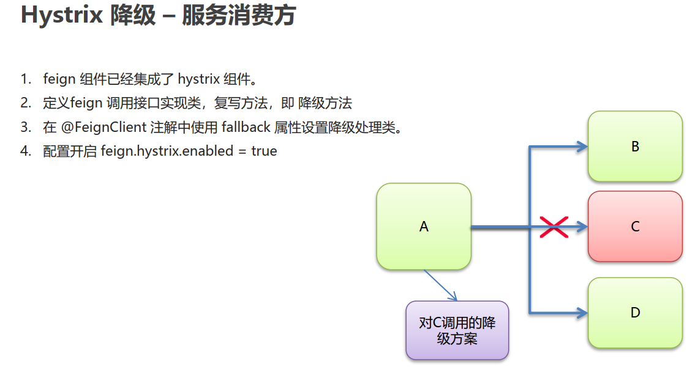

==Feign已经引入了Hystrix依赖，所以不需要我们自己再添加坐标，有openfeign的坐标即可==

> <font color="red">注意：在消费方有一个问题：实际上Hystrix熔断器是在浏览器或者其他工具通过http调用时有一个超时时间，而消费者调用生产者是用的ribbon，这期间是ribbon的超时时间生效</font>

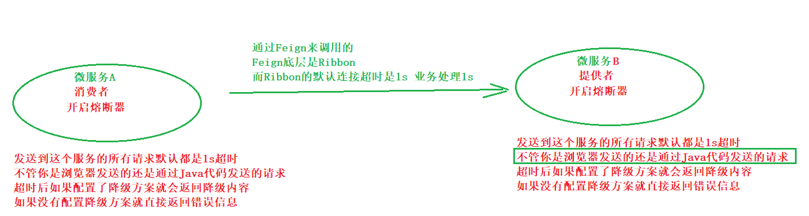

**consumer-GoodsFeignClientFallback**

~~~java
package com.itheima.consumer.feign;

import com.itheima.consumer.domain.Goods;
import org.springframework.stereotype.Component;

/**
 * 1. 定义类，实现Feign的客户端接口
 * 2. 使用@Component注解将该类的bean加入spring ioc 容器
 *
 */
@Component
public class GoodsFeignClientFallback implements GoodsFeignClient {

    @Override
    public Goods findGoodsById(int id) {
        Goods goods = new Goods();
        goods.setTitle("又降级了！");
        return goods;
    }
}

~~~

**consumer-GoodsFeignClient**

~~~java
// 需要添加注解  fallback = GoodsFeignClientFallback.class 实现类的class
@FeignClient(value = "HYSTRIX-PROVIDER",fallback = GoodsFeignClientFallback.class)
public interface GoodsFeignClient {


    @GetMapping("/goods/findOne/{id}")
    public Goods findGoodsById(@PathVariable("id") int id);

}
~~~

**yml配置文件**

> 开启feign对hystrix的支持
>
> feign:
>   hystrix:
>     enabled: true

~~~shell
server:
  port: 9001


eureka:
  instance:
    hostname: localhost # 主机名
  client:
    service-url:
      defaultZone: http://localhost:8761/eureka
spring:
  application:
    name: hystrix-consumer # 设置当前应用的名称。将来会在eureka中Application显示。将来需要使用该名称来获取路径

  #开启feign对hystrix的支持
feign:
  hystrix:
    enabled: true
~~~

- 需要注意的是：
  - <font color="red">当provider已经有提供服务降级了，返回给consumer了，那么这个是一个正常数据，这时候假如provider和consumer都配置了降级，那么consumer的降级是不会生效的！</font>

## 2.3 熔断

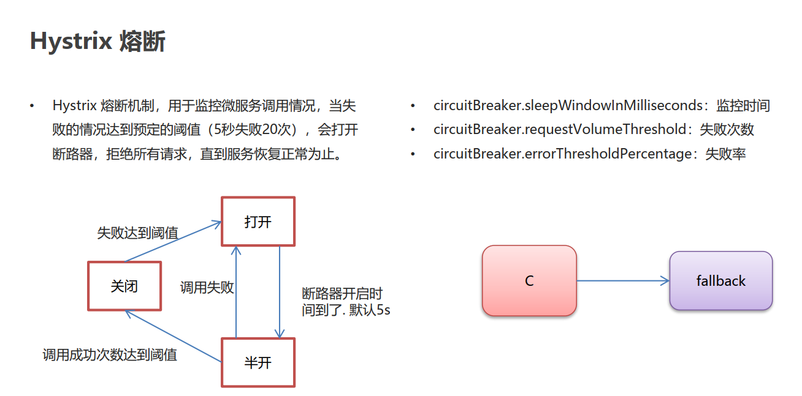

> <font color="green">当失败次数达到预定的阈值（失败、降级次数太多）时，断路器就会打开，5s后变成半开状态，放一些请求进来调用，如果能调用成功，那么就恢复服务，如果调用失败，就继续开启断路器再循环半开，直到恢复正常</font>

**代码演示**

> 熔断机制是全自动的，有默认阈值，当出现降级次数达到默认阈值时，就会自动开启断路器了，这时候去访问id != 1 的url的也会被降级，因为服务已经被拒绝了，5s后断路器半开状态再去访问就会恢复了！
>
> ```java
> @HystrixCommand(fallbackMethod = "findOne_fallback",commandProperties = {
>         // 配置Hystrix的超时时间，默认是1s 1000ms
>         @HystrixProperty(name = "execution.isolation.thread.timeoutInMilliseconds",value = "3000"),
>         // 监控时间 默认5000ms
>         @HystrixProperty(name = "circuitBreaker.sleepWindowInMilliseconds",value = "5000"),
>         // 失败次数 默认20次
>         @HystrixProperty(name = "circuitBreaker.requestVolumeThreshold",value = "20"),
>         // 失败率 默认50%
>         @HystrixProperty(name = "circuitBreaker.errorThresholdPercentage",value = "50")
> })
> ```

**provider-controller**

~~~java
package com.itheima.provider.controller;

import com.itheima.provider.domain.Goods;
import com.itheima.provider.service.GoodsService;
import com.netflix.hystrix.contrib.javanica.annotation.HystrixCommand;
import com.netflix.hystrix.contrib.javanica.annotation.HystrixProperty;
import com.netflix.ribbon.proxy.annotation.Hystrix;
import org.springframework.beans.factory.annotation.Autowired;
import org.springframework.beans.factory.annotation.Value;
import org.springframework.web.bind.annotation.GetMapping;
import org.springframework.web.bind.annotation.PathVariable;
import org.springframework.web.bind.annotation.RequestMapping;
import org.springframework.web.bind.annotation.RestController;

import java.util.Date;

/**
 * Goods Controller 服务提供方
 */

@RestController
@RequestMapping("/goods")
public class GoodsController {

    /**
     * 降级
     *      1. 出现异常
     *      2.服务调用超时
     *          默认1s超时
     *  @HystrixCommand(fallbackMethod = "findOne_fallback") // fallbackMethod 指定降级后的调用方法
     *
     * @param id
     * @return
     */

    @GetMapping("/findOne/{id}")
    @HystrixCommand(fallbackMethod = "findOne_fallback",commandProperties = {
            // 配置Hystrix的超时时间，默认是1s 1000ms
            @HystrixProperty(name = "execution.isolation.thread.timeoutInMilliseconds",value = "3000"),
            // 监控时间 默认5000ms
            @HystrixProperty(name = "circuitBreaker.sleepWindowInMilliseconds",value = "5000"),
            // 失败次数 默认20次
            @HystrixProperty(name = "circuitBreaker.requestVolumeThreshold",value = "20"),
            // 失败率 默认50%
            @HystrixProperty(name = "circuitBreaker.errorThresholdPercentage",value = "50")
    }) //指定降级后的调用方法
    public Goods findOne(@PathVariable("id") int id) {

        // 如果id == 1 出现异常，id ！= 1 正常走
        if (id == 1) {
            // 1.出现异常
            int i = 1 / 0;
        }

        // 2.服务调用超时
        /*try {
            Thread.sleep(2000);
        } catch (InterruptedException e) {
            e.printStackTrace();
        }*/
        Goods goods = goodsService.findOne(id);

        goods.setTitle(goods.getTitle() + ":" + port);//将端口号，设置到了 商品标题上
        return goods;
    }

    @Autowired
    private GoodsService goodsService;

    @Value("${server.port}")
    private int port;


    /**
     * 定义降级方法
     * 1. 方法的返回值需要和原方法一样
     * 2. 方法的参数需要和原方法一样
     */

    public Goods findOne_fallback(int id){
        Goods goods = new Goods();

        goods.setTitle("降级了~~~");
        return goods;
    }
}

~~~

## 2.4 熔断监控 见文档

具体配置见文档

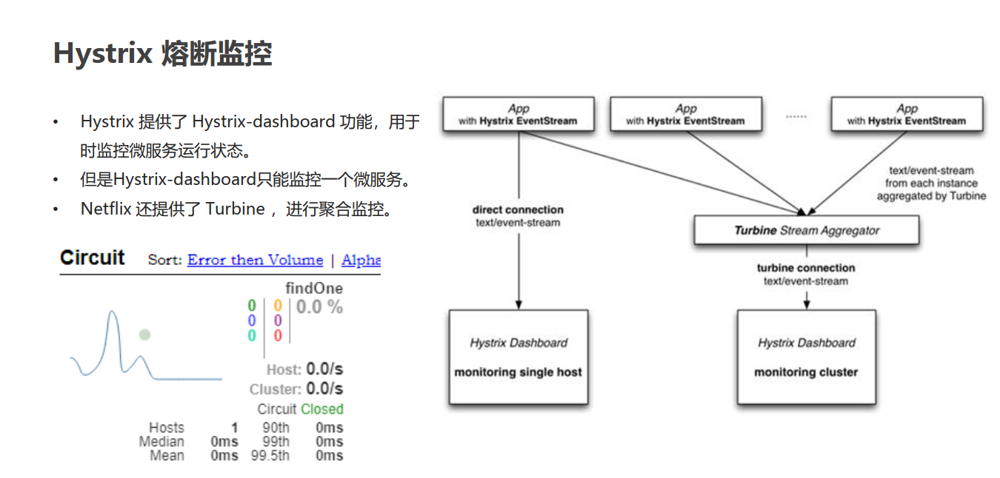

# 3.Gateway 网关

## 3.1 网关概述

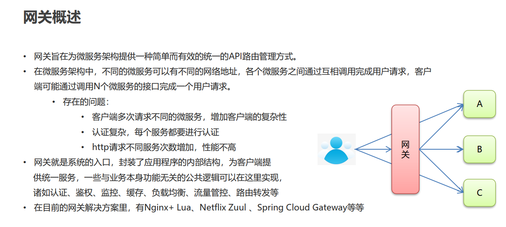

## 3.2 Gateway 网关快速入门  


**pom依赖**

~~~xml
<!--gateway-->
        <dependency>
            <groupId>org.springframework.cloud</groupId>
            <artifactId>spring-cloud-starter-gateway</artifactId>
        </dependency>
~~~

**yml**

~~~shell
server:
  port: 80

spring:
  application:
    name: api-geteway-server

  cloud:
    # 网关配置
    gateway:
      # 路由配置：转发规则
      routes: # 集合，可以配置多个
      # id:唯一标识。默认是一个uuid
      # uri：转发路径
      # predicates：条件，用于请求网关路径的匹配规则
      - id: gateway-provider
        uri: http://localhost:8001/
        predicates:
          - Path=/goods/**

~~~

## 3.3 Gateway 网关配置-静态路由

**其实就是把==uri==写死了，这样可以是可以，并不好**

```shell
server:
  port: 80

spring:
  application:
    name: api-geteway-server

  cloud:
    # 网关配置
    gateway:
      # 路由配置：转发规则
      routes: # 集合，可以配置多个
      # id:唯一标识。默认是一个uuid
      # uri：转发路径
      # predicates：条件，用于请求网关路径的匹配规则
      - id: gateway-provider
        uri: http://localhost:8001/
        predicates:
          - Path=/goods/**

      - id: gateway-consumer
        uri: http://localhost:9001/
        predicates:
        - Path=/order/**
```

## 3.4 Gateway 网关路由配置 – 动态路由  

**步骤**

> • 引入eureka-client配置
> • 修改uri属性： uri: lb://服务名称  

~~~SHELL
server:
  port: 80

spring:
  application:
    name: api-geteway-server

  cloud:
    # 网关配置
    gateway:
      # 路由配置：转发规则
      routes: # 集合，可以配置多个
      # id:唯一标识。默认是一个uuid
      # uri：转发路径
      # predicates：条件，用于请求网关路径的匹配规则
      - id: gateway-provider
        # 静态路由
#        uri: http://localhost:8001/
        # 动态路由
        uri: lb://GATEWAY-PROVIDER
        predicates:
          - Path=/goods/**

      - id: gateway-provider
        #uri: http://localhost:9001/
        uri: lb://GATEWAY-CONSUMER
        predicates:
        - Path=/order/**

# 从eureka中获取uri的 不要忘记配置eureka
eureka:
  client:
    service-url:
      defaultZone: http://localhost:8761/eureka

~~~

## 3.5 微服务名称配置

**这个配置不配置无所谓，最好不要配置，暴露的越多越不好**

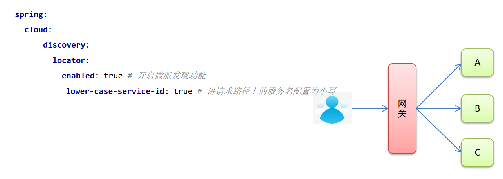

~~~shell
server:
  port: 80

spring:
  application:
    name: api-geteway-server

  cloud:
    # 网关配置
    gateway:
      # 路由配置：转发规则
      routes: # 集合，可以配置多个
      # id:唯一标识。默认是一个uuid
      # uri：转发路径
      # predicates：条件，用于请求网关路径的匹配规则
      - id: gateway-provider
        # 静态路由
#        uri: http://localhost:8001/
        # 动态路由
        uri: lb://GATEWAY-PROVIDER
        predicates:
          - Path=/goods/**

      - id: gateway-provider
        #uri: http://localhost:9001/
        uri: lb://GATEWAY-CONSUMER
        predicates:
        - Path=/order/**
        #微服务名称配置
      discovery:
        locator:
          enabled: true  # 设置为true：请求路径前可以添加微服务名称
          lower-case-service-id: true  # 允许设置为小写


eureka:
  client:
    service-url:
      defaultZone: http://localhost:8761/eureka

~~~

# 4.Gateway 过滤器  

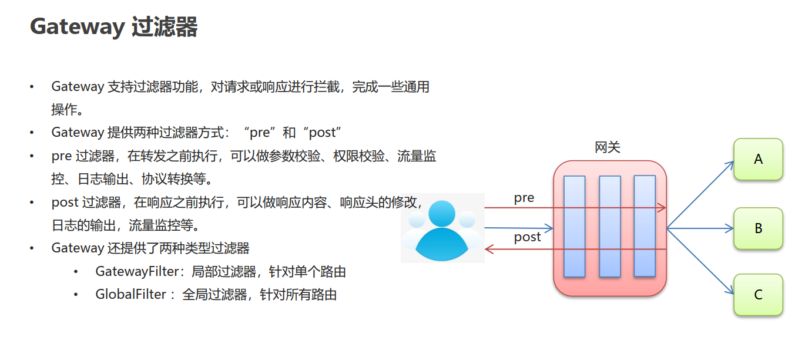

## 4.1 Gateway 过滤器 – 局部过滤器

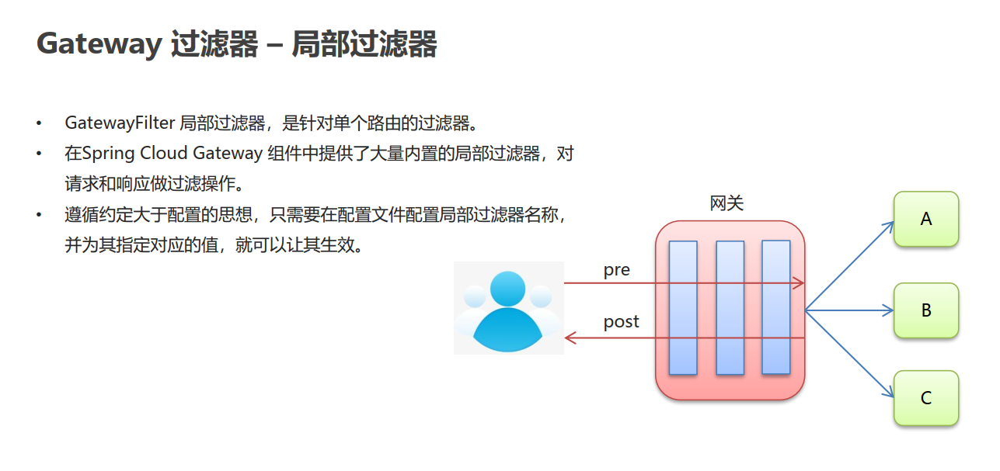

**yml**

==亲测：当配置了局部过滤器后，再去访问地址http://localhost/gateway-provider/goods/findOne/2 是获取不到设置的username参数的，使用微服务名称配置可以解决这个问题，但是不建议。==

~~~shell
server:
  port: 80

spring:
  application:
    name: api-gateway-server

  cloud:
    # 网关配置
    gateway:
      # 路由配置：转发规则
      routes: # 集合，可以配置多个
      # id:唯一标识。默认是一个uuid
      # uri：转发路径
      # predicates：条件，用于请求网关路径的匹配规则
      # filters：配置局部过滤器
      - id: gateway-provider
        # 静态路由
#        uri: http://localhost:8001/
        # 动态路由
        uri: lb://GATEWAY-PROVIDER
        predicates:
        - Path=/goods/**
        # 局部过滤器
        filters:
        # 添加了个请求参数
        - AddRequestParameter=username,zhangsan

      - id: gateway-consumer
        #uri: http://localhost:9001/
        uri: lb://GATEWAY-CONSUMER
        predicates:
        - Path=/order/**
        #微服务名称配置
      discovery:
        locator:
          enabled: true  # 设置为true：请求路径前可以添加微服务名称
          lower-case-service-id: true  # 允许设置为小写

eureka:
  client:
    service-url:
      defaultZone: http://localhost:8761/eureka

~~~

## 4.2 Gateway 过滤器 – 全局过滤器

==全局过滤器对所有路由生效，而且不需要我们自己配置==

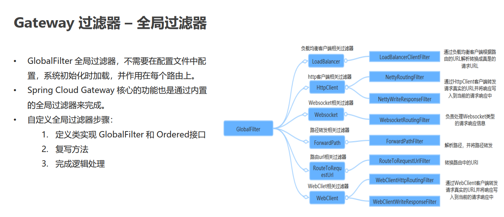

**自定义全局过滤器**

~~~java
package com.itheima.gateway.filter;

import org.springframework.cloud.gateway.filter.GatewayFilterChain;
import org.springframework.cloud.gateway.filter.GlobalFilter;
import org.springframework.core.Ordered;
import org.springframework.web.server.ServerWebExchange;
import reactor.core.publisher.Mono;

/**
 * @author: Mask.m
 * @create: 2020/12/16 21:02
 * @description: 自定义SpringCloud 全局过滤器
 */
public class MyFilter implements GlobalFilter, Ordered {
    @Override
    public Mono<Void> filter(ServerWebExchange exchange, GatewayFilterChain chain) {

        System.out.println("自定义全局过滤器执行了---");


        return chain.filter(exchange);// 放行
        
        // 还可以写后置的业务逻辑，响应回去
    }

    /**
     * 过滤器排序
     * @return 数值越小，越先执行
     */
    @Override
    public int getOrder() {
        return 0;
    }
}

~~~

