# 1.Config分布式配置中心

## 1.1 Config 概述

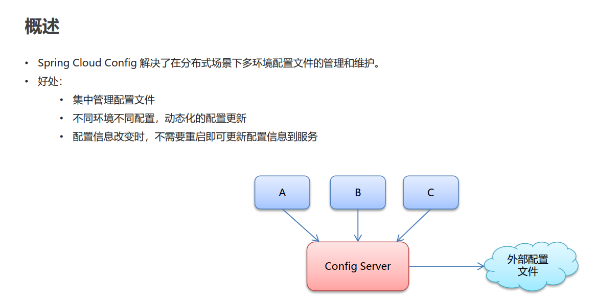

## 1.2 Config快速入门

### 1.2.1 gitee搭建远程仓库

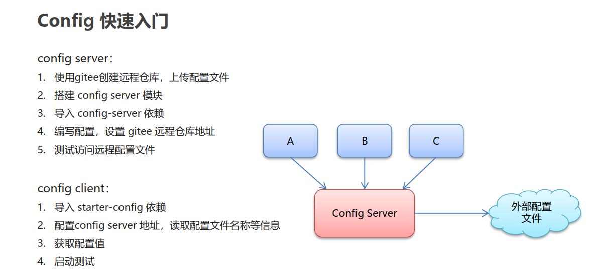

### **1.2.2 config - server 搭建**

- **依赖**

~~~xml
<dependencies>
        <!-- config -server-->
        <dependency>
            <groupId>org.springframework.cloud</groupId>
            <artifactId>spring-cloud-config-server</artifactId>
        </dependency>
    </dependencies>
~~~

- **yml配置**

~~~shell
server:
  port: 9527

spring:
  application:
    name: config-server

    #spring cloud config 的配置
  cloud:
    config:
      server:
        # git 的远程仓库 地址
        git:
          uri: https://gitee.com/sleepwalk6/springcloud-config.git
          # 当前远程仓库公开的，如果是私有的，需要配置用户名和密码
          #username:
          #password:
      label: master  # 分支配置

~~~

**访问地址：localhost: 9527/master/config-dev.yml**

- **启动类**

注解：

~~~java
package com.itheima.config;

import org.springframework.boot.SpringApplication;
import org.springframework.boot.autoconfigure.SpringBootApplication;
import org.springframework.cloud.config.server.EnableConfigServer;

/**
 * @author: Mask.m
 * @create: 2020/12/17 19:01
 * @description:
 */
@SpringBootApplication
@EnableConfigServer
public class ConfigServerApp {

    public static void main(String[] args) {
        SpringApplication.run(ConfigServerApp.class,args);
    }
}

~~~

### **1.2.3 config - client 搭建** 

- **依赖**

~~~xml
 <!-- config client -->
        <dependency>
            <groupId>org.springframework.cloud</groupId>
            <artifactId>spring-cloud-starter-config</artifactId>
        </dependency>
~~~

>  ==**bootstrap.yml的优先级更高，一般是加载系统类的配置，在application.yml之前执行**==
>
> ==**bootstrap.yml是SpringCloud的上下文加载的配置文件**==

- **bootstrap.yml**

~~~shell

spring:
  cloud:
    config:
      # 配置config-server地址
      uri: http://localhost:9527

      # 配置获取文件的名称等信息
      name: config #文件名
      profile: dev # 环境，这里是开发环境,会自动拼接config-dev
      label: master # 分支

~~~

- **controller**

~~~java
@Value("${mask}")
private String mask;

// 是可以获取到值的，说明已经和远程仓库的配置文件链接起来了
sout(mask); // 结果是：mask-m
~~~

**Gitee文件名：config-dev.yml,文件内容：mask: mask-m**

### 1.2.4 config客户端刷新

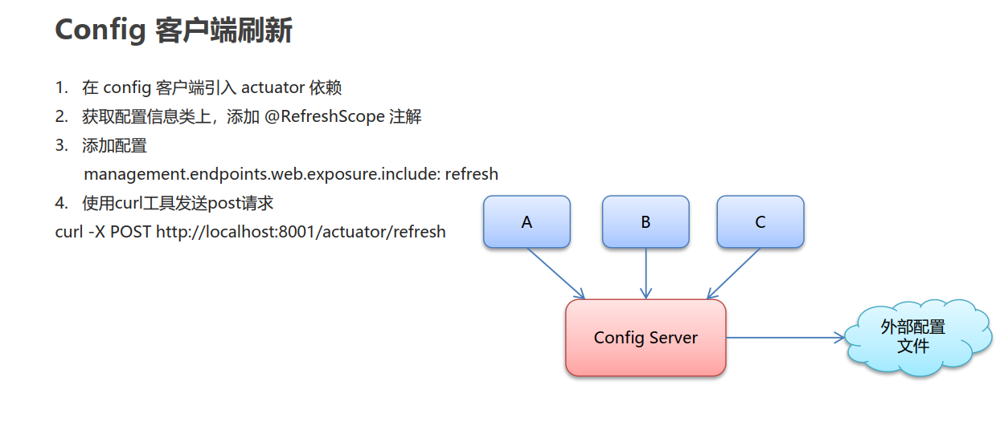

- **依赖**

**==actuator: 默认是health、info监控==**

~~~xml
<dependency>
            <groupId>org.springframework.boot</groupId>
            <artifactId>spring-boot-starter-actuator</artifactId>
        </dependency>
~~~

- **bootstrap.yml**

~~~shell

spring:
  cloud:
    config:
      # 配置config-server地址
      uri: http://localhost:9527

      # 配置获取文件的名称等信息
      name: config #文件名
      profile: dev # 环境，这里是开发环境,会自动拼接config-dev
      label: master # 分支

management:
  endpoints:
    web:
      exposure:
        # 暴露端点
        include: '*'

~~~

**使用curl发送post请求刷新**

curl -X POST http://localhost:8001/actuator/refresh

### 1.2.5 config 客户端集成eureka

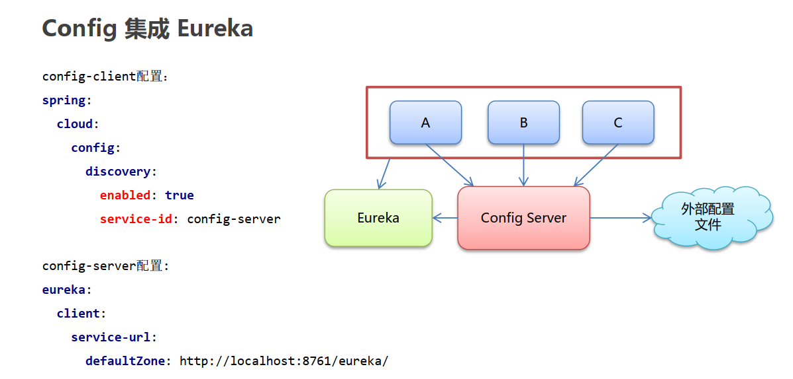

**config客户端集成eureka 可以动态获取config-server的uri**

- **config server **

  **需要将自己注册到eureka**

~~~xml
<!-- eureka-client -->
<dependency>
    <groupId>org.springframework.cloud</groupId>
    <artifactId>spring-cloud-starter-netflix-eureka-client</artifactId>
</dependency>
~~~

- **application.yml**

~~~shell
# 将自己注册到eureka中
eureka:
  client:
    service-url:
      defaultZone: http://localhost:8761/eureka
~~~

- **config - client**
  - yml配置

  - >  discovery:
    >
    > //从注册中心寻找config-server地址
    >
    > ​        enabled: true
    > ​        service-id: CONFIG-SERVER
    >
    > 这样就可以注释掉原先配置的uri了

    

  ~~~shell
  
  spring:
    cloud:
      config:
        # 配置config-server地址
        #uri: http://localhost:9527
        # 配置获取文件的名称等信息
        name: config #文件名
        profile: dev # 环境，这里是开发环境,会自动拼接config-dev
        label: master # 分支
        discovery:
          # 从注册中心寻找config-server地址
          enabled: true
          service-id: CONFIG-SERVER
  
  management:
    endpoints:
      web:
        exposure:
          # 暴露端点
          include: '*'
  
  ~~~

  

  
  
# 2. Bus 消息总线
## 2.1 概述

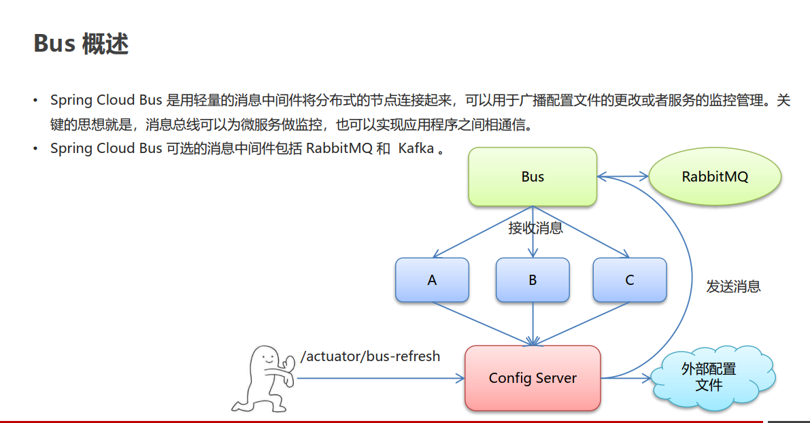

## 2.2 Bus快速入门

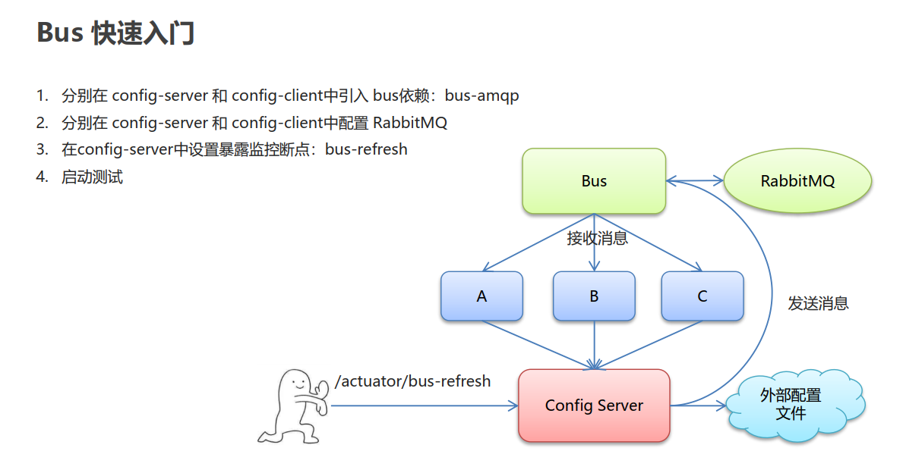

**config-server/client 配置一致，暴露bus端点不用在client中配置,bus的使用目的是对config-server刷新即可**

- **==依赖==**
~~~xml
<!-- bus -->
        <dependency>
            <groupId>org.springframework.cloud</groupId>
            <artifactId>spring-cloud-starter-bus-amqp</artifactId>
        </dependency>
~~~
- **==application.yml==**
~~~shell
server:
  port: 9527

spring:
  application:
    name: config-server
  # spring cloud config的配置
  cloud:
    config:
      server:
        # git 的 远程仓库地址
        git:
          uri: https://gitee.com/mxxiv/springcloud_config.git
      label: master # 分支配置
  #配置rabbitmq信息
  rabbitmq:
    host: 192.168.31.127
    port: 5672
    username: guest
    password: guest
    virtual-host: /

# 将自己注册到eureka中
eureka:
  client:
    service-url:
      defaultZone: http://localhost:8761/eureka

# 暴露bus的刷新端点 info  health bus-refresh
management:
  endpoints:
    web:
      exposure:
        include: 'bus-refresh'

~~~

**发送POST消息到server，注意路径是bus-refresh**

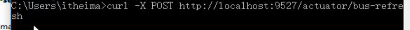

==这样在config的配置修改了之后，就会通过bus刷新到client==

# 3.Stream

## 3.1 Stream概述

**可以用统一的代码来操作不同的消息中间件的一个框架，目前只支持RabbitMQ和Kafka**

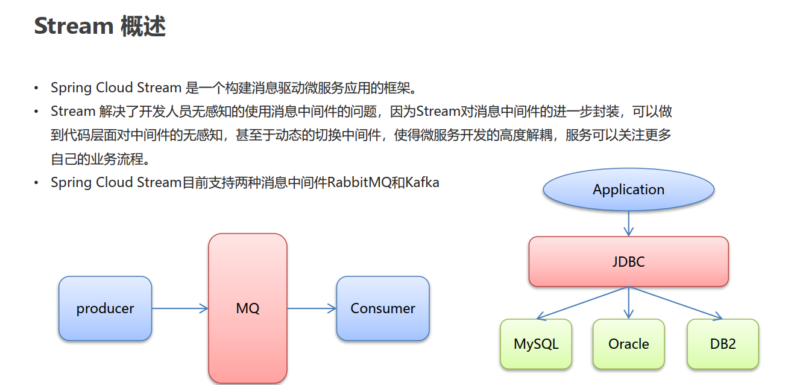

## 3.2 Stream组件

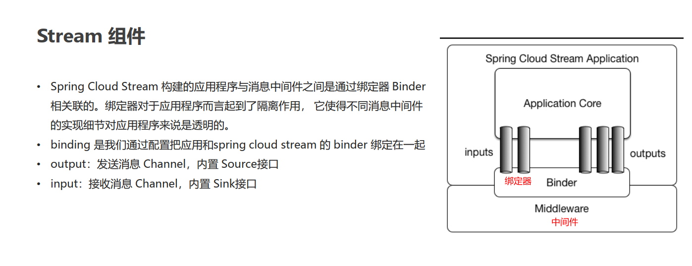

## 3.3 Stream快速入门

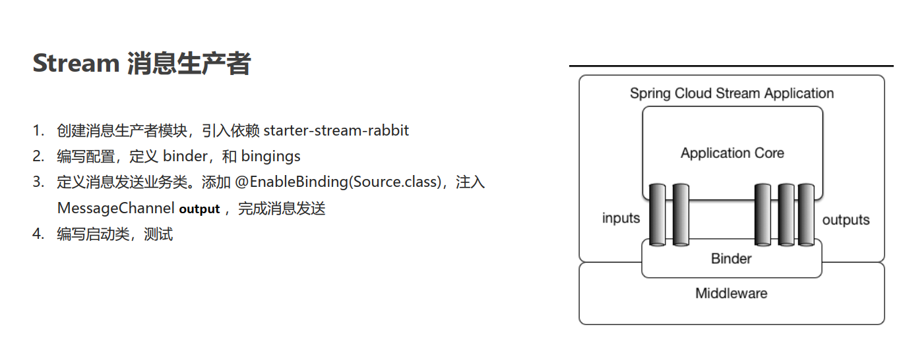

### 3.3.1 消息生产者

**stream-producer**

- **pom.xml**

~~~xml
<dependencies>

        <!--spring boot web-->
        <dependency>
            <groupId>org.springframework.boot</groupId>
            <artifactId>spring-boot-starter-web</artifactId>
        </dependency>

        <!-- stream -->
        <dependency>
            <groupId>org.springframework.cloud</groupId>
            <artifactId>spring-cloud-starter-stream-rabbit</artifactId>
        </dependency>

    </dependencies>
~~~

- **application.yml**

~~~shell
server:
  port: 8000

spring:
  cloud:
    stream:
      # 定义绑定器，绑定到哪个消息中间件上　　
      binders:
        itheima_binder: # 自定义的绑定器名称
          type: rabbit # 绑定器类型
          environment: # 指定mq的环境
            spring:
              rabbitmq:
                host: 192.168.110.75
                port: 5672
                username: guest
                password: guest
                virtual-host: /
      bindings:
        output: # channel名称
          binder: itheima_binder #指定使用哪一个binder
          destination: itheima_exchange # 消息目的地

~~~

- **MessageProducer 发消息**

~~~java
package com.itheima.stream.producer;

import org.springframework.beans.factory.annotation.Autowired;
import org.springframework.cloud.stream.annotation.EnableBinding;
import org.springframework.cloud.stream.messaging.Source;
import org.springframework.messaging.MessageChannel;
import org.springframework.messaging.support.MessageBuilder;
import org.springframework.stereotype.Component;

@Component
// 用的是默认的source
@EnableBinding(Source.class)
public class MessageProducer {

    @Autowired
    private MessageChannel output;

    public void send(){
        String msessage = "hello stream~~~";
        //发送消息
        output.send(MessageBuilder.withPayload(msessage).build());
        System.out.println("消息发送成功~~~");

    }
}

~~~

- **controller**

~~~java
package com.itheima.stream.producer;

import org.springframework.beans.factory.annotation.Autowired;
import org.springframework.web.bind.annotation.RequestMapping;
import org.springframework.web.bind.annotation.RestController;

@RestController
public class ProducerController {

    @Autowired
    private MessageProducer producer;

    @RequestMapping("/send")
        public String sendMsg(){
        producer.send();
        return "success";
    }
}

~~~

### 3.3.2 消息消费者

**stream-consumer**

- **application.yml**

~~~shell
server:
  port: 9000

spring:
  cloud:
    stream:
      # 定义绑定器，绑定到哪个消息中间件上
      binders:
        itheima_binder: # 自定义的绑定器名称
          type: rabbit # 绑定器类型
          environment: # 指定mq的环境
            spring:
              rabbitmq:
                host: 192.168.110.75
                port: 5672
                username: guest
                password: guest
                virtual-host: /
      bindings:
        input: # channel名称
          binder: itheima_binder #指定使用哪一个binder
          destination: itheima_exchange # 消息目的地

~~~

- **MessageListener**

~~~java
package com.itheima.stream.consumer;

import org.springframework.cloud.stream.annotation.EnableBinding;
import org.springframework.cloud.stream.annotation.StreamListener;
import org.springframework.cloud.stream.messaging.Sink;
import org.springframework.messaging.Message;
import org.springframework.stereotype.Component;

/**
 * 消息接收类
 */
@EnableBinding({Sink.class})
@Component
public class MessageListener {
	// @StreamListener 就是SpringCloud Stream提供的消息监听器，用来收消息
    @StreamListener(Sink.INPUT)
    public void receive(Message message){
        System.out.println(message);
		// 打印消息的内容        
        System.out.println(message.getPayload());
    }
}

~~~

# 4.Sleuth+Zipkin 链路追踪

## 4.1 概述

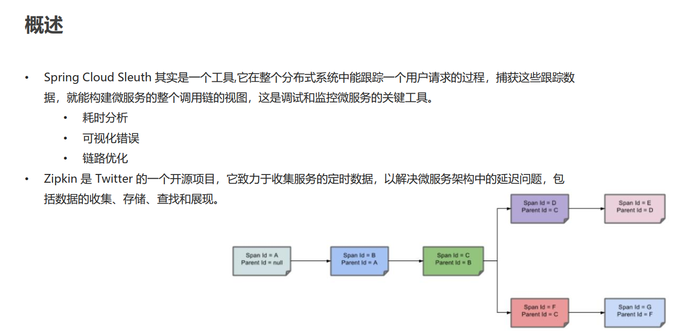

## 4.2 快速入门

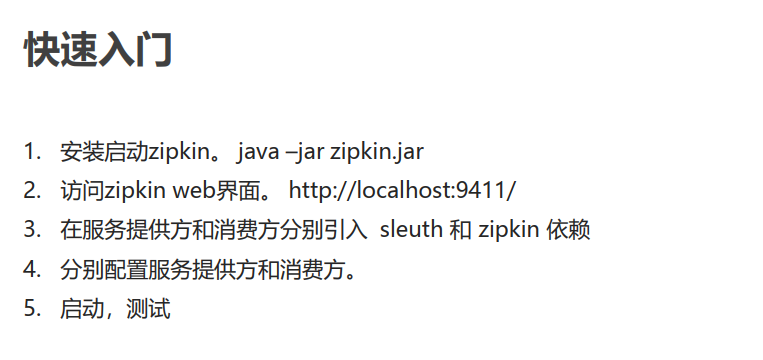

- **依赖**

~~~xml
<!-- sleuth-zipkin -->
        <dependency>
            <groupId>org.springframework.cloud</groupId>
            <artifactId>spring-cloud-starter-sleuth</artifactId>
        </dependency>

        <dependency>
            <groupId>org.springframework.cloud</groupId>
            <artifactId>spring-cloud-starter-zipkin</artifactId>
        </dependency>
~~~

- **配置**

~~~shell
spring:
  application:
    name: feign-consumer # 设置当前应用的名称。将来会在eureka中Application显示。将来需要使用该名称来获取路径
  zipkin:
    base-url: http://localhost:9411/  # 设置zipkin的服务端路径

  sleuth:
    sampler:
      probability: 1 # 采集率 默认 0.1 百分之十。
~~~

