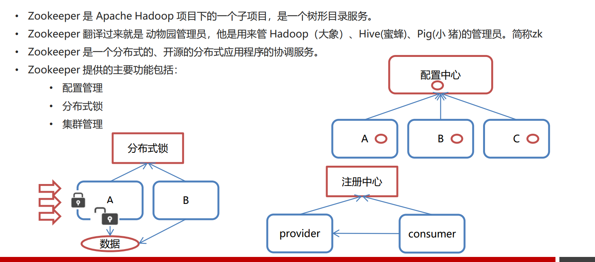
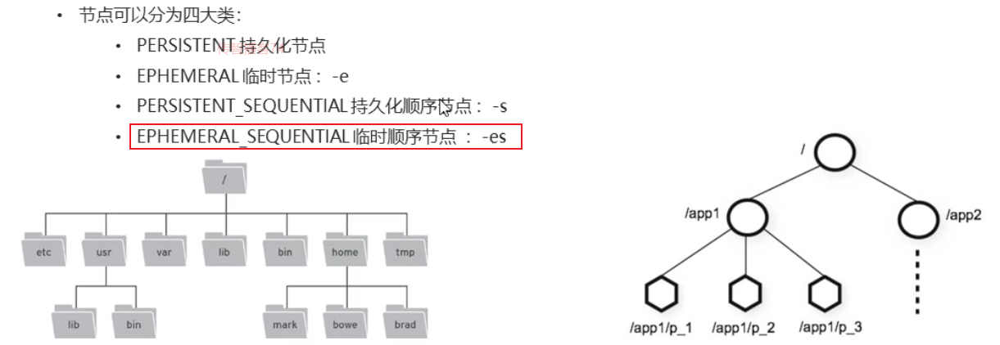
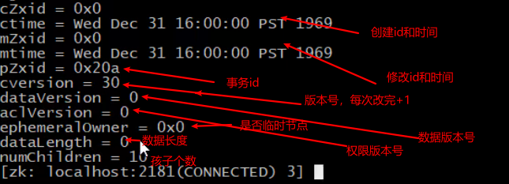
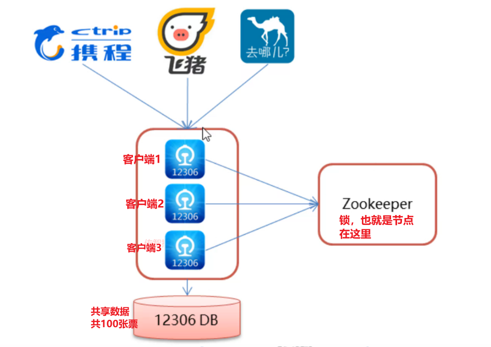

## ==1. `Zookeeper`概念相关==

`Apache Hadoop`的子项目，树形目录服 务，动物管理员，管理`Hadoop`/`Hive`/`Pig`。

`Zookeeper`是一个分布式的/开源的分布式应用程序的协调服务。

**<font color="red">分布式的一致性服务</font>**

主要内容包括：

- 配置管理（配置中心）

- ==分布式锁==

- 集群管理


### ==1.2`Zookeeper`三个特点==

1. 每个节点都可以有子节点和数据
2. 节点的类型有四种（是否持久、是否有序）
3. 节点支持事件回调机制。节点事件(增删改)被触发时，会回调注册该事件的客户端上的回调函数。





## 2. `zookeeper`安装使用

### 2.1 安装步骤

解压，复制配置文件cfg，修改配置文件中的数据保存地址和netty服务端口

```properties

```


### 2.2 启动

运行`zkServer.cmd/zkServer.sh`	启动服务端

运行`zkCli.cmd/zkcli.sh`	启动客户端端


## ==3. `Zookeeper`数据模型==

`Zookeeper`是一个属性目录服务，其数据模型和`Unix`的文件系统目录树结构很类似的层次结构

这里面的每一个节点都被称为`ZNode`，每个节点上都会保存自己的数据和节点信息

节点可以拥有子节点，也同时存储少量(<1M)的数据

四类节点：

- 持久节点 PERSISTENT

- 临时节点 EPHEMERAL 参数： -e
- 持久化顺序节点 PERSISTENT_SEQUENTIAL 参数：-s
- 临时顺序节点 EPHEMERAL_SEQUENTIAL 参数：-es




## ==4. `Zookeeper`常用命令==


### 4.1 服务端常用命令

```powershell
#start/stop/status/restart
./zkServer.sh start   #启动 ZooKeeper 服务: 
./zkServer.sh status  #查看 ZooKeeper 服务状态: 
./zkServer.sh stop    #停止 ZooKeeper 服务: 
./zkServer.sh restart #重启 ZooKeeper 服务: 
```


### 4.2 客户端常用命令

#### 4.2.1 基本的`CRUD`

```powershell
./zkCli.sh [-servet localhost:2181] # 启动客户端
quit								# 退出客户端
ls /
ls /dubbo/xxx          # 查看子节点，当前节点的路径必须完整
create /节点名 [数据]    # 创建节点
get /节点名             # 获取节点数据
set /节点名 [数据]       # 修改节点上的数据
delete /节点名          # 删除单个节点
deleteall /节点名       # 删除多级节点
```


#### 4.2.2 创建各种类型的节点

```powershell
create -e /节点名     # 创建无序临时节点，客户端连接断开后消失
create -s /节点名     # 创建有序持久节点
create -es /节点名    # 创建有序临时节点，所有有序节点共享顺序编号，编号全局唯一不重复
ls2|ls -s /          # 可以查看当前节点的详细信息：是否是临时节点，0否，1是
```




#### 4.2.3 有序节点特点

<font color="red">对于有序节点：`zookeeper`会维护一个**全局**`有序`**唯一**的节点</font>

<font color="blue">意思就是全局的有序节点都有一个编号，即使这个节点被删除了，那么他原有的编号也不会再次被使用</font>


#### 4.2.4 临时节点删除原理

`zookeeper`通过客户端定时向服务端发送心跳请求维护长连接，心跳周期可以通过配tickTime配置(<font color="red">在zookeeper目录conf目录下的zoo.cfg文件内配置</font>)，单位毫秒。

如果服务器检测不到某个客户端的定时心跳，即判断对应客户端挂掉了，然后删除该客户端所有临时节点。所以这个删除可能会有延时，延时理论上不超过一个心跳周期。


## ==5. `Curator`==

### 5.1 概述

`zookeeper`客户端分类：原生API、`zkClient`、`Curator`

`Zookeeper`的客户端连接工具，也是`Apache`的项目，但是一个是顶级项目。


### 5.2 `API`之建立连接

导入依赖坐标

```xml
<dependencies>
    <!-- Curator-recipes依赖，依赖传递导入Curator-framework -->  
    <dependency>
        <groupId>org.apache.curator</groupId>
        <artifactId>curator-recipes</artifactId>
        <version>4.0.0</version>
    </dependency>

    <!-- junit -->
    <dependency>
        <groupId>junit</groupId>
        <artifactId>junit</artifactId>
        <version>4.10</version>
        <scope>test</scope>
    </dependency>

    <!--日志-->
    <dependency>
        <groupId>org.slf4j</groupId>
        <artifactId>slf4j-api</artifactId>
        <version>1.7.21</version>
    </dependency>
    <dependency>
        <groupId>org.slf4j</groupId>
        <artifactId>slf4j-log4j12</artifactId>
        <version>1.7.21</version>
    </dependency>
</dependencies>

```

日志配置文件

```properties
### direct log messages to stdout ###
log4j.appender.stdout=org.apache.log4j.ConsoleAppender
log4j.appender.stdout.Target=System.out
log4j.appender.stdout.layout=org.apache.log4j.PatternLayout
log4j.appender.stdout.layout.ConversionPattern=%d{ABSOLUTE} %5p %c{1}:%L - %m%n

### direct messages to file mylog.log ###
log4j.appender.file=org.apache.log4j.FileAppender
log4j.appender.file.File=c:/mylog.log
log4j.appender.file.layout=org.apache.log4j.PatternLayout
log4j.appender.file.layout.ConversionPattern=%d{ABSOLUTE} %5p %c{1}:%L - %m%n

### set log levels - for more verbose logging change 'info' to 'debug' ###

log4j.rootLogger=debug, stdout
```


编码建立连接

```java
public void testConnect() {

    /*
     * @param connectString       连接字符串。zk server 地址和端口 "192.168.149.135:2181,192.168.149.136:2181"
     * @param sessionTimeoutMs    会话超时时间 单位ms
     * @param connectionTimeoutMs 连接超时时间 单位ms
     * @param retryPolicy         重试策略
     */
   /* //重试策略
    RetryPolicy retryPolicy = new ExponentialBackoffRetry(3000,10);
    //1.第一种方式
    CuratorFramework client = CuratorFrameworkFactory.newClient("192.168.149.135:2181",
            60 * 1000, 15 * 1000, retryPolicy);*/
    //重试策略
    RetryPolicy retryPolicy = new ExponentialBackoffRetry(3000, 10);
    //2.第二种方式
    // 构建的方式创建对象，支持链式编程，每个方法返回的都是xxxBuilder，最后通过调用build()方法获取到真正的对象
    //CuratorFrameworkFactory.builder();
    client = CuratorFrameworkFactory.builder()
            .connectString("localhost:2181")
            .sessionTimeoutMs(60 * 1000)
            .connectionTimeoutMs(15 * 1000)
            .retryPolicy(retryPolicy)
             // namespace会添加一个命名空间，创建了一个同名的节点。
             // 之后通过该链接的所有操作，默认是在该节点下操作的 create("/app") 相当于 /itheima/app
            .namespace("itheima")
            .build();

    //开启连接
    client.start();
}
```


### 5.3 `API`之创建节点

```java
public class CuratorTest {

	private CuratorFramework client;
    @Before
    public void testConnect() {
        // TODO 建立连接
	}
    @After
    public void close() {
        if (client != null) {
            client.close();
        }
    }
    //==============================create=============================================================================

    /**
     * 创建节点：create 持久 临时 顺序 数据
     * 1. 基本创建 ：create().forPath("") 默认持久节点，数据是当前客户端ipv4地址
     * 2. 创建节点 带有数据:create().forPath("",data)
     * 3. 设置节点的类型：create().withMode(节点类型的枚举值).forPath("",data)
     * 4. 创建多级节点  /app1/p1 ：create().creatingParentsIfNeeded().forPath("",data)
     */
    @Test
    public void testCreate() throws Exception {
        //2. 创建节点 带有数据
        //如果创建节点，没有指定数据，则默认将当前客户端的ip作为数据存储
        String path = client.create().forPath("/app2", "hehe".getBytes());
        System.out.println(path);

    }

    @Test
    public void testCreate2() throws Exception {
        //1. 基本创建
        //如果创建节点，没有指定数据，则默认将当前客户端的ip作为数据存储
        String path = client.create().forPath("/app1");
        System.out.println(path);

    }

    @Test
    public void testCreate3() throws Exception {
        //3. 设置节点的类型
        //默认类型：持久化
        String path = client.create().withMode(CreateMode.EPHEMERAL).forPath("/app3");
        System.out.println(path);
        while(true){}
    }

    @Test
    public void testCreate4() throws Exception {
        //4. 创建多级节点  /app1/p1
        //creatingParentsIfNeeded():如果父节点不存在，则创建父节点
        String path = client.create().creatingParentsIfNeeded().forPath("/app4/p1");
        System.out.println(path);
    }
}
```


### 5.4 `API`之查询节点

```java
public class CuratorTest {

	private CuratorFramework client;

    @Before
    public void testConnect() {
        // TODO 建立连接
    }
    @After
    public void close() {
        if (client != null) {
            client.close();
        }
    }
    //===========================get==============================================================
    /**
     * 查询节点：
     * 1. 查询数据：get: getData().forPath()
     * 2. 查询子节点： ls: getChildren().forPath()
     * 3. 查询节点状态信息：ls -s:getData().storingStatIn(状态对象).forPath()
     *
     * 这里的/ ≠ zkCli.sh 中之行的ls /  因为有命名空间，这里的/ = 命名空间
     */

    @Test
    public void testGet1() throws Exception {
        //1. 查询数据：get
        byte[] data = client.getData().forPath("/app1");
        System.out.println(new String(data));
    }

    @Test
    public void testGet2() throws Exception {
        // 2. 查询子节点： ls
        List<String> path = client.getChildren().forPath("/");
        System.out.println(path);
    }

    @Test
    public void testGet3() throws Exception {
        Stat status = new Stat();
        System.out.println(status);
        //3. 查询节点状态信息：ls -s
        client.getData().storingStatIn(status).forPath("/app1");
        System.out.println(status);
    }
}
```


### 5.5 `API`之修改节点

关于`version`

```java
public class Stat implements Record {
  private long czxid;
  private long mzxid;
  private long ctime;
  private long mtime;
  private int version;	//Data version，节点数据版本，默认为0，每次修改 + 1
  private int cversion; //Children version，子节点修改版本，
  private int aversion;
  private long ephemeralOwner;
  private int dataLength;
  private int numChildren;
  private long pzxid;
}
```


修改节点代码

```java
public class CuratorTest {

	private CuratorFramework client;

    @Before
    public void testConnect() {
        // TODO 建立连接
    }
    @After
    public void close() {
        if (client != null) {
            client.close();
        }
    }
    //===========================set================================================================================

    /**
     * 修改数据
     * 1. 基本修改数据：setData().forPath()
     * 2. 根据版本修改: setData().withVersion().forPath()
     * * version 是通过查询出来的。目的就是为了让其他客户端或者线程不干扰我。
     *
     * @throws Exception
     */
    @Test
    public void testSet() throws Exception {
        client.setData().forPath("/app1", "itcast".getBytes());
    }


    @Test
    public void testSetForVersion() throws Exception {

        Stat status = new Stat();
        //3. 查询节点状态信息：ls -s
        client.getData().storingStatIn(status).forPath("/app1");


        int version = status.getVersion();//查询出来的 3
        System.out.println(version);
        client.setData().withVersion(version).forPath("/app1", "hehe".getBytes());
    }
}
```

### 5.6 `API`之删除节点

```java
public class CuratorTest {

	private CuratorFramework client;

    @Before
    public void testConnect() {
        // TODO 建立连接
    }
    @After
    public void close() {
        if (client != null) {
            client.close();
        }
    }
//===========================delete================================================================================

    /**
     * 删除节点： delete deleteall
     * 1. 删除单个节点:delete().forPath("/app1");
     * 2. 删除带有子节点的节点:delete().deletingChildrenIfNeeded().forPath("/app1");
     * 3. 必须成功的删除:为了防止网络抖动。本质就是重试。  client.delete().guaranteed().forPath("/app2");
     * 4. 回调：inBackground
     * @throws Exception
     */


    @Test
    public void testDelete() throws Exception {
        // 1. 删除单个节点
        client.delete().forPath("/app1");
    }

    @Test
    public void testDelete2() throws Exception {
        //2. 删除带有子节点的节点
        client.delete().deletingChildrenIfNeeded().forPath("/app4");
    }
    @Test
    public void testDelete3() throws Exception {
        //3. 必须成功的删除
        client.delete().guaranteed().forPath("/app2");
    }

    @Test
    public void testDelete4() throws Exception {
        //4. 回调
        client.delete().guaranteed().inBackground(new BackgroundCallback(){

            @Override
            public void processResult(CuratorFramework client, CuratorEvent event) throws Exception {
                System.out.println("我被删除了~");
                System.out.println(event);
            }
        }).forPath("/app1");
    }
}
```


## ==6 `API`之`Watch`事件监听==


### 6.0 准备数据

```java
public class CuratorWatcherTest {
    private CuratorFramework client;
    /**
     * 建立连接
     */
    @Before
    public void testConnect() {
        /*
         * @param connectString       连接字符串。zk server 地址和端口 "192.168.149.135:2181,192.168.149.136:2181"
         * @param sessionTimeoutMs    会话超时时间 单位ms
         * @param connectionTimeoutMs 连接超时时间 单位ms
         * @param retryPolicy         重试策略
         */
       /* //重试策略
        RetryPolicy retryPolicy = new ExponentialBackoffRetry(3000,10);
        //1.第一种方式
        CuratorFramework client = CuratorFrameworkFactory.newClient("192.168.149.135:2181",
                60 * 1000, 15 * 1000, retryPolicy);*/
        //重试策略
        RetryPolicy retryPolicy = new ExponentialBackoffRetry(3000, 10);
        //2.第二种方式
        //CuratorFrameworkFactory.builder();
        client = CuratorFrameworkFactory.builder()
                .connectString("localhost:2181")
                .sessionTimeoutMs(60 * 1000)
                .connectionTimeoutMs(15 * 1000)
                .retryPolicy(retryPolicy)
                .namespace("itheima")
                .build();

        //开启连接
        client.start();
    }

    @After
    public void close() {
        if (client != null) {
            client.close();
        }
    }
}
```


### 6.1监听特定节点

```java
    /**
     * 演示 NodeCache：给指定一个节点注册监听器
     */
    @Test
    public void testNodeCache() throws Exception {
        //1. 创建NodeCache对象
        final NodeCache nodeCache = new NodeCache(client,"/app1");
        //2. 注册监听
        nodeCache.getListenable().addListener(new NodeCacheListener() {
            // 可以理解成是一个回调函数，当监听到事件发生的时候，会被zookeeper服务器通知，自动执行该方法
            @Override
            public void nodeChanged() throws Exception {
                System.out.println("节点变化了~");

                //获取修改节点后的数据
                byte[] data = nodeCache.getCurrentData().getData();
                System.out.println(new String(data));
            }
        });

        //3. 开启监听.如果设置为true，则开启监听是，加载缓冲数据
        nodeCache.start(true);


        while (true){

        }
    }


    /**
     * 演示 PathChildrenCache：监听某个节点的所有子节点们
     */

    @Test
    public void testPathChildrenCache() throws Exception {
        //1.创建监听对象
        PathChildrenCache pathChildrenCache = new PathChildrenCache(client,"/app2",true);

        //2. 绑定监听器
        pathChildrenCache.getListenable().addListener(new PathChildrenCacheListener() {
            // 可以理解成是一个回调函数，当监听到事件发生的时候，会被zookeeper服务器通知，自动执行该方法
            @Override
            public void childEvent(CuratorFramework client, PathChildrenCacheEvent event) throws Exception {
                System.out.println("子节点变化了~");
                System.out.println(event);
                //监听子节点的数据变更，并且拿到变更后的数据
                //1.获取类型
                PathChildrenCacheEvent.Type type = event.getType();
                //2.判断类型是否是update
                if(type.equals(PathChildrenCacheEvent.Type.CHILD_UPDATED)){
                    System.out.println("数据变了！！！");
                    byte[] data = event.getData().getData();
                    System.out.println(new String(data));

                }
            }
        });
        //3. 开启
        pathChildrenCache.start();

        while (true){

        }
    }


    /**
     * 演示 TreeCache：监听某个节点自己和所有子节点们，包括该节点
     */

    @Test
    public void testTreeCache() throws Exception {
        //1. 创建监听器
        TreeCache treeCache = new TreeCache(client,"/app2");

        //2. 注册监听
        treeCache.getListenable().addListener(new TreeCacheListener() {
            // 可以理解成是一个回调函数，当监听到事件发生的时候，会被zookeeper服务器通知，自动执行该方法
            @Override
            public void childEvent(CuratorFramework client, TreeCacheEvent event) throws Exception {
                System.out.println("节点变化了");
                System.out.println(event);
            }
        });

        //3. 开启
        treeCache.start();
        while (true){ }
    }
}

```


## ==7. `zookeeper`分布式锁（最重要）==

**回调机制**

**全局唯一的临时有序节点**

### 7.1 共享资源并发访问问题

多线程环境下可能会产生数据安全的问题。三个必要条件：

1. 多线程环境下
2. 存在共享资源
3. 共享资源的访问操作互斥（读读，写写）

单体项目架构中，所有代码都在同一个机器上运行，更准确的是在同一个`jvm`中；

我们使用`Synchronized`或者`lock`实现，因为锁对象本质是一个值，使用同一个锁对象，才能保证所有的线程都只能抢占这一个锁对象，抢到锁对象了，就执行；否则等待，并且不停的轮询看别人有没有释放锁。

但是跨JVM了，还是同一个对象吗？就算做了序列化反序列化也已经不再是同一个对象了。不是同一个锁对象，还能保证处于两个JVM中中的线程抢占同一个锁吗？数据还安全吗？

这时候就用到了分布式锁，解决分布式环境下共享资源的并发访问问题。


### 7.2 分布式锁演化流程


## ==分布式锁原理==


### 7.3 `Zookeeper`分布式锁分类


### 7.4 卖票案例分析




#### Ticket12306类代码

~~~java
public class Ticket12306 implements Runnable{
    private int tickets = 10;//数据库的票数
    private InterProcessMutex lock ;

    public Ticket12306(){
        //重试策略
        RetryPolicy retryPolicy = new ExponentialBackoffRetry(3000, 10);
        //2.第二种方式
        //CuratorFrameworkFactory.builder();
        CuratorFramework client = CuratorFrameworkFactory.builder()
                .connectString("192.168.149.135:2181")
                .sessionTimeoutMs(60 * 1000)
                .connectionTimeoutMs(15 * 1000)
                .retryPolicy(retryPolicy)
                .build();

        //开启连接
        client.start();

        lock = new InterProcessMutex(client,"/lock");
    }

    @Override
    public void run() {

        while(true){
            //获取锁
            try {
                lock.acquire(3, TimeUnit.SECONDS);
                if(tickets > 0){

                    System.out.println(Thread.currentThread()+":"+tickets);
                    Thread.sleep(100);
                    tickets--;
                }
            } catch (Exception e) {
                e.printStackTrace();
            }finally {
                //释放锁
                try {
                    lock.release();
                } catch (Exception e) {
                    e.printStackTrace();
                }
            }
        }
    }
}

~~~


#### Test类代码

~~~java
public class LockTest {
    public static void main(String[] args) {
        Ticket12306 ticket12306 = new Ticket12306();
        //创建客户端
        Thread t1 = new Thread(ticket12306,"携程");
        Thread t2 = new Thread(ticket12306,"飞猪");
        t1.start();
        t2.start();
    }
}
~~~


## `Zookeeper`集群搭建（了解）


